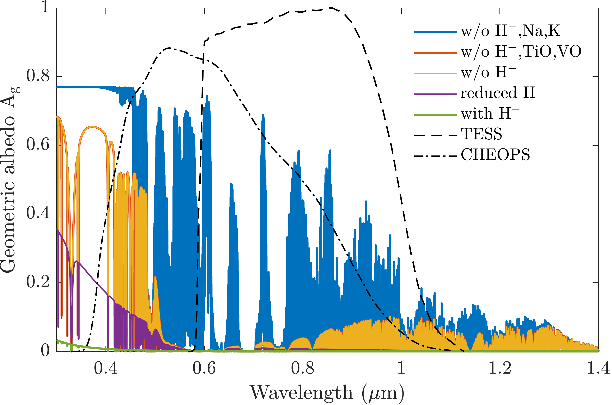
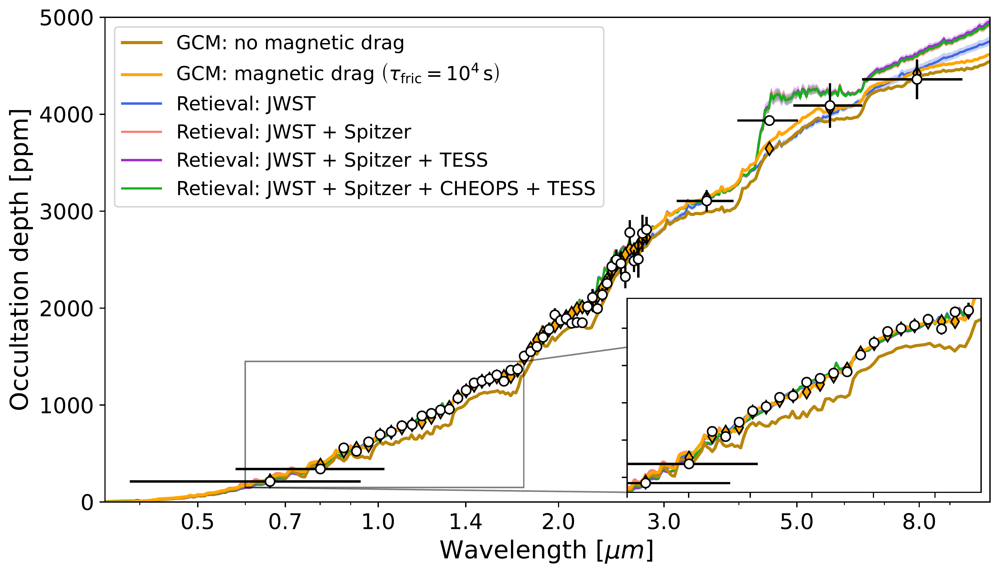
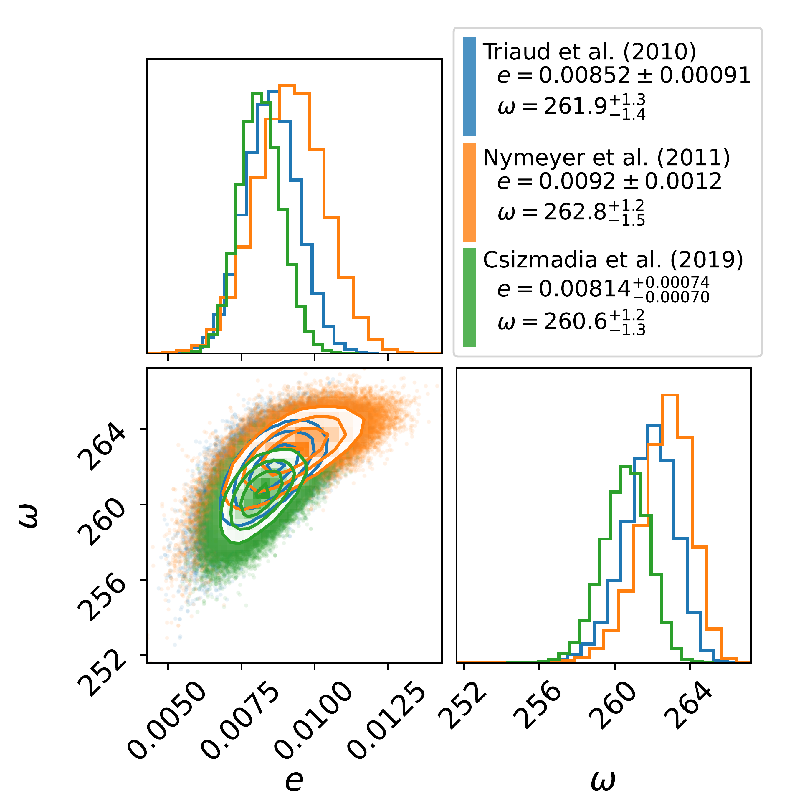

$\newcommand{\ensuremath}{}$
$\newcommand{\xspace}{}$
$\newcommand{\object}[1]{\texttt{#1}}$
$\newcommand{\farcs}{{.}''}$
$\newcommand{\farcm}{{.}'}$
$\newcommand{\arcsec}{''}$
$\newcommand{\arcmin}{'}$
$\newcommand{\ion}[2]{#1#2}$
$\newcommand{\textsc}[1]{\textrm{#1}}$
$\newcommand{\hl}[1]{\textrm{#1}}$
$\newcommand{\footnote}[1]{}$
$\newcommand{\host}{WASP-18}$
$\newcommand{\planet}{WASP-18 b}$
$\newcommand{\cheops}{CHEOPS}$
$\newcommand{\tess}{TESS}$
$\newcommand{\hst}{HST}$
$\newcommand{\spitzer}{Spitzer}$
$\newcommand{\gaia}{Gaia}$
$\newcommand{\jwst}{JWST}$
$\newcommand{\kepler}{Kepler}$
$\newcommand{\batman}{\texttt{batman}}$
$\newcommand{\pipe}{PIPE}$
$\newcommand{\citepipe}{Brandeker et~al. (in~prep.)}$
$\newcommand{\pyratbay}{\textsc{Pyrat Bay}}$
$\newcommand{\cmark}{\ding{51}}$
$\newcommand{\xmark}{\ding{55}}$
$\newcommand{\missingref}{{\bf[REF TO BE ADDED]}}$
$\newcommand{\tbc}[1]{{\bf \color{orange} [TBC\expandafter\ifx\expandafter\relax\detokenize{#1}\relax\else\textnormal{\bf: #1}\fi]}}$
$\newcommand{\tbd}[1]{{\bf \color{orange} [TBD\expandafter\ifx\expandafter\relax\detokenize{#1}\relax\else\textnormal{\bf: #1}\fi]}}$
$\newcommand{\comment}[1]{{\bf \color{violet} [#1]}}$
$\newcommand{\au}{au}$
$\newcommand{\um}{\textmu m}$
$\newcommand{\arraystretch}{1.3}$
$\newcommand{\arraystretch}{1.25}$

# ${Dark skies of the slightly eccentric \planet \\from its optical-to-infrared dayside emission}$$\thanks{This work makes use of CHEOPS data from the Guaranteed Time Observation (GTO) programmes \texttt{CH\_PR100012} and \texttt{CH\_PR100016}.}$\textsuperscript{,}$\thanks{Raw and detrended light curves are available at the CDS via anonymous ftp to \href{ftp://cdsarc.u-strasbg.fr}{cdsarc.u-strasbg.fr} (\href{ftp://130.79.128.5}{130.79.128.5}) or via \url{http://cdsweb.u-strasbg.fr/cgi-bin/qcat?J/A+A/}.}$

<mark>Appeared on: 2025-05-06</mark> -  _31 pages, 17 figures, 13 tables (including the appendix); accepted for publication in A&A_

A. Deline, et al. -- incl., <mark>L. Kreidberg</mark>

**Abstract:** ${Ultra-hot Jupiters are gas giant exoplanets strongly irradiated by their star, which sets intense molecular dissociation leading to atmospheric chemistry}$ dominated by ions and atoms. These conditions inhibit ${day-to-night}$ heat redistribution resulting in ${large}$ temperature contrast. Phase-curve observations ${over several}$ passbands offer insights on the thermal structure and properties of these extreme atmospheres. We aim to perform a joint analysis of ${multiple}$ observations of $\planet$ from the visible to the mid-infrared, using unpublished data from $\cheops$ , $\tess$ and $\spitzer$ . Our purpose is to characterise the ${planetary atmosphere}$ with a consistent view over the large wavelength range covered, including $\jwst{data}$ . We implement a model for the planetary signal including transits, occultations, phase signal, ellipsoidal variations, Doppler boosting, and light-travel time. We fit jointly more than 250 ${{eclipse events} and derive atmospheric properties}$ using General Circulation Models and retrieval ${analyses}$ . ${We obtain}$ new ephemerides with unprecedented precisions of 1 second and 1.4 millisecond on the time of inferior conjunction and orbital period, respectively. We ${compute}$ a planetary radius of $R_p=1.1926\pm0.0077 R_J$ with a precision of 0.65 \% , or 550 km. Through a timing inconsistency with $\jwst$ , we ${discuss and confirm orbital eccentricity ($e=0.00852\pm0.00091$),}$ and constrain the argument of periastron to ${$\omega=261.9^{+1.3}_{-1.4} \deg$}$ . We show that the large dayside emission implies the presence of magnetic drag and super-solar metallicity. We ${find a steep thermally-inverted gradient in the planetary atmosphere, which is common for ultra-hot Jupiters}$ . ${We detect the presence of strong CO emission lines at 4.5 \textmu m from an excess of dayside brightness in the \spitzer /IRAC/Channel 2 passband. {Using these models to} constrain the reflected contribution in the \cheops  passband{, we derive an extremely low geometric albedo} $A_g^\text{\cheops }={0.027}\pm{0.011}$.}$ The orbital eccentricity remains a potential challenge for planetary dynamics that might require further study given the short-period massive planet and despite the young age of the system. The characterisation of the atmosphere of $\planet$ reveals the necessity to account for magnetic friction and super-solar metallicity to explain the full picture of the dayside emission. ${We find the planetary dayside to be extremely unreflective, but when juxtaposing \tess  and \cheops  data, we get hints of increased scattering efficiency in the visible, likely due to Rayleigh scattering.}$

**Figure 7. -** Estimated geometric albedo of $\planet$  based on the retrieval results in comparison to the passbands of $\cheops$  and $\tess$ . {The green line shows the geometric albedo with an \ch{H-} abundance derived by assuming chemical equilibrium {(extremely low $A_g$ values, reaching 0.03 at short wavelengths)}. For the purple line, this abundance is artificially reduced by 98\% {(yielding $A_g$ values comparable to our results in the $\cheops$  and $\tess$  passbands)}, while for the yellow case the \ch{H-} continuum is entirely removed as an opacity source. {We further explored the effect of removing} TiO and VO (red) as well as {Na and K} (blue).}{The impact of the former is negligible and the red curve lies hidden behind the yellow model. The latter reveals however more significant scattering spectral features, especially in the $\cheops$  and $\tess$  passbands.} The strong increase of $A_g$ towards lower wavelengths is caused by the $\lambda^{-4}$-dependence of Rayleigh scattering. (*fig:geometric_albedo*)

**Figure 14. -** Occultation depths as a function of wavelength. The black points with errorbars represent the measurement from this work ($\cheops$ , $\tess$  and $\spitzer$  -- 2 leftmost and 4 rightmost points) and from \cite{Coulombe2023} with $\jwst$(0.8--3 $\um$). The GCM simulations {including TiO and VO}(Section \ref{ssec:gcm}) with and without magnetic drag are shown in orange and light brown, respectively.
                        {The orange-filled diamonds mark the passband-integrated GCM values with magnetic drag ($\tau_\text{fric}=10^4 \text{s}$).}
                        The retrieval runs (Section \ref{ssec:retrieval}) are shown in {blue, pink, purple and green}(same colours as in Fig. \ref{fig:bright_temp} and Table \ref{table:retrievals}) depending on the data points included in the fit.
                        {An inset zoomed-in view of the $\cheops$ -to-1.75 $\um$  range is shown in the lower right corner for convenience.} (*fig:docc_wl*)

**Figure 2. -** Correlation plot of the posterior distribution of the eccentricity $e$ and argument of periastron $\omega$ of the orbit of $\planet$  that match the mid-occultation time $T_\text{occ}^\text{JWST}$ from \cite{Coulombe2023}. We used our posterior distribution on planetary parameters from Table \ref{tab:parameters}, and Gaussian priors on $e \cos\omega$ and $e \sin\omega${from \cite{Triaud2010_HJs} in blue, \cite{Nymeyer2011_WASP-18b} in orange, and \cite{Csizmadia2019_WASP-18b} in green. Overall, the 3 posterior distributions are all consistent with each other within $<1.2 \sigma$.}
                This plot made use of the package \texttt{corner.py}\citep{corner}. (*fig:e-w*)

