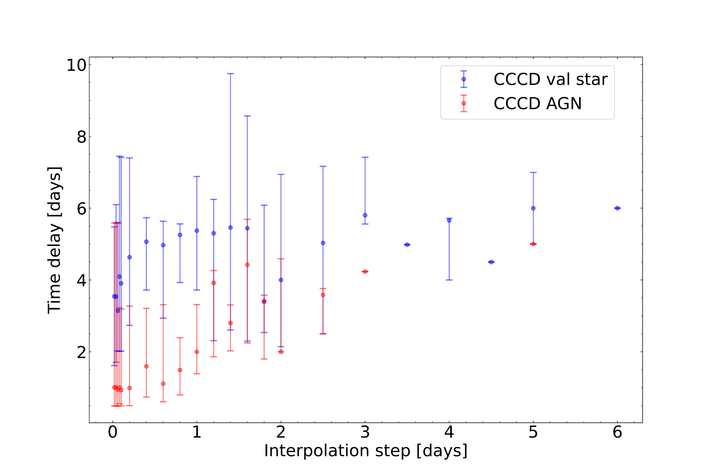
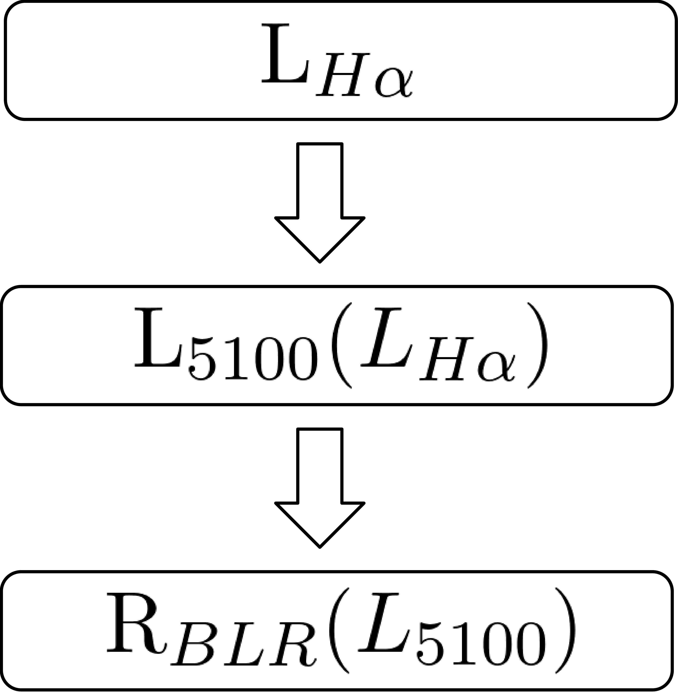

$\newcommand{\ensuremath}{}$
$\newcommand{\xspace}{}$
$\newcommand{\object}[1]{\texttt{#1}}$
$\newcommand{\farcs}{{.}''}$
$\newcommand{\farcm}{{.}'}$
$\newcommand{\arcsec}{''}$
$\newcommand{\arcmin}{'}$
$\newcommand{\ion}[2]{#1#2}$
$\newcommand{\textsc}[1]{\textrm{#1}}$
$\newcommand{\hl}[1]{\textrm{#1}}$
$\newcommand{\footnote}[1]{}$
$\newcommand\hyper{@linkstart##1##2 $
$}$
$\newcommand\hyper{@linkstart##1##2 $
$}$
$\newcommand\hyper{@linkstart##1##2 $
$}$
$\newcommand\hyper{@linkstart##1##2 $
$}$

# Broad line region echo from rapidly accreting intermediate-mass black hole candidate SDSS J144850.08+160803.1: The first probe of intra-night variability and reverberation mapping

<mark>Appeared on: 2025-05-08</mark> -  _Submitted to A&A on 14.04.2025, 18 pages, 13 figures_

<mark>M. Demianenko</mark>, et al. -- incl., <mark>J.-U. Pott</mark>

**Abstract:** Elusive intermediate-mass black holes (IMBHs; $100 M_{\odot} \leq M_{\rm BH}\leq 2\times10^{5} M_{\odot}$ ) can act as "time-squeezing" machines, enabling studies of AGN geometry through reverberation mapping (RM) on much shorter timescales than their supermassive siblings. The broad line region (BLR) radius constraints for IMBH candidates with different Eddington ratios probe the unexplored faint end of radius--luminosity ( $R-L$ ) relations and allow us to build a robust $M_{\rm BH}$ estimator. This study aims to (a) confirm a rapidly accreting IMBH candidate; (b) demonstrate the feasibility of the first photometric BLR reverberation mapping (RM) campaign for this class of objects. The IMBH candidate J1448+16 was identified in the broad H $\alpha$ -selected spectroscopic sample from SDSS. We carried out narrow-band H $\alpha$ and broad-band SDSS g \' monitoring to check small-scale variability and extract the time lag between the BLR and accretion disk (AD) continuum  during 5 months (March--July 2024) using a 60-cm telescope at the Caucasus Mountain Observatory. We confirmed the candidate as an active IMBH using XMM-Newton as a bright X-ray point source with the photon index $\Gamma = 2.32^{+0.15}_{-0.13}$ , suggesting the high accretion rate. From a combination of SDSS optical spectra and XMM-Newton observations, we estimate the black hole mass in the range $\sim 0.9-2.4 \times10^{5} M_{\odot}$ and the Eddington rate from $\sim 37-112\%$ .    We report high-amplitude $\sim 60\%$ intra-night ( $\sim 2$ h) H $\alpha$ variability in this highly accreting IMBH. In addition, we extracted a tentative measurement of a BLR RM radius $\sim 1-8 \mathrm{days}$ . This work is a proof of concept for further IMBH variability studies and BLR RM campaigns, which will be essential for the calibration of the $R-L$ relation at the faint end.

**Figure 3. -** Time delay inference dependence on interpolation step of ICCF for whole light curve.
Color code: blue -- validation star, red -- AGN. Points without error bars correspond to the flat ICCF, where CCCD failed. The CCCD was run with the following ICCF parameters ({\sc nsim}: 5000, {\sc sigmode}: 0.4, {\sc thres}: 0.6, {\sc nbin}: 100). The Monte Carlo sampling slightly depends on the random seed, but for interpolation steps less than one day always shows smaller time lags with smaller uncertainties for AGN compared to the validation star.
 (*fig:iccf_hyperparams_ccpd*)

**Figure 5. -** An example of an RC600 g\' field (FoV 22.7 arcmin) with reference stars marked with magenta circles and validation stars with dark cyan circles, indicating a S/N ratio near each star. The circle diameter is 6" for display purposes (the photometry aperture diameter is 3").
 (*fig:foV*)

**Figure 6. -** General pipeline of deriving $\mathrm{H\beta}$ \citep{2013ApJ...767..149B} BLR radius in this Appendix.  (*fig: r_blr_from_xray*)

