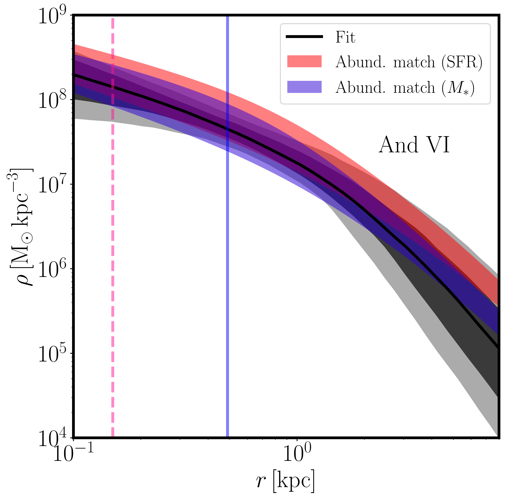
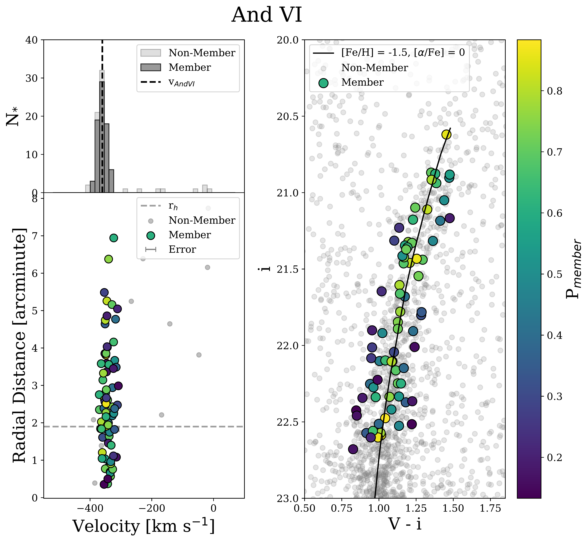
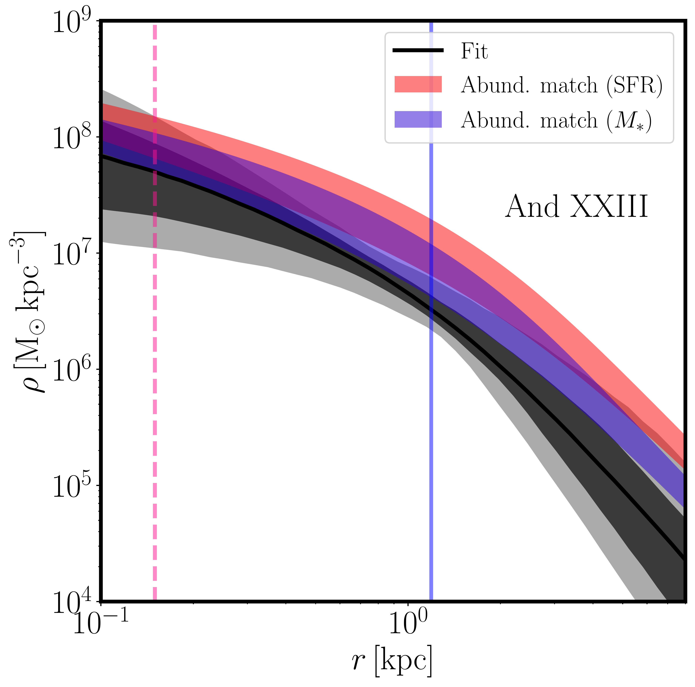

$\newcommand{\ensuremath}{}$
$\newcommand{\xspace}{}$
$\newcommand{\object}[1]{\texttt{#1}}$
$\newcommand{\farcs}{{.}''}$
$\newcommand{\farcm}{{.}'}$
$\newcommand{\arcsec}{''}$
$\newcommand{\arcmin}{'}$
$\newcommand{\ion}[2]{#1#2}$
$\newcommand{\textsc}[1]{\textrm{#1}}$
$\newcommand{\hl}[1]{\textrm{#1}}$
$\newcommand{\footnote}[1]{}$
$\newcommand{\vdag}{(v)^\dagger}$
$\newcommand$
$\newcommand$
$\newcommand{\LCDM}{\LambdaCDM}$
$\newcommand{\kms}{kms^{-1}}$
$\newcommand{\gravsphere}{\texttt{GravSphere}}$
$\newcommand{\DMVI}{\rho_{\rm{DM,VI}}(150 pc) = (1.4 \pm 0.5) \times 10^{8} M_{\odot} kpc^{-3}}$
$\newcommand{\DMXXIII}{\rho_{\rm{DM,XXIII}}(150 pc) = 0.5\substack{+0.4 \ -0.3} \times 10^{8} M_{\odot} kpc^{-3}}$
$\newcommand{\rhVI}{r_{\rm{h,VI}} = (489\pm{22}) pc}$
$\newcommand{\rhXXIII}{r_{\rm{h,XXIII}} = 1170 \substack{+95 \ -94} pc}$
$\newcommand{\MLVI}{(27.1 \pm 8.2) M_{\odot}/L_{\odot}}$
$\newcommand{\MLXXIII}{(90.2 \pm 53.9) M_{\odot}/L_{\odot}}$
$\newcommand{\arraystretch}{1.4}$
$\newcommand{\arraystretch}{1.25}$
$\newcommand{\arraystretch}{1.25}$
$\newcommand{\arraystretch}{1.4}$
$\newcommand{\arraystretch}{1.5}$
$\newcommand{\arraystretch}{1.5}$
$\newcommand{\arraystretch}{1.4}$
$\newcommand{\thebibliography}{\DeclareRobustCommand{\VAN}[3]{##3}\VANthebibliography}$

# Mass Modeling the Andromeda Dwarf Galaxies: Andromeda VI and Andromeda XXIII

<mark>Appeared on: 2025-05-08</mark> -  _19 pages, 16 figures. Submitted to MNRAS for review_

C. S. Pickett, et al. -- incl., <mark>N. Martin</mark>

**Abstract:** Accurately mapping the mass profiles of low mass dwarf spheroidal (dSph) galaxies allows us to test predictions made by dark matter (DM) models. To date, such analyses have primarily been performed on Milky Way (MW) satellites. Meanwhile, the Andromeda Galaxy (M31) is home to 35 known dwarf galaxies, yet only two have been successfully mass-modeled so far. In order to better understand the nature of dark matter, a more comprehensive study of Local Group dwarfs is necessary. In this study, we have undertaken a dynamical study of two higher-luminosity Andromeda dwarf galaxies: Andromeda VI (And VI) and Andromeda XXIII (And XXIII). We infer an enclosed mass for And VI of  M(r $<$ r $_{\rm{h}}$ ) = (4.9 $\pm$ 1.5) $\times$ 10 $^{7}$ M $_{\odot}$ , corresponding to a mass-to-light ratio of $[M/L]_{r_{\rm{h}}}$ = $\MLVI$ . We infer an enclosed mass for And XXIII of  M(r $<$ r $_{\rm{h}}$ ) = (3.1 $\pm$ 1.9) $\times$ 10 $^{7}$ M $_{\odot}$ , corresponding to a mass-to-light ratio of $[M/L]_{r_{\rm{h}}}$ = $\MLXXIII$ . Using the dynamical Jeans modeling tool, $\gravsphere$ , we determine And VI and And XXIII's dark matter density at 150 pc, finding $\DMVI$ and $\DMXXIII$ . Our results make And VI the first mass-modeled M31 satellite to fall into the cuspy regime, while And XXIII has a lower density, implying either a more cored central dark matter density, or a lowering of the density through tides. As And XXIII was quenched early in its evolution, dark matter core formation from repeated inflow/outflow due to gas cooling and stellar feedback is disfavored. This adds And XXIII to a growing list of M31 dwarfs with a central density lower than most MW dwarfs and lower than expected for isolated dwarfs in the Standard Cosmology. This could be explained by the M31 dwarfs having experienced stronger tides than their Milky Way counterparts.

**Figure 7. -** Andromeda VI Dark matter density profiles determined by $\gravsphere$ (solid black line), with 1 and 2$\sigma$ being denoted by the dark gray and light gray shaded regions, respectively. The pink shaded region is the density profile created via $\langle{\text{SFR}}\rangle$ abundance matching. The blue shaded region is the density profile created via $M_{\rm{*}}$ abundance matching. The blue vertical line is the measured $r_{\rm{h}}$ of And VI. The pink dashed line is at 150 pc, or the distance at which DM density is measured. (*fig:And6_SFR_Den*)

**Figure 2. -** **Top Left**: Histogram of number of stars split into 40 velocity bins of 15 $\kms$ each. The light gray bars represent the non-member velocities while the dark gray bars represent member star velocities. The vertical dashed black bar is the systemic velocity of And VI from C13. **Bottom Left**: Velocity versus radial distance from measured center of And VI. The points are shaded depending on their respective probabilities. Each point's uncertainty is too small to be seen relative to each point but is adequately represented by the size of each marker. The dashed light gray horizontal line is the measured half-light radius of And VI from [ and Savino (2022)](https://ui.adsabs.harvard.edu/abs/2022ApJ...938..101S). **Right**: CMD of the RGB overdensity of And VI. The light gray points are non-member stars, as determined by our probability calculations. The colored points represent member stars, shaded according to their respective probability. The RGB is overlaid with the best-fit-by-eye isochrone of parameters [Fe/H] = -1.5 dex, [$\alpha$/Fe] = 0, and age = 10 Gyr. (*fig:And6all*)

**Figure 8. -** Same as Figure \ref{fig:And6_SFR_Den} but for Andromeda XXIII. (*fig:And23_SFR_Den*)

