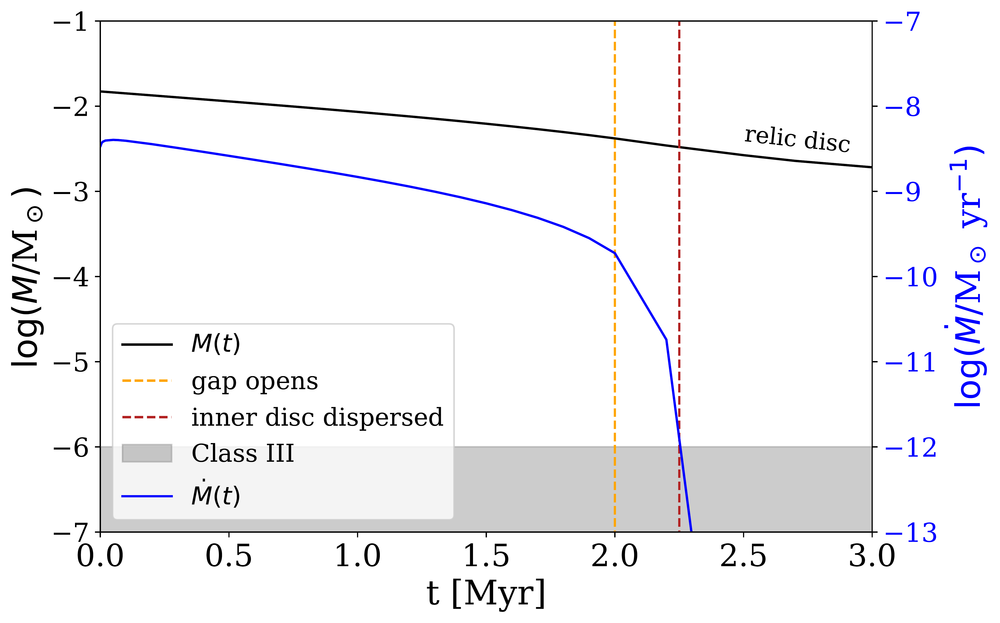
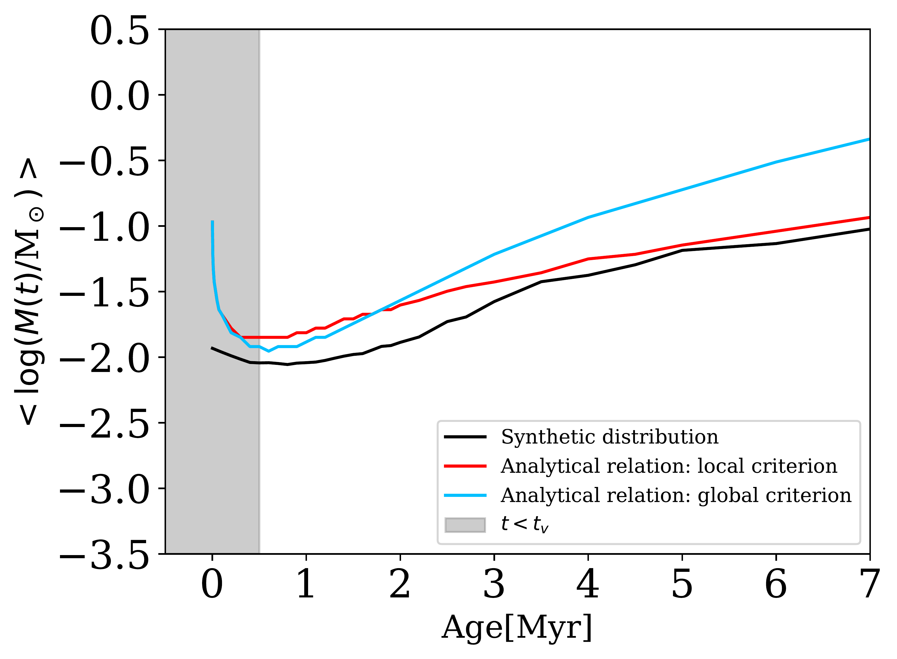
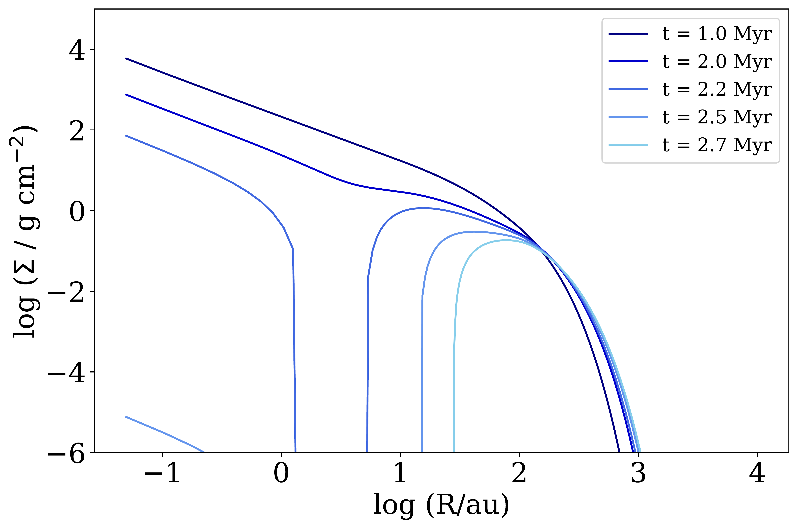

$\newcommand{\ensuremath}{}$
$\newcommand{\xspace}{}$
$\newcommand{\object}[1]{\texttt{#1}}$
$\newcommand{\farcs}{{.}''}$
$\newcommand{\farcm}{{.}'}$
$\newcommand{\arcsec}{''}$
$\newcommand{\arcmin}{'}$
$\newcommand{\ion}[2]{#1#2}$
$\newcommand{\textsc}[1]{\textrm{#1}}$
$\newcommand{\hl}[1]{\textrm{#1}}$
$\newcommand{\footnote}[1]{}$
$\newcommand{\tildea}[1]{\overset{\sim}{#1}}$
$\newcommand{\rev}[1]{#1}$
$\newcommand{\theequation}{A.\arabic{equation}}$

# The survivorship bias of protoplanetary disc populations: Internal photoevaporation causes an apparent increase of the median total disc mass with time

<mark>Appeared on: 2025-05-12</mark> -  _14 pages, 15 figures_

L. A. Malanga, et al. -- incl., <mark>A. Somigliana</mark>

**Abstract:** The evolution of protoplanetary discs has a substantial impact on theories of planet formation.   To date, $\rev{neither}$ of the two main competing evolutionary models, namely the viscous-photoevaporative paradigm and the MHD winds model, has been ruled out by observations.   Due to the high number of sources observed by large surveys, population synthesis is a powerful tool to distinguish the evolution mechanism in observations.   We explore the evolution of the mass distribution of synthetic populations under the assumptions of turbulence-driven accretion and dispersal caused by internal photoevaporation.   We find that the rapid removal of light discs often results in an apparent increase of the median mass of the survived disc population.   This occurs both when the disc properties are independent of each other, and when typical correlations between these quantities and the stellar mass are assumed.   Furthermore, as MHD wind-driven accretion rarely manifests the same feature, this serves as a signature of the viscous-photoevaporative evolution when dispersal proceeds from inside-out.   Therefore, we propose the evolution of the median mass as a new method to distinguish this model in observed populations.   This survivorship bias is not shown by the median accretion rate, which, instead, decreases with time.   Moreover, we introduce a new criterion that estimates the disc lifetime as a function of initial conditions and an analytical relation to predict whether internal photoevaporation triggers an inside-out or an outside-in dispersal.   We verify both analytical relations with numerical simulations.

**Figure 2. -** Evolution of the accretion rate (blue) and mass (black) of a disc with time. The vertical yellow line indicates the instant when the gap opens, which triggers a steep decrease of $\dot{M$. The red line corresponds to the transition between accreting and non-accreting. The grey region corresponds to lower values of disc mass and accretion rate than the respective observational threshold.
        } (*fig:mass_accrate*)

**Figure 6. -** \small{Comparison between the evolution of the median of the synthetic mass distribution with time and the analytical prediction for both dispersal criteria. The shaded region corresponds to $t<t_\nu$, which is not considered in the model.
        } (*fig:medians*)

**Figure 1. -** Evolution of the surface density of a disc with time, obtained integrating equation \eqref{eqn:master_pe with \texttt{Diskpop}. This disc has $M_0 = 1.5 \cdot 10^{-2}$ M$_\odot$, $R_0 = 32.8$ au, $\alpha = 10^{-3}$ and $\dot{M}_\text{w} = 2.5 \cdot 10^{-9}$ M$_\odot$ yr$^{-1}$. After the opening of the gap, the inner disc is dispersed within a short timescale.
        } (*fig:surfacedensity_gap*)

