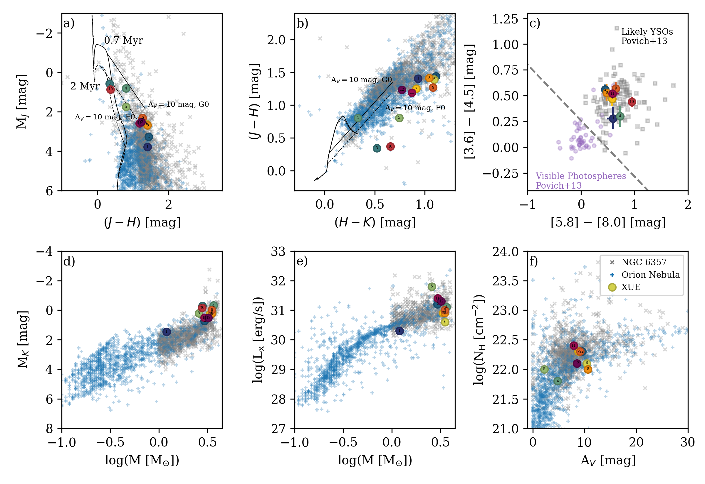
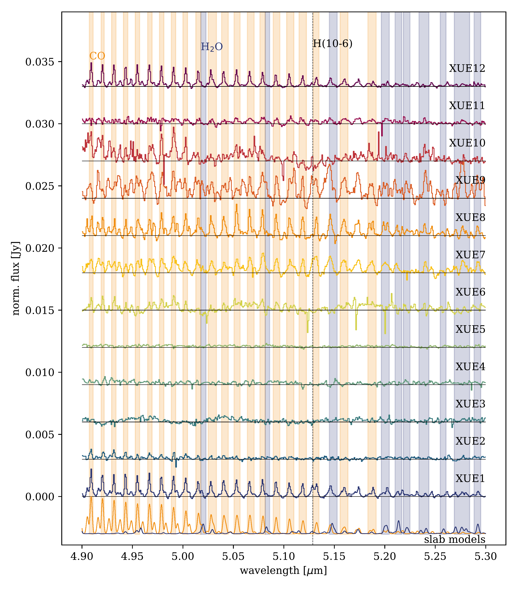
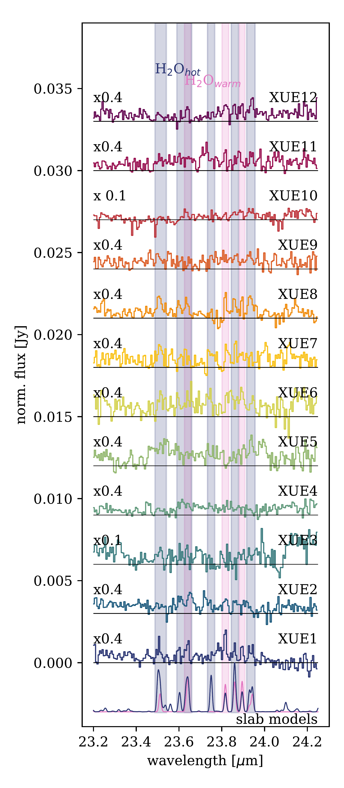

$\newcommand{\ensuremath}{}$
$\newcommand{\xspace}{}$
$\newcommand{\object}[1]{\texttt{#1}}$
$\newcommand{\farcs}{{.}''}$
$\newcommand{\farcm}{{.}'}$
$\newcommand{\arcsec}{''}$
$\newcommand{\arcmin}{'}$
$\newcommand{\ion}[2]{#1#2}$
$\newcommand{\textsc}[1]{\textrm{#1}}$
$\newcommand{\hl}[1]{\textrm{#1}}$
$\newcommand{\footnote}[1]{}$
$\newcommand{\vdag}{(v)^\dagger}$
$\newcommand$
$\newcommand$
$\newcommand$
$\newcommand{\green}[1]{\textcolor{mygreen}{#1}}$
$\newcommand{\red}[1]{\textcolor{myred}{#1}}$
$\newcommand{\yellow}[1]{\textcolor{myyellow}{#1}}$
$\newcommand{\purple}[1]{\textcolor{mypurple}{#1}}$
$\newcommand{\arraystretch}{1.3}$
$\newcommand{\nodata}{...}$
$\newcommand{\yes}{\green{\ding{51}}}$
$\newcommand{\no}{\red{\ding{55}}}$
$\newcommand{\maybe}{\yellow{\ding{51}^{?}}}$
$\newcommand{\ngc6357}{NGC 6357}$
$\newcommand{\mys}{MYStIX}$
$\newcommand{\Hii}{H {\sc ii}}$
$\newcommand{\micron}{\mum}$
$\newcommand{\kms}{km s^{-1}}$
$\newcommand{\cmss}{cm s^{-2}}$
$\newcommand{\lsol}{L_{\odot}}$
$\newcommand{\msun}{M_{\odot}}$
$\newcommand{\msol}{M_{\odot}}$
$\newcommand{\rsol}{R_{\odot}}$
$\newcommand{\rsun}{R_{\odot}}$
$\newcommand{\Rsun}{R_{\odot}}$
$\newcommand{\s}{\sigma}$
$\newcommand{\w}{\omega}$
$\newcommand{\vsini}{v \sin i}$
$\newcommand{\sigrms}{\sigma_\mathrm{rms}}$
$\newcommand{\srv}{\sigma_\mathrm{RV}}$
$\newcommand{\Msol}{M_\odot}$
$\newcommand{\Msun}{M_\odot}$
$\newcommand{\Lsol}{L_\odot}$
$\newcommand{\Lsun}{L_\odot}$
$\newcommand{\s}{\sigma}$
$\newcommand{\feros}{{\sc feros}}$
$\newcommand{\lco}{{\sc lco}}$
$\newcommand{\uves}{{\sc uves}}$
$\newcommand{\iacob}{{\sc iacob}}$
$\newcommand{\l}{\lambda}$
$\newcommand{\ll}{\lambda\lambda}$
$\newcommand{\palp}{Pa~\alpha}$
$\newcommand{\palph}{Pa~\alpha}$
$\newcommand{\palpha}{Pa~\alpha}$
$\newcommand{\pbet}{Pa~\beta}$
$\newcommand{\pbeta}{Pa~\beta}$
$\newcommand{\pdelt}{Pa~\delta}$
$\newcommand{\pgam}{Pa~\gamma}$
$\newcommand{\peps}{Pa~\epsilon}$
$\newcommand{\halp}{H~\alpha}$
$\newcommand{\halph}{H~\alpha}$
$\newcommand{\halpha}{H~\alpha}$
$\newcommand{\hbet}{H~\beta}$
$\newcommand{\hdelt}{H~\delta}$
$\newcommand{\hgam}{H~\gamma}$
$\newcommand{\ha}{H {\sc i}}$
$\newcommand{\hb}{H {\sc ii}}$
$\newcommand{\hea}{He {\sc i}}$
$\newcommand{\heb}{He {\sc ii}}$
$\newcommand{\nc}{N {\sc iii}}$
$\newcommand{\fea}{Fe {\sc i}}$
$\newcommand{\nd}{N {\sc iv}}$
$\newcommand{\ne}{N {\sc v}}$
$\newcommand{\mgb}{Mg {\sc ii}}$
$\newcommand{\ob}{O {\sc ii}}$
$\newcommand{\sic}{Si {\sc iii}}$
$\newcommand{\sid}{Si {\sc iv}}$
$\newcommand{\H2O}{H_{2}O}$
$\newcommand{\C2H2}{C_{2}H_{2}}$
$\newcommand{\CO2}{^{12}CO_{2}}$
$\newcommand{\13CO}{^{13}CO_{2}}$
$\newcommand{\13CO2}{^{13}CO_{2}}$
$\newcommand\CH{3+}$

# XUE. JWST spectroscopy of externally irradiated disks\ around young intermediate-mass stars$\thanks{Table \ref{tab:full_properties}, containing all the properties of the XUE sources is available in online form.}$

<mark>Appeared on: 2025-05-12</mark> -  _12 pages, 8 appendix, 16 figures, 2 tables. Submitted to A&A_

M. C. Ramírez-Tannus, et al. -- incl., <mark>A. Winter</mark>, <mark>T. Henning</mark>

**Abstract:** Our knowledge of the initial conditions of terrestrial planet formation is mainly based on the study of  protoplanetary disks around nearby isolated low-mass stars. However, most young stars and therefore planetary systems form in high-mass star forming regions and are exposed to ultraviolet radiation, affecting the protoplanetary disk. These regions are located at large distances and only now with JWST become accessible to study the inner disks surrounding young stars. We present the eXtreme UV Environments (XUE) program, which provides the first detailed characterization of the physical and chemical properties of the inner disks  around young intermediate-mass ( $1$ – $4$  $\msun$ )  stars exposed to external irradiation from nearby massive stars. We present high signal to noise MIRI-MRS spectroscopy of 12 disks located in three sub-clusters of the high-mass star-forming region NGC 6357 ( $d\sim1690$ pc). Based on their mid-infrared spectral energy distribution, we classify the XUE sources into Group I and II based on the Meeus scheme. We analyze their molecular emission features, and compare their spectral indices and 10 $\micron$ silicate emission profiles to those of nearby Herbig and intermediate T Tauri (IMTT) disks. The XUE program provides the first detailed characterization of the rich molecular inventory within 10 au of IMTT disks, including water, CO, $CO_2$ , HCN, and $\C$ 2H2.  Despite being more massive, the XUE stars host disks with molecular richness comparable to isolated T Tauri systems. The spectral indices are also consistent with similar-mass stars in nearby regions. The 10 $\micron$ silicate features in the XUE sample show lower F $_{11.3}$ /F $_{9.8}$ ratios at a given F $_{\mathrm{peak}}$ , although uncertainties in extinction prevent firm conclusions about their inner disk properties. The majority of disks display water emission from the inner disk, suggesting that even in these extreme environments rocky planets can form in the presence of water. Only one object shows PAH emission, contrasting with the higher PAH detection rates in IMTT surveys from lower-UV environments. The absence of strong line fluxes and other irradiation signatures suggests that the XUE disks have been truncated by external UV photons. However, this truncation does not appear to significantly impact the chemical richness of their inner regions. These findings indicate that even in extreme environments, IMTT disks can retain the ingredients necessary for rocky planet formation, comparable to those of lower mass T Tauri disks in low-mass star-forming regions.

**Figure 13. -** Characteristics of XUE stars. In all panels, XUE stars are color-coded and labeled for clarity. The Orion Nebula young stars are represented by blue plus symbols, and NGC 6357 young stars are shown as grey crosses \citep[][]{2005ApJS..160..319G, 2013ApJS..209...32B, 2013ApJS..209...28K, 2019ApJS..244...28T, 2022ApJ...935...43G}. (a, b) UKIRT/VVV NIR color-magnitude and color-color diagrams. PARSEC 1.2S PMS isochrones for 0.7 and 2 Myr are shown as solid and dashed curves, respectively. Reddening vectors corresponding to $A_V = 10$ mag are drawn as solid and dashed lines, originating from G0 stars at 0.7 Myr and F0 stars at 2 Myr. (c) Spitzer-IRAC MIR color-color diagram of NGC 6357 young stars with known IRAC photometry. Grey squares represent known disky stars, while purple circles indicate diskless stars \citep[][]{2013ApJS..209...31P}. (d) Absolute $K$-band magnitude (uncorrected for extinction) as a function of stellar mass. (e) Intrinsic X-ray luminosity as a function of stellar mass. (f) X-ray column density plotted against visual-band extinction.
    The names of the sources are displayed on the markers and are visible when zooming in. (*fig:CMD_CCD*)

**Figure 15. -** Overview of the spectral region between 4.9 and 5.3 $\micron$ for all XUE sources. The lowermost spectrum shows the most prominent molecules in this region; CO at a temperature of 1500 K and a column density of 3$\times10^{17}$ cm$^{-2}$(yellow) and $H_2$O at 850 K and $10^{18}$ cm$^{-2}$(blue). (*fig:4.9-5.3_region*)

**Figure 7. -** Same as Figure \ref{fig:4.9-5.3_region} but for the region between 23.2 and 24.3 $\micron$. The lowermost spectrum shows warm and hot $H_2$O at 400 K and $2.2\times10^{16}$ cm$^{-2}$(blue) and at 900 K and $2.2\times10^{16}$ cm$^{-2}$(purple). (*fig:23.2-24.25_region*)

