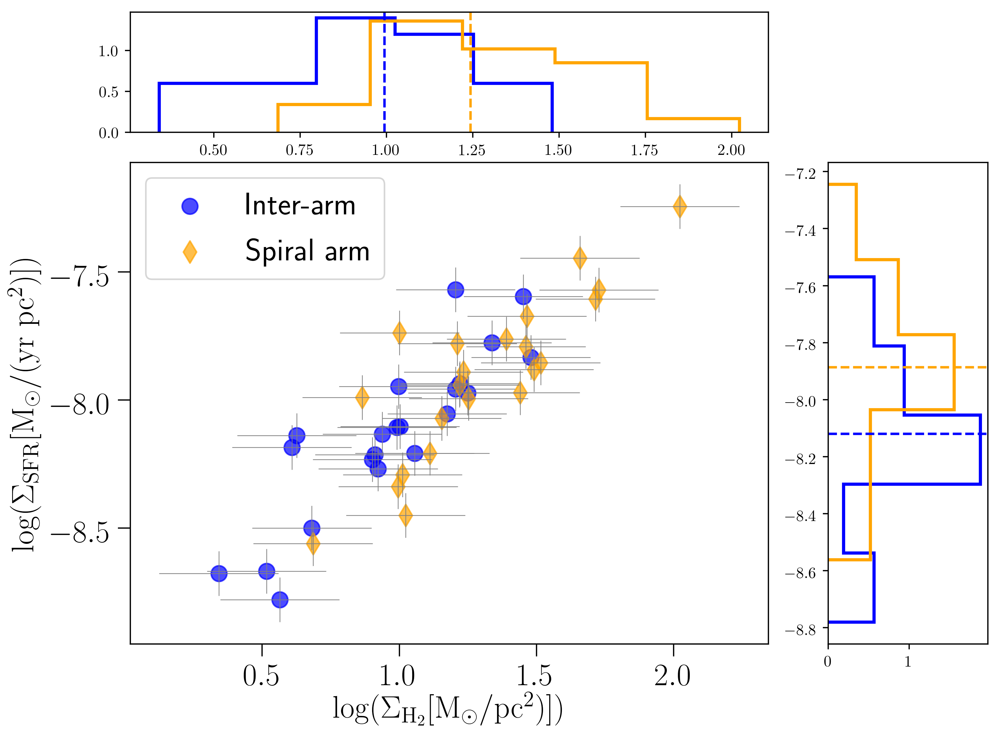
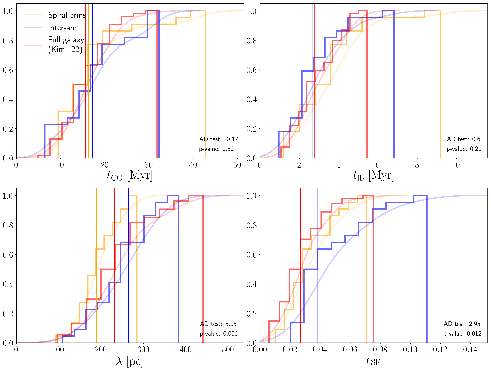
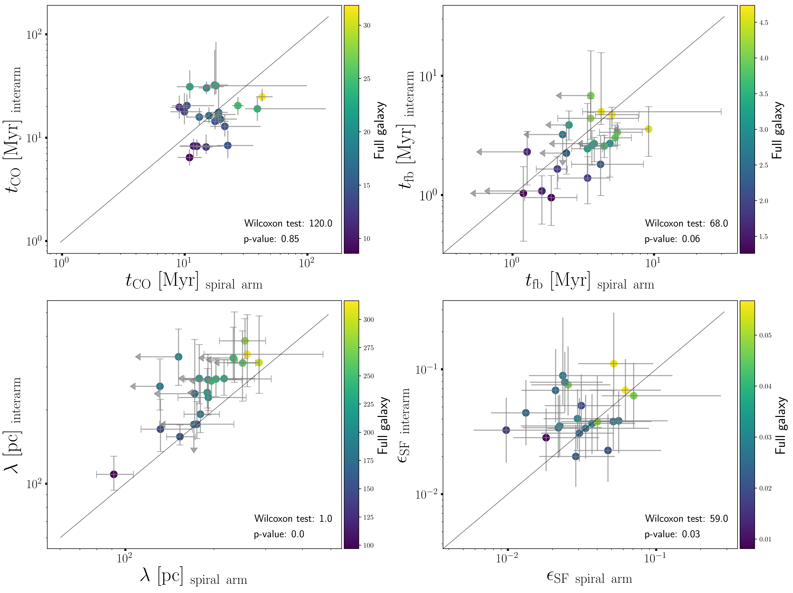

$\newcommand{\ensuremath}{}$
$\newcommand{\xspace}{}$
$\newcommand{\object}[1]{\texttt{#1}}$
$\newcommand{\farcs}{{.}''}$
$\newcommand{\farcm}{{.}'}$
$\newcommand{\arcsec}{''}$
$\newcommand{\arcmin}{'}$
$\newcommand{\ion}[2]{#1#2}$
$\newcommand{\textsc}[1]{\textrm{#1}}$
$\newcommand{\hl}[1]{\textrm{#1}}$
$\newcommand{\footnote}[1]{}$
$\newcommand{\Halpha}{H\alpha}$
$\newcommand{\HII}{H\textsc{ii}}$
$\newcommand{\Htwo}{H_2}$
$\newcommand{\mic}{\mum}$
$\newcommand{\arraystretch}{1.25}$

# The impact of spiral arms on the star formation life cycle

<mark>Appeared on: 2025-05-19</mark> -  _12 pages, 5 figures_

A. Romanelli, et al. -- incl., <mark>A. Hughes</mark>, <mark>E. Schinnerer</mark>

**Abstract:** The matter cycle between gas clouds and stars in galaxies plays a crucial role in regulating galaxy evolution through feedback mechanisms. In turn, the local and global galactic environments shape the interstellar medium and provide the initial conditions for star formation, potentially affecting the properties of this small-scale matter cycle. In particular, spiral arms have been proposed to play a pivotal role in the star formation life cycle, by enhancing the gas density and triggering star formation. However, their exact role is still debated. In this study, we investigated the role of spiral arms in the giant molecular cloud evolutionary life cycle and on the star formation process in a sample of 22 nearby spiral galaxies from the PHANGS survey. We measured the cloud lifetime, the feedback timescale, the typical distance between independent regions, and the star formation efficiency in spiral arms and inter-arm regions separately. We find that the distributions of the cloud lifetime as well as the feedback timescale are similar in both environments. This result suggests that spiral arms are unlikely to play a dominant role in triggering star formation. By contrast, the star formation efficiency appears to be slightly higher in inter-arm regions compared to spiral arms.

**Figure 2. -** Molecular gas surface density versus SFR surface density averaged over the area enclosed by arm and inter-arm regions. Dashed lines mark the position of the median of each sample. (*ksrelation*)

**Figure 4. -** Cumulative distribution function of the cloud lifetime (top left), feedback timescale (top right), region separation length (bottom left), and SFE (bottom right). Each panel shows the c.d.f. for the parameters calculated in spiral arms (orange) and inter-arm regions (blue), as well as for the full galaxies (red,  ([Kim, Chevance and Kruijssen 2022]()) ) as a thick solid line, and the smoothed c.d.f as a shaded line. In cases where only an upper limit could be determined, the value indicated in Table \ref{table1} is used. (*cdf*)

**Figure 5. -** Cloud lifetime (top left), feedback timescale (top right), region separation length (bottom left), and integrated SFE (bottom right) measured through our statistical analysis. For each parameter, we report the values calculated in the spiral arms on the x-axis and in the inter-arm regions on the y-axis for each galaxy. The grey line shows the one-to-one relation. Each data point is colour-coded according to the averaged value obtained by [Kim, Chevance and Kruijssen (2022)]() for the full galaxy. For the feedback timescale and the region separation length, upper limits in the spiral arms are indicated with arrows. (*scatter*)

