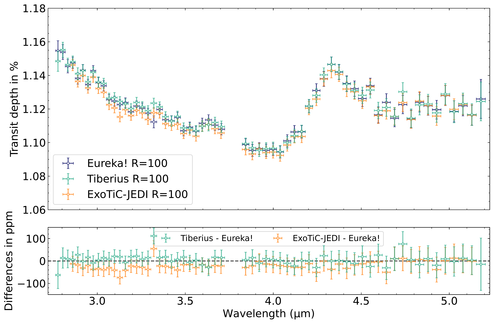
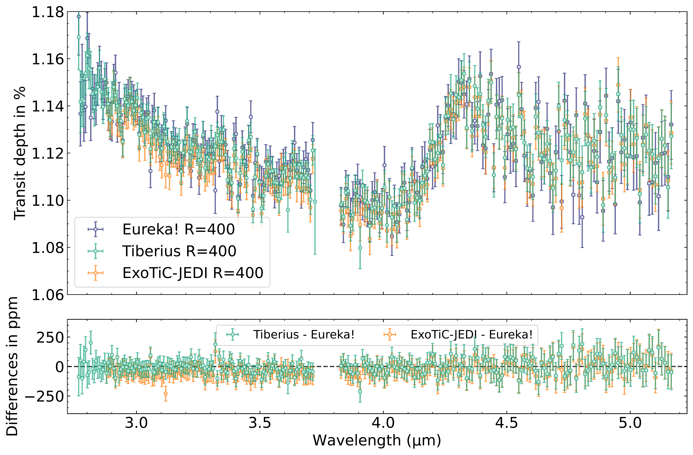
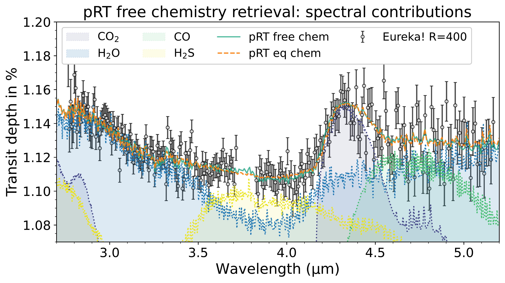
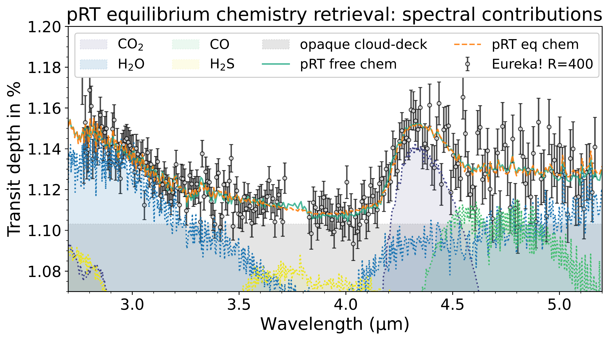
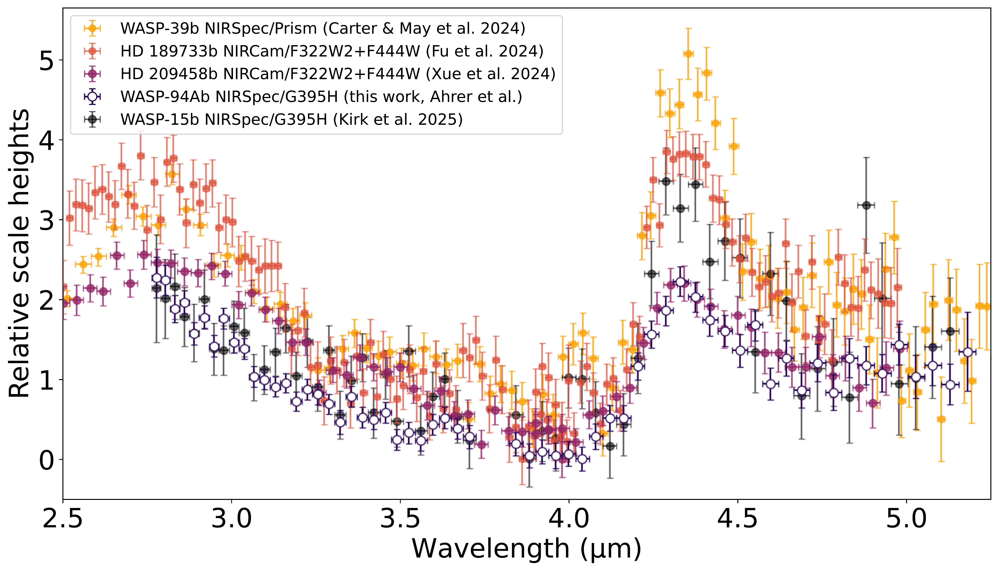

$\newcommand{\ensuremath}{}$
$\newcommand{\xspace}{}$
$\newcommand{\object}[1]{\texttt{#1}}$
$\newcommand{\farcs}{{.}''}$
$\newcommand{\farcm}{{.}'}$
$\newcommand{\arcsec}{''}$
$\newcommand{\arcmin}{'}$
$\newcommand{\ion}[2]{#1#2}$
$\newcommand{\textsc}[1]{\textrm{#1}}$
$\newcommand{\hl}[1]{\textrm{#1}}$
$\newcommand{\footnote}[1]{}$
$\newcommand{\revision}[1]{#1}$
$\newcommand{\Rsun}{R_{\odot}}$
$\newcommand{\Msun}{M_{\odot}}$
$\newcommand{\Rjup}{R_{\mathrm{J}}}$
$\newcommand{\Mjup}{M_{\mathrm{J}}}$
$\newcommand{\Rp}{R_{\mathrm{P}}}$
$\newcommand{\Mp}{M_{\mathrm{P}}}$
$\newcommand{\Rs}{R_{\mathrm{*}}}$
$\newcommand{\Ms}{R_{\mathrm{*}}}$
$\newcommand{\Teq}{T_{\mathrm{eq}}}$
$\newcommand{\Teff}{T_{\mathrm{eff}}}$
$\newcommand{◦ee}{^{\circ}}$
$\newcommand{\obliquity}{|\lambda|}$
$\newcommand{\mystar}{WASP-94A\xspace}$
$\newcommand{\myplanet}{WASP-94A b\xspace}$
$\newcommand{\eureka}{\texttt{Eureka!}\xspace}$
$\newcommand{\tiberius}{\texttt{Tiberius}\xspace}$
$\newcommand{\exoticjedi}{\texttt{ExoTiC-JEDI}\xspace}$
$\newcommand{\pRT}{\texttt{pRT}\xspace}$
$\newcommand{\hydra}{\texttt{HyDRA}\xspace}$
$\newcommand{\platon}{\texttt{PLATON}\xspace}$
$\newcommand{\microns}{\textmu m\xspace}$
$\newcommand{\arraystretch}{1.2}$
$\newcommand{\arraystretch}{1.2}$

# Tracing the formation and migration history: molecular signatures in the atmosphere of misaligned hot Jupiter WASP-94Ab using JWST NIRSpec/G395H

<mark>Appeared on: 2025-05-19</mark> -  _19 pages, 15 figures, accepted for publication in MNRAS_

<mark>E.-M. Ahrer</mark>, et al.

**Abstract:** The discovery of hot Jupiters that orbit very close to their host stars has long challenged traditional models of planetary formation and migration. Characterising their atmospheric composition --- mainly in the form of the carbon-to-oxygen (C/O) ratio and metallicity --- can provide insights into their formation locations and evolution pathways. With JWST we can characterise the atmospheres of these types of planets more precisely than previously possible, primarily because it allows us to determine both their atmospheric oxygen and carbon composition.Here, we present a JWST NIRSpec/G395H transmission spectrum from 2.8 -- 5.1 $\microns$ of WASP-94Ab, an inflated hot Jupiter with a retrograde misaligned orbit around its F-type host star. We find a relatively cloud-free atmosphere, with absorption features of $\ce{H2O}$ and $\ce{CO2}$ at detection significances of $\sim 4\sigma$ and $\sim 11\sigma$ , respectively. In addition, we detect tentative evidence of $\ce{CO}$ absorption at $\sim3\sigma$ , as well as hints of sulphur with the detection of $\ce{H2S}$ at a $\sim 2.5\sigma$ confidence level. Our favoured equilibrium chemistry model determines a C/O ratio of $0.49^{+0.08}_{-0.13}$ for WASP-94Ab's atmosphere, which is substellar compared to the star's C/O ratio of $0.68 \pm 0.10$ . The retrieved atmospheric metallicity is similar to the star's metallicity as both are $\sim 2\times$ solar.We find that this sub-stellar C/O ratio and stellar metallicity can be best explained by pebble accretion or planetesimal accretion in combination with large-distance migration of the planet.

**Figure 11. -** _Top panels: _Transmission spectrum of $\myplanet$ using JWST's NIRSpec/G395H, using three independent reduction pipelines, $\tiberius$(green), $\eureka$(dark blue) and $\exoticjedi$(orange). The two panels show the spectra at two different binning schemes with $R=100$ on the left and $R=400$ on the right. _Bottom panels:_ Differences between the reductions compared to \texttt{Eureka!}. Note that the y axis on the left panel is a different scale (-150,+150) ppm compared to the right panel (-400,+400) ppm for visual clarity. $\exoticjedi$ displays a slight offset compared to $\tiberius$ and $\eureka$ in the NRS1 spectrum.   (*fig:transmission-spectrum*)

**Figure 7. -** $\eureka$ transmission spectrum of $\myplanet$ with the best-fit $\pRT$ models using free chemistry and equilibrium chemistry and the fitted corresponding spectral contributions on the top and bottom panels, respectively. The best-fit offset from the latter retrieval is applied to the NRS2 spectrum (87ppm, consistent within $0.3\sigma$ with the 92ppm from the free chemistry run). By eye the two models (equilibrium chemistry vs free chemistry) show remarkable agreement with the exception of the cloud-deck which is at much higher altitudes for the equilibrium chemistry (see bottom panel), while the free chemistry retrieval prefers a cloud deck at lower altitudes not shown in the top panel as it is off the y axis (equivalent of $\sim 1.05 \%$ transit depth). However, the equilibrium chemistry retrieval runs were preferred across the board when comparing their Bayesian evidence values for all reductions and resolutions, see Table \ref{tab:bayesian_evidences}. Therefore, our favoured model is the equilibrium model, with $\Delta \ln \mathcal{Z} = 3.7$($3.2\sigma$) in the case of $\eureka$ R=400 using $\pRT$.   (*fig:spectrum-free_chem-vs-eq_chem*)

**Figure 9. -** $\myplanet$ in context with JWST transmission spectra published for hot Jupiters ($\revision${here assumed as exoplanets with} temperatures $1,000$ K -- $2,000$ K, radii R$_\mathrm{p} > 0.5$ R$_\mathrm{Jup}$, masses M$_\mathrm{p} > 0.2$ M$_\mathrm{Jup}$) in the 2.5 -- 5.2 $\microns$ wavelength range: WASP-39b \citepalias{Carter2024AWASP-39b}, HD 189733b  (Fu2024HydrogenExoplanet) , HD 209458b  (Xue20242) , and WASP-15b  ([ and Kirk 2025](https://ui.adsabs.harvard.edu/abs/2025MNRAS.537.3027K)) . The colours represent the order of temperatures, from light to dark: WASP-39b ($\sim1170$ K), HD 189733b ($\sim1200$ K), HD 209458b ($\sim1460$ K),  WASP-94Ab ($\sim1500$ K; best-fitting offset applied), and WASP-15b ($\sim1680$ K). The scale heights are computed using a mean molecular mass of $\mu = 2.3$ amu and normalised using the minimum of the transit depth.   (*fig:jwst-HJs-transmission-spectra*)

