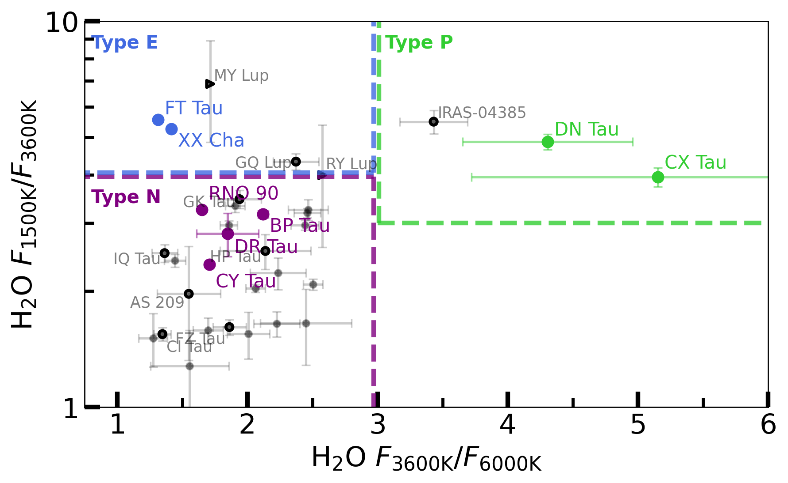
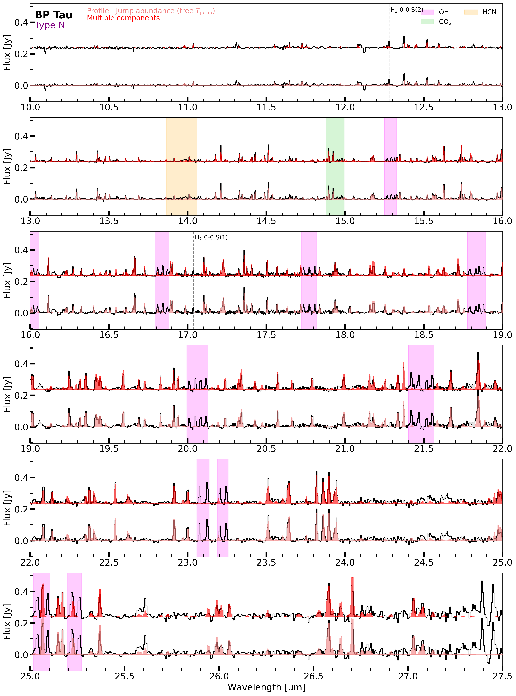
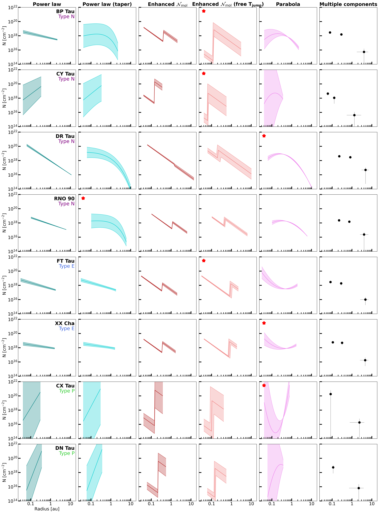

$\newcommand{\ensuremath}{}$
$\newcommand{\xspace}{}$
$\newcommand{\object}[1]{\texttt{#1}}$
$\newcommand{\farcs}{{.}''}$
$\newcommand{\farcm}{{.}'}$
$\newcommand{\arcsec}{''}$
$\newcommand{\arcmin}{'}$
$\newcommand{\ion}[2]{#1#2}$
$\newcommand{\textsc}[1]{\textrm{#1}}$
$\newcommand{\hl}[1]{\textrm{#1}}$
$\newcommand{\footnote}[1]{}$

# MINDS. Water reservoirs of compact planet-forming dust disks: A diversity of $\ce{H_2O}$ distributions

<mark>Appeared on: 2025-05-22</mark> -  _Accepted for publication in A&A on 20/05/2025; 34 pages, 20 figures, 10 tables_

M. Temmink, et al. -- incl., <mark>T. Henning</mark>, <mark>G. Perotti</mark>, <mark>M. Samland</mark>, <mark>K. Schwarz</mark>

**Abstract:** Millimetre-compact dust disks are thought to have efficient radial drift of icy dust pebbles, which has been hypothesised to produce an enhanced cold ( $T<$ 400 K) $\ce{H_2O}$ reservoir in their inner disks. Mid-infrared spectral surveys, now with the _James Webb_ Space Telescope (JWST), pave the way to explore this hypothesis. In this work, we test this theory for 8 compact disks ( $R_\mathrm{dust}<$ 60 au) with JWST-MIRI/MRS observations. To explore the $\ce{H_2O}$ distribution in the inner disk and whether these disks are enhanced in cold $\ce{H_2O}$ emission, we analyse the different reservoirs that can be probed with the pure rotational lines ( $>$ 10 $\mathrm{\mu}$ m) by JWST: hot ( $T>800$ K), intermediate (400 $<T<$ 800 K), and cold ( $T<$ 400 K). We probe the $\ce{H_2O}$ reservoirs with JWST-MIRI observations for a sample of 8 compact disks through parametric column density profiles (power laws, jump abundances, and parabolas), multiple component (two or three) slab models, and line flux ratios. We find that not all compact disks show strong enhancements of the cold $\ce{H_2O}$ reservoir, instead we propose three different classes of inner disk $\ce{H_2O}$ distributions. Four of our disks (BP Tau, CY Tau, DR Tau, and RNO 90; Type N or "Normal" disks) appear to have similar $\ce{H_2O}$ distributions as many of the large and structured disks, as is indicated by the slab model fitting and the line flux ratios. These disks have a small cold reservoir, suggesting the inward drift of dust, but it is not as efficient as hypothesised before. Only two disks (FT Tau and XX Cha; Type E or cold $\ce{H_2O}$ enhanced disks) do show a strong enhancement of the cold $\ce{H_2O}$ emission, agreeing with the original hypothesis. The two remaining disks (CX Tau and DN Tau; Type P or $\ce{H_2O}$ -poor disks) are found to be very $\ce{H_2O}$ -poor, yet show emission from either the hot or immediate reservoirs (depending on the fit) in addition to emission from the cold one.  For the three types, we find that different parametrisations are able to provide a good description of the observed $\ce{H_2O}$ spectra; a jump abundance at a free temperature is amongst the preferred profiles for all three types, suggesting that this profile can provide a good description of the observed reservoirs for most disks. The multiple component analysis yields similar results as the parametric models. However, in some cases, a power law can give an entirely different distribution compared to the other parametric models. Finally, we also report the detection of other molecules in these disks, including a tentative detection of $\ce{CH_4}$ in CY Tau. Not all compact disks follow the hypothesis that their cold $\ce{H_2O}$ reservoir is enhanced following efficient radial drift. Therefore, we introduced a classification based on the observed $\ce{H_2O}$ reservoirs, which should hold for all (isolated) disks: Type N, Type E, and Type P. Type N disks are considered to behave as many other (large and structured) disks, with all three reservoirs present, yet the cold emission is not enhanced. The Type E disks show strong enhancements of the cold $\ce{H_2O}$ emission, while the Type P disks are generally $\ce{H_2O}$ -poor.

**Figure 1. -** Ratios of the 3600 K/6000 K and 1500 K/3600 K line fluxes, used to investigate the respective strength of each \ce{H_2O} reservoir. The grey data points are adapted from \citet{BanzattiEA24}(see their Table 3), where we have highlighted those analysed by \citet{RomeroMirzaEA24} and potential Type P sources (i.e., MY Lup, RY Lup and IRAS-04385). The coloured data points indicate the line ratios of our sample of compact disks. See Section \ref{sec:Types} for a discussion on the different types. (*fig:RatioPlot*)

**Figure 4. -** Comparison between the full models of the best-fitting parametric model (bottom fit) and of the multiple components (red, top fit) for BP Tau. The colour of the best-fitting profile matches that of Figure \ref{fig:AllProfs-4.71}. Indicated are also the molecular features from \ce{OH}(magenta), \ce{CO_2}(green), and \ce{HCN}(orange). The vertical lines indicate the S(1) and S(2) transitions of \ce{H_2}. (*fig:BPTau-ProfFit*)

**Figure 18. -** Profiles and multiple components (rightmost panel) fitted for our sample of compact disks using a line width of 4.71 km s$^{-1}$. The shaded area is the 1$\sigma$-confidence interval, given the uncertainties listed in Tables \ref{tab:ProfileParams-4.71}. The red stars in the top-left corner indicate the best fitting profiles for each disk (see Table \ref{tab:ResultsSum}). We note that the best-fitting profile for DN Tau is highlighted in Figure \ref{fig:AllProfs-Quad}. (*fig:AllProfs-4.71*)

