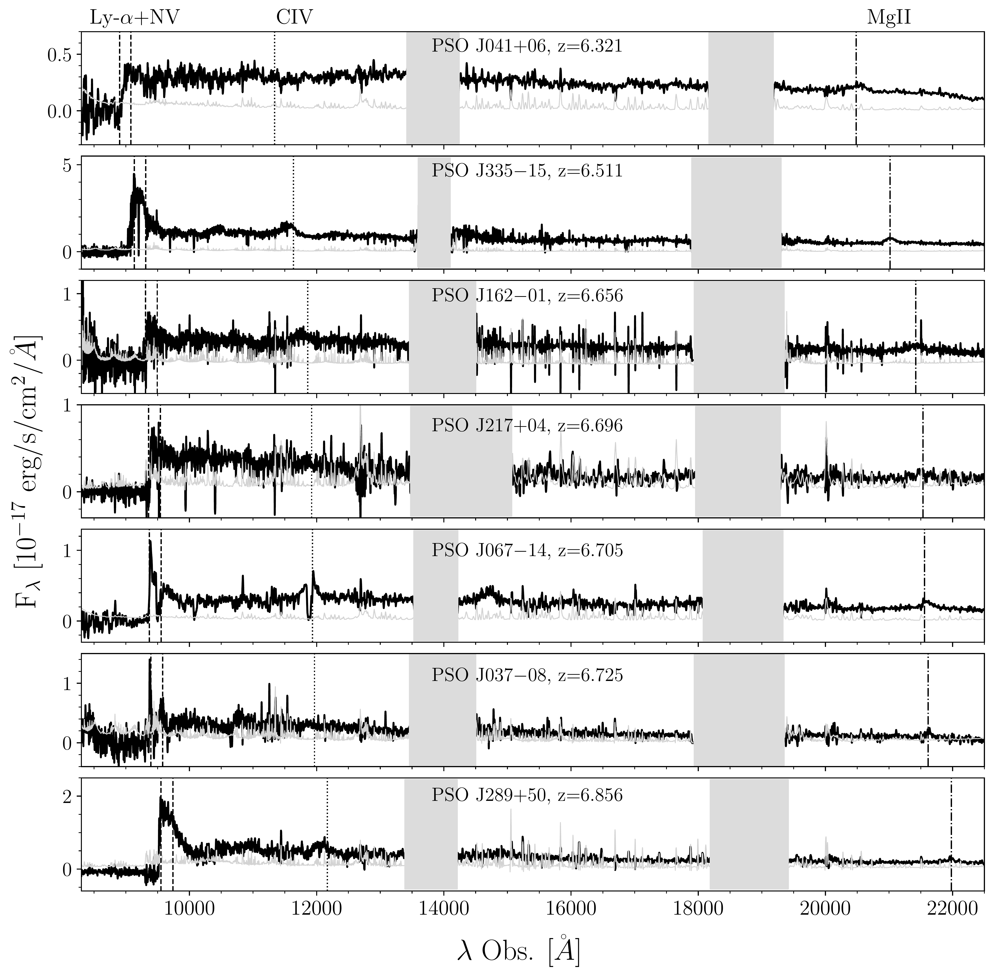
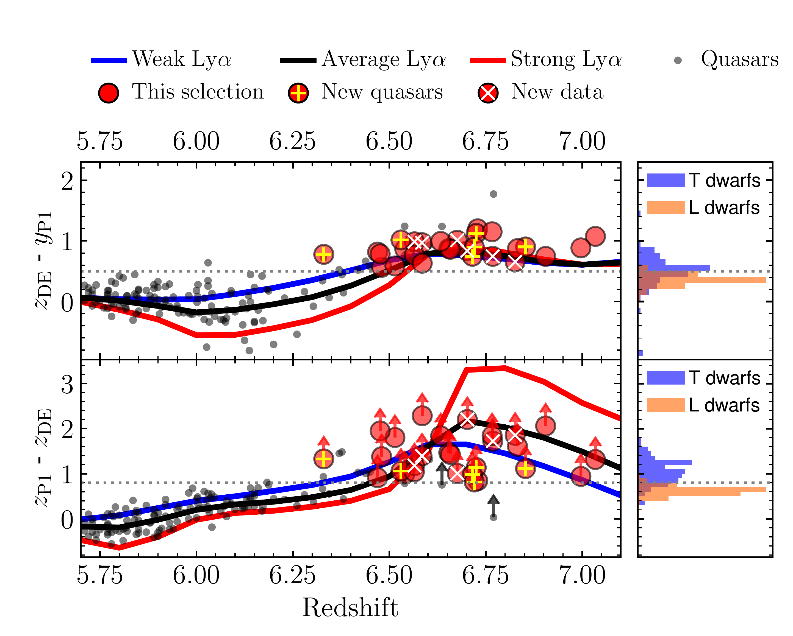
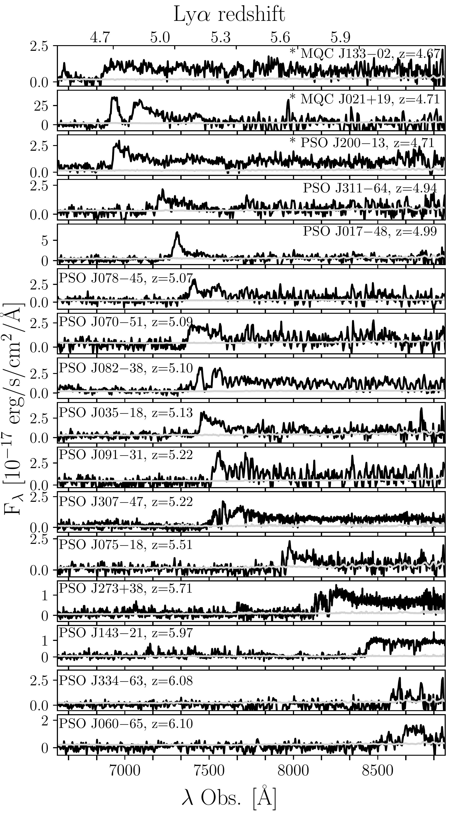
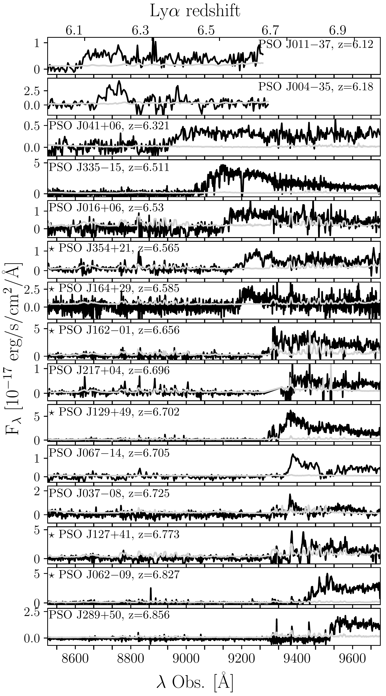

$\newcommand{\ensuremath}{}$
$\newcommand{\xspace}{}$
$\newcommand{\object}[1]{\texttt{#1}}$
$\newcommand{\farcs}{{.}''}$
$\newcommand{\farcm}{{.}'}$
$\newcommand{\arcsec}{''}$
$\newcommand{\arcmin}{'}$
$\newcommand{\ion}[2]{#1#2}$
$\newcommand{\textsc}[1]{\textrm{#1}}$
$\newcommand{\hl}[1]{\textrm{#1}}$
$\newcommand{\footnote}[1]{}$
$\newcommand{\nqsos}{25}$

# Discovery and characterization of 25 new quasars at $4.6 < z < 6.9$ from wide-field multi-band surveys

<mark>Appeared on: 2025-05-23</mark> -  _25 pages, 8 figures, 12 tables, Accepted for publication in A&A_

<mark>S. Belladitta</mark>, et al. -- incl., <mark>E. Bañados</mark>, <mark>Z.-L. Xie</mark>, <mark>J. Wolf</mark>, <mark>F. Walter</mark>

**Abstract:** Luminous quasars at $z>4$ provide key insights into the early Universe.Their rarity necessitates wide-field multi-band surveys to efficiently separate them from the main astrophysical contaminants (i.e., ultracool dwarfs).To expand the sample of high- $z$ quasars, we conducted targeted selections using optical, infrared, and radio surveys, complemented by literature-based quasar candidate catalogs.In this paper, we report the discovery of $\nqsos$ new quasars at $4.6<z<6.9$ (six at $z\geq6.5$ ), with $M_{1450}$ between $-$ 25.4 and $-$ 27.0.We also present new spectra of six $z>6.5$ quasars we selected, but whose independent discovery has already been published in the literature.Three of the newly discovered quasars are strong radio emitters (L $_{1.4 \rm GHz}=0.09-1.0\times$ 10 $^{34}$ erg s $^{-1}$ Hz $^{-1}$ ).Among them, one source at $z=4.71$ exhibits typical blazar-like properties, including a flat radio spectrum, radio-loudness $\sim$ 1000, and multi-frequency variability.It is also detected by SRG/eROSITA X-ray telescope (f $_{\rm 0.2-2.3keV} \sim 1.3\times10^{-13}$ erg s $^{-1}$ cm $^{-2}$ ).In addition, for seven $6.3<z<6.9$ quasars we present near-infrared spectroscopy and estimate the central black hole mass from their C $\rm IV$ and Mg $\rm II$ broad emission lines.Their masses (log [ M $_{\rm BH,MgII}$ ] $=8.58-9.14 \rm M_{\odot}$ ) and Eddington ratios ( $\lambda_{\rm Edd,MgII}=0.74-2.2$ ) are consistent with other _z_ $>$ 6 quasars reported in the literature.A $z = 6.3$ quasar exhibits a velocity difference of approximately $9000$ km s $^{-1}$ between the C $\rm IV$ and Mg $\rm II$ emission lines, making it one of the most extreme C $\rm IV$ outflows currently known.Additionally, the sample includes three high-ionization broad absorption line quasars. One of these quasars shows potential evidence of an extremely fast outflow feature, reaching $48 000$ km s $^{-1}$ .

**Figure 6. -** \small NIR follow-up spectra of a sub-sample of quasars reported in this paper (sorted by increasing redshift). We show the NIR spectra of the newly discovered quasars PSO J041$+$06, PSO J335$-$15, PSO J067$-$14, PSO J217$+$04, PSO J037$-$08 and PSO J289$+$50 and the newly published NIR spectrum for the already known quasar PSO J162$-$01.
    The noise spectra are reported in gray.
    Shaded light gray areas highlight regions strongly affected by telluric absorption.
    On the top the location of the main emission lines according to the Mg$\rm II$ redshift are also shown: Lyman-$\alpha+$N$\rm V$(dashed), C$\rm IV$(dotted) and Mg$\rm II$(dashed-dotted).  (*fig:nirspectra*)

**Figure 1. -** \small Redshift vs.  $z_{\rm P1} - z_{\rm DE}$(bottom) and $z_{\rm DE}-y_{\rm P1}$(top) colors. The blue, black, and red solid lines represent the color tracks of composite quasar spectra from [Bañados, Venemans and Decarli (2016)](), illustrating weak, average, and strong Ly$\alpha$ emission lines, respectively.
    The dotted lines indicate the color cuts for the [DELS+PS1] selection, as described in Section \ref{selectionbanados23}. The red circles represent quasars that meet the selection criteria. Sources marked with a yellow cross are newly discovered quasars from this study, while those with a white `x' are known quasars for which we present new spectroscopy data. Lower limits correspond to sources undetected in $z_{\rm P1}$, for which we use their $3\sigma$ limiting magnitude. On the right, we show the histograms of the same colors for the L and T dwarfs compiled in [Bañados, Venemans and Decarli (2016)](). (*fig:z66sel*)

**Figure 5. -** \small Newly discovered spectra (25 sources, $*$ marked radio-loud objects) and new spectra publication (6 objects, marked with a $\star$) for the quasars reported in this paper. Only the part of the spectrum that covers the Lyman-$\alpha$ break is shown here. The noise spectrum is reported in gray. Sorted by increasing redshift. (*fig:spectra_lyman*)

