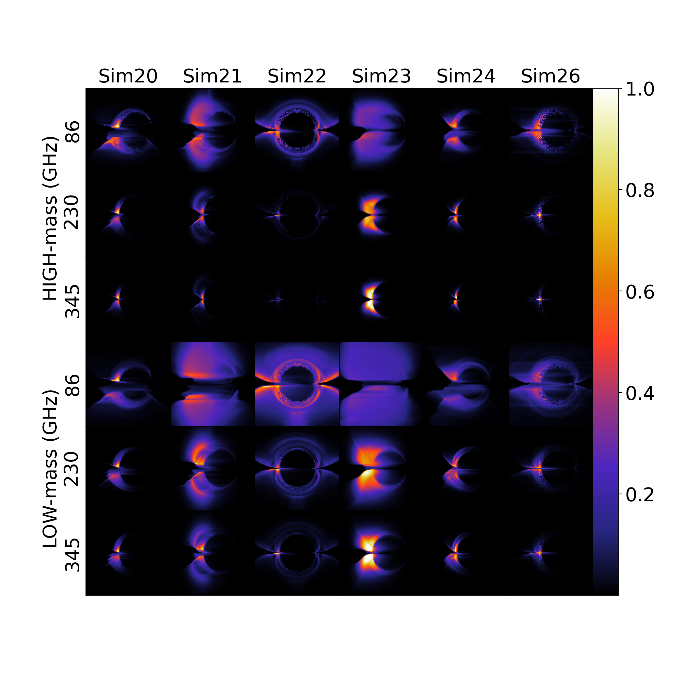
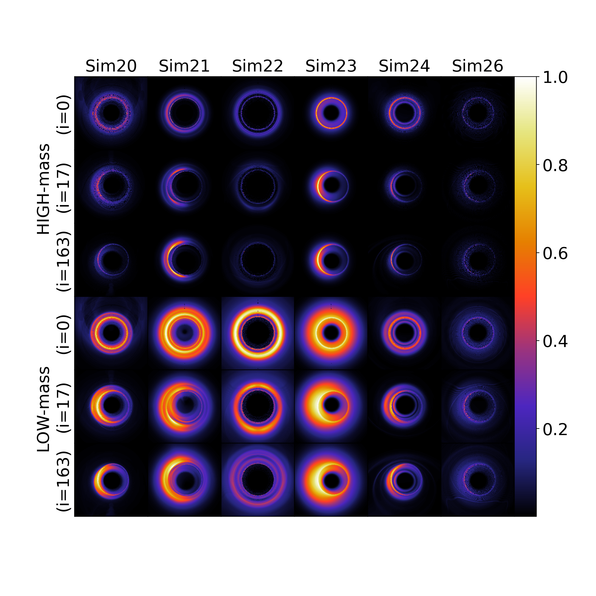
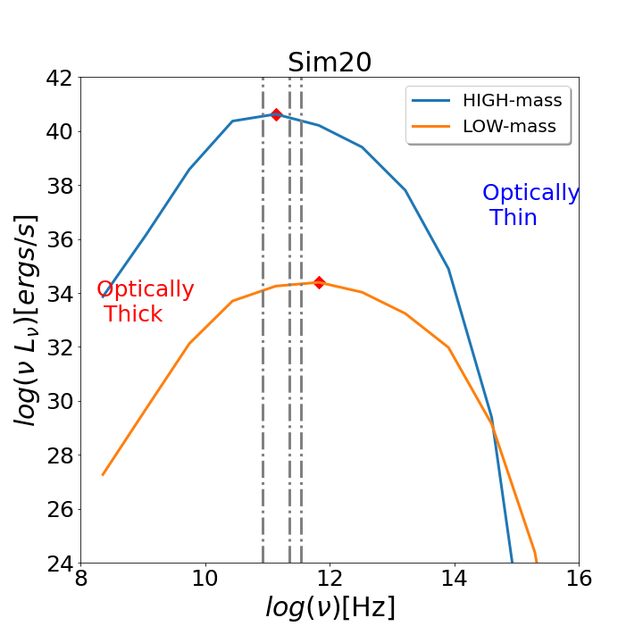
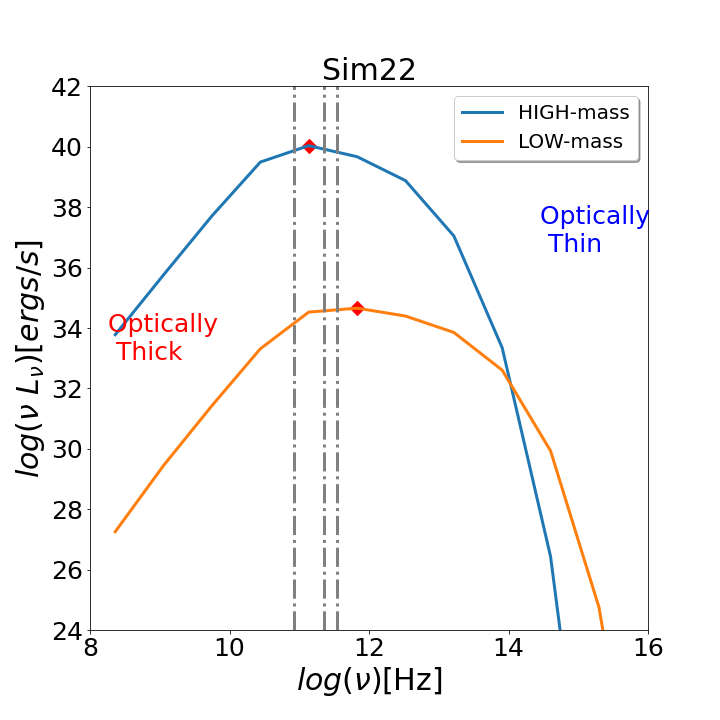
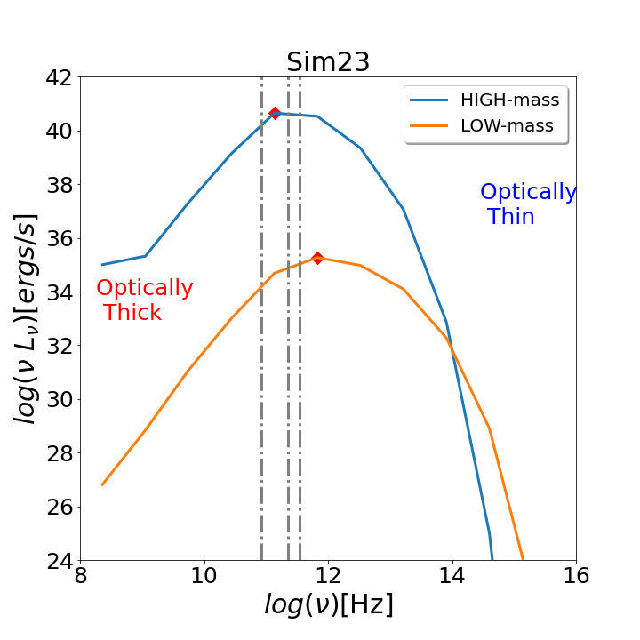
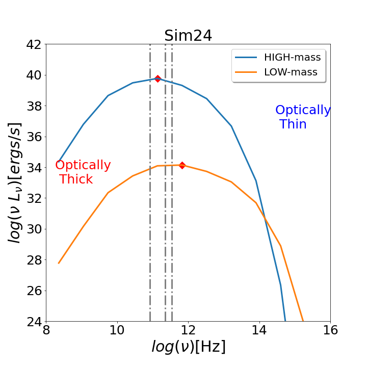
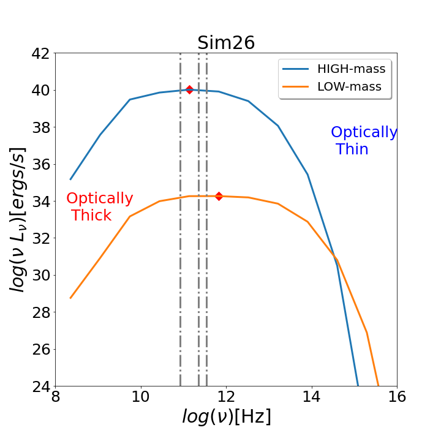
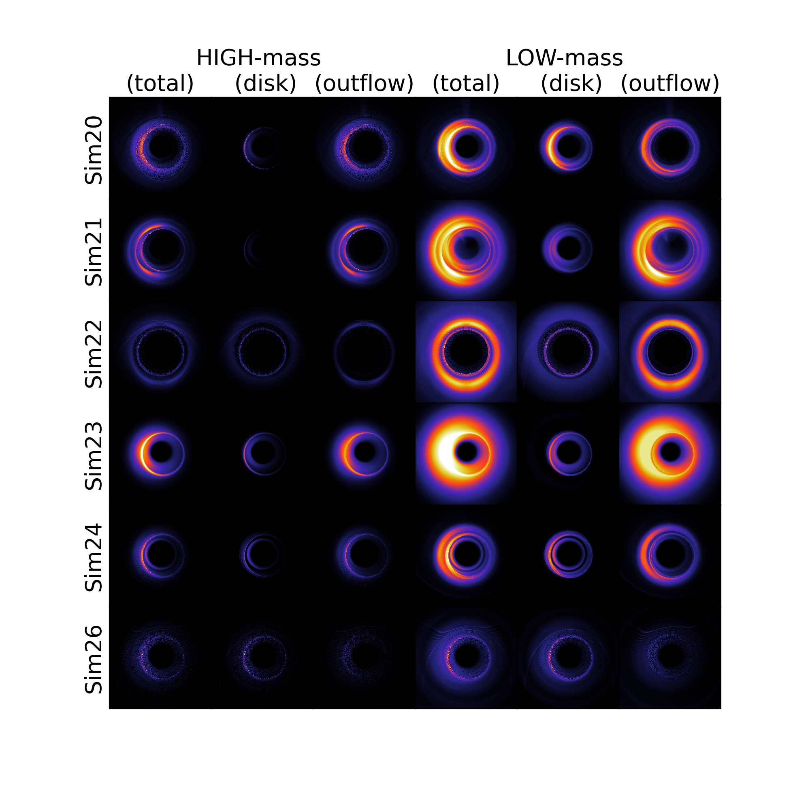

$\newcommand{\ensuremath}{}$
$\newcommand{\xspace}{}$
$\newcommand{\object}[1]{\texttt{#1}}$
$\newcommand{\farcs}{{.}''}$
$\newcommand{\farcm}{{.}'}$
$\newcommand{\arcsec}{''}$
$\newcommand{\arcmin}{'}$
$\newcommand{\ion}[2]{#1#2}$
$\newcommand{\textsc}[1]{\textrm{#1}}$
$\newcommand{\hl}[1]{\textrm{#1}}$
$\newcommand{\footnote}[1]{}$

# Ray-tracing GR-MHD-generated outflows from AGNs hosting thin accretion disks: An analysis approaching horizon scales

<mark>Appeared on: 2025-05-23</mark> -  _13 pages, 8 figures, 1 table, accepted for publication in A&A_

B. Bandyopadhyay, et al. -- incl., <mark>C. Fendt</mark>

**Abstract:** Active galactic nuclei (AGNs) exhibit a wide range of black hole masses and inflow/outflow properties. It is now possible to probe regions close to the event horizons of nearby supermassive black holes (SMBHs) using very long baseline interferometry (VLBI) with earth-sized baselines, as performed by the Event Horizon Telescope (EHT). This study explores the emission properties of accretion and outflows near the event horizon of both low-mass and high-mass SMBHs. Using resistive general relativistic magnetohydrodynamic (GR-MHD) simulations, we model AGNs with thin Keplerian disks. This contrasts with widely studied models featuring thick disks, such as magnetically arrested disks (MADs) or the standard and normal evolution (SANE) scenario. Our GR-MHD models serve as simplified representations to study disk–jet–wind structures. These simulations are postprocessed and ray-traced, using constraints of black hole mass and observed spectral energy distributions (SEDs). Thermal synchrotron emission generated near the event horizon is used to create emission maps, which are analysed by separating accretion and outflow components to determine their contributions to the total intensity. Whether the emission appears optically thick or thin at a given frequency depends on its position relative to the synchrotron SED peak. At 230 GHz, low-mass SMBHs appear optically thicker than high-mass ones, even at lower accretion rates. Doppler beaming affects the brightness of emission from outflows with changing viewing angles in low-mass systems. Eddington ratios from our models align with those inferred by the EHTC for M87 and SgrA* using thicker MAD/SANE models. Although thin disks are optically thicker, their spectral properties make high-mass systems appear optically thinner at 230 GHz—ideal for probing GR effects like photon rings. In contrast, low-mass systems remain optically thicker at these frequencies because of synchrotron self-absorption, making outflow emissions near the horizon more pronounced. However, distinguishing these features remains challenging with current EHT resolution.

**Figure 6. -** _ Left:_ Normalized emission maps (25 $R_g$ across) for an edge-on view for all our simulations applied for HIGH-mass (upper 3 rows) and LOW-mass (lower 3 rows) systems
   at 86 GHz, 230 GHz and 345 GHz obtained with the Eddington ratio detailed in Table \ref{tab:para_dynamics}. _ Right:_ Normalized 230 GHz emission maps (25 $R_g$ across) as above but for inclination angles of $0^{\circ}$, $17^{\circ}$, and $163^{\circ}$. (*fig:allsimalli*)

**Figure 5. -** SEDs applying Eddington ratios from Table \ref{tab:para_dynamics} for a HIGH-mass (blue curves) and LOW-mass (orange curves) system for SIM20, SIM21, SIM22, SIM23, SIM24, and SIM26 respectively. The three vertical lines correspond to 86 GHz, 230 GHz, and 345 GHz, respectively. The figures also mark the optically thin and optically thick regions of the thermal synchrotron, which lie on the right and left sides of the thermal synchrotron peak marked by the red diamond. (*fig:specdiffM87SgrA*)

**Figure 2. -** Normalized 230 GHz emission maps (25 $R_g$ across) for all the models with the total emissions, only the disk emissions and the emission from the "outflow" region for HIGH-mass (left 3 columns) and LOW-mass (right 3 columns) systems for an inclination angle of $17^{\circ}$. (*fig:prothdiskoutflowalli1*)

