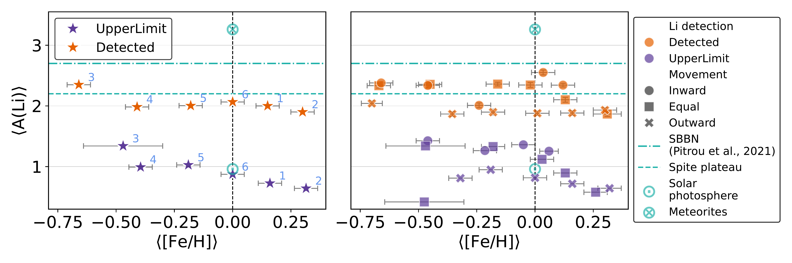
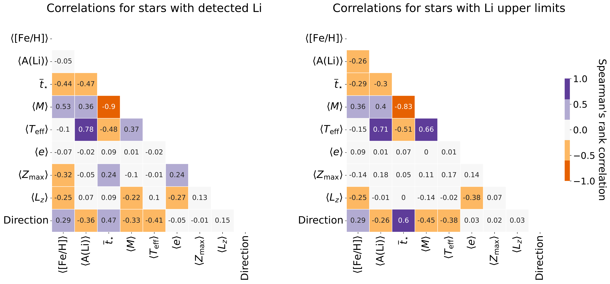
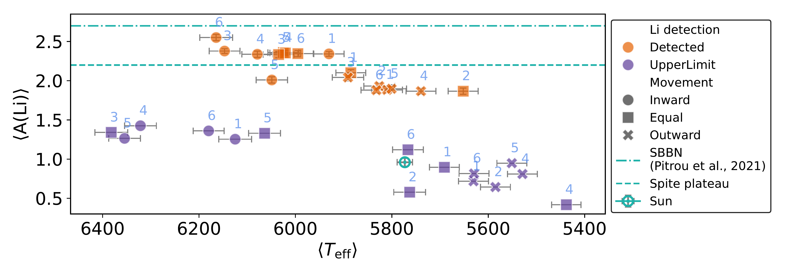

$\newcommand{\ensuremath}{}$
$\newcommand{\xspace}{}$
$\newcommand{\object}[1]{\texttt{#1}}$
$\newcommand{\farcs}{{.}''}$
$\newcommand{\farcm}{{.}'}$
$\newcommand{\arcsec}{''}$
$\newcommand{\arcmin}{'}$
$\newcommand{\ion}[2]{#1#2}$
$\newcommand{\textsc}[1]{\textrm{#1}}$
$\newcommand{\hl}[1]{\textrm{#1}}$
$\newcommand{\footnote}[1]{}$
$\newcommand{\feh}{[Fe/H]}$
$\newcommand{\ali}{A(Li)}$
$\newcommand{\rgui}{\langle R_{\rm{g}} \rangle}$
$\newcommand{\rbirth}{\langle R_{\rm{b}} \rangle}$
$\newcommand{\eccentricity}{\langle e \rangle}$
$\newcommand{\zmax}{\langle Z_{\rm{max}} \rangle}$
$\newcommand{\lz}{\langle L_z \rangle}$
$\newcommand{\mass}{\langle M \rangle }$
$\newcommand{\age}{\overline{t}_{\star}}$
$\newcommand{\teff}{T_{\rm eff}}$
$\newcommand{\arraystretch}{1.2}$
$\newcommand{\arraystretch}{1.}$

# Probing the origins: II. Unravelling lithium depletion and stellar motion: Intrinsic stellar properties drive depletion, not kinematics

<mark>Appeared on: 2025-05-26</mark> -  _Accepted for publication in A&A. 12 pages, 6 figs, 3 tables. Abridged abstract to fit ArXiV's requirements_

M. L. L. Dantas, et al. -- incl., <mark>G. Guiglion</mark>

**Abstract:** Lithium (Li) is a complex yet fragile element, with many production pathways but being easily destroyed in stars. Previous studies noted that the top envelope of the distribution of Li abundances [ A(Li) ] in super-solar metallicity dwarf stars shows signs of Li depletion, contrary to expectations. This depletion is thought to result from the interplay between stellar evolution and radial migration. In Paper I, we classified a stellar sample from the thin disc with a broad range in metallicity as being churned outward or inward, or blurred/undisturbed. In this paper (Paper II), we delve deeper by analysing our entire metallicity-stratified sample along with their dynamic properties, focusing on the connection between radial migration and Li depletion. We analyse the chemo-dynamics of a set of 1188 thin disc dwarf stars observed by the _Gaia_ -ESO survey, previously classified into six metallicity-stratified groups via Hierarchical Clustering (HC), ranging from metal-poor to super-metal-rich. We examine several features, such as effective temperatures, masses, and dynamic properties. We also implement a parametric survival analysis using penalised splines (logistic distribution) to quantify how stellar properties and motion (or migration) direction jointly influence Li depletion patterns. We find that stars in our sample that appear to have churned outward are predominantly Li-depleted, regardless of their metallicities. These stars are also the oldest, coldest, and least massive compared to those in the same HC group that have either churned inward or kept their orbital radii. Our survival analysis confirms temperature as the primary driver of Li depletion, followed by metallicity and age, while migration direction shows negligible influence. Additionally, the proportion of outward-churned stars increases with increasing metallicity, making up more than 90 \% of our sample in the most metal-rich group. The increasing proportion of outward-churned stars with higher metallicity (and older ages) indicates their dominant influence on the overall trend observed in the [ Fe/H ] -A(Li) space for stellar groups with [ Fe/H ] >0. The survival model reinforces that the observed Li depletion stems primarily from intrinsic stellar properties (cool temperatures, higher metallicity, old ages) rather than migration history. This suggests the metallicity-dependent depletion pattern emerges through stellar evolution rather than Galactic dynamical processes.

**Figure 1. -** Median lithium abundances ($\langle \rm{$\ali$} \rangle$) versus median metallicity ($\langle \rm{$\feh$} \rangle$) with their respective median errors for all the stellar groups in our sample, stratified by HC groups and Li detection (orange markers indicate detected values, purple markers indicate upper limits). Left panel: star-shaped markers depict $\langle \rm{$\ali$} \rangle$ vs $\langle \rm{$\feh$} \rangle$ for the entire sample, with each marker annotated to indicate the corresponding HC group. Right panel: Similar to the left panel, but further stratified by stellar movement. Circle markers represent stars that have moved inward, x-shaped markers indicate stars that have moved outward, and square markers depict stars with birth radius similar to their current Galactocentric distance (`Equal'). In cyan, we additionally display the abundances for the Solar photosphere ($\bigodot$), meteorites ($\bigotimes$), the Spite plateau (dashed horizontal line), and a newer SBBN estimate for $\ali$ from [Pitrou, et. al (2021)]() at 2.7 dex (dot-dashed horizontal line). Note that upper limits do not include error estimations for lithium since no de facto detection was made, as shown in all other plots of the paper. (*fig:li_feh_all*)

**Figure 4. -** Heatmaps displaying the correlations between several parameters for all the stars in the sample stratified by Li detection (detected and upper limits, respectively, from the left to right). We display the values of $\langle \rm{$\feh$} \rangle$, $\langle \rm{$\ali$} \rangle$, $\age$, $\langle M \rangle$, $\langle T_{\rm eff} \rangle$, $\eccentricity$, $\zmax$, $\lz$, and direction. We considered direction as a numerical value to classify stars churned outward (1) or inward (-1), or blurred/undisturbed (0). (*fig:li_correlations*)

**Figure 2. -** Median lithium abundances ($\langle \rm{$\ali$} \rangle$) versus median effective temperatures ($\langle T_{\rm{eff}} \rangle$) for all the stellar groups in our sample, stratified by metallicity (through the HC) and Li detection (orange markers indicate detected values, purple markers indicate upper limits). Circle markers represent stars that have moved inward, X-shaped markers indicate stars that have moved outward, and square markers depict stars with similar birth and current Galactocentric distances (`Equal'). We additionally display the Sun within this parameter space in cyan ($\bigodot$), considering  $T_{\rm{eff, \odot}} = 5773 \pm 16$ K  ([Asplund, Amarsi and Grevesse 2021]()) ; the Spite plateau can be seen through the dashed horizontal cyan line, as well as the SBBN estimate by \citet[][dot-dashed line]{Pitrou2021}. (*fig:li_teff_all*)

