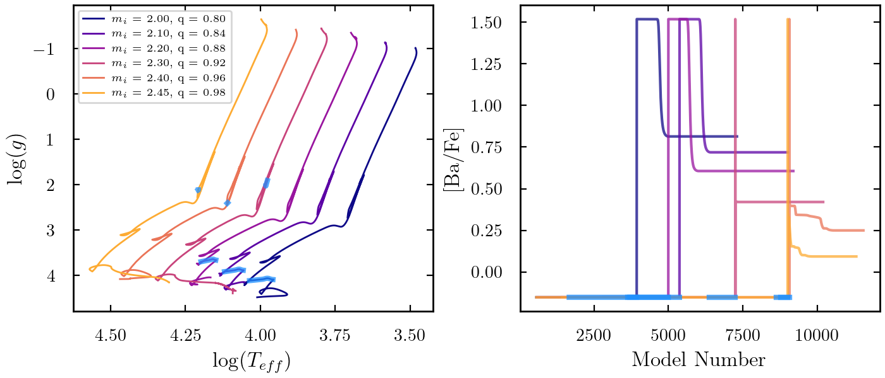
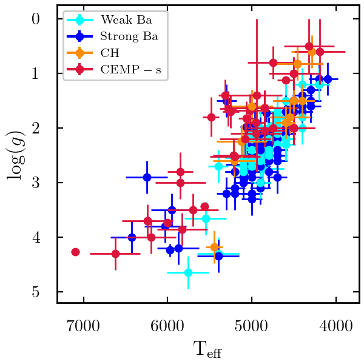
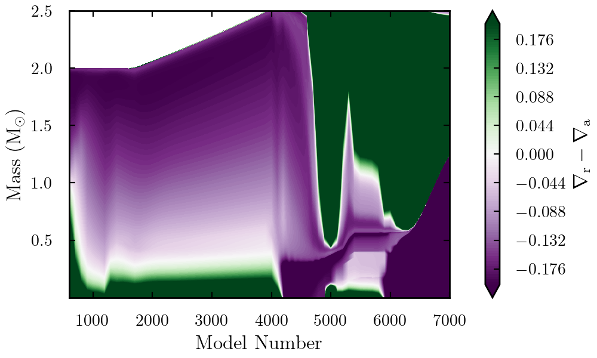

$\newcommand{\ensuremath}{}$
$\newcommand{\xspace}{}$
$\newcommand{\object}[1]{\texttt{#1}}$
$\newcommand{\farcs}{{.}''}$
$\newcommand{\farcm}{{.}'}$
$\newcommand{\arcsec}{''}$
$\newcommand{\arcmin}{'}$
$\newcommand{\ion}[2]{#1#2}$
$\newcommand{\textsc}[1]{\textrm{#1}}$
$\newcommand{\hl}[1]{\textrm{#1}}$
$\newcommand{\footnote}[1]{}$
$\newcommand{\CJH}[1]{\textcolor{brightpink}{{\bf} #1}}$
$\newcommand{\AJD}[1]{\textcolor{electricblue}{#1}}$
$\newcommand{\isotope}[2]{^{#1}{#2}}$
$\newcommand{\msun}{\rm{M_{\odot}}}$

# Modeling the progenitors of low-mass post-accretion binaries

<mark>Appeared on: 2025-05-29</mark> - 

<mark>A. Dimoff</mark>, et al.

**Abstract:** About half of the mass of all heavy elements with mass number A $>$ 90 is formed through the slow neutron capture process (s-process), occurring in evolved asymptotic giant branch (AGB) stars with masses $\sim1-6$ $\msun$ . The s-process can be studied by modeling the accretion of material from AGB stars onto binary barium (Ba), CH, and carbon-enhanced metal-poor (CEMP)-s stars. Comparing observationally derived surface parameters and 1D-LTE abundance patterns of s-process elements to theoretical binary accretion models, we aim to understand the formation of post-accretion systems. We explore the extent of dilution of the accreted material and describe the impact of convective mixing on the observed surface abundances. We compute a new grid of 2700 accretion models for low-mass post-accretion systems. A maximum-likelihood comparison determines the best fit models for observational samples of Ba, CH, and CEMP-s stars. We find consistent AGB donor masses in the mass range of $2 - 3$ $\msun$ $ $ across our sample of post-accretion binaries. We find the formation scenario for weak Ba stars is an AGB star transferring a moderate amount of mass ( $\leq 0.5$ $\msun$ ) resulting in a $\sim 2.0-2.5$ $\msun$ $ $ Ba star. The strong Ba stars are best fit with lower final masses $\sim1.0-2.0$ $\msun$ $ $ and significant accreted mass ( $\geq 0.5$ $\msun$ ). The CH and CEMP-s stars display lower final masses ( $\sim1.0$ $\msun$ ) and small amounts of transferred material ( $\sim 0.1$ $\msun$ ). We find that Ba stars generally accrete more material than CEMP-s and CH stars. We also find that strong Ba stars must accrete more than $0.50$ $\msun$ $ $ to explain their abundance patterns, and in this limit we are unable to reproduce the observed mass distribution of strong Ba stars. The mass distributions of the weak Ba stars, CEMP-s, and CH stars are well reproduced in our modeling.

**Figure 5. -** Left: Evolutionary tracks for a sample of stars with $m_{final} = 2.50$\msun$ $at [Fe/H] = -0.15 with different accretion masses and initial mass ratios, with accretion phases for each model highlighted in blue. Right: Relative surface abundance of the s-process element Ba. The abundance is elevated after the accretion phase, and only after the onset of first dredge-up and mixing is the surface abundance diluted. (*fig:acc_phase*)

**Figure 1. -** Kiel diagram showing surface gravities and effective temperatures for the collected observational sample. Blue data points are strong Ba stars, cyan data points are weak Ba stars, orange data points are CH stars, and red data points are CEMP-s stars. Surface parameters and abundances are collected from \citet{Dimoff+2024}, \citet{DeCastro_etal2016}, \citet{Roriz2021}, \cite{Goswami_etal2006}, \citet{Karinkuzi_Goswami2014}, \citet{Karinkuzhi_Goswami2015}, \citet{Goswami_Aoki_Karinkuzhi2016}, \citet{Goswami+2021_CEMPs}. (*fig:obs_kiel*)

**Figure 2. -** Example Kippenhahn diagram for a 2.00 $\msun$$ $star accreting 0.50 $\msun$$ $of material from a 2.50 $\msun$$ $AGB star at a metallicity of [Fe/H] = -0.15. Green colors denote convective regions, and purple colors denote radiative regions, determined by the computed difference in the radiative and adiabatic transfer gradients. In the total mass on the y-axis, the accretion phase can be identified by the increase in mass. Note that the x-axis is model number, which is non-linear with respect to time. (*fig:Kippenhahn*)

