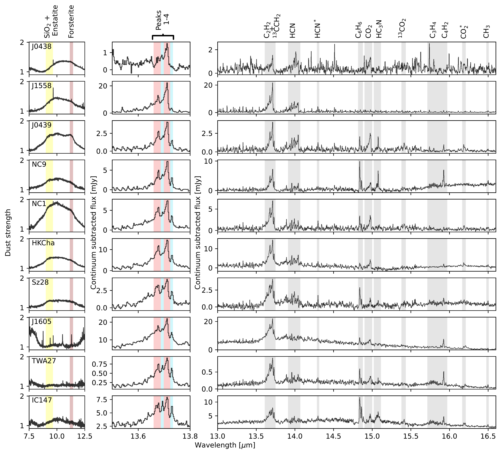
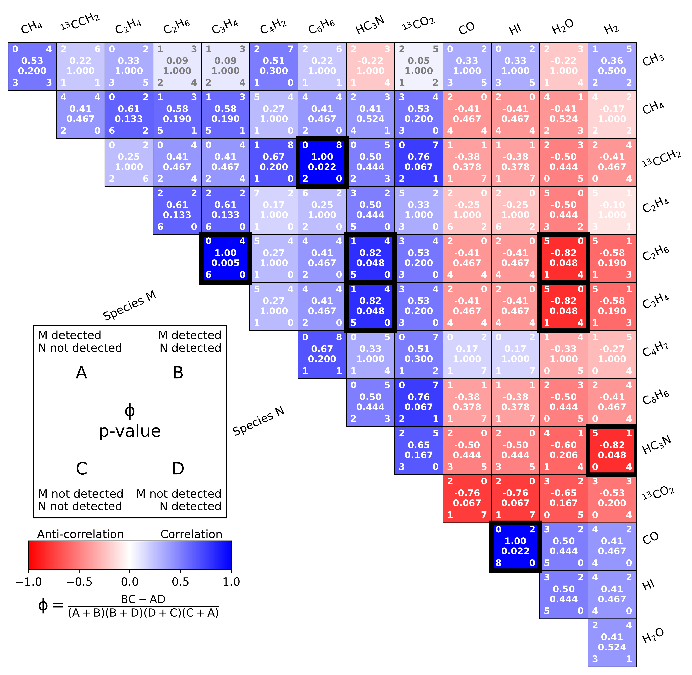

$\newcommand{\ensuremath}{}$
$\newcommand{\xspace}{}$
$\newcommand{\object}[1]{\texttt{#1}}$
$\newcommand{\farcs}{{.}''}$
$\newcommand{\farcm}{{.}'}$
$\newcommand{\arcsec}{''}$
$\newcommand{\arcmin}{'}$
$\newcommand{\ion}[2]{#1#2}$
$\newcommand{\textsc}[1]{\textrm{#1}}$
$\newcommand{\hl}[1]{\textrm{#1}}$
$\newcommand{\footnote}[1]{}$
$\newcommand{\ama}[1]{\textcolor{red}{\rm #1^{(\rm AMA)}}}$
$\newcommand{\ik}[1]{\textcolor{purple}{\rm #1^{(\rm IK)}}}$
$\newcommand{\jay}[1]{\textcolor{magenta}{\rm #1^{(\rm Jay)}}}$
$\newcommand{\ch}[1]{{\rm #1}}$
$\newcommand{\hl}[1]{{{#1}}}$
$\newcommand{\hll}[1]{{{#1}}}$
$\newcommand{\PreserveBackslash}[1]{\let\temp=\\#1\let\\=\temp}$
$\newcommand{\mybox}[2][1.1ex]{\raisebox{#1}{\myboxi{#2}}}$
$\newcommand{\myboxx}[2][1.1ex]{\raisebox{#1}{\myboxxi{#2}}}$
$\newcommand{\myboxxx}[2][1.1ex]{\raisebox{#1}{\myboxxxi{#2}}}$

# MINDS: The very low-mass star and brown dwarf sample: Detections and trends in the inner disk gas

<mark>Appeared on: 2025-06-04</mark> -  _20 pages, 18 figures, Accepted for publication in Astronomy & Astrophysics_

A. M. Arabhavi, et al. -- incl., <mark>T. Henning</mark>, <mark>G. Perotti</mark>, <mark>K. Schwarz</mark>

**Abstract:** Planet-forming disks around brown dwarfs and very low-mass stars (VLMS) are on average less massive and are expected to undergo faster radial solid transport than their higher mass counterparts. _Spitzer_ had detected $\ch{C_2H_2}$ , $\ch{CO_2}$ and $\ch{HCN}$ around these objects, but did not provide a firm detection of water. With better sensitivity and spectral resolving power than that of _Spitzer_ , the _James Webb Space Telescope_ (JWST) has recently revealed incredibly carbon-rich spectra and only one water-rich spectrum from such disks. A study of a larger sample of objects is necessary to understand how common such carbon-rich inner disk regions are and to put constraints on their evolution. We present and analyze JWST MIRI/MRS observations of 10 disks around VLMS from the MIRI GTO program. This sample is diverse, with the central object ranging in mass from 0.02 to 0.14 $M_{\odot}$ . They are located in three star-forming regions and a moving group (1-10 Myr). We identify molecular emission $\hl{in all sources based on recent literature and spectral inspection,}$ and report detection rates. We compare the molecular flux ratios between different species and to dust emission strengths. We also compare the flux ratios with the stellar and disk properties. The spectra of these VLMS disks are extremely rich in molecular emission, and we detect the 10 $\mu$ m silicate dust emission feature in 70 \% of the sample. We detect $\ch{C_2H_2}$ and $\ch{HCN}$ in all of the sources and find larger hydrocarbons such as $\ch{C_4H_2}$ and $\ch{C_6H_6}$ in nearly all sources. Among oxygen-bearing molecules, we find firm detections of $\ch{CO_2}$ , $\ch{H_2O}$ , and $\ch{CO}$ in 90 \% , 50 \% , and 20 \% of the sample, respectively. We find that the detection rates of organic molecules correlate with other organic molecules and anti-correlate with the detection rates of inorganic molecules. Hydrocarbon-rich sources show a weaker 10 $\mu$ m dust strength as well as lower disk dust mass (measured from millimeter fluxes) than the oxygen-rich sources. We find potential evidence for C/O enhancement with disk age. The observed trends are consistent with models that suggest rapid inward solid material transport and grain growth.

**Figure 17. -** Summary of dust and gas observations. The left panels show continuum-normalized dust strengths highlighting $\ch${SiO_2}, enstatite, and forsterite emission features. The middle panels show a zoom in on the observed $\ch${C_2H_2} features highlighting four peaks corresponding to the main and rare isotopologues in red and blue respectively. The right panels show the continuum-subtracted hydrocarbon-rich wavelength region of the spectra. The grey regions highlight the main $Q$-branches of molecules in this wavelength region. $\ch${HCN^*} and $\ch${CO_2^*} indicate hot bands $\nu_2$:1-0 and $\nu_1\nu_2\nu_3$:100-010, respectively. The spectra are ordered by increasing flux ratios of the $\ch${^{13}CCH_2} and $\ch${C_2H_2} peaks (see Sect. \ref{sec:trends2}) and are normalised to a distance of 150 pc. (*fig:features_summary*)

**Figure 23. -** Binary correlation coefficients  (Yule1912)  between the detection rates of different molecules. The box on the bottom left describes the details of various numbers shown in each colored box on the right. The color denotes the value of the correlation coefficient, with red corresponding to an anti-correlation and blue corresponding to a correlation. For calculating the coefficients only firm detections are considered as `detected' while the rest (including tentative detections) are considered `not detected'. Molecules that are detected in all the sources or are detected in only one source are not shown. Molecule pairs with statistically significant correlations (p-value<0.05) are highlighted with black borders. (*fig:correlations*)

**Figure 5. -** Vibrational stability equation of state
               $S_{\mathrm{vib}}(\lg e, \lg \rho)$.
               $>0$ means vibrational stability.
              Vibrational stability equation of state
               $S_{\mathrm{vib}}(\lg e, \lg \rho)$.
               $>0$ means vibrational stability.
              Nonlinear Model ResultsNonlinear Model ResultsSpectral types and photometry for stars in the
  region.Spectral types and photometry for stars in the
  region.List of nearby SNe used in this work.Summary for ISOCAM sources with mid-IR excess
(YSO candidates).Summary for ISOCAM sources with mid-IR excess
(YSO candidates). Sample stars with absolute magnitudecontinued. Sample stars with absolute magnitudecontinued.Shown in greyscale is a...Plotted above...Complexes characterisation.Line data and abundances ...Continued. (*FigVibStab*)

