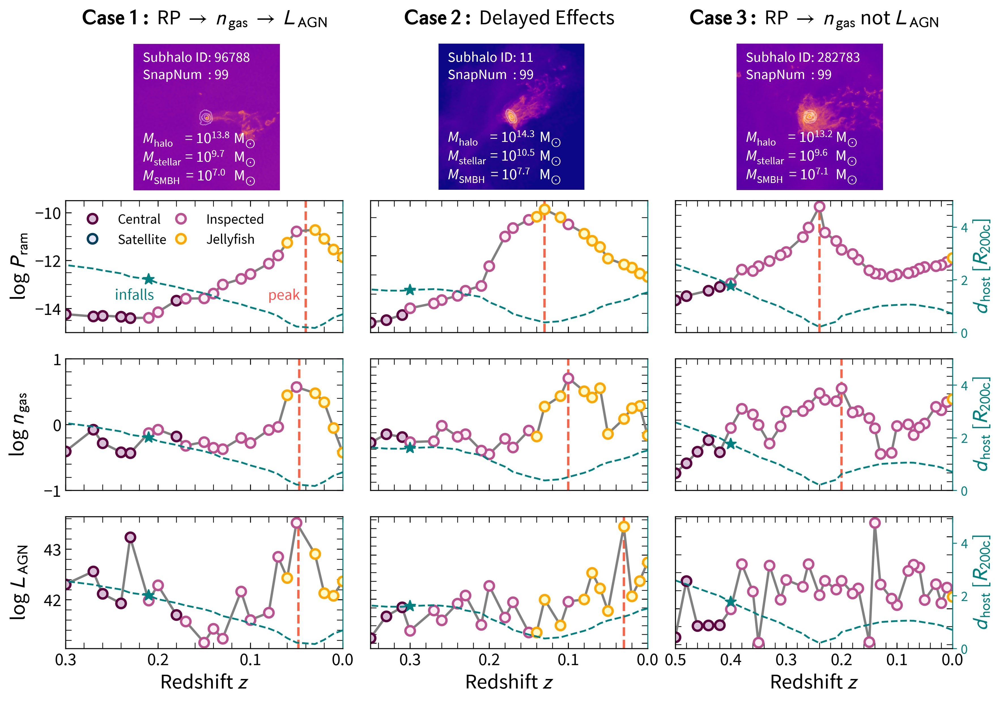
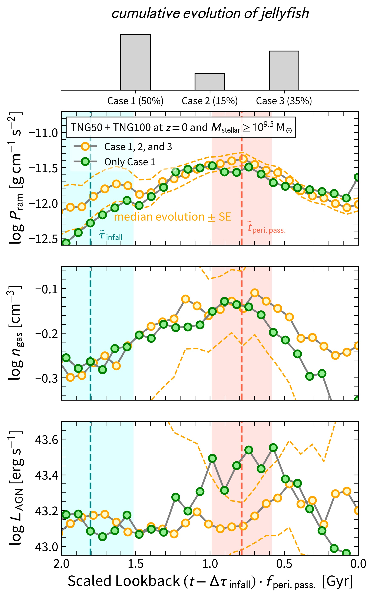
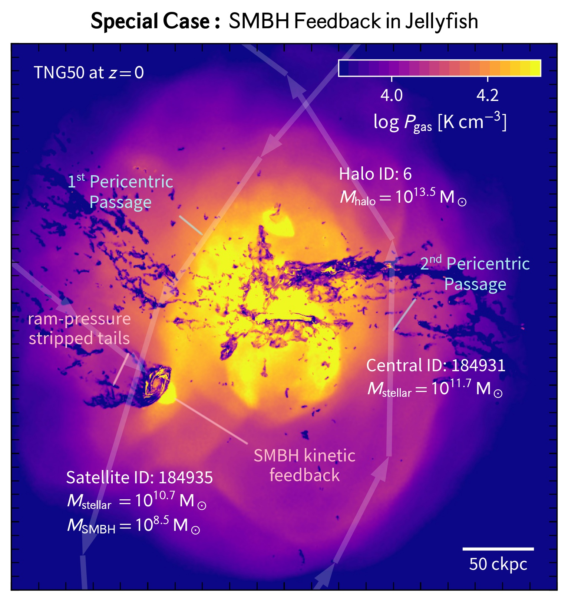

$\newcommand{\ensuremath}{}$
$\newcommand{\xspace}{}$
$\newcommand{\object}[1]{\texttt{#1}}$
$\newcommand{\farcs}{{.}''}$
$\newcommand{\farcm}{{.}'}$
$\newcommand{\arcsec}{''}$
$\newcommand{\arcmin}{'}$
$\newcommand{\ion}[2]{#1#2}$
$\newcommand{\textsc}[1]{\textrm{#1}}$
$\newcommand{\hl}[1]{\textrm{#1}}$
$\newcommand{\footnote}[1]{}$
$\newcommand{\swatch}[1]{\tikz[baseline=-0.6ex] \node[fill=#1,shape=rectangle,draw=black,thick,minimum width=5mm,rounded corners=2pt]() ;}$
$\newcommand{\orcid}[1]{\href{https://orcid.org/#1}{\includegraphics[scale=0.05]{figures/ORCID-iD_icon-128x128.png}}}$
$\newcommand{\thebibliography}{\DeclareRobustCommand{\VAN}[3]{##3}\VANthebibliography}$

# Jellyfish galaxieswith the IllustrisTNG simulations --Supermassive black hole activity in dense environments with ram-pressure stripped satellites

<mark>Appeared on: 2025-06-09</mark> -  _21 pages, 9 figures + 3 appendices with 3 figures. Submitted to MNRAS_

<mark>S. Kurinchi-Vendhan</mark>, et al. -- incl., <mark>E. Rohr</mark>, <mark>A. Pillepich</mark>

**Abstract:** $\noindent$ Jellyfish galaxies are extreme examples of how galaxies can transform due to dense environmental effects. These satellite galaxies suffer from ram-pressure stripping, leading to the formation of their distinctive gaseous tails. Some recent observational studies find that jellyfish galaxies are more likely to host active galactic nuclei (AGN) compared to central galaxies of the same mass, suggesting a link between ram pressure and supermassive black hole (SMBH) accretion. We use the IllustrisTNG cosmological-magnetohydrodynamical simulations, namely TNG50 and TNG100, to explore the presence of AGN in jellyfish galaxies with $M_{\rm{stellar}}\simeq10^{9.5-10.8} \rm{M}_\odot$ at redshift $z=0$ from the Zooniverse "Cosmological Jellyfish" citizen-science project. Compared to central galaxies, jellyfish are more likely to host an AGN ( $L_{\rm AGN}\geq10^{44} \mathrm{erg s^{-1}}$ ) particularly at high stellar masses ( $M_{\rm stellar}\gtrsim10^{10} \mathrm{M_\odot}$ ). Jellyfish are also more likely to host an AGN than satellites of the same mass, largely because many satellite galaxies are gas-poor and therefore have lower SMBH accretion rates. Compared to non-jellyfish satellites with similar gas content, jellyfish typically undergo stronger ram pressure and have higher central gas densities along with lower central gas sound speeds, although these effects are smaller at lower stellar masses ( $M_{\rm stellar}\lesssim10^{10} \mathrm{M_\odot}$ ). Together with case studies of individual galaxies, our population analysis indicates that ram pressure can play a key role in fuelling AGN activity in a large fraction of jellyfish, where gas compression can lead to intense episodes of AGN feedback and star formation. Thus, it is essential to consider both environmental and secular processes for a more complete picture of satellite galaxy evolution.

**Figure 10. -** **_Ram-pressure feeding of SMBH activity,**_ shown through the evolution of ram pressure, central gas densities (innermost 1 ckpc), and AGN luminosities in three individual jellyfish galaxies in TNG50 at $z = 0$. We also note whether the galaxy is a jellyfish (yellow circle), inspected satellite (pink circle), satellite (blue circle), or central (purple circle) at each snapshot, as well as when the galaxy infalls into its halo (star; tracked by the host-centric distance in green). In all cases, most of the depicted quantities peak near in time to the first pericentric passage, where the host-centric distance is at a local minimum (dashed red line). **Case 1:** For \texttt{SubhaloID = 96788}, the peak in $P_{\rm ram}$ directly corresponds to a peak in $n_{\rm gas}$ and $L_{\rm AGN}$ at around the time of the first pericentric passage. **Case 2:** For \texttt{SubhaloID = 11}, the peaks in $n_{\rm gas}$ and $L_{\rm AGN}$ are slightly delayed compared to the peak in $P_{\rm ram}$, showing that ram pressure can indirectly effect SMBH activity after the pericentric passage. **Case 3:** For \texttt{SubhaloID = 282783}, the peak in $P_{\rm ram}$ corresponds to a peak in $n_{\rm gas}$ but not $L_{\rm AGN}$; here, it is possible for ram pressure to drive gas toward the centre of the jellyfish without affecting the SMBH. See Figure \ref{FIG:RP-AGN_Cumulative} for a cumulative evolution of all cases. (*FIG:RP-AGN*)

**Figure 1. -** **_Ram-pressure feeding of SMBH activity,**_ shown through the evolution of ram pressure, central gas densities, and AGN luminosities in hundreds of jellyfish galaxies from TNG50 and TNG100 at $z = 0$. The cumulative i.e. "stacked" evolution represents a combination of three evolutionary paths by which ram pressure affects the AGN activity of the jellyfish galaxies: we categorize them as "Case 1" (Direct Effect), "Case 2" (Delayed Effect), and "Case 3" (No Effect) and quantify them in the above bar plot by visual inspection of the evolutionary tracks of all individual galaxies (as those of Figure \ref{FIG:RP-AGN}). We show the median-stacked evolution, with the galaxy-to-galaxy standard deviation around the median as the dashed outer lines. The standard error extends beyond the figure limits in the case of $n_{\rm gas}$ and $L_{\rm AGN}$, as these quantities are highly variable between galaxies. To stack the data, we shift the time axes by $\Delta \tau_{\rm infall}$ and scale by $f_{\rm peri. \: pass.}$ to align the evolutions at the average time of infall (dotted teal line) and first pericentric passage (dotted red line with 1-$\sigma$ shaded). The time correlation between ram pressure and AGN luminosity is somewhat weak. However, when we stack across only jellyfish galaxies of the first case (green circles), a strong and timely increase of AGN luminosity manifests with an increase of ram pressure and central gas density.
     (*FIG:RP-AGN_Cumulative*)

**Figure 12. -** **_The special case of a satellite with ram-pressure stripped tails and an AGN-driven bubble.**_ The image shows the 2-D gas pressure projection of a satellite galaxy from TNG50 at $z = 0$, with \texttt{Subhalo ID = 184935, Snapshot 99} and a stellar mass of $M_{\rm stellar} = 10^{10.7} \: \rm{M}_\odot$. We show the trajectory of the satellite (arrows) as well as when it goes through a pericentric passage. It is orbiting a central galaxy with \texttt{Subfind ID = 184931} and a stellar mass of $M_{\rm stellar} = 10^{11.7} \: \rm{M}_\odot$, and both are residents of a larger halo structure with \texttt{Group Nr. = 6} and a host mass of $M_{\rm halo} = 10^{13.5} \: \rm{M}_\odot$. Not only does this satellite exhibit ram-pressure stripped tails, but also a bubble of high pressure gas at its leading edge. This looks similar to the eROSITA-like X-ray emitting bubbles of TNG50 Milky Way- and Andromeda-like galaxies driven by their SMBH kinetic feedback \citep[see][]{Pillepich_2021}. Interestingly, here the galaxy is a satellite and ram-pressure stripping, star formation, and gas bubbles driven by kinetic feedback from a low accretion SMBH all coexist at once. (*FIG:Special_Case*)

