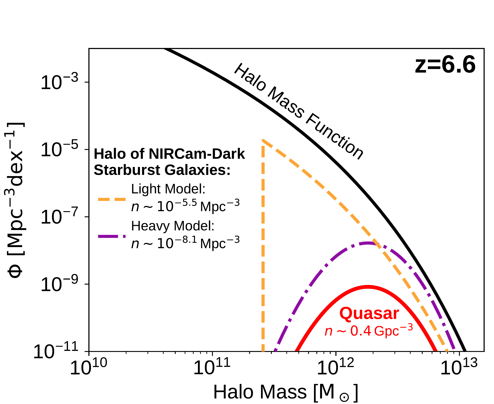
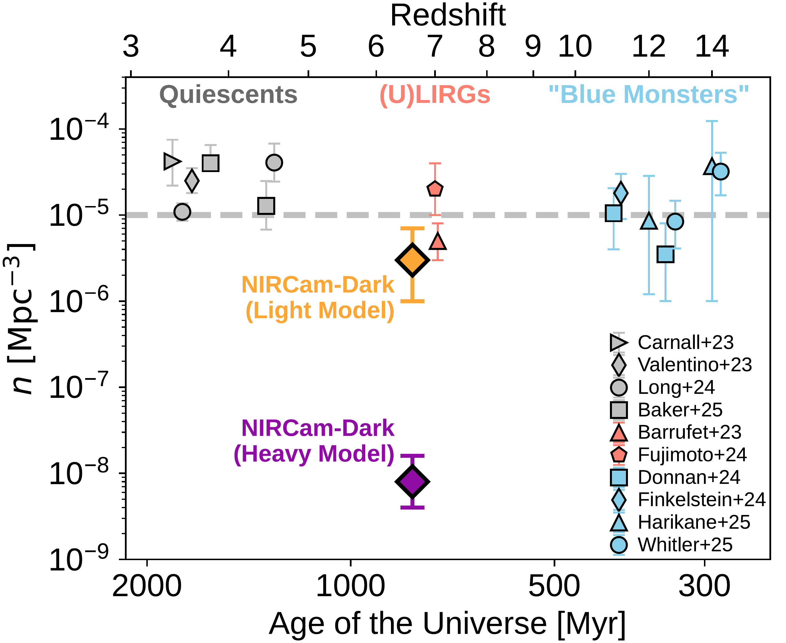
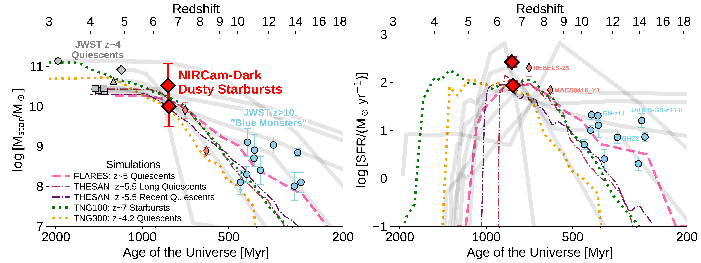

$\newcommand{\ensuremath}{}$
$\newcommand{\xspace}{}$
$\newcommand{\object}[1]{\texttt{#1}}$
$\newcommand{\farcs}{{.}''}$
$\newcommand{\farcm}{{.}'}$
$\newcommand{\arcsec}{''}$
$\newcommand{\arcmin}{'}$
$\newcommand{\ion}[2]{#1#2}$
$\newcommand{\textsc}[1]{\textrm{#1}}$
$\newcommand{\hl}[1]{\textrm{#1}}$
$\newcommand{\footnote}[1]{}$
$\newcommand{\vdag}{(v)^\dagger}$
$\newcommand$
$\newcommand$
$\newcommand$
$\newcommand$
$\newcommand{\oii}{\mbox{[\ion{O}{2}]}}$
$\newcommand{\oiii}{\mbox{[\ion{O}{3}]}}$
$\newcommand{\hei}{\mbox{\ion{He}{1}}}$
$\newcommand{\heii}{\mbox{\ion{He}{2}}}$
$\newcommand{\ci}{\mbox{[\ion{C}{1}]}}$
$\newcommand{\cii}{\mbox{[\ion{C}{2}]}}$
$\newcommand{\nii}{\mbox{[\ion{N}{2}]}}$
$\newcommand{\sii}{\mbox{[\ion{S}{2}]}}$
$\newcommand{\siii}{\mbox{[\ion{S}{3}]}}$
$\newcommand{\feii}{\mbox{[\ion{Fe}{2}]}}$
$\newcommand{\hb}{\mbox{H\beta}}$
$\newcommand{\ha}{\mbox{H\alpha}}$
$\newcommand{\bra}{\mbox{Br\alpha}}$
$\newcommand{\brb}{\mbox{Br\beta}}$
$\newcommand{\brg}{\mbox{Br\gamma}}$
$\newcommand{\paa}{\mbox{Pa\alpha}}$
$\newcommand{\pab}{\mbox{Pa\beta}}$
$\newcommand{\pag}{\mbox{Pa\gamma}}$
$\newcommand{\pad}{\mbox{Pa\delta}}$
$\newcommand{\lya}{\mbox{Ly\alpha}}$
$\newcommand{\popiii}{\mbox{\ion{Pop}{3}}}$
$\newcommand$
$\newcommand$
$\newcommand$
$\newcommand$
$\newcommand$
$\newcommand$
$\newcommand{\zsp}{\mbox{z_\mathrm{spec}}}$
$\newcommand{\zph}{\mbox{z_\mathrm{phot}}}$
$\newcommand{\lir}{\mbox{L_\mathrm{IR}}}$
$\newcommand{\sap}{\mbox{\texttt{SAPPHIRES}}}$
$\newcommand{\macs}{\mbox{MACS J0416.1--2403}}$
$\newcommand{\textred}[1]{{#1}}$
$\newcommand{\textblue}[1]{{#1}}$
$\newcommand{\thefigure}{\thesection\arabic{figure}}$

# The Identification of Two JWST/NIRCam-Dark Starburst Galaxies at $z=6.6$ with ALMA

<mark>Appeared on: 2025-06-10</mark> -  _14 pages, 5 figures, submitted to an AAS journal. Comments are welcome_

F. Sun, et al.

**Abstract:** We analyze two dusty star-forming galaxies at $z=6.6$ .These galaxies are selected from the ASPIRE survey, a JWST Cycle-1 medium and ALMA Cycle-9 large program targeting 25 quasars and their environments at $z\simeq6.5 - 6.8$ .These galaxies are identified as companions to UV-luminous quasars and robustly detected in ALMA continuum and $\cii$ emission, yet they are extraordinarily faint at the NIRCam wavelengths (down to $>28.0$ AB mag in the F356W band).They are more obscured than galaxies like Arp220, and thus we refer to them as "NIRCam-dark" starburst galaxies (star formation rate $\simeq 80 - 250$ $\smpy$ ).Such galaxies are typically missed by (sub)-millimeter blank-field surveys.From the star-formation history (SFH), we show that the NIRCam-dark galaxies are viable progenitors of massive quiescent galaxies at $z\gtrsim4$ and descendants of UV-luminous galaxies at $z>10$ .Although it is hard to constrain their number density from a quasar survey, we conclude that NIRCam-dark galaxies can be as abundant as $n\sim10^{-5.5}$ Mpc $^{-3}$ assuming a light halo occupation model.If true, this would equal to $\sim$ 30 \% of the number densities of both the quiescent galaxies at $z\gtrsim4$ and UV-luminous galaxies at $z>10$ .We further predict that analogs at $z\sim8$ should exist according to the SFH of early massive quiescent galaxies.However, they may fall below the current detection limits of wide JWST and ALMA surveys, thus remaining "JWST-dark".To fully trace the evolution of massive galaxies and dust-obscured cosmic star formation at $z\gtrsim8$ , wide-field JWST/NIRCam imaging and slitless spectroscopic surveys of early protoclusters are essential.

**Figure 4. -** 
The number density constraint of NIRCam-dark galaxies. **Left**: The host halo mass function models of NIRCam-dark starburst galaxies at $z=6.6$.
We consider two models for their host mass distribution, including a light model (dashed orange line) and a heavy model (dashed-dotted purple line; Section \ref{ss:04b_number}).
These two models predict completely different number densities of NIRCam-dark galaxies, while both of them match the existing observations.
For comparison we show the quasar host HMF (red) and overall HMF (black) at the same redshift.
**Right**: Comparison of the number densities with massive quiescent galaxies at $z\sim4$\citep{carnall23b, valentino23, long24a, baker25a}, (U)LIRGs at $z\sim7$\citep[][see Section \ref{ss:04b_number} for details]{barrufet23a, fujimoto24b} and "blue monsters" at $z>10$\citep[][computed from their measured UVLFs in the brightest bins, typically at $M_\mathrm{UV} \sim -21$ mag]{donnan24, finkelstein24, harikane25, whitler25}.
The derived number densities of NIRCam-dark galaxies based on the light and heavy halo occupation model are shown as orange and purple diamonds, respectively.
 (*fig:n*)

**Figure 3. -** Stellar mass (left) and SFR (right) versus redshift for NIRCam-dark dusty starburst galaxies (red diamonds) in the context of massive galaxy evolution.
For comparison we show the star-formation histories of massive quiescent galaxies at $z\sim4$ confirmed with JWST spectroscopy (gray circle: $\ci$tealt{glazebrook24} but using the SFH from $\ci$tealt{turner25a}; diamond: $\ci$tealt{degraaff25a} with solar-metallicity SFH model; triangle: $\ci$tealt{carnall23a} but using the SFH from $\ci$tealt{jiz24a}; squares: $\ci$tealt{baker25a}).
We also highlighted two ALMA-confirmed dusty starbursts known at $z>7$ prior to JWST in coral diamonds, including REBELS-25 $\ci$tep[$z=7.3$;][]{hygate23} and MACS0416\_Y1 $\ci$tep[$z=8.3$;][]{tamura19}.
JWST-confirmed luminous galaxies at $z>10$ with low dust content (also known as "blue monsters"; e.g., $\ci$tealt{ziparo23}) are shown in blue circles $\ci$tep[including][]{arrabalharo23,bunker23,carniani24,castellano24,hsiao24a,kokorev25a,naidu25b,zavala25}.
The median evolution track of early massive galaxies in cosmological simulations are shown in colored lines (including FLARES, $\ci$tealt{lovell23}; IllustrisTNG, $\ci$tealt{pillepich18}, $\ci$tealt{nelson19} and $\ci$tealt{hartley23}; THESAN, $\ci$tealt{kannan22} and $\ci$tealt{chittenden25}).
NIRCam-dark dusty starburst galaxies presented by this study are candidates for the progenitors of massive quiescent galaxies at $z\sim4$ and descendants of "blue monsters" at $z>10$.
 (*fig:sfh*)

**Figure 1. -** JWST NIRCam images (F115W, F200W, F356W), ALMA 1.2 mm continuum images and $\ci$i 158 \micron spectra of two NIRCam-dark galaxies at $z_\mathrm{spec}\sim6.6$.
Because the luminous quasar J1526--2050 is visible to the northwest of J1526m2050.C02 (1$\farcs$6 separation), we also show the quasar-subtracted F200W and F356W image of J1526m2020.C02 in the third row, with ALMA continuum contours (purple) at 10 and 20$\sigma$ overlaid.
Image size is 4$\arcsec$$\times$4$\arcsec$.
These galaxies are selected as companions of quasars with ALMA, but remain undetected or faint at JWST/NIRCam wavelengths.
 (*fig:img*)

