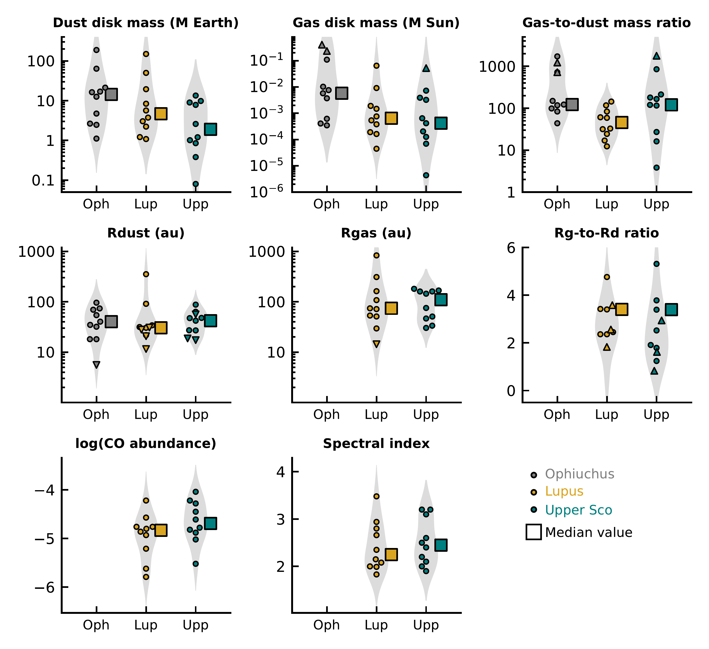
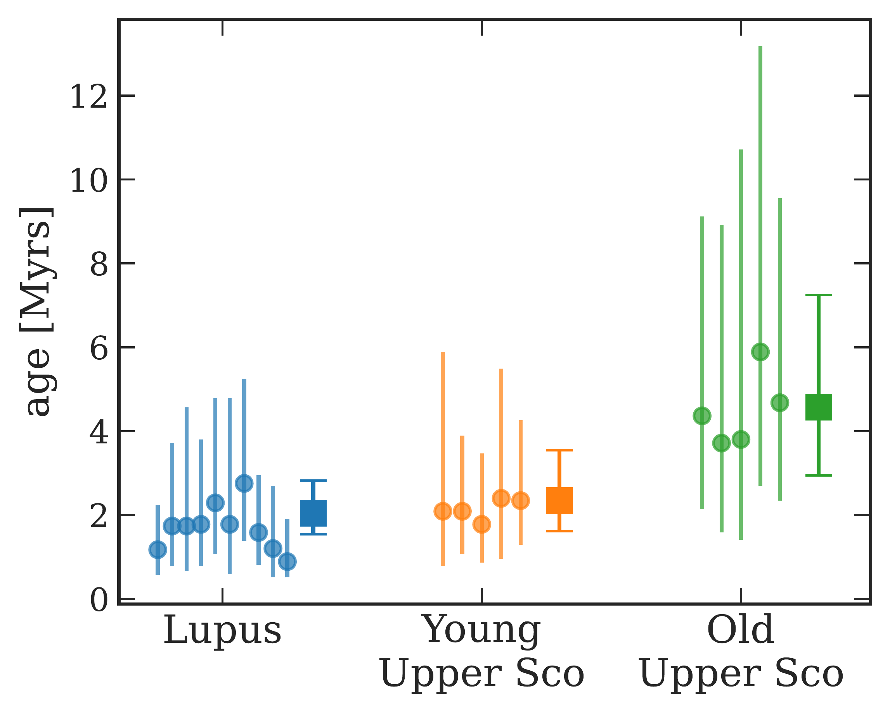
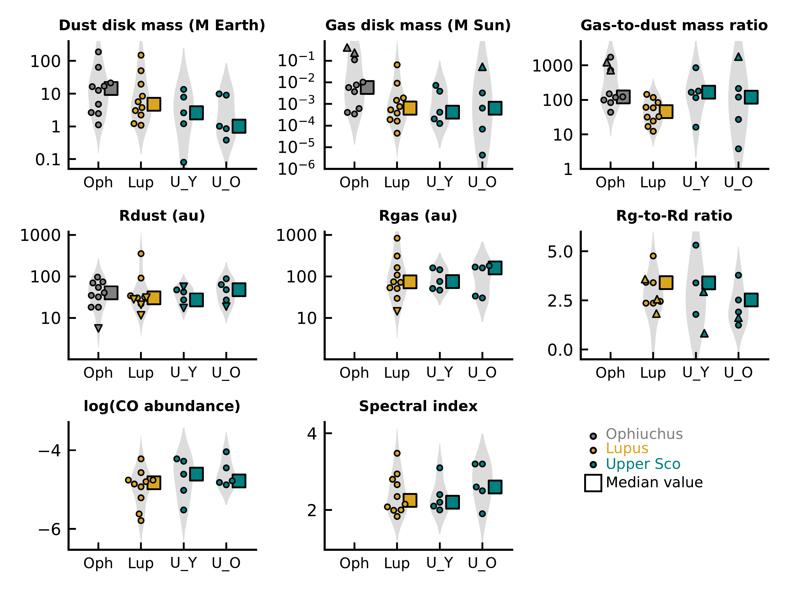

$\newcommand{\ensuremath}{}$
$\newcommand{\xspace}{}$
$\newcommand{\object}[1]{\texttt{#1}}$
$\newcommand{\farcs}{{.}''}$
$\newcommand{\farcm}{{.}'}$
$\newcommand{\arcsec}{''}$
$\newcommand{\arcmin}{'}$
$\newcommand{\ion}[2]{#1#2}$
$\newcommand{\textsc}[1]{\textrm{#1}}$
$\newcommand{\hl}[1]{\textrm{#1}}$
$\newcommand{\footnote}[1]{}$
$\newcommand{\vdag}{(v)^\dagger}$
$\newcommand$
$\newcommand$
$\newcommand{\ce}{C^{18}O}$
$\newcommand{\ct}{^{13}CO}$
$\newcommand{\cseven}{C^{17}O}$
$\newcommand{\kms}{ km s^{-1}}$
$\newcommand{\nco}{N_{\rm CO}~}$
$\newcommand$
$\newcommand{\todo}[1]{\textcolor{red}{\textbf{#1}}}$
$\newcommand{\Coco}[1]{\textcolor{black}{\textbf{#1}}}$

# The ALMA Survey of Gas Evolution of PROtoplanetary Disks (AGE-PRO): \ I. Program Overview and Summary of First Results

<mark>Appeared on: 2025-06-13</mark> -  _Accepted for publication in ApJ for the special issue of AGE-PRO_

K. Zhang, et al. -- incl., <mark>K. Schwarz</mark>

**Abstract:** We present the ALMA Survey of Gas Evolution of PROtoplanetary Disks (AGE-PRO), a Large Program of the Atacama Large Millimeter/submillimeter Array (ALMA). AGE-PRO aims to systematically trace the evolution of gas disk mass and size throughout the lifetime of protoplanetary disks. It uses a carefully selected sample of 30 disks around M3-K6 stars in three nearby star-forming regions: Ophiuchus (0.5-1 Myr), Lupus (1-3 Myr), and Upper Sco (2-6 Myr).Assuming the three regions had similar initial conditions and evolutionary paths, we find the median gas disk mass appears to decrease with age. Ophiuchus disks have the highest median gas mass (6 M $_{\rm Jup}$ ), while the Lupus and Upper Sco disks have significantly lower median masses (0.68 and 0.44 M $_{\rm Jup}$ , respectively). Notably, the gas and dust disk masses appear to evolve on different timescales. This is evidenced by the median gas-to-dust mass ratio, which decreases from 122 in the youngest disks ( $<$ 1 Myr) to 46 in Lupus disks, and then increases to 120 in the Upper Sco disks. The median gas disk sizes range between 74-110 au, suggesting that typical gas disks are much smaller than those of well-studied, massive disks. Population synthesis models suggest that magneto-hydrodynamic wind-driven accretion can reproduce median disk properties across all three regions, when assuming compact disks with a declining magnetic field over time. In contrast, turbulent-driven models overestimate gas masses of $>$ 1 Myr disks by an order of magnitude. Here we discuss the program's motivation, survey design, sample selection, observation and data calibration processes, and highlight the initial results.

**Figure 8. -**  Comparison of disk properties in the Ophiuchus, Lupus, and Upper Sco samples. The circles are individual values and the squares are median values listed in Table \ref{tab:median}. The gas disk sizes, R$_{\rm CO, 90\%}$ are measured as radius that encloses 90 \% of the $^{12}$CO (2-1). Due to the severe cloud/envelope contamination in the $^{12}$CO emission of the Ophiuchus disks, we only measure R$_{\rm CO, 90\%}$ for the Lupus and Upper Sco disks  ([Trapman, Vioque and Kurtovic 2025]()) . The CO abundances of Ophiuchus disks are assumed to be at the ISM level  ([Zhang, Schwarz and Bergin 2020](), [Trapman, Zhang and Rosotti 2025]())  rather than constrained by \ntwoh, and therefore, are not plotted. The spectral index of Ophiuchus disks is not constrained due to the lack of Band 7 observations. (*fig:disk_properties*)

**Figure 10. -** Isochronal ages of the Lupus and Upper Sco samples of AGE-PRO. The circles are individual ages and the squares represent the median ages of each group. The ages were derived based on stellar properties listed in Table \ref{table:stars} and PMS evolutionary tracks of [ and Feiden (2016)](), [Baraffe, et. al (2015)](). The individual ages and their uncertainties can be found in [Deng, Vioque and Pascucci (2025)](), [Agurto-Gangas, Pérez and Sierra (2025)]().   (*fig:age_distribution*)

**Figure 13. -** Comparison of disk properties in the Ophiuchus (0.5-1 Myr), Lupus (1-3 Myr), young Upper Sco group (2-3 Myr), and old Upper Sco group (4-6 Myr). This is the same as Figure \ref{fig:disk_properties}, but with the Upper Sco sample divided into two groups that show different isochronal ages (see Figure \ref{fig:age_distribution}). The circles are individual values and the squares are median values, further details in caption of Figure \ref{fig:disk_properties}.
 (*fig:4group_disk_properties*)

