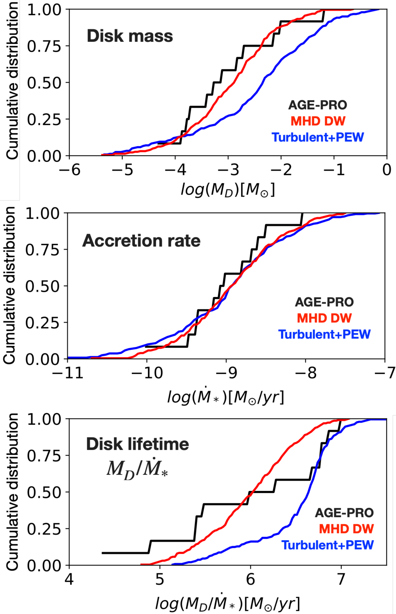

$\newcommand{\ensuremath}{}$
$\newcommand{\xspace}{}$
$\newcommand{\object}[1]{\texttt{#1}}$
$\newcommand{\farcs}{{.}''}$
$\newcommand{\farcm}{{.}'}$
$\newcommand{\arcsec}{''}$
$\newcommand{\arcmin}{'}$
$\newcommand{\ion}[2]{#1#2}$
$\newcommand{\textsc}[1]{\textrm{#1}}$
$\newcommand{\hl}[1]{\textrm{#1}}$
$\newcommand{\footnote}[1]{}$
$\newcommand{\vdag}{(v)^\dagger}$
$\newcommand$
$\newcommand$
$\newcommand$
$\newcommand$
$\newcommand$
$\newcommand$
$\newcommand$
$\newcommand$
$\newcommand$
$\newcommand$
$\newcommand$
$\newcommand$
$\newcommand$
$\newcommand$
$\newcommand$
$\newcommand{\BT}[1]{\textcolor{black}{#1}}$
$\newcommand{\PP}[1]{\textcolor{black}{#1}}$
$\newcommand{\BTbis}[1]{\textcolor{black}{#1}}$
$\newcommand{\revBT}[1]{\textcolor{black}{#1}}$

# The ALMA Survey of Gas Evolution of PROtoplanetary Disks (AGE-PRO):\ VII. Testing accretion mechanisms from disk population synthesis

<mark>Appeared on: 2025-06-13</mark> -  _Accepted for publication in ApJ for the special issue of AGE-PRO_

B. Tabone, et al. -- incl., <mark>A. Somigliana</mark>, <mark>K. Schwarz</mark>

**Abstract:** The architecture of planetary systems depends on the evolution of the disks in which they form. In this work, we develop a population synthesis approach to interpret the AGE-PRO measurements of disk gas mass and size considering two scenarios: turbulence-driven evolution with photoevaporative winds and MHD disk-wind-driven evolution. A systematic method is proposed to constrain the distribution of disk parameters from the disk fractions, accretion rates, disk gas masses, and CO gas sizes. We find that turbulence-driven accretion with initially compact disks ( $R_0 \simeq 5-20 $ au), low mass-loss rates, and relatively long viscous timescales ( $t_{\nu,0} \simeq 0.4-3 $ Myr or $\alpha_{SS} \simeq 2-4 \times 10^{-4}$ ) can reproduce the disk fraction and gas sizes. However, the distribution of apparent disk lifetime defined as the $M_D/\dot{M}_*$ ratio is severely overestimated by turbulence-driven models. On the other hand, MHD wind-driven accretion can reproduce the bulk properties of the disk populations from Ophiuchus to Upper Sco assuming compact disks with an initial magnetization of about $\beta \simeq 10^5$ ( $\alpha_{DW} \simeq 0.5-1 \times 10^{-3}$ ) and a magnetic field that declines with time. More studies are needed to confirm the low masses found by AGE-PRO, notably for compact disks that question turbulence-driven accretion. The constrained synthetic disk populations can now be used for realistic planet population models to interpret the properties of planetary systems on a statistical basis.

**Figure 12. -** Summary of the constraints on turbulence-driven disk evolution obtained from disk dispersal time and median accretion rate measured in Lupus (namely, after 2).
The fitted values of \medMO(panel a) and \medMW(panel b) parameters are plotted as a function of \medtnu for various values of \medRO. The calculated median \medRO and $<M_D>$ at the estimated age of Lupus (2 Myr) are shown in panels c) and d). Median CO gas size and disk mass estimated by AGE-PRO are represented by a grey-shaded area. None of the synthetic populations can simultaneously reproduce the low disk mass and the disk size. Focusing on $<R_{CO}>$, we selected three best-fit models outlined by black circles and boxes. (*fig:fig_stage_2-3_PEW*)

**Figure 2. -** Schematic view of the fitting stages for the turbulent (left) and the MHD disk-wind (right) models. This step-by-step approach allows us to build synthetic populations consistent with the observations in a rationalized approach.
 (*fig:scheme_fitting*)

**Figure 7. -** Cumulative distribution of the accretion rate, the disk mass, and the disk lifetime for the best fit MHD disk-wind (red) and turbulence-driven model (blue) versus the AGE-PRO sample focusing on 1-3 Myr disks (black). The MHD wind model reproduces well the distributions. The salient discrepancy between the turbulence-driven model and the observations lies in the $M_D/\dot{M}_*$ ratio. The modeled cumulative distributions are computed assuming a detection threshold of $M_D= 10^{-5} M_{\odot}$. (*fig:CDF_best_fit*)

