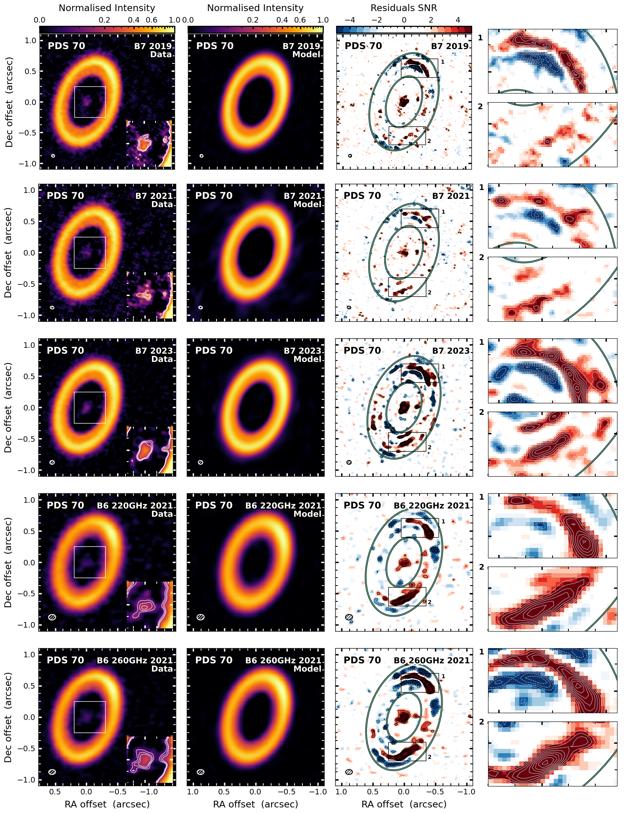
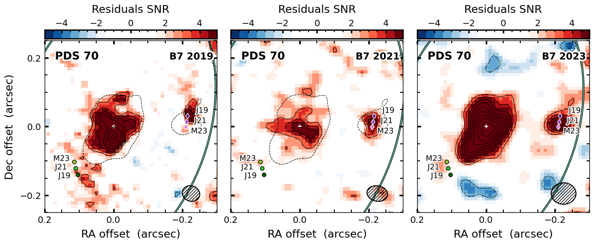
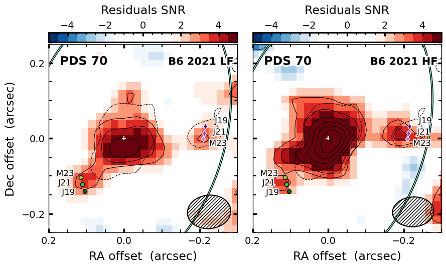
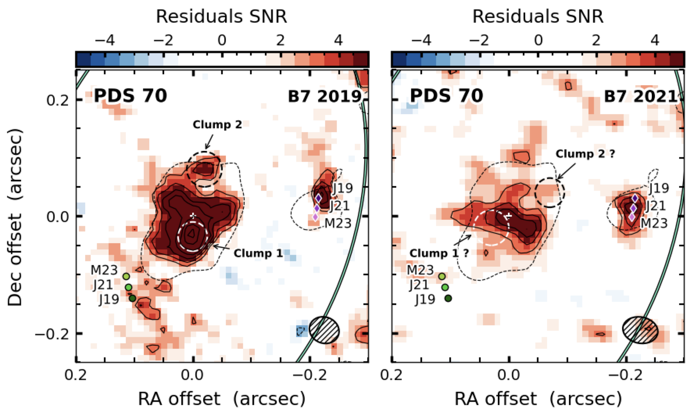

$\newcommand{\ensuremath}{}$
$\newcommand{\xspace}{}$
$\newcommand{\object}[1]{\texttt{#1}}$
$\newcommand{\farcs}{{.}''}$
$\newcommand{\farcm}{{.}'}$
$\newcommand{\arcsec}{''}$
$\newcommand{\arcmin}{'}$
$\newcommand{\ion}[2]{#1#2}$
$\newcommand{\textsc}[1]{\textrm{#1}}$
$\newcommand{\hl}[1]{\textrm{#1}}$
$\newcommand{\footnote}[1]{}$
$\newcommand{\Daniele}[1]{{\color{MidnightBlue}\textbf{DF}: #1}}$
$\newcommand{\mb}[1]{{\color{magenta}\textbf{mb}: #1}}$
$\newcommand{\Tomo}[1]{{\color{ForestGreen}\textbf{TY}: #1}}$
$\newcommand{\fsco}[1]{{\color{Orange}\textbf{fsco}: #1}}$
$\newcommand{\arraystretch}{1.5}$
$\newcommand{\arraystretch}{1.5}$
$\newcommand{\arraystretch}{1.5}$
$\newcommand{\arraystretch}{1.5}$
$\newcommand{\arraystretch}{1.5}$
$\newcommand{\arraystretch}{1.5}$
$\newcommand{\arraystretch}{1.5}$
$\newcommand{\arraystretch}{1.5}$

# Inner Disc and Circumplanetary Material in the PDS 70 System: Insights from Multi-Epoch, Multi-Frequency ALMA Observations

<mark>Appeared on: 2025-06-16</mark> -  _12 pages, 5 figures. Accepted for publication in A&A June 04, 2025_

<mark>D. Fasano</mark>, et al. -- incl., <mark>M. Benisty</mark>, <mark>F. Zagaria</mark>, <mark>K. Doi</mark>

**Abstract:** The two giant protoplanets directly detected in the dust-depleted cavity of PDS 70 offer a unique opportunity to study the processes of ongoing planet formation. The planets have been detected both in IR thermal light and in the H $\alpha$ line, indicating that they are actively accreting material from their surroundings. We calibrate and analyse archival Atacama Large Millimetre/subMillimetre Array (ALMA) Band 6 and 7 observations of PDS 70 to detect circumplanetary material in independent datasets taken at different epochs in 2019, 2021 and 2023 and assess its possible motion. We perform 2D visibility modelling of the high resolution ALMA Band 6 ( $\sim0.11\arcsec\times0.08\arcsec$ ) and Band 7 ( $\sim0.05\arcsec\times0.05\arcsec$ )  dust continuum emission of the outer disc. After subtracting the model from the data, we image the dust continuum emission in the cavity of PDS 70 at multiple epochs. We re-detect the compact dust emission around PDS 70 c in all our datasets in Band 6 and 7, with more than $3.8\sigma$ significance, and tentatively detect compact emission around PDS 70 b at $\sim3\sigma$ in the Band 6 datasets, with a peak emission of $59\pm17 \rm\mu Jy/beam$ and $46\pm14 \rm\mu Jy/beam$ . We find the astrometric relative position of the compact emission around PDS 70 c to be consistent with the expected position of the planet in the 2019-2023 time range. We measure a peak flux difference of up to $64\pm34\rm \mu Jy/beam$ at $1\sigma$ confidence level for the continuum emission coming from the region around PDS 70 c and perform a Bayesian test on our measurements, finding that they are not consistent with significant variable emission. We find no evidence of flux variability in the inner disc. We measure the dust mass of the material co-located with PDS 70 c and the inner disc to be in the range $0.008-0.063 M_\oplus$ and $0.04-0.31 M_\oplus$ , respectively, consistent with previous measurements. Additionally, we obtain Band 6-7 spectral indices of $2.5\pm1.2$ and $3.2\pm0.5$ for the dust emission around PDS 70 c and in the inner disc, respectively, suggesting the inner disc emission is dominated by optically thin dust.

**Figure 2. -** Left to right: Continuum images with insets showing a zoom in the cavity; CLEANed \texttt{galario} model images; CLEANed residual images; zoom on the North (1) and South (2) sides of the outer ring residuals. Contours start at $3\sigma$ and increase by $1\sigma$. The green ellipses approximate the $7\sigma$ contours of the continuum data. The datasets are ordered from Band 7 to Band 6 and by epoch from top to bottom. (*fig:Summary plots*)

**Figure 3. -** Zoom of the residuals in the cavity from Fig.\ref{fig:Summary plots}. a) Band 7 2019 (left panel), 2021 (middle panel) and 2023 (right panel) datasets. b) Band 6 2021 datasets at $\rm220 GHz$(left panel) and $\rm260 GHz$(right panel). The solid contours start from the $3\sigma$ emission and increase by $1\sigma$, while the  dashed contours correspond to the $3\sigma$ emission from the B7 2023 dataset and are overlaid to the other datasets for comparison. The white plus sign marks the centre of the disc, corrected with the \texttt{galario} offset. The green circles and purple diamonds represent the expected position in July 2019 (dark), July 2021 (medium) and May 2023 (light) obtained from the orbital fit of PDS 70 b and c  ([Wang, Vigan and Lacour 2021]()) , respectively. The error bars are smaller than the markers.
               (*fig:Residual cavity all*)

**Figure 4. -** Same as left an middle panels of Fig. \ref{fig:Residual cavity all B7}, with additional labels to identify Clump 1 and Clump 2. The dashed white and black circles represent the location where we re-detect Clump 1 and Clump 2, respectively, in the B7 2019 dataset (left panel), and their expected position assuming Keplerian rotation in the B7 2021 dataset (right panel). (*fig:Inner disc clumps*)

