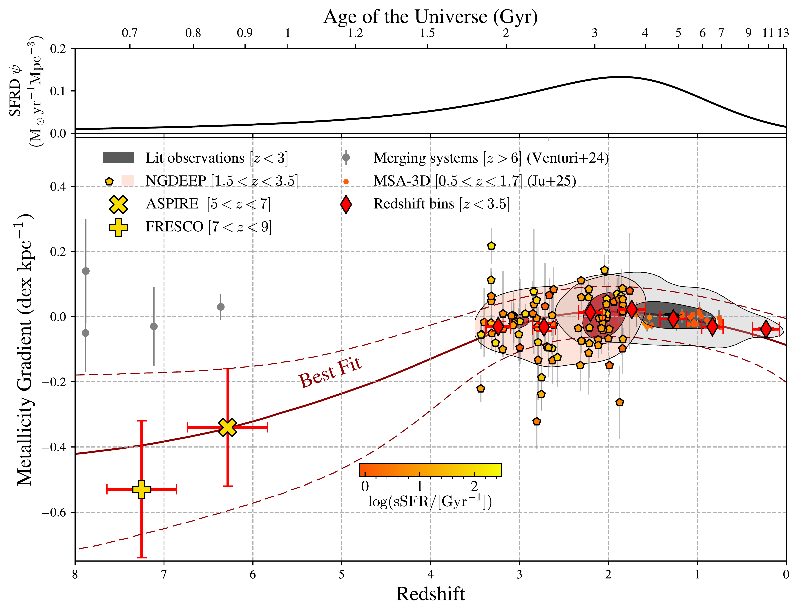
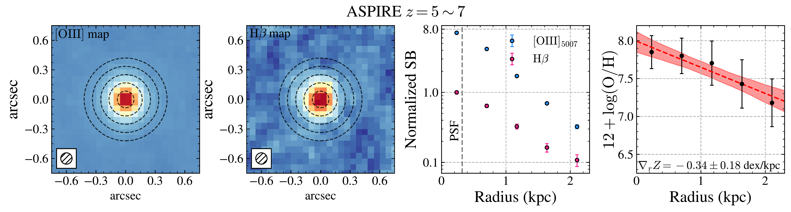
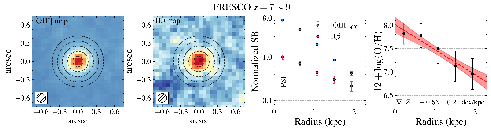
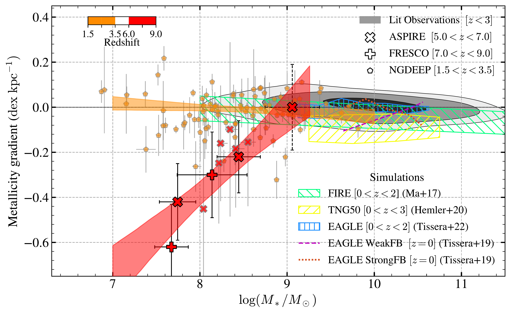

$\newcommand{\ensuremath}{}$
$\newcommand{\xspace}{}$
$\newcommand{\object}[1]{\texttt{#1}}$
$\newcommand{\farcs}{{.}''}$
$\newcommand{\farcm}{{.}'}$
$\newcommand{\arcsec}{''}$
$\newcommand{\arcmin}{'}$
$\newcommand{\ion}[2]{#1#2}$
$\newcommand{\textsc}[1]{\textrm{#1}}$
$\newcommand{\hl}[1]{\textrm{#1}}$
$\newcommand{\footnote}[1]{}$
$\newcommand{\vdag}{(v)^\dagger}$
$\newcommand$
$\newcommand$
$\newcommand{\kms}{\ensuremath{\rm km~s^{-1}}\xspace}$
$\newcommand{\lya}{\textrm{Ly}\ensuremath{\alpha}\xspace}$
$\newcommand{\secref}[1]{Section~\ref{#1}}$
$\newcommand{\figref}[1]{Figure~\ref{#1}}$
$\newcommand{\Eqref}[1]{Equation~(\ref{#1})}$
$\newcommand$
$\newcommand$
$\newcommand{\arcsec}{\mbox{^{\prime\prime}}\xspace}$
$\newcommand{\arcmin}{\mbox{\!^{\prime}}\xspace}$
$\newcommand{\arcdeg}{\mbox{^{\circ}}\xspace}$
$\newcommand{\be}{\begin{equation}}$
$\newcommand{\ee}{\end{equation}}$
$\newcommand{\non}{\nonumber}$
$\newcommand{\ba}{\begin{align}}$
$\newcommand{\ea}{\end{align}}$
$\newcommand{\nt}{\notag}$
$\newcommand\abs{#1}{\left|{#1}\right|}$
$\newcommand{\avg}[1]{\left<#1\right>}$
$\newcommand{\newcommandeq}{\vcentcolon=}$
$\newcommand{\eqnewcommand}{=\vcentcolon}$
$\newcommand{\Ra}{\ensuremath{\Rightarrow}\xspace}$
$\newcommand{\ra}{\ensuremath{\rightarrow}\xpace}$
$\newcommand{\lra}{\ensuremath{\Leftrightarrow}\xspace}$
$\newcommand{\stmean}[1]{\langle{#1}\rangle}$
$\newcommand{\logg}{\log_{10}}$
$\DeclareMathOperator{\sk}{S}$
$\DeclareMathOperator{\tr}{tr}$
$\DeclareMathOperator{\ud}{d}$
$\newcommand{\Msun}{\ensuremath{M_\odot}\xspace}$
$\newcommand{\Rsun}{\ensuremath{R_\odot}\xspace}$
$\newcommand{\Lsun}{\ensuremath{L_\odot}\xspace}$
$\newcommand{\thE}{\ensuremath{\theta_{\rm E}}\xspace}$
$\newcommand{\chisq}{\ensuremath{\chi^2}\xspace}$
$\newcommand{\zspec}{\ensuremath{z_{\rm spec}}\xspace}$
$\newcommand{\zphot}{\ensuremath{z_{\rm phot}}\xspace}$
$\newcommand{\Mstar}{\ensuremath{M_\ast}\xspace}$
$\newcommand{\Lstar}{\ensuremath{L_\ast}\xspace}$
$\newcommand{\Sstar}{\ensuremath{\Sigma_\ast}\xspace}$
$\newcommand{\oh}{\ensuremath{12+\log({\rm O/H})}\xspace}$
$\newcommand{\Av}{\ensuremath{A_{\rm V}}\xspace}$
$\newcommand{\Rv}{\ensuremath{R_{\rm V}}\xspace}$
$\newcommand{\Te}{\ensuremath{T_{\rm e}}\xspace}$
$\newcommand{\ne}{\ensuremath{n_{\rm e}}\xspace}$
$\newcommand{\SFR}{\ensuremath{{\rm SFR}}\xspace}$
$\newcommand{\Mgas}{\ensuremath{M_{\rm gas}}\xspace}$
$\newcommand{\Sgas}{\ensuremath{\Sigma_{\rm gas}}\xspace}$
$\newcommand{\fgas}{\ensuremath{f_{\rm gas}}\xspace}$
$\newcommand{\Zgas}{\ensuremath{Z_{\rm gas}}\xspace}$
$\newcommand{\tage}{\ensuremath{t_{\rm age}}\xspace}$
$\newcommand{\Vrot}{\ensuremath{V_{\rm rot}}\xspace}$
$\newcommand{\reff}{\ensuremath{r_{\rm eff}}\xspace}$
$\newcommand{\Dn}{\ensuremath{{\rm D}_n(4000)}\xspace}$
$\newcommand{\HdA}{\ensuremath{{\rm H}\delta_A}\xspace}$
$\newcommand{\scrit}{\ensuremath{\sigma_{\rm crit}}\xspace}$
$\newcommand{\fesc}{\ensuremath{f_{\rm esc}}\xspace}$
$\newcommand{\xion}{\ensuremath{\xi_{\rm ion}}\xspace}$
$\newcommand{\tauIGM}{\ensuremath{\tau_{\rm IGM}}\xspace}$
$\newcommand{\Muv}{\ensuremath{M_{\rm UV}}\xspace}$
$\newcommand{\eV}{\ensuremath{\rm eV}\xspace}$
$\newcommand{\pc}{\ensuremath{\rm pc}\xspace}$
$\newcommand{\kpc}{\ensuremath{\rm kpc}\xspace}$
$\newcommand{\Mpc}{\ensuremath{\rm Mpc}\xspace}$
$\newcommand{\K}{\ensuremath{\rm K}\xspace}$
$\newcommand{\mK}{\ensuremath{\rm mK}\xspace}$
$\newcommand{\Hunit}{\ensuremath{\rm km~s^{-1}~Mpc^{-1}}\xspace}$
$\newcommand{\Funit}{\ensuremath{\rm erg~s^{-1}~cm^{-2}}\xspace}$
$\newcommand{\Flam}{\ensuremath{\rm erg~s^{-1}~cm^{-2}~Å^{-1}}\xspace}$
$\newcommand{\Fnu}{\ensuremath{\rm erg~s^{-1}~cm^{-2}~Hz^{-1}}\xspace}$
$\newcommand{\muJy}{\ensuremath{\mu\rm Jy}\xspace}$
$\newcommand{\SBunit}{\ensuremath{\rm erg~s^{-1}~cm^{-2}~arcsec^{-2}}\xspace}$
$\newcommand{\magarcs}{\ensuremath{\rm mag~arcsec^{-2}}\xspace}$
$\newcommand{\Msunyr}{\ensuremath{\Msun~\mathrm{yr}^{-1}}\xspace}$
$\newcommand{\yr}{\ensuremath{\rm yr}\xspace}$
$\newcommand{\Myr}{\ensuremath{\rm Myr}\xspace}$
$\newcommand{\Gyr}{\ensuremath{\rm Gyr}\xspace}$
$\newcommand{\micron}{\ensuremath{\mu\textrm{m}}\xspace}$
$\newcommand\ionp[2]{#1\;{\scshape{#2}}}$
$\newcommand\ionf[2]{[#1\;{\scshape{#2}}]}$
$\newcommand\ions[2]{#1\;{\scshape{#2}}]}$
$\newcommand{\Ha}{\textrm{H}\ensuremath{\alpha}\xspace}$
$\newcommand{\Hb}{\textrm{H}\ensuremath{\beta}\xspace}$
$\newcommand{\Hg}{\textrm{H}\ensuremath{\gamma}\xspace}$
$\newcommand{\Hd}{\textrm{H}\ensuremath{\delta}\xspace}$
$\newcommand{\HII}{\textrm{H}\textsc{ii}\xspace}$
$\newcommand{\HI}{\textrm{H}\textsc{i}\xspace}$
$\newcommand{\Htwo}{\textrm{H}\ensuremath{_2}\xspace}$
$\newcommand{\He}{\textrm{He}\xspace}$
$\newcommand{\OI}{[\textrm{O}~\textsc{i}]\xspace}$
$\newcommand{\OII}{[\textrm{O}~\textsc{ii}]\xspace}$
$\newcommand{\OIII}{[\textrm{O}~\textsc{iii}]\xspace}$
$\newcommand{\CIII}{\textrm{C}~\textsc{iii}]\xspace}$
$\newcommand{\NII}{[\textrm{N}~\textsc{ii}]\xspace}$
$\newcommand{\SII}{[\textrm{S}~\textsc{ii}]\xspace}$
$\newcommand{\NeIII}{[\textrm{Ne}~\textsc{iii}]\xspace}$
$\newcommand{\HeII}{\textrm{He}~\textsc{ii}\xspace}$
$\newcommand{\CIV}{\textrm{C}~\textsc{iv}\xspace}$
$\newcommand{\SiIV}{\textrm{Si}~\textsc{iv}\xspace}$
$\newcommand{\CII}{\textrm{C}~\textsc{ii}\xspace}$
$\newcommand{\sersic}{Sérsic\xspace}$
$\newcommand{\U}{\ensuremath{U_{360}}\xspace}$
$\newcommand{\B}{\ensuremath{B_{435}}\xspace}$
$\newcommand{\V}{\ensuremath{V_{606}}\xspace}$
$\newcommand{\I}{\ensuremath{I_{814}}\xspace}$
$\newcommand{\Y}{\ensuremath{Y_{105}}\xspace}$
$\newcommand{\J}{\ensuremath{J_{125}}\xspace}$
$\newcommand{\JH}{\ensuremath{JH_{140}}\xspace}$
$\newcommand{\H}{\ensuremath{H_{160}}\xspace}$
$\newcommand{\clyi}{MACS1149.6+2223\xspace}$
$\newcommand{\cler}{Abell 2744\xspace}$
$\newcommand{\clsan}{Abell 370\xspace}$
$\newcommand{\clsi}{MACS0416.1-2403\xspace}$
$\newcommand{\clwu}{MACS0717.5+3745\xspace}$
$\newcommand{\clliu}{RXJ2248.7-4431\xspace}$
$\newcommand{\clqi}{RXJ1347.5-1145\xspace}$
$\newcommand{\clba}{MACS0744.9+3927\xspace}$
$\newcommand{\cljiu}{MACS2129.4-0741\xspace}$
$\newcommand{\clshi}{MACS1423.8+2404\xspace}$
$\newcommand{\pylf}{\textsc{pyLensFix}\xspace}$
$\newcommand{\lf}{\textsc{LensFix}\xspace}$
$\newcommand{\sw}{\textsc{SWunited}\xspace}$
$\newcommand{\sex}{\textsc{SExtractor}\xspace}$
$\newcommand{\emc}{\textsc{Emcee}\xspace}$
$\newcommand{\linmix}{\textsc{linmix}\xspace}$
$\newcommand{\adriz}{\textsc{AstroDrizzle}\xspace}$
$\newcommand{\dpac}{\textsc{DrizzlePac}\xspace}$
$\newcommand{\fast}{\textsc{FAST}\xspace}$
$\newcommand{\galfit}{\textsc{Galfit}\xspace}$
$\newcommand{\axe}{\textsc{aXe}\xspace}$
$\newcommand{\lt}{\textsc{Lenstool}\xspace}$
$\newcommand{\glafic}{\textsc{Glafic}\xspace}$
$\newcommand{\gasoline}{\textsc{Gasoline}\xspace}$
$\newcommand{\ramses}{\textsc{Ramses}\xspace}$
$\newcommand{\SJ}{\textsc{Sharon \& Johnson}\xspace}$
$\newcommand{\grzl}{\textsc{Grizli}\xspace}$
$\newcommand{\burst}{\textsc{Starburst99}\xspace}$
$\newcommand{\tphot}{\textsc{T-PHOT}\xspace}$
$\newcommand{\bagp}{\textsc{BAGPIPES}\xspace}$
$\newcommand{\phut}{\textsc{Photutils}\xspace}$
$\newcommand{\msa}{\textsc{msaexp}\xspace}$
$\newcommand{\ppxf}{\textsc{pPXF}\xspace}$
$\newcommand{\jwst}{\textit{JWST}\xspace}$
$\newcommand{\planck}{\textit{Planck}\xspace}$
$\newcommand{\hst}{\textit{HST}\xspace}$
$\newcommand{\hubble}{\textit{Hubble}\xspace}$
$\newcommand{\spitzer}{\textit{Spitzer}\xspace}$
$\newcommand{\herschel}{\textit{Herschel}\xspace}$
$\newcommand{\chandra}{\textit{Chandra}\xspace}$
$\newcommand{\glass}{\textit{GLASS}\xspace}$
$\newcommand{\clear}{\textit{CLEAR}\xspace}$
$\newcommand{\wisp}{\textit{WISP}\xspace}$
$\newcommand{\clash}{\textit{CLASH}\xspace}$
$\newcommand{\candels}{\textit{CANDELS}\xspace}$
$\newcommand{\uvc}{\textit{UVCANDELS}\xspace}$
$\newcommand{\hff}{\textit{HFF}\xspace}$
$\newcommand{\muse}{\textit{MUSE}\xspace}$
$\newcommand{\kmos}{\textit{KMOS}\xspace}$
$\newcommand{\keck}{\textit{Keck}\xspace}$
$\newcommand{\deimos}{\textit{DEIMOS}\xspace}$
$\newcommand{\mosfire}{\textit{MOSFIRE}\xspace}$
$\newcommand{\surfsup}{\textit{SURFSUP}\xspace}$
$\newcommand{\kd}{\textit{KMOS}^{3\rm D}\xspace}$
$\newcommand{\sdss}{\textit{SDSS}\xspace}$
$\newcommand{\clash}{\textit{CLASH}\xspace}$
$\newcommand{\mosnewcommand}{\textit{MOSDEF}\xspace}$
$\newcommand{\vlt}{\textit{VLT}\xspace}$
$\newcommand{\osiris}{\textit{OSIRIS}\xspace}$
$\newcommand{\sinf}{\textit{SINFONI}\xspace}$
$\newcommand{\ngrst}{\textit{NGRST}\xspace}$
$\newcommand{\niriss}{\textit{NIRISS}\xspace}$
$\newcommand{\mmth}{\textit{MAMMOTH}\xspace}$
$\newcommand{\mg}{\textit{MAMMOTH-Grism}\xspace}$
$\newcommand{\etal}{et al.\xspace}$
$\newcommand{\ie}{i.e.\xspace}$
$\newcommand{\eg}{e.g.\xspace}$
$\newcommand{\etc}{etc.\xspace}$
$\newcommand{\aka}{a.k.a.\xspace}$
$\newcommand{\vsv}{vis-á-vis\xspace}$
$\newcommand\({\left(}$
$\newcommand\){\right)}$
$\newcommand\sfr{star-formation rate\xspace}$
$\newcommand\sfh{star-formation history\xspace}$
$\newcommand\sfms{star-formation main sequence\xspace}$
$\newcommand{\el}[1]{\ensuremath{\textrm{EL}_{#1}}}$
$\newcommand{\obs}{\textrm{o}}$
$\newcommand{\theo}{\textrm{t}}$
$\newcommand{\ext}{\textrm{ext}}$
$\newcommand{\det}{\textrm{det}}$
$\newcommand\refe{\textrm{ref}}$
$\newcommand\pa{\textrm{PA}}$
$\newcommand{\p}{{\rm prior}}$
$\newcommand{\fid}{{\rm fid}}$
$\newcommand{\lnk}{\kappa}$
$\newcommand{\lnkp}{\kappa'}$
$\newcommand{\xa}{\alpha}$
$\newcommand{\xb}{\beta}$
$\newcommand{\xk}{\kappa}$
$\newcommand{\xg}{\gamma}$
$\newcommand{\Or}{\ensuremath{\Omega_{\rm{r}}}\xspace}$
$\newcommand{\Om}{\ensuremath{\Omega_{\rm{m}}}\xspace}$
$\newcommand{\Ok}{\ensuremath{\Omega_{\rm{k}}}\xspace}$
$\newcommand{\Ol}{\ensuremath{\Omega_{\Lambda}}\xspace}$
$\newcommand{\Obh}{\ensuremath{\Omega_{\rm{b}}h^2}\xspace}$
$\newcommand{\Ob}{\ensuremath{\Omega_{\rm{b}}}\xspace}$
$\newcommand{\Onu}{\ensuremath{\Omega_\nu}\xspace}$
$\newcommand{\fnu}{\ensuremath{f_{\nu}}\xspace}$
$\newcommand{\Och}{\ensuremath{\Omega_{\rm{DM}}h^2}\xspace}$
$\newcommand{\Oc}{\ensuremath{\Omega_{\rm{DM}}}\xspace}$
$\newcommand{\ns}{\ensuremath{n_{\rm s}}\xspace}$
$\newcommand{\As}{\ensuremath{A_{\rm s}}\xspace}$
$\newcommand{\thA}{\ensuremath{\theta_{\rm A}}\xspace}$
$\newcommand{\neff}{\ensuremath{N_\textrm{eff}}\xspace}$
$\newcommand{\mnu}{\ensuremath{\sum{m_{\nu}}}\xspace}$
$\newcommand{\yhe}{\ensuremath{Y_p}\xspace}$
$\newcommand{\Map}[1]{\left<M^2_\textrm{ap}\right>( #1 )}$
$\newcommand{\map}{\ensuremath{\left<M^2_\textrm{ap}\right>}\xspace}$
$\newcommand{\chiH}{\ensuremath{\chi_\textrm{H}}\xspace}$
$\newcommand{\n}{\ensuremath{{\nu}\rm}\xspace}$
$\newcommand{\nue}{\ensuremath{{\nu}_{\rm e}}\xspace}$
$\newcommand{\num}{\ensuremath{{\nu}_{\rm \mu}}\xspace}$
$\newcommand{\nut}{\ensuremath{{\nu}_{\rm \tau}}\xspace}$
$\newcommand{\da}{\ensuremath{D_{\rm A}}\xspace}$
$\newcommand{\dl}{\ensuremath{D_{\rm L}}\xspace}$
$\newcommand{\taueq}{\ensuremath{\tau_{\rm eq}}\xspace}$
$\newcommand{\hi}{H \textsc{i}}$
$\newcommand{\heii}{He \textsc{ii}}$
$\newcommand{\civ}{C \textsc{iv}}$
$\newcommand{\ciii}{[C \textsc{iii}]}$
$\newcommand{\oii}{O \textsc{ii}}$
$\newcommand{\oiii}{O \textsc{iii}}$
$\newcommand{\ovi}{O \textsc{vi}}$
$\newcommand{\Ha}{\textrm{H}\ensuremath{\alpha}\xspace}$
$\newcommand{\Hb}{\textrm{H}\ensuremath{\beta}\xspace}$
$\newcommand{\Hg}{\textrm{H}\ensuremath{\gamma}\xspace}$
$\newcommand{\Hd}{\textrm{H}\ensuremath{\delta}\xspace}$
$\newcommand{\OII}{[\textrm{O}~\textsc{ii}]\xspace}$
$\newcommand{\OIII}{[\textrm{O}~\textsc{iii}]\xspace}$
$\newcommand{\NII}{[\textrm{N}~\textsc{ii}]\xspace}$
$\newcommand{\red}{\color{red}}$
$\newcommand{\blue}{\color{blue}}$
$\newcommand{\logm}{\log(M_*/M_\odot)}$
$\usepackage{graphicx}$
$\usepackage{xspace}$
$\usepackage{subcaption}$
$\usepackage{amsmath}$
$\usepackage{multirow}$
$\usepackage{pgffor}$
$\newcommand{\oh}{\ensuremath{12+\log({\rm O/H})}\xspace}$
$\newcommand{\el}[1]{\ensuremath{\textrm{EL}_{#1}}}$
$\newcommand{\Msun}{\ensuremath{M_\odot}\xspace}$
$\newcommandcitealias{Erb_08}{Erb08}$
$\graphicspath{{./}{img/}}$
$\usepackage[flushleft]{threeparttable}$
$\begin{document}$
$\title{A 13-Billion-Year View of Galaxy Growth: Metallicity Gradient Evolution from the Local Universe to z=9 with JWST and Archival Surveys}$
$\author[0000-0001-5951-459X]{Zihao Li}$
$\affiliation{Department of Astronomy, Tsinghua University, Beijing 100084, China}$
$\affiliation{Cosmic Dawn Center (DAWN), Denmark}$
$\affiliation{Niels Bohr Institute, University of Copenhagen, Jagtvej 128, DK-2200, Copenhagen N, Denmark}$
$\email[show]{zihao.li@nbi.ku.dk}$
$\author[0000-0001-8467-6478]{Zheng Cai}$
$\affiliation{Department of Astronomy, Tsinghua University, Beijing 100084, China}$
$\email[show]{zcai@tsinghua.edu.cn}$
$\author[0000-0002-9373-3865]{Xin Wang}$
$\affiliation{School of Astronomy and Space Science, University of Chinese Academy of Sciences, Beijing 100049, China}$
$\affiliation{National Astronomical Observatories, Chinese Academy of Sciences, Beijing 100101, China}$
$\affiliation{Institute for Frontiers in Astronomy and Astrophysics, Beijing Normal University, Beijing 102206, China}$
$\email[show]{xwang@ucas.ac.cn}$
$\author[0000-0001-7890-4964]{Zhaozhou Li}$
$\affiliation{Center for Astrophysics and Planetary Science, Racah Institute of Physics, The Hebrew University, Jerusalem, 91904, Israel}$
$\email $
$\author[0000-0003-4174-0374]{Avishai Dekel}$
$\affiliation{Center for Astrophysics and Planetary Science, Racah Institute of Physics, The Hebrew University, Jerusalem, 91904, Israel}$
$\affiliation{Santa Cruz Institute for Particle Physics, University of California, Santa Cruz, CA 95064, USA}$
$\email $
$\author[0000-0002-7767-8472]{Kartick C. Sarkar}$
$\affiliation{Center for Astrophysics and Planetary Science, Racah Institute of Physics, The Hebrew University, Jerusalem, 91904, Israel}$
$\affiliation{Raman Research Institute, Sadashivanagar, C. V. Raman Avenue, 560 080, Bangalore, India}$
$\email $
$\author[0000-0002-2931-7824]{Eduardo Bañados}$
$\affiliation{Max-Plank-Institut für Astronomie, Königstuhl 17, D-69117 Heidelberg, Germany}$
$\email $
$\author[0000-0002-1620-0897]{Fuyan Bian}$
$\affiliation{European Southern Observatory, Alonso de Cordova 3107, Casilla 19001, Vitacura, Santiago 19, Chile}$
$\email $
$\author[0000-0002-7080-2864]{Aklant K. Bhowmick}$
$\affiliation{Department of Physics, University of Florida, Gainesville, Florida 32601, USA}$
$\email $
$\author[0000-0002-2183-1087]{Laura Blecha}$
$\affiliation{Department of Physics, University of Florida, Gainesville, Florida 32601, USA}$
$\email $
$\author[0000-0001-8582-7012]{Sarah E. I. Bosman}$
$\affiliation{Max-Plank-Institut für Astronomie, Königstuhl 17, D-69117 Heidelberg, Germany}$
$\affiliation{Institute for Theoretical Physics, Heidelberg University, Philosophenweg 12, D–69120, Heidelberg, Germany}$
$\email $
$\author[0000-0002-6184-9097]{Jaclyn B. Champagne}$
$\affiliation{Steward Observatory, University of Arizona, 933 N Cherry Avenue, Tucson, AZ 85721, USA}$
$\email $
$\author[0000-0002-6336-3007]{Xiaohui Fan}$
$\affiliation{Steward Observatory, University of Arizona, 933 N Cherry Avenue, Tucson, AZ 85721, USA}$
$\email $
$\author[0000-0001-5160-6713]{Emmet Golden-Marx}$
$\affiliation{INAF-Astronomical Observatory of Padova vicolo dell’Osservatorio 5 35122 Padova, Italy}$
$\email $
$\author[0000-0003-1470-5901]{Hyunsung D. Jun}$
$\affiliation{Department of Physics, Northwestern College, 101 7th Street SW, Orange City, Iowa 51041, USA}$
$\email $
$\author[0000-0001-6251-649X]{Mingyu Li}$
$\affiliation{Department of Astronomy, Tsinghua University, Beijing 100084, China}$
$\email $
$\author[0000-0001-6052-4234]{Xiaojing Lin}$
$\affiliation{Department of Astronomy, Tsinghua University, Beijing 100084, China}$
$\affiliation{Steward Observatory, University of Arizona, 933 N Cherry Avenue, Tucson, AZ 85721, USA}$
$\email $
$\author[0000-0003-3762-7344]{Weizhe Liu}$
$\affiliation{Steward Observatory, University of Arizona, 933 N Cherry Avenue, Tucson, AZ 85721, USA}$
$\email $
$\author[0000-0002-4622-6617]{Fengwu Sun}$
$\affiliation{Center for Astrophysics | Harvard \& Smithsonian, 60 Garden St., Cambridge, MA 02138, USA}$
$\email $
$\author[0000-0002-6849-5375]{Maxime Trebitsch}$
$\affiliation{LUX, Observatoire de Paris, Université PSL, Sorbonne Université, CNRS, 75014 Paris, France}$
$\email $
$\author[0000-0003-4793-7880]{Fabian Walter}$
$\affiliation{Max-Plank-Institut für Astronomie, Königstuhl 17, D-69117 Heidelberg, Germany}$
$\email $
$\author[0000-0002-7633-431X]{Feige Wang}$
$\affiliation{Department of Astronomy, University of Michigan, 500 S State St, Ann Arbor, MI 48109, USA}$
$\email $
$\author[0000-0003-0111-8249]{Yunjing Wu}$
$\affiliation{Department of Astronomy, Tsinghua University, Beijing 100084, China}$
$\email $
$\author[0000-0001-5287-4242]{Jinyi Yang}$
$\affiliation{Department of Astronomy, University of Michigan, 500 S State St, Ann Arbor, MI 48109, USA}$
$\email $
$\author[0000-0002-0123-9246]{Huanian Zhang}$
$\affiliation{Department of Astronomy, Huazhong University of Science and Technology, Wuhan 430074, China}$
$\email $
$\author[0000-0002-0427-9577]{Shiwu Zhang}$
$\affiliation{Zhejiang Lab, Hangzhou, Zhejiang 311121, China}$
$\email $
$\author[0000-0001-5105-2837]{Mingyang Zhuang}$
$\affiliation{Department of Astronomy, University of Illinois at Urbana-Champaign, Urbana, IL 61801, USA}$
$\email $
$\author[0000-0002-3983-6484]{Siwei Zou}$
$\affiliation{Chinese Academy of Sciences South America Center for Astronomy, National Astronomical Observatories, CAS, Beijing 100101, China}$
$\affiliation{Departamento de Astronomía, Universidad de Chile, Casilla 36-D, Santiago, Chile}$
$\email $
$\begin{abstract}$
$The gas-phase metallicity gradients of galaxies have been extensively studied over the past four decades both in the local and high-redshift universe, as they trace the baryon cycle and growth of galaxies. With the unprecedented spatial resolution and sensitivity of the James Webb Space Telescope (JWST), it is now possible to measure metallicity and its radial gradients out to redshifts as high as z = 9. Here, we present a sample of 456 spectroscopically confirmed galaxies from redshifts 1.5 \lesssim z \lesssim 9 that are spatially resolved on sub-kiloparsec (kpc) scales by deep JWST NIRCam or NIRISS Wide Field Slitless Spectroscopy (WFSS). Synthesizing these new JWST observations with legacy observations from the literature, we observe that at redshift z > 5, galaxy centers are more metal-rich, exhibiting negative metallicity gradients of \sim-0.4 dex kpc^{-1}. These gradients flatten over time, reaching near-zero around z \approx 2, coinciding with the peak of the cosmic star formation rate. Beyond this point, the gradients become negative again at lower redshifts approaching z=0.$
$This evolution likely reflects transitions in galaxy formation modes: an inside-out growth phase dominated by intense central star formation with inefficient feedback and limited gas mixing during "cosmic dawn", enhanced gas mixing due to feedback-driven wind and gas accretion at "cosmic noon", and a later phase of slow evolution and reduced feedback toward the present day. These physical processes including gas accretion and feedback not only regulate star and galaxy formation on cosmic scale, but also shape the evolutionary pathways of individual galaxies over cosmic time.$
$\end{abstract}$
$\keywords{\uat{Galaxies}{573} --- \uat{High-redshift galaxies}{734} --- \uat{Chemical enrichment}{225} --- \uat{Galaxy evolution}{594} --- \uat{Galaxy formation}{595} --- \uat{Metallicity}{1031}}$
$\n\end{document}\end{align}}\end{equation}}$
$\newcommand{\ee}{\end{equation}}$
$\newcommand{\non}{\nonumber}$
$\newcommand{\ba}{\begin{align}}$
$\newcommand{\ea}{\end{align}}$
$\newcommand{\nt}{\notag}$
$\newcommand\abs{#1}{\left|{#1}\right|}$
$\newcommand{\avg}[1]{\left<#1\right>}$
$\newcommand{\newcommandeq}{\vcentcolon=}$
$\newcommand{\eqnewcommand}{=\vcentcolon}$
$\newcommand{\Ra}{\ensuremath{\Rightarrow}\xspace}$
$\newcommand{\ra}{\ensuremath{\rightarrow}\xpace}$
$\newcommand{\lra}{\ensuremath{\Leftrightarrow}\xspace}$
$\newcommand{\stmean}[1]{\langle{#1}\rangle}$
$\newcommand{\logg}{\log_{10}}$
$\DeclareMathOperator{\sk}{S}$
$\DeclareMathOperator{\tr}{tr}$
$\DeclareMathOperator{\ud}{d}$
$\newcommand{\Msun}{\ensuremath{M_\odot}\xspace}$
$\newcommand{\Rsun}{\ensuremath{R_\odot}\xspace}$
$\newcommand{\Lsun}{\ensuremath{L_\odot}\xspace}$
$\newcommand{\thE}{\ensuremath{\theta_{\rm E}}\xspace}$
$\newcommand{\chisq}{\ensuremath{\chi^2}\xspace}$
$\newcommand{\zspec}{\ensuremath{z_{\rm spec}}\xspace}$
$\newcommand{\zphot}{\ensuremath{z_{\rm phot}}\xspace}$
$\newcommand{\Mstar}{\ensuremath{M_\ast}\xspace}$
$\newcommand{\Lstar}{\ensuremath{L_\ast}\xspace}$
$\newcommand{\Sstar}{\ensuremath{\Sigma_\ast}\xspace}$
$\newcommand{\oh}{\ensuremath{12+\log({\rm O/H})}\xspace}$
$\newcommand{\Av}{\ensuremath{A_{\rm V}}\xspace}$
$\newcommand{\Rv}{\ensuremath{R_{\rm V}}\xspace}$
$\newcommand{\Te}{\ensuremath{T_{\rm e}}\xspace}$
$\newcommand{\ne}{\ensuremath{n_{\rm e}}\xspace}$
$\newcommand{\SFR}{\ensuremath{{\rm SFR}}\xspace}$
$\newcommand{\Mgas}{\ensuremath{M_{\rm gas}}\xspace}$
$\newcommand{\Sgas}{\ensuremath{\Sigma_{\rm gas}}\xspace}$
$\newcommand{\fgas}{\ensuremath{f_{\rm gas}}\xspace}$
$\newcommand{\Zgas}{\ensuremath{Z_{\rm gas}}\xspace}$
$\newcommand{\tage}{\ensuremath{t_{\rm age}}\xspace}$
$\newcommand{\Vrot}{\ensuremath{V_{\rm rot}}\xspace}$
$\newcommand{\reff}{\ensuremath{r_{\rm eff}}\xspace}$
$\newcommand{\Dn}{\ensuremath{{\rm D}_n(4000)}\xspace}$
$\newcommand{\HdA}{\ensuremath{{\rm H}\delta_A}\xspace}$
$\newcommand{\scrit}{\ensuremath{\sigma_{\rm crit}}\xspace}$
$\newcommand{\fesc}{\ensuremath{f_{\rm esc}}\xspace}$
$\newcommand{\xion}{\ensuremath{\xi_{\rm ion}}\xspace}$
$\newcommand{\tauIGM}{\ensuremath{\tau_{\rm IGM}}\xspace}$
$\newcommand{\Muv}{\ensuremath{M_{\rm UV}}\xspace}$
$\newcommand{\eV}{\ensuremath{\rm eV}\xspace}$
$\newcommand{\pc}{\ensuremath{\rm pc}\xspace}$
$\newcommand{\kpc}{\ensuremath{\rm kpc}\xspace}$
$\newcommand{\Mpc}{\ensuremath{\rm Mpc}\xspace}$
$\newcommand{\K}{\ensuremath{\rm K}\xspace}$
$\newcommand{\mK}{\ensuremath{\rm mK}\xspace}$
$\newcommand{\Hunit}{\ensuremath{\rm km~s^{-1}~Mpc^{-1}}\xspace}$
$\newcommand{\Funit}{\ensuremath{\rm erg~s^{-1}~cm^{-2}}\xspace}$
$\newcommand{\Flam}{\ensuremath{\rm erg~s^{-1}~cm^{-2}~Å^{-1}}\xspace}$
$\newcommand{\Fnu}{\ensuremath{\rm erg~s^{-1}~cm^{-2}~Hz^{-1}}\xspace}$
$\newcommand{\muJy}{\ensuremath{\mu\rm Jy}\xspace}$
$\newcommand{\SBunit}{\ensuremath{\rm erg~s^{-1}~cm^{-2}~arcsec^{-2}}\xspace}$
$\newcommand{\magarcs}{\ensuremath{\rm mag~arcsec^{-2}}\xspace}$
$\newcommand{\Msunyr}{\ensuremath{\Msun~\mathrm{yr}^{-1}}\xspace}$
$\newcommand{\yr}{\ensuremath{\rm yr}\xspace}$
$\newcommand{\Myr}{\ensuremath{\rm Myr}\xspace}$
$\newcommand{\Gyr}{\ensuremath{\rm Gyr}\xspace}$
$\newcommand{\micron}{\ensuremath{\mu\textrm{m}}\xspace}$
$\newcommand\ionp[2]{#1\;{\scshape{#2}}}$
$\newcommand\ionf[2]{[#1\;{\scshape{#2}}]}$
$\newcommand\ions[2]{#1\;{\scshape{#2}}]}$
$\newcommand{\Ha}{\textrm{H}\ensuremath{\alpha}\xspace}$
$\newcommand{\Hb}{\textrm{H}\ensuremath{\beta}\xspace}$
$\newcommand{\Hg}{\textrm{H}\ensuremath{\gamma}\xspace}$
$\newcommand{\Hd}{\textrm{H}\ensuremath{\delta}\xspace}$
$\newcommand{\HII}{\textrm{H}\textsc{ii}\xspace}$
$\newcommand{\HI}{\textrm{H}\textsc{i}\xspace}$
$\newcommand{\Htwo}{\textrm{H}\ensuremath{_2}\xspace}$
$\newcommand{\He}{\textrm{He}\xspace}$
$\newcommand{\OI}{[\textrm{O}~\textsc{i}]\xspace}$
$\newcommand{\OII}{[\textrm{O}~\textsc{ii}]\xspace}$
$\newcommand{\OIII}{[\textrm{O}~\textsc{iii}]\xspace}$
$\newcommand{\CIII}{\textrm{C}~\textsc{iii}]\xspace}$
$\newcommand{\NII}{[\textrm{N}~\textsc{ii}]\xspace}$
$\newcommand{\SII}{[\textrm{S}~\textsc{ii}]\xspace}$
$\newcommand{\NeIII}{[\textrm{Ne}~\textsc{iii}]\xspace}$
$\newcommand{\HeII}{\textrm{He}~\textsc{ii}\xspace}$
$\newcommand{\CIV}{\textrm{C}~\textsc{iv}\xspace}$
$\newcommand{\SiIV}{\textrm{Si}~\textsc{iv}\xspace}$
$\newcommand{\CII}{\textrm{C}~\textsc{ii}\xspace}$
$\newcommand{\sersic}{Sérsic\xspace}$
$\newcommand{\U}{\ensuremath{U_{360}}\xspace}$
$\newcommand{\B}{\ensuremath{B_{435}}\xspace}$
$\newcommand{\V}{\ensuremath{V_{606}}\xspace}$
$\newcommand{\I}{\ensuremath{I_{814}}\xspace}$
$\newcommand{\Y}{\ensuremath{Y_{105}}\xspace}$
$\newcommand{\J}{\ensuremath{J_{125}}\xspace}$
$\newcommand{\JH}{\ensuremath{JH_{140}}\xspace}$
$\newcommand{\H}{\ensuremath{H_{160}}\xspace}$
$\newcommand{\clyi}{MACS1149.6+2223\xspace}$
$\newcommand{\cler}{Abell 2744\xspace}$
$\newcommand{\clsan}{Abell 370\xspace}$
$\newcommand{\clsi}{MACS0416.1-2403\xspace}$
$\newcommand{\clwu}{MACS0717.5+3745\xspace}$
$\newcommand{\clliu}{RXJ2248.7-4431\xspace}$
$\newcommand{\clqi}{RXJ1347.5-1145\xspace}$
$\newcommand{\clba}{MACS0744.9+3927\xspace}$
$\newcommand{\cljiu}{MACS2129.4-0741\xspace}$
$\newcommand{\clshi}{MACS1423.8+2404\xspace}$
$\newcommand{\pylf}{\textsc{pyLensFix}\xspace}$
$\newcommand{\lf}{\textsc{LensFix}\xspace}$
$\newcommand{\sw}{\textsc{SWunited}\xspace}$
$\newcommand{\sex}{\textsc{SExtractor}\xspace}$
$\newcommand{\emc}{\textsc{Emcee}\xspace}$
$\newcommand{\linmix}{\textsc{linmix}\xspace}$
$\newcommand{\adriz}{\textsc{AstroDrizzle}\xspace}$
$\newcommand{\dpac}{\textsc{DrizzlePac}\xspace}$
$\newcommand{\fast}{\textsc{FAST}\xspace}$
$\newcommand{\galfit}{\textsc{Galfit}\xspace}$
$\newcommand{\axe}{\textsc{aXe}\xspace}$
$\newcommand{\lt}{\textsc{Lenstool}\xspace}$
$\newcommand{\glafic}{\textsc{Glafic}\xspace}$
$\newcommand{\gasoline}{\textsc{Gasoline}\xspace}$
$\newcommand{\ramses}{\textsc{Ramses}\xspace}$
$\newcommand{\SJ}{\textsc{Sharon \& Johnson}\xspace}$
$\newcommand{\grzl}{\textsc{Grizli}\xspace}$
$\newcommand{\burst}{\textsc{Starburst99}\xspace}$
$\newcommand{\tphot}{\textsc{T-PHOT}\xspace}$
$\newcommand{\bagp}{\textsc{BAGPIPES}\xspace}$
$\newcommand{\phut}{\textsc{Photutils}\xspace}$
$\newcommand{\msa}{\textsc{msaexp}\xspace}$
$\newcommand{\ppxf}{\textsc{pPXF}\xspace}$
$\newcommand{\jwst}{\textit{JWST}\xspace}$
$\newcommand{\planck}{\textit{Planck}\xspace}$
$\newcommand{\hst}{\textit{HST}\xspace}$
$\newcommand{\hubble}{\textit{Hubble}\xspace}$
$\newcommand{\spitzer}{\textit{Spitzer}\xspace}$
$\newcommand{\herschel}{\textit{Herschel}\xspace}$
$\newcommand{\chandra}{\textit{Chandra}\xspace}$
$\newcommand{\glass}{\textit{GLASS}\xspace}$
$\newcommand{\clear}{\textit{CLEAR}\xspace}$
$\newcommand{\wisp}{\textit{WISP}\xspace}$
$\newcommand{\clash}{\textit{CLASH}\xspace}$
$\newcommand{\candels}{\textit{CANDELS}\xspace}$
$\newcommand{\uvc}{\textit{UVCANDELS}\xspace}$
$\newcommand{\hff}{\textit{HFF}\xspace}$
$\newcommand{\muse}{\textit{MUSE}\xspace}$
$\newcommand{\kmos}{\textit{KMOS}\xspace}$
$\newcommand{\keck}{\textit{Keck}\xspace}$
$\newcommand{\deimos}{\textit{DEIMOS}\xspace}$
$\newcommand{\mosfire}{\textit{MOSFIRE}\xspace}$
$\newcommand{\surfsup}{\textit{SURFSUP}\xspace}$
$\newcommand{\kd}{\textit{KMOS}^{3\rm D}\xspace}$
$\newcommand{\sdss}{\textit{SDSS}\xspace}$
$\newcommand{\clash}{\textit{CLASH}\xspace}$
$\newcommand{\mosnewcommand}{\textit{MOSDEF}\xspace}$
$\newcommand{\vlt}{\textit{VLT}\xspace}$
$\newcommand{\osiris}{\textit{OSIRIS}\xspace}$
$\newcommand{\sinf}{\textit{SINFONI}\xspace}$
$\newcommand{\ngrst}{\textit{NGRST}\xspace}$
$\newcommand{\niriss}{\textit{NIRISS}\xspace}$
$\newcommand{\mmth}{\textit{MAMMOTH}\xspace}$
$\newcommand{\mg}{\textit{MAMMOTH-Grism}\xspace}$
$\newcommand{\etal}{et al.\xspace}$
$\newcommand{\ie}{i.e.\xspace}$
$\newcommand{\eg}{e.g.\xspace}$
$\newcommand{\etc}{etc.\xspace}$
$\newcommand{\aka}{a.k.a.\xspace}$
$\newcommand{\vsv}{vis-á-vis\xspace}$
$\newcommand\({\left(}$
$\newcommand\){\right)}$
$\newcommand\sfr{star-formation rate\xspace}$
$\newcommand\sfh{star-formation history\xspace}$
$\newcommand\sfms{star-formation main sequence\xspace}$
$\newcommand{\el}[1]{\ensuremath{\textrm{EL}_{#1}}}$
$\newcommand{\obs}{\textrm{o}}$
$\newcommand{\theo}{\textrm{t}}$
$\newcommand{\ext}{\textrm{ext}}$
$\newcommand{\det}{\textrm{det}}$
$\newcommand\refe{\textrm{ref}}$
$\newcommand\pa{\textrm{PA}}$
$\newcommand{\p}{{\rm prior}}$
$\newcommand{\fid}{{\rm fid}}$
$\newcommand{\lnk}{\kappa}$
$\newcommand{\lnkp}{\kappa'}$
$\newcommand{\xa}{\alpha}$
$\newcommand{\xb}{\beta}$
$\newcommand{\xk}{\kappa}$
$\newcommand{\xg}{\gamma}$
$\newcommand{\Or}{\ensuremath{\Omega_{\rm{r}}}\xspace}$
$\newcommand{\Om}{\ensuremath{\Omega_{\rm{m}}}\xspace}$
$\newcommand{\Ok}{\ensuremath{\Omega_{\rm{k}}}\xspace}$
$\newcommand{\Ol}{\ensuremath{\Omega_{\Lambda}}\xspace}$
$\newcommand{\Obh}{\ensuremath{\Omega_{\rm{b}}h^2}\xspace}$
$\newcommand{\Ob}{\ensuremath{\Omega_{\rm{b}}}\xspace}$
$\newcommand{\Onu}{\ensuremath{\Omega_\nu}\xspace}$
$\newcommand{\fnu}{\ensuremath{f_{\nu}}\xspace}$
$\newcommand{\Och}{\ensuremath{\Omega_{\rm{DM}}h^2}\xspace}$
$\newcommand{\Oc}{\ensuremath{\Omega_{\rm{DM}}}\xspace}$
$\newcommand{\ns}{\ensuremath{n_{\rm s}}\xspace}$
$\newcommand{\As}{\ensuremath{A_{\rm s}}\xspace}$
$\newcommand{\thA}{\ensuremath{\theta_{\rm A}}\xspace}$
$\newcommand{\neff}{\ensuremath{N_\textrm{eff}}\xspace}$
$\newcommand{\mnu}{\ensuremath{\sum{m_{\nu}}}\xspace}$
$\newcommand{\yhe}{\ensuremath{Y_p}\xspace}$
$\newcommand{\Map}[1]{\left<M^2_\textrm{ap}\right>( #1 )}$
$\newcommand{\map}{\ensuremath{\left<M^2_\textrm{ap}\right>}\xspace}$
$\newcommand{\chiH}{\ensuremath{\chi_\textrm{H}}\xspace}$
$\newcommand{\n}{\ensuremath{{\nu}\rm}\xspace}$
$\newcommand{\nue}{\ensuremath{{\nu}_{\rm e}}\xspace}$
$\newcommand{\num}{\ensuremath{{\nu}_{\rm \mu}}\xspace}$
$\newcommand{\nut}{\ensuremath{{\nu}_{\rm \tau}}\xspace}$
$\newcommand{\da}{\ensuremath{D_{\rm A}}\xspace}$
$\newcommand{\dl}{\ensuremath{D_{\rm L}}\xspace}$
$\newcommand{\taueq}{\ensuremath{\tau_{\rm eq}}\xspace}$
$\newcommand{\hi}{H \textsc{i}}$
$\newcommand{\heii}{He \textsc{ii}}$
$\newcommand{\civ}{C \textsc{iv}}$
$\newcommand{\ciii}{[C \textsc{iii}]}$
$\newcommand{\oii}{O \textsc{ii}}$
$\newcommand{\oiii}{O \textsc{iii}}$
$\newcommand{\ovi}{O \textsc{vi}}$
$\newcommand{\Ha}{\textrm{H}\ensuremath{\alpha}\xspace}$
$\newcommand{\Hb}{\textrm{H}\ensuremath{\beta}\xspace}$
$\newcommand{\Hg}{\textrm{H}\ensuremath{\gamma}\xspace}$
$\newcommand{\Hd}{\textrm{H}\ensuremath{\delta}\xspace}$
$\newcommand{\OII}{[\textrm{O}~\textsc{ii}]\xspace}$
$\newcommand{\OIII}{[\textrm{O}~\textsc{iii}]\xspace}$
$\newcommand{\NII}{[\textrm{N}~\textsc{ii}]\xspace}$
$\newcommand{\red}{\color{red}}$
$\newcommand{\blue}{\color{blue}}$
$\newcommand{\logm}{\log(M_*/M_\odot)}$
$\usepackage{graphicx}$
$\usepackage{xspace}$
$\usepackage{subcaption}$
$\usepackage{amsmath}$
$\usepackage{multirow}$
$\usepackage{pgffor}$
$\newcommand{\oh}{\ensuremath{12+\log({\rm O/H})}\xspace}$
$\newcommand{\el}[1]{\ensuremath{\textrm{EL}_{#1}}}$
$\newcommand{\Msun}{\ensuremath{M_\odot}\xspace}$
$\newcommandcitealias{Erb_08}{Erb08}$
$\graphicspath{{./}{img/}}$
$\usepackage[flushleft]{threeparttable}$
$\begin{document}$
$\title{A 13-Billion-Year View of Galaxy Growth: Metallicity Gradient Evolution from the Local Universe to z=9 with JWST and Archival Surveys}$
$\author[0000-0001-5951-459X]{Zihao Li}$
$\affiliation{Department of Astronomy, Tsinghua University, Beijing 100084, China}$
$\affiliation{Cosmic Dawn Center (DAWN), Denmark}$
$\affiliation{Niels Bohr Institute, University of Copenhagen, Jagtvej 128, DK-2200, Copenhagen N, Denmark}$
$\email[show]{zihao.li@nbi.ku.dk}$
$\author[0000-0001-8467-6478]{Zheng Cai}$
$\affiliation{Department of Astronomy, Tsinghua University, Beijing 100084, China}$
$\email[show]{zcai@tsinghua.edu.cn}$
$\author[0000-0002-9373-3865]{Xin Wang}$
$\affiliation{School of Astronomy and Space Science, University of Chinese Academy of Sciences, Beijing 100049, China}$
$\affiliation{National Astronomical Observatories, Chinese Academy of Sciences, Beijing 100101, China}$
$\affiliation{Institute for Frontiers in Astronomy and Astrophysics, Beijing Normal University, Beijing 102206, China}$
$\email[show]{xwang@ucas.ac.cn}$
$\author[0000-0001-7890-4964]{Zhaozhou Li}$
$\affiliation{Center for Astrophysics and Planetary Science, Racah Institute of Physics, The Hebrew University, Jerusalem, 91904, Israel}$
$\email $
$\author[0000-0003-4174-0374]{Avishai Dekel}$
$\affiliation{Center for Astrophysics and Planetary Science, Racah Institute of Physics, The Hebrew University, Jerusalem, 91904, Israel}$
$\affiliation{Santa Cruz Institute for Particle Physics, University of California, Santa Cruz, CA 95064, USA}$
$\email $
$\author[0000-0002-7767-8472]{Kartick C. Sarkar}$
$\affiliation{Center for Astrophysics and Planetary Science, Racah Institute of Physics, The Hebrew University, Jerusalem, 91904, Israel}$
$\affiliation{Raman Research Institute, Sadashivanagar, C. V. Raman Avenue, 560 080, Bangalore, India}$
$\email $
$\author[0000-0002-2931-7824]{Eduardo Bañados}$
$\affiliation{Max-Plank-Institut für Astronomie, Königstuhl 17, D-69117 Heidelberg, Germany}$
$\email $
$\author[0000-0002-1620-0897]{Fuyan Bian}$
$\affiliation{European Southern Observatory, Alonso de Cordova 3107, Casilla 19001, Vitacura, Santiago 19, Chile}$
$\email $
$\author[0000-0002-7080-2864]{Aklant K. Bhowmick}$
$\affiliation{Department of Physics, University of Florida, Gainesville, Florida 32601, USA}$
$\email $
$\author[0000-0002-2183-1087]{Laura Blecha}$
$\affiliation{Department of Physics, University of Florida, Gainesville, Florida 32601, USA}$
$\email $
$\author[0000-0001-8582-7012]{Sarah E. I. Bosman}$
$\affiliation{Max-Plank-Institut für Astronomie, Königstuhl 17, D-69117 Heidelberg, Germany}$
$\affiliation{Institute for Theoretical Physics, Heidelberg University, Philosophenweg 12, D–69120, Heidelberg, Germany}$
$\email $
$\author[0000-0002-6184-9097]{Jaclyn B. Champagne}$
$\affiliation{Steward Observatory, University of Arizona, 933 N Cherry Avenue, Tucson, AZ 85721, USA}$
$\email $
$\author[0000-0002-6336-3007]{Xiaohui Fan}$
$\affiliation{Steward Observatory, University of Arizona, 933 N Cherry Avenue, Tucson, AZ 85721, USA}$
$\email $
$\author[0000-0001-5160-6713]{Emmet Golden-Marx}$
$\affiliation{INAF-Astronomical Observatory of Padova vicolo dell’Osservatorio 5 35122 Padova, Italy}$
$\email $
$\author[0000-0003-1470-5901]{Hyunsung D. Jun}$
$\affiliation{Department of Physics, Northwestern College, 101 7th Street SW, Orange City, Iowa 51041, USA}$
$\email $
$\author[0000-0001-6251-649X]{Mingyu Li}$
$\affiliation{Department of Astronomy, Tsinghua University, Beijing 100084, China}$
$\email $
$\author[0000-0001-6052-4234]{Xiaojing Lin}$
$\affiliation{Department of Astronomy, Tsinghua University, Beijing 100084, China}$
$\affiliation{Steward Observatory, University of Arizona, 933 N Cherry Avenue, Tucson, AZ 85721, USA}$
$\email $
$\author[0000-0003-3762-7344]{Weizhe Liu}$
$\affiliation{Steward Observatory, University of Arizona, 933 N Cherry Avenue, Tucson, AZ 85721, USA}$
$\email $
$\author[0000-0002-4622-6617]{Fengwu Sun}$
$\affiliation{Center for Astrophysics | Harvard \& Smithsonian, 60 Garden St., Cambridge, MA 02138, USA}$
$\email $
$\author[0000-0002-6849-5375]{Maxime Trebitsch}$
$\affiliation{LUX, Observatoire de Paris, Université PSL, Sorbonne Université, CNRS, 75014 Paris, France}$
$\email $
$\author[0000-0003-4793-7880]{Fabian Walter}$
$\affiliation{Max-Plank-Institut für Astronomie, Königstuhl 17, D-69117 Heidelberg, Germany}$
$\email $
$\author[0000-0002-7633-431X]{Feige Wang}$
$\affiliation{Department of Astronomy, University of Michigan, 500 S State St, Ann Arbor, MI 48109, USA}$
$\email $
$\author[0000-0003-0111-8249]{Yunjing Wu}$
$\affiliation{Department of Astronomy, Tsinghua University, Beijing 100084, China}$
$\email $
$\author[0000-0001-5287-4242]{Jinyi Yang}$
$\affiliation{Department of Astronomy, University of Michigan, 500 S State St, Ann Arbor, MI 48109, USA}$
$\email $
$\author[0000-0002-0123-9246]{Huanian Zhang}$
$\affiliation{Department of Astronomy, Huazhong University of Science and Technology, Wuhan 430074, China}$
$\email $
$\author[0000-0002-0427-9577]{Shiwu Zhang}$
$\affiliation{Zhejiang Lab, Hangzhou, Zhejiang 311121, China}$
$\email $
$\author[0000-0001-5105-2837]{Mingyang Zhuang}$
$\affiliation{Department of Astronomy, University of Illinois at Urbana-Champaign, Urbana, IL 61801, USA}$
$\email $
$\author[0000-0002-3983-6484]{Siwei Zou}$
$\affiliation{Chinese Academy of Sciences South America Center for Astronomy, National Astronomical Observatories, CAS, Beijing 100101, China}$
$\affiliation{Departamento de Astronomía, Universidad de Chile, Casilla 36-D, Santiago, Chile}$
$\email $
$\begin{abstract}$
$The gas-phase metallicity gradients of galaxies have been extensively studied over the past four decades both in the local and high-redshift universe, as they trace the baryon cycle and growth of galaxies. With the unprecedented spatial resolution and sensitivity of the James Webb Space Telescope (JWST), it is now possible to measure metallicity and its radial gradients out to redshifts as high as z = 9. Here, we present a sample of 456 spectroscopically confirmed galaxies from redshifts 1.5 \lesssim z \lesssim 9 that are spatially resolved on sub-kiloparsec (kpc) scales by deep JWST NIRCam or NIRISS Wide Field Slitless Spectroscopy (WFSS). Synthesizing these new JWST observations with legacy observations from the literature, we observe that at redshift z > 5, galaxy centers are more metal-rich, exhibiting negative metallicity gradients of \sim-0.4 dex kpc^{-1}. These gradients flatten over time, reaching near-zero around z \approx 2, coinciding with the peak of the cosmic star formation rate. Beyond this point, the gradients become negative again at lower redshifts approaching z=0.$
$This evolution likely reflects transitions in galaxy formation modes: an inside-out growth phase dominated by intense central star formation with inefficient feedback and limited gas mixing during "cosmic dawn", enhanced gas mixing due to feedback-driven wind and gas accretion at "cosmic noon", and a later phase of slow evolution and reduced feedback toward the present day. These physical processes including gas accretion and feedback not only regulate star and galaxy formation on cosmic scale, but also shape the evolutionary pathways of individual galaxies over cosmic time.$
$\end{abstract}$
$\keywords{\uat{Galaxies}{573} --- \uat{High-redshift galaxies}{734} --- \uat{Chemical enrichment}{225} --- \uat{Galaxy evolution}{594} --- \uat{Galaxy formation}{595} --- \uat{Metallicity}{1031}}$
$\n\end{document}\end{align}}$
$\newcommand{\ea}{\end{align}}$
$\newcommand{\nt}{\notag}$
$\newcommand{\avg}[1]{\left<#1\right>}$
$\newcommand{\newcommandeq}{\vcentcolon=}$
$\newcommand{\eqnewcommand}{=\vcentcolon}$
$\newcommand{\Ra}{\ensuremath{\Rightarrow}\xspace}$
$\newcommand{\ra}{\ensuremath{\rightarrow}\xpace}$
$\newcommand{\lra}{\ensuremath{\Leftrightarrow}\xspace}$
$\newcommand{\stmean}[1]{\langle{#1}\rangle}$
$\newcommand{\logg}{\log_{10}}$
$\newcommand{\Msun}{\ensuremath{M_\odot}\xspace}$
$\newcommand{\Rsun}{\ensuremath{R_\odot}\xspace}$
$\newcommand{\Lsun}{\ensuremath{L_\odot}\xspace}$
$\newcommand{\thE}{\ensuremath{\theta_{\rm E}}\xspace}$
$\newcommand{\chisq}{\ensuremath{\chi^2}\xspace}$
$\newcommand{\zspec}{\ensuremath{z_{\rm spec}}\xspace}$
$\newcommand{\zphot}{\ensuremath{z_{\rm phot}}\xspace}$
$\newcommand{\Mstar}{\ensuremath{M_\ast}\xspace}$
$\newcommand{\Lstar}{\ensuremath{L_\ast}\xspace}$
$\newcommand{\Sstar}{\ensuremath{\Sigma_\ast}\xspace}$
$\newcommand{\oh}{\ensuremath{12+\log({\rm O/H})}\xspace}$
$\newcommand{\Av}{\ensuremath{A_{\rm V}}\xspace}$
$\newcommand{\Rv}{\ensuremath{R_{\rm V}}\xspace}$
$\newcommand{\Te}{\ensuremath{T_{\rm e}}\xspace}$
$\newcommand{\SFR}{\ensuremath{{\rm SFR}}\xspace}$
$\newcommand{\Mgas}{\ensuremath{M_{\rm gas}}\xspace}$
$\newcommand{\Sgas}{\ensuremath{\Sigma_{\rm gas}}\xspace}$
$\newcommand{\fgas}{\ensuremath{f_{\rm gas}}\xspace}$
$\newcommand{\Zgas}{\ensuremath{Z_{\rm gas}}\xspace}$
$\newcommand{\tage}{\ensuremath{t_{\rm age}}\xspace}$
$\newcommand{\Vrot}{\ensuremath{V_{\rm rot}}\xspace}$
$\newcommand{\reff}{\ensuremath{r_{\rm eff}}\xspace}$
$\newcommand{\Dn}{\ensuremath{{\rm D}_n(4000)}\xspace}$
$\newcommand{\HdA}{\ensuremath{{\rm H}\delta_A}\xspace}$
$\newcommand{\scrit}{\ensuremath{\sigma_{\rm crit}}\xspace}$
$\newcommand{\fesc}{\ensuremath{f_{\rm esc}}\xspace}$
$\newcommand{\xion}{\ensuremath{\xi_{\rm ion}}\xspace}$
$\newcommand{\tauIGM}{\ensuremath{\tau_{\rm IGM}}\xspace}$
$\newcommand{\Muv}{\ensuremath{M_{\rm UV}}\xspace}$
$\newcommand{\eV}{\ensuremath{\rm eV}\xspace}$
$\newcommand{\pc}{\ensuremath{\rm pc}\xspace}$
$\newcommand{\kpc}{\ensuremath{\rm kpc}\xspace}$
$\newcommand{\Mpc}{\ensuremath{\rm Mpc}\xspace}$
$\newcommand{\K}{\ensuremath{\rm K}\xspace}$
$\newcommand{\mK}{\ensuremath{\rm mK}\xspace}$
$\newcommand{\Hunit}{\ensuremath{\rm km~s^{-1}~Mpc^{-1}}\xspace}$
$\newcommand{\Funit}{\ensuremath{\rm erg~s^{-1}~cm^{-2}}\xspace}$
$\newcommand{\Flam}{\ensuremath{\rm erg~s^{-1}~cm^{-2}~Å^{-1}}\xspace}$
$\newcommand{\Fnu}{\ensuremath{\rm erg~s^{-1}~cm^{-2}~Hz^{-1}}\xspace}$
$\newcommand{\muJy}{\ensuremath{\mu\rm Jy}\xspace}$
$\newcommand{\SBunit}{\ensuremath{\rm erg~s^{-1}~cm^{-2}~arcsec^{-2}}\xspace}$
$\newcommand{\magarcs}{\ensuremath{\rm mag~arcsec^{-2}}\xspace}$
$\newcommand{\Msunyr}{\ensuremath{\Msun~\mathrm{yr}^{-1}}\xspace}$
$\newcommand{\yr}{\ensuremath{\rm yr}\xspace}$
$\newcommand{\Myr}{\ensuremath{\rm Myr}\xspace}$
$\newcommand{\Gyr}{\ensuremath{\rm Gyr}\xspace}$
$\newcommand$
$\newcommand$
$\newcommand$
$\newcommand{\Ha}{\textrm{H}\ensuremath{\alpha}\xspace}$
$\newcommand{\Hb}{\textrm{H}\ensuremath{\beta}\xspace}$
$\newcommand{\Hg}{\textrm{H}\ensuremath{\gamma}\xspace}$
$\newcommand{\Hd}{\textrm{H}\ensuremath{\delta}\xspace}$
$\newcommand{\HII}{\textrm{H}\textsc{ii}\xspace}$
$\newcommand{\HI}{\textrm{H}\textsc{i}\xspace}$
$\newcommand{\Htwo}{\textrm{H}\ensuremath{_2}\xspace}$
$\newcommand{\He}{\textrm{He}\xspace}$
$\newcommand{\OI}{[\textrm{O}~\textsc{i}]\xspace}$
$\newcommand{\OII}{[\textrm{O}~\textsc{ii}]\xspace}$
$\newcommand{\OIII}{[\textrm{O}~\textsc{iii}]\xspace}$
$\newcommand{\CIII}{\textrm{C}~\textsc{iii}]\xspace}$
$\newcommand{\NII}{[\textrm{N}~\textsc{ii}]\xspace}$
$\newcommand{\SII}{[\textrm{S}~\textsc{ii}]\xspace}$
$\newcommand{\NeIII}{[\textrm{Ne}~\textsc{iii}]\xspace}$
$\newcommand{\HeII}{\textrm{He}~\textsc{ii}\xspace}$
$\newcommand{\CIV}{\textrm{C}~\textsc{iv}\xspace}$
$\newcommand{\SiIV}{\textrm{Si}~\textsc{iv}\xspace}$
$\newcommand{\CII}{\textrm{C}~\textsc{ii}\xspace}$
$\newcommand{\sersic}{Sérsic\xspace}$
$\newcommand{\clyi}{MACS1149.6+2223\xspace}$
$\newcommand{\cler}{Abell 2744\xspace}$
$\newcommand{\clsan}{Abell 370\xspace}$
$\newcommand{\clsi}{MACS0416.1-2403\xspace}$
$\newcommand{\clwu}{MACS0717.5+3745\xspace}$
$\newcommand{\clliu}{RXJ2248.7-4431\xspace}$
$\newcommand{\clqi}{RXJ1347.5-1145\xspace}$
$\newcommand{\clba}{MACS0744.9+3927\xspace}$
$\newcommand{\cljiu}{MACS2129.4-0741\xspace}$
$\newcommand{\clshi}{MACS1423.8+2404\xspace}$
$\newcommand{\pylf}{\textsc{pyLensFix}\xspace}$
$\newcommand{\lf}{\textsc{LensFix}\xspace}$
$\newcommand{\sw}{\textsc{SWunited}\xspace}$
$\newcommand{\sex}{\textsc{SExtractor}\xspace}$
$\newcommand{\emc}{\textsc{Emcee}\xspace}$
$\newcommand{\linmix}{\textsc{linmix}\xspace}$
$\newcommand{\adriz}{\textsc{AstroDrizzle}\xspace}$
$\newcommand{\dpac}{\textsc{DrizzlePac}\xspace}$
$\newcommand{\fast}{\textsc{FAST}\xspace}$
$\newcommand{\galfit}{\textsc{Galfit}\xspace}$
$\newcommand{\axe}{\textsc{aXe}\xspace}$
$\newcommand{\glafic}{\textsc{Glafic}\xspace}$
$\newcommand{\gasoline}{\textsc{Gasoline}\xspace}$
$\newcommand{\ramses}{\textsc{Ramses}\xspace}$
$\newcommand{\SJ}{\textsc{Sharon \& Johnson}\xspace}$
$\newcommand{\grzl}{\textsc{Grizli}\xspace}$
$\newcommand{\burst}{\textsc{Starburst99}\xspace}$
$\newcommand{\tphot}{\textsc{T-PHOT}\xspace}$
$\newcommand{\bagp}{\textsc{BAGPIPES}\xspace}$
$\newcommand{\phut}{\textsc{Photutils}\xspace}$
$\newcommand{\msa}{\textsc{msaexp}\xspace}$
$\newcommand{\ppxf}{\textsc{pPXF}\xspace}$
$\newcommand{\jwst}{\textit{JWST}\xspace}$
$\newcommand{\planck}{\textit{Planck}\xspace}$
$\newcommand{\hst}{\textit{HST}\xspace}$
$\newcommand{\hubble}{\textit{Hubble}\xspace}$
$\newcommand{\spitzer}{\textit{Spitzer}\xspace}$
$\newcommand{\herschel}{\textit{Herschel}\xspace}$
$\newcommand{\chandra}{\textit{Chandra}\xspace}$
$\newcommand{\glass}{\textit{GLASS}\xspace}$
$\newcommand{\clear}{\textit{CLEAR}\xspace}$
$\newcommand{\wisp}{\textit{WISP}\xspace}$
$\newcommand{\clash}{\textit{CLASH}\xspace}$
$\newcommand{\candels}{\textit{CANDELS}\xspace}$
$\newcommand{\uvc}{\textit{UVCANDELS}\xspace}$
$\newcommand{\hff}{\textit{HFF}\xspace}$
$\newcommand{\muse}{\textit{MUSE}\xspace}$
$\newcommand{\kmos}{\textit{KMOS}\xspace}$
$\newcommand{\keck}{\textit{Keck}\xspace}$
$\newcommand{\deimos}{\textit{DEIMOS}\xspace}$
$\newcommand{\mosfire}{\textit{MOSFIRE}\xspace}$
$\newcommand{\surfsup}{\textit{SURFSUP}\xspace}$
$\newcommand{\kd}{\textit{KMOS}^{3\rm D}\xspace}$
$\newcommand{\sdss}{\textit{SDSS}\xspace}$
$\newcommand{\vlt}{\textit{VLT}\xspace}$
$\newcommand{\osiris}{\textit{OSIRIS}\xspace}$
$\newcommand{\sinf}{\textit{SINFONI}\xspace}$
$\newcommand{\ngrst}{\textit{NGRST}\xspace}$
$\newcommand{\niriss}{\textit{NIRISS}\xspace}$
$\newcommand{\mmth}{\textit{MAMMOTH}\xspace}$
$\newcommand{\mg}{\textit{MAMMOTH-Grism}\xspace}$
$\newcommand$
$\newcommand$
$\newcommand$
$\newcommand{\el}[1]{\ensuremath{\textrm{EL}_{#1}}}$
$\newcommand{\obs}{\textrm{o}}$
$\newcommand{\theo}{\textrm{t}}$
$\newcommand{\ext}{\textrm{ext}}$
$\newcommand$
$\newcommand$
$\newcommand{\xa}{\alpha}$
$\newcommand{\xb}{\beta}$
$\newcommand{\xk}{\kappa}$
$\newcommand{\xg}{\gamma}$
$\newcommand{\Or}{\ensuremath{\Omega_{\rm{r}}}\xspace}$
$\newcommand{\Om}{\ensuremath{\Omega_{\rm{m}}}\xspace}$
$\newcommand{\Ok}{\ensuremath{\Omega_{\rm{k}}}\xspace}$
$\newcommand{\Ol}{\ensuremath{\Omega_{\Lambda}}\xspace}$
$\newcommand{\Obh}{\ensuremath{\Omega_{\rm{b}}h^2}\xspace}$
$\newcommand{\Ob}{\ensuremath{\Omega_{\rm{b}}}\xspace}$
$\newcommand{\Onu}{\ensuremath{\Omega_\nu}\xspace}$
$\newcommand{\fnu}{\ensuremath{f_{\nu}}\xspace}$
$\newcommand{\Och}{\ensuremath{\Omega_{\rm{DM}}h^2}\xspace}$
$\newcommand{\Oc}{\ensuremath{\Omega_{\rm{DM}}}\xspace}$
$\newcommand{\ns}{\ensuremath{n_{\rm s}}\xspace}$
$\newcommand{\As}{\ensuremath{A_{\rm s}}\xspace}$
$\newcommand{\thA}{\ensuremath{\theta_{\rm A}}\xspace}$
$\newcommand{\neff}{\ensuremath{N_\textrm{eff}}\xspace}$
$\newcommand{\mnu}{\ensuremath{\sum{m_{\nu}}}\xspace}$
$\newcommand{\yhe}{\ensuremath{Y_p}\xspace}$
$\newcommand{\Map}[1]{\left<M^2_\textrm{ap}\right>( #1 )}$
$\newcommand{\map}{\ensuremath{\left<M^2_\textrm{ap}\right>}\xspace}$
$\newcommand{\chiH}{\ensuremath{\chi_\textrm{H}}\xspace}$
$\newcommand{\n}{\ensuremath{{\nu}\rm}\xspace}$
$\newcommand{\nue}{\ensuremath{{\nu}_{\rm e}}\xspace}$
$\newcommand{\num}{\ensuremath{{\nu}_{\rm \mu}}\xspace}$
$\newcommand{\nut}{\ensuremath{{\nu}_{\rm \tau}}\xspace}$
$\newcommand{\da}{\ensuremath{D_{\rm A}}\xspace}$
$\newcommand{\dl}{\ensuremath{D_{\rm L}}\xspace}$
$\newcommand{\taueq}{\ensuremath{\tau_{\rm eq}}\xspace}$
$\newcommand{\hi}{H \textsc{i}}$
$\newcommand{\heii}{He \textsc{ii}}$
$\newcommand{\civ}{C \textsc{iv}}$
$\newcommand{\ciii}{[C \textsc{iii}]}$
$\newcommand{\oii}{O \textsc{ii}}$
$\newcommand{\oiii}{O \textsc{iii}}$
$\newcommand{\ovi}{O \textsc{vi}}$
$\newcommand{\Ha}{\textrm{H}\ensuremath{\alpha}\xspace}$
$\newcommand{\Hb}{\textrm{H}\ensuremath{\beta}\xspace}$
$\newcommand{\Hg}{\textrm{H}\ensuremath{\gamma}\xspace}$
$\newcommand{\Hd}{\textrm{H}\ensuremath{\delta}\xspace}$
$\newcommand{\OII}{[\textrm{O}~\textsc{ii}]\xspace}$
$\newcommand{\OIII}{[\textrm{O}~\textsc{iii}]\xspace}$
$\newcommand{\NII}{[\textrm{N}~\textsc{ii}]\xspace}$
$\newcommand{\red}{\color{red}}$
$\newcommand{\blue}{\color{blue}}$
$\newcommand{\logm}{\log(M_*/M_\odot)}$
$\newcommand{\oh}{\ensuremath{12+\log({\rm O/H})}\xspace}$
$\newcommand{\el}[1]{\ensuremath{\textrm{EL}_{#1}}}$
$\newcommand{\Msun}{\ensuremath{M_\odot}\xspace}$
$\newcommand$
$\newcommand$
$\newcommand{\prt}{\partial}$
$\newcommand{\cP}{{\cal P}}$
$\newcommand\abs{#1}$
$\newcommand{\ne}{\ensuremath{n_{\rm e}}\xspace}$
$\newcommand{\micron}{\ensuremath{\mu\textrm{m}}\xspace}$
$\newcommand{\U}{\ensuremath{U_{360}}\xspace}$
$\newcommand{\B}{\ensuremath{B_{435}}\xspace}$
$\newcommand{\V}{\ensuremath{V_{606}}\xspace}$
$\newcommand{\I}{\ensuremath{I_{814}}\xspace}$
$\newcommand{\Y}{\ensuremath{Y_{105}}\xspace}$
$\newcommand{\J}{\ensuremath{J_{125}}\xspace}$
$\newcommand{\JH}{\ensuremath{JH_{140}}\xspace}$
$\newcommand{\H}{\ensuremath{H_{160}}\xspace}$
$\newcommand{\lt}{\textsc{Lenstool}\xspace}$
$\newcommand{\clash}{\textit{CLASH}\xspace}$
$\newcommand{\mosnewcommand}{\textit{MOSDEF}\xspace}$
$\newcommand{\etal}{et al.\xspace}$
$\newcommand{\ie}{i.e.\xspace}$
$\newcommand{\eg}{e.g.\xspace}$
$\newcommand{\etc}{etc.\xspace}$
$\newcommand{\aka}{a.k.a.\xspace}$
$\newcommand{\vsv}{vis-á-vis\xspace}$
$\newcommand{\det}{\textrm{det}}$
$\newcommand{\p}{{\rm prior}}$
$\newcommand{\fid}{{\rm fid}}$
$\newcommand{\lnk}{\kappa}$
$\newcommand{\lnkp}{\kappa'}$

# A 13-Billion-Year View of Galaxy Growth: Metallicity Gradient Evolution from the Local Universe to $z=9$ with JWST and Archival Surveys

<mark>Appeared on: 2025-06-17</mark> -  _The main results are presented in Fig. 8. Comments are welcome_

Z. Li, et al. -- incl., <mark>E. Bañados</mark>, <mark>F. Walter</mark>

**Abstract:** The gas-phase metallicity gradients of galaxies have been extensively studied over the past four decades both in the local and high-redshift universe, as they trace the baryon cycle and growth of galaxies. With the unprecedented spatial resolution and sensitivity of the James Webb Space Telescope (JWST), it is now possible to measure metallicity and its radial gradients out to redshifts as high as $z = 9$ . Here, we present a sample of 456 spectroscopically confirmed galaxies from redshifts $1.5 \lesssim z \lesssim 9$ that are spatially resolved on sub-kiloparsec (kpc) scales by deep JWST NIRCam or NIRISS Wide Field Slitless Spectroscopy (WFSS). Synthesizing these new JWST observations with legacy observations from the literature, we observe that at redshift $z > 5$ , galaxy centers are more metal-rich, exhibiting negative metallicity gradients of $\sim-0.4$ dex kpc $^{-1}$ . These gradients flatten over time, reaching near-zero around $z \approx 2$ , coinciding with the peak of the cosmic star formation rate. Beyond this point, the gradients become negative again at lower redshifts approaching $z=0$ .This evolution likely reflects transitions in galaxy formation modes: an inside-out growth phase dominated by intense central star formation with inefficient feedback and limited gas mixing during "cosmic dawn", enhanced gas mixing due to feedback-driven wind and gas accretion at "cosmic noon", and a later phase of slow evolution and reduced feedback toward the present day. These physical processes including gas accretion and feedback not only regulate star and galaxy formation on cosmic scale, but also shape the evolutionary pathways of individual galaxies over cosmic time.

**Figure 5. -** The redshift evolution of metallicity gradients. The thin red diamonds show the weighted mean in redshift bins at $z=[0,3.5]$ from both this work and the literature. Red "$\times$" and "+" represent the median stacks of the ASPIRE sample in $z\approx 6$ and FRESCO sample in $z\approx 7$.
 The NGDEEP sample at $z\approx 1-3$ is denoted by pentagons, color-coded by sSFR. Gray contours encompass individual measurements at $z<3$ in the literature using HST  ([Wang, Jones and Treu 2017](), [Wang, Jones and Treu 2020](), [Simons, Papovich and Momcheva 2021]()) , and ground-based AO-assisted surveys  ([Swinbank, Sobral and Smail 2012](), [Jones, et. al 2013](), [Renzini and Mancini 2018]()) . We also include seeing-limited observations  ([Salzer, Haynes and Balonek 1998](), [Queyrel, Contini and Kissler-Patig 2012](), [Curti, Maiolino and Cirasuolo 2020](), [Carton, Brinchmann and Contini 2018](), [Wuyts, Wisnioski and Fossati 2016]()) .
 The red contour only encompasses our observations at $1.7<z<3.5$, overlapping with literature observations at $z\sim2$. Gray circles with error bars represent interacting galaxies at $z>6$ recently observed with JWST NIRSpec  ([Venturi, Carniani and Parlanti 2024]()) . Recent JWST MSA-3D observations  ([Ju, Wang and Jones 2025]())  are noted in circles color-coded by sSFR.
 The dark-red line shows our best fitting of all stacks, with dashed lines in the same color showing the $1\sigma$ confidence interval of the fit.
 In the upper panel, we plot the cosmic star formation rate density (SFRD  ([Madau and Dickinson 2014]()) ), where the evolution of metallicity gradients also peaks at $z\sim2$.
  (*fig:zgrad-z*)

**Figure 4. -** Stacking results of $5<z<7$ galaxies in ASPIRE (top) and $7<z<9$ galaxies in FRESCO (bottom). The first two columns show the median stack of emission maps ($\OI$II, $\Hb$). The FWHM of PSFs are shown on the bottom left in each line map. The third column shows the surface brightness (SB) profiles of $\OI$II and $\Hb$, normalized by the peak $\Hb$ flux. The vertical dashed line marks the angular resolution (half of PSF FWHM). The fourth column shows the fitted metallicity gradient.  The black error bars include both statistical error and calibration error.
  The red shadow represents the $1\sigma$ confidence interval of the linear regression. Both samples in each redshift bin show steep gradients towards the center.
     (*fig:zgrad-stacking*)

**Figure 7. -** The mass dependence of metallicity gradients. Galaxies in NGDEEP, ASPIRE, and FRESCO are labeled with a pentagon, "$\times$" and "$+$", respectively, color-coded by redshift. The highest mass bin in ASPIRE is marked with a dashed error bar; for this bin, the metallicity gradients were derived using the higher-branch solution. The red and orange shaded areas represent the $1\sigma$ confidence intervals for the linear fit to the stacked data at $z > 5$ and the individual NGDEEP measurements within $1.5 < z < 3.5$, respectively.
 The literature observations  ([Swinbank, Sobral and Smail 2012](), [Jones, et. al 2013](), [Wuyts, Wisnioski and Fossati 2016](), [Wang, Jones and Treu 2017](), [Carton, Brinchmann and Contini 2018](), [Renzini and Mancini 2018](), [Wang, Jones and Treu 2020](), [Curti, Maiolino and Cirasuolo 2020](), [Simons, Papovich and Momcheva 2021](), [Ju, Wang and Jones 2025]())  are included in gray-filled regions with 1, 2 and 3$\sigma$ levels of the density contours of the distribution. Green, yellow, and blue hatched areas represent the $1\sigma$ interval from FIRE  ([Ma, Hopkins and Feldmann 2017]()) , TNG50  ([Hemler, Torrey and Qi 2021]()) , and EAGLE  ([Tissera, Rosas-Guevara and Sillero 2022]())  simulations, respectively. The dashed magenta and dotted orange lines show the median metallicity gradients of EAGLE galaxies with strong feedback (StrongFB) and weak feedback (WeakFB) prescriptions  ([ and Rosas-Guevara 2019]()) .
  (*fig:zgrad-mass*)

