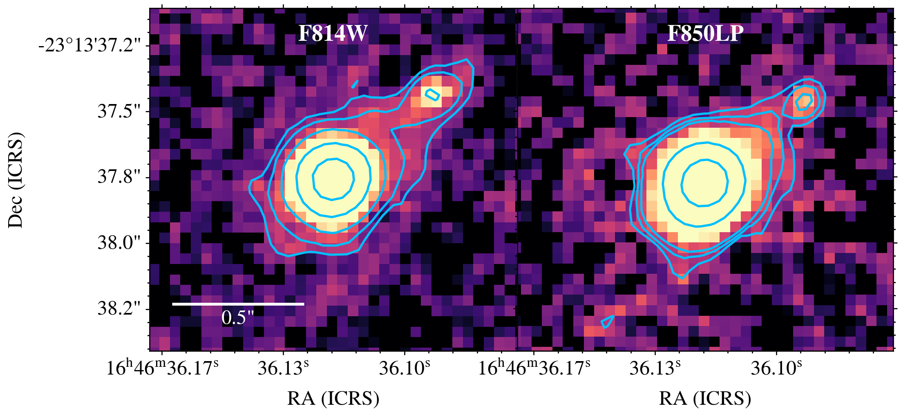
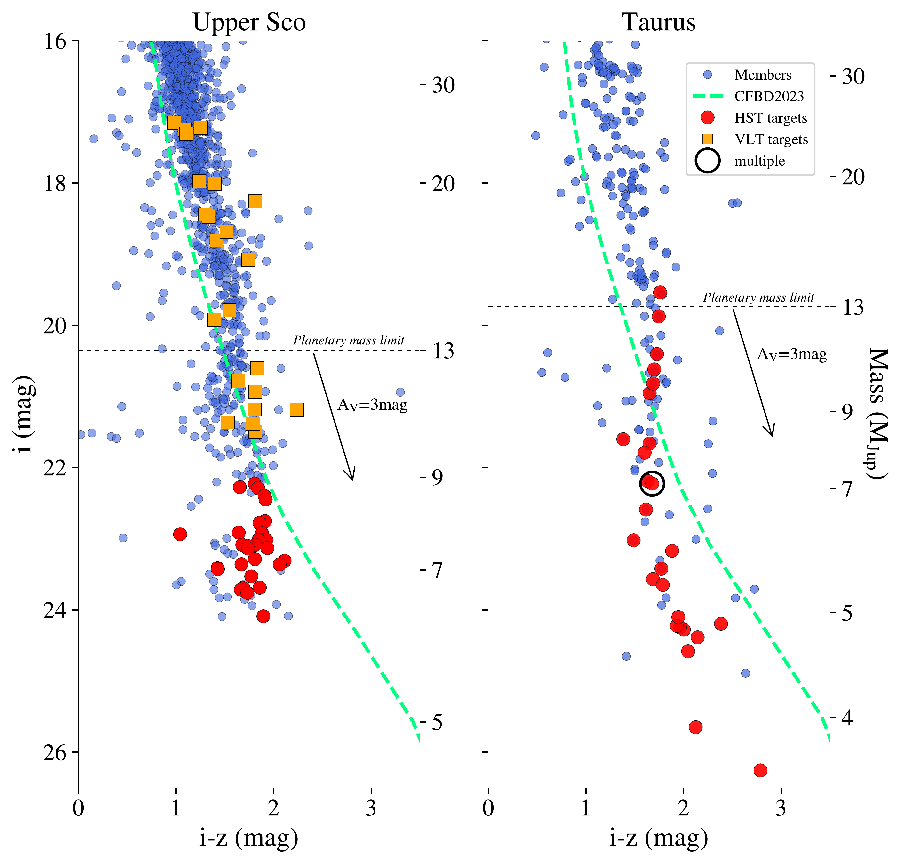
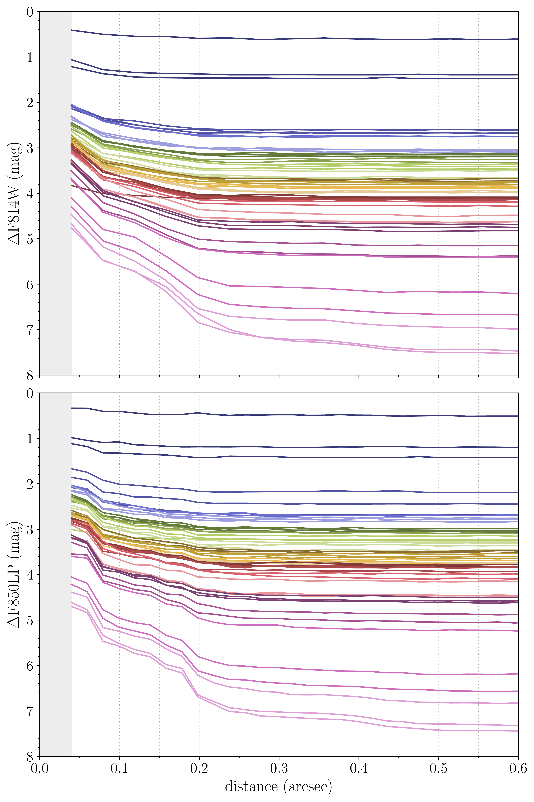

$\newcommand{\ensuremath}{}$
$\newcommand{\xspace}{}$
$\newcommand{\object}[1]{\texttt{#1}}$
$\newcommand{\farcs}{{.}''}$
$\newcommand{\farcm}{{.}'}$
$\newcommand{\arcsec}{''}$
$\newcommand{\arcmin}{'}$
$\newcommand{\ion}[2]{#1#2}$
$\newcommand{\textsc}[1]{\textrm{#1}}$
$\newcommand{\hl}[1]{\textrm{#1}}$
$\newcommand{\footnote}[1]{}$
$\newcommand{\mjup}{M_{\rm Jup} }$
$\newcommand{\GD}[1]{ {\color{blue}(\it Gaspard: #1)}}$
$\newcommand{\GS}[1]{ {\color{teal}(\it Giovanni: #1)}}$
$\newcommand{\JA}[1]{ {\color{goldenrod}(\it Jonathan: #1)}}$
$\newcommand{\HB}[1]{ {\color{magenta}(\it Hervé: #1)}}$
$\newcommand{\straklip}{\textit{Stra}KLIP}$
$\newcommand{\publicwifi}{\textit{PUBLIC-WiFi}}$
$\newcommand{\orcid}[1]{\orcidlink{#1}}$
$\newcommand\natexlab{#1}$

# Multiplicity of young isolated planetary mass objects in Taurus and Upper Scorpius

<mark>Appeared on: 2025-06-18</mark> -  _Submitted to A&A on 2025-04-04 ; awaiting the initial review_

H. Bouy, et al. -- incl., <mark>W. Brandner</mark>

**Abstract:** Free-floating planetary mass objects--worlds that roam interstellar space untethered to a parent star--challenge conventional notions of planetary formation and migration, but also of star and brown dwarf formation. We focus on the multiplicity among free-floating planets. By virtue of their low binding energy (compared to other objects formed in these environments), these low-mass substellar binaries represent a most sensitive probe of the mechanisms at play during the star formation process. We use the $_ Hubble Space Telescope_$ and its Wide Field Camera 3 and the $_ Very Large Telescope_$ and its ERIS adaptive optics facility to search for visual companions among a sample of 77 objects members of the Upper Scorpius and Taurus young nearby associations with estimated masses in the range between approximately 5--33 $\mjup$ . We report the discovery of one companion candidate around a Taurus member with a separation of 111.9 $\pm$ 0.4 mas, or $\sim$ 18 au assuming a distance of 160 pc, with an estimated primary mass in the range between 3--6 $\mjup$ and a secondary mass between 2.6--5.2 $\mjup$ , depending on the assumed age. This corresponds to an overall binary fraction of 1.8 $^{+2.6}_{-1.3}$ \% among free-floating planetary mass objects over the separation range $\ge$ 7 au.  Despite the limitations of small-number statistics and variations in spatial resolution and sensitivity, our results, combined with previous high-spatial-resolution surveys, suggest a notable difference in the multiplicity properties of objects below $\sim$ 25 $\mjup$ between Upper Sco and Taurus. In Taurus, five companions were identified among 78 observed objects (4.9 $^{+2.8}_{-2.0}$ \% ), whereas none were found among 97 objects in Upper Sco ( $\le$ 1.2 \% ).

**Figure 6. -** HST F814W (left) and F850LP (right) images of the visual companion identified around J164636.12-231337.6 through direct inspection. A square root stretch is used. Contours highlight the extended emission originating from the visual companion. North is up and east is left. (*fig:galaxy-comp*)

**Figure 1. -** (_ i, i-z_) diagram of USco members (left) identified by \citet{MiretRoig2022} and Taurus members (right) from \citet{Esplin2019}, represented as blue dots. The HST targets are over-plotted as red dots and the VLT targets are orange squares. The \citet{Chabrier2023} isochrones at respectively 5 and 3 Myr and 140 pc are represented by  green dashed lines and the corresponding masses are indicated on the right vertical axis. A reddening vector A$_{\rm V}$=3 mag is also represented, and the planetary mass limit of 13 $\mjup$ is indicated. The new binary candidate identified in Taurus is over-plotted as a black open circle.
 (*fig:targets_cmd*)

**Figure 4. -** Detection limits in the HST F814W (top) and F850LP (bottom) images.  (*fig:contrast_hst*)

