

$\newcommand{\ensuremath}{}$
$\newcommand{\xspace}{}$
$\newcommand{\object}[1]{\texttt{#1}}$
$\newcommand{\farcs}{{.}''}$
$\newcommand{\farcm}{{.}'}$
$\newcommand{\arcsec}{''}$
$\newcommand{\arcmin}{'}$
$\newcommand{\ion}[2]{#1#2}$
$\newcommand{\textsc}[1]{\textrm{#1}}$
$\newcommand{\hl}[1]{\textrm{#1}}$
$\newcommand{\footnote}[1]{}$

# MICONIC: JWST/MIRI MRS reveals a fast ionized gas    outflow in the central region of    Centaurus A

<mark>Appeared on: 2025-06-19</mark> -  _Accepted for publication in Astronomy & Astrophysics_

A. A. Herrero, et al. -- incl., <mark>F. Walter</mark>, <mark>T. Henning</mark>

**Abstract:** We present a kinematical study of the ionized and molecular gas in  the central region ( $\sim$ 7--14 $\arcsec$ $\sim$ 100--200 pc) of the  nearby radio galaxy Centaurus A  (Cen A). We used JWST/MIRI MRS $\sim 5-28 \mu$ m observations taken as part of the Mid-Infrared   Characterization of Nearby Iconic galaxy Centers(MICONIC) of the MIRI EuropeanConsortium. The two gas phases present contrasting morphologiesand kinematics in Cen A. The brightest emission from the ionized gas, tracedwith a range of ionization potential (IP) lines analyzed here (from [ Fe ${\sc ii}$ ] to [ Ne ${\sc vi}$ ] ), is extended along the direction of the radio jet.  We also detectedemission from low IP emission lines and $H_2$ transitions in thegalaxy disk region mapped with MRS. Both gas phases present rotationalmotions in the disk but also complex kinematics. The MRS observationsreveal  several ionized gas kinematical features that are consistent with simulationpredictions of a jet-driven bubble and outflow interacting with the galaxyinterstellar medium. Theseinclude broad components in the nuclear line profiles ( $\sigma\sim600 {\rm km s}^{-1}$ in [ Ar ${\sc ii}$ ] and [ Ne ${\sc iii}$ ] ),  highvelocities (reaching approximately +1000, $-1400 {\rm km s}^{-1}$ )confined within the nuclear region, velocities of hundreds ofkilometers per secondin several directions in the central 2 $\arcsec$ , and enhanced velocitydispersions perpendicular to the radio jet. Moreover, we find evidenceof shock excitation in the nuclear region of Cen Abased on mid-infrared line ratios. We compared the ionized gas mass outflow ratewith Cen A's active galactic nucleus (AGN) luminosity and radio jetpower and demonstrate that bothmechanisms provide sufficient energy to launch the outflow. Thenoncircular motions observed in the mid-infrared $H_2$ lines can bereproduced with either a  warped rotating disk model or a radialcomponent. The latter might be to related to gas streamers detected incold molecular gas. Notably, there is no clear indication of a fast $nuclearH_2$ outflow in Cen A, only a weak blueshifted component in the lineprofiles. This could be due to a relatively low nuclear warm $H_2$ column density and/or the limited geometricalcoupling of Cen A's inner radiojet with the circumnuclear disk of the galaxy.

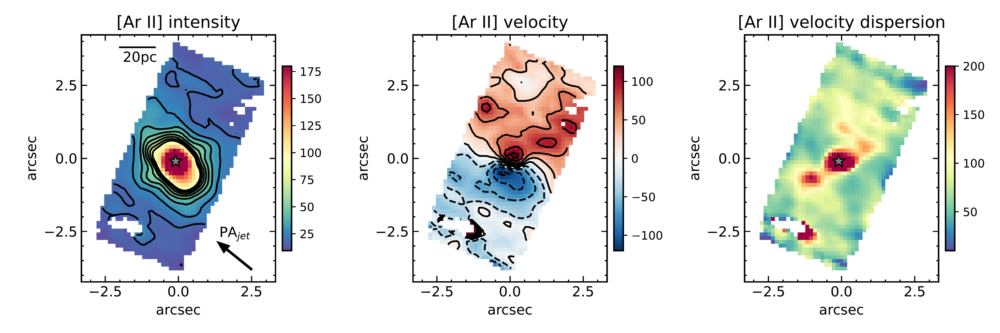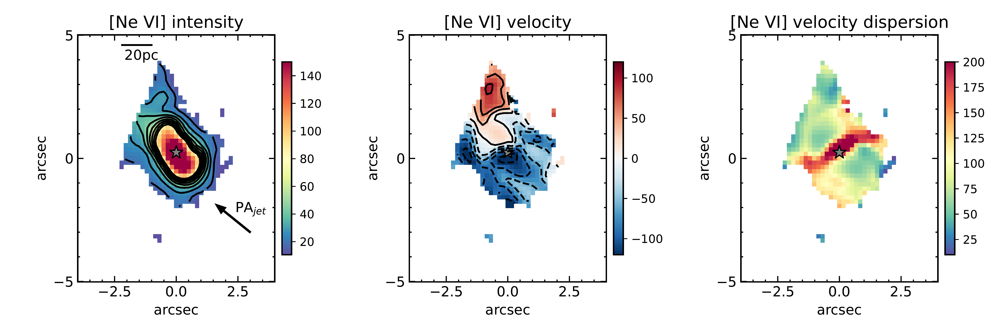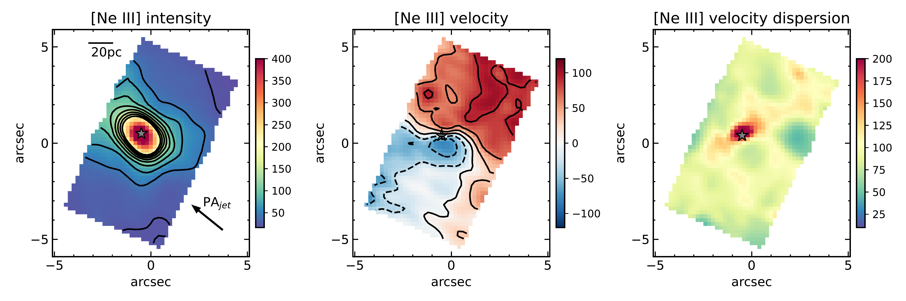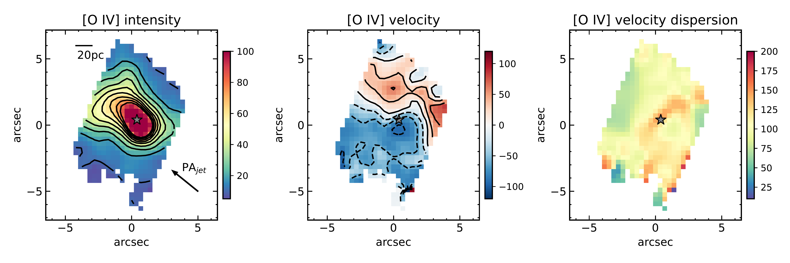

**Figure 16. -** Same as Fig. \ref{fig:maintextalucinemapsH2} but for
    [Ar {\sc ii}], [Ne {\sc vi}],
       [Ne {\sc iii}], and [O {\sc iv}](from top to
       bottom). (*fig:maintextalucinemapsFSL*)

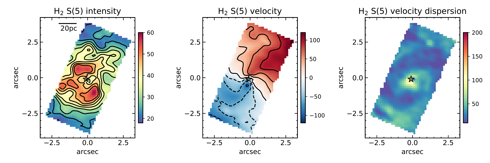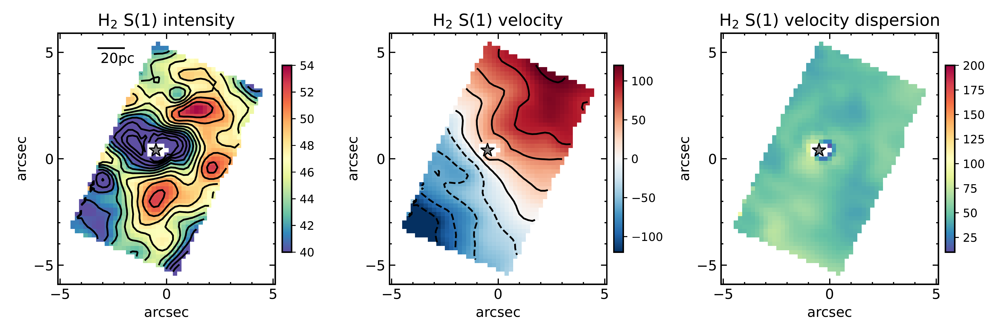

**Figure 15. -** Maps of  $H_2$ S(5) at $6.909 \mu$m (top) and
         $H_2$ S(1) at $17.03 \mu$m (bottom)  constructed as
       explained in Sect. \ref{subsec:analysis}.
       Panels show  the intensity and contours in a square root
       scale in arbitrary units (left),
       the mean-velocity field in units of km s$^{-1}$(middle),
       and the velocity dispersion map $\sigma$(corrected for instrumental
       resolution)
       in units of km s$^{-1}$(right). The velocity contours are in a linear
       scale (solid lines positive values and dashed lines negative
       values). The star symbol marks the peak of the continuum
       adjacent to the line, that is, the AGN position. The
       0,0 point on the axes refers to the center of the corresponding sub-channel
       array. North is up and east to the left. (*fig:maintextalucinemapsH2*)

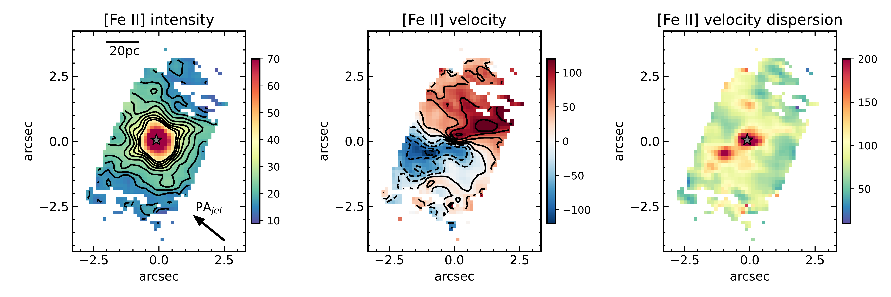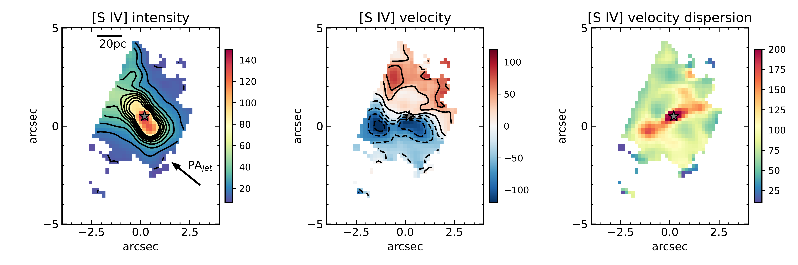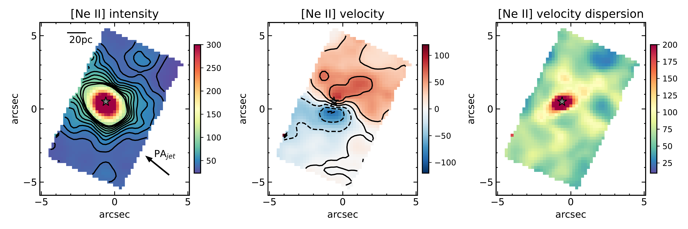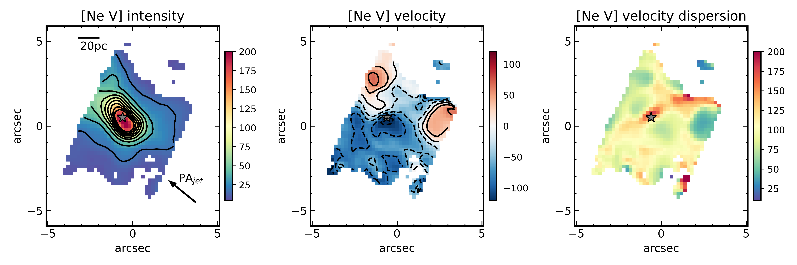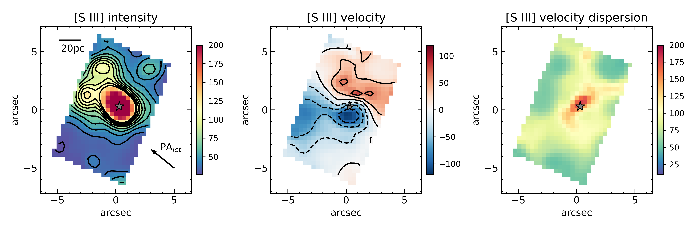

**Figure 19. -** Same as Fig. \ref{fig:maintextalucinemapsFSL} but for  [Fe {\sc
      ii}] at $5.34 \mu$m, [S {\sc iv}],  [Ne {\sc ii}], [Ne {\sc v}] at $14.32 \mu$m, and
[S {\sc iii}](from top to bottom). (*fig:appendixalucinemaps*)

