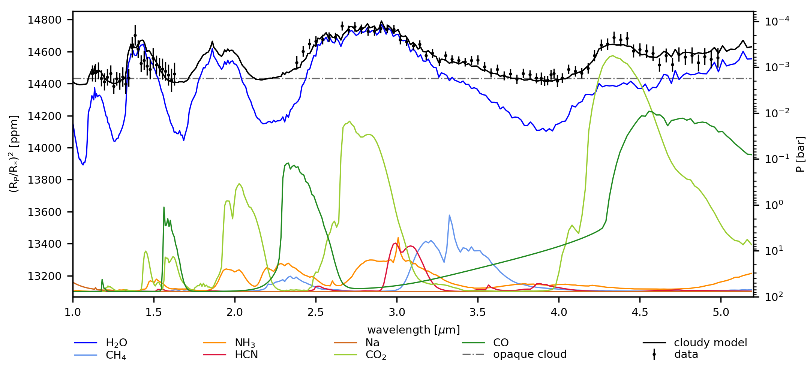
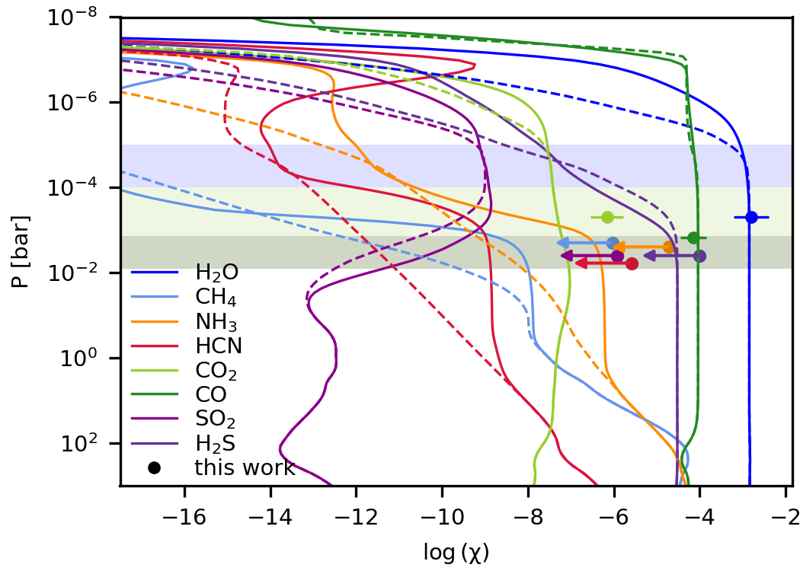
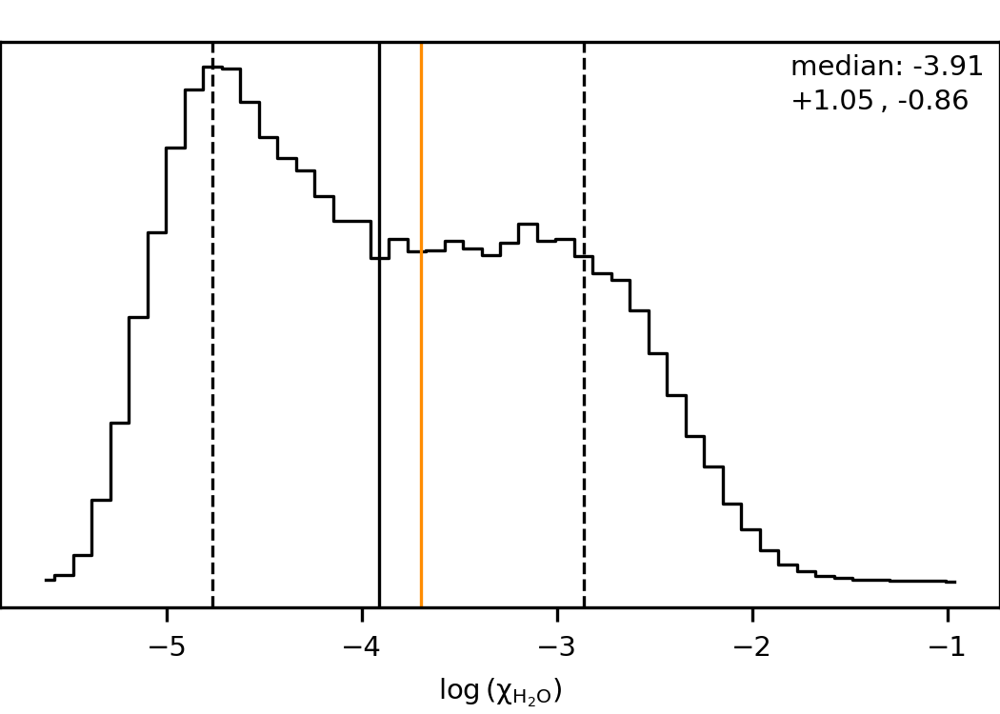
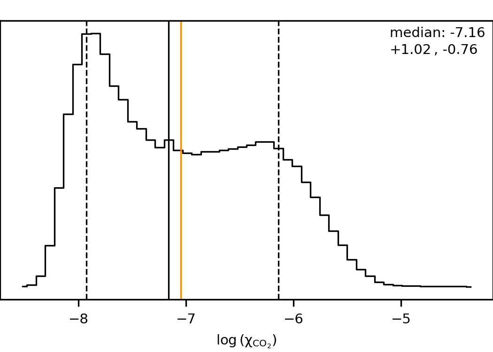

$\newcommand{\ensuremath}{}$
$\newcommand{\xspace}{}$
$\newcommand{\object}[1]{\texttt{#1}}$
$\newcommand{\farcs}{{.}''}$
$\newcommand{\farcm}{{.}'}$
$\newcommand{\arcsec}{''}$
$\newcommand{\arcmin}{'}$
$\newcommand{\ion}[2]{#1#2}$
$\newcommand{\textsc}[1]{\textrm{#1}}$
$\newcommand{\hl}[1]{\textrm{#1}}$
$\newcommand{\footnote}[1]{}$
$\newcommand{\planet}{HD~209458 b}$
$\newcommand{\arraystretch}{1.5}$
$\newcommand{\arraystretch}{1.5}$
$\newcommand{\arraystretch}{1.2}$
$\newcommand{\arraystretch}{1.5}$
$\newcommand{\arraystretch}{1.5}$

# Osiris revisited: Confirming a solar metallicity and low C/O in $\planet$

<mark>Appeared on: 2025-06-23</mark> -  _22 pages, 18 figures, 9 tables; accepted for publication in A&A_

<mark>N. Bachmann</mark>, et al. -- incl., <mark>L. Kreidberg</mark>, <mark>P. Mollière</mark>

**Abstract:** $\planet$ is the prototypical hot Jupiter and one of the best targets available for precise atmosphere characterisation. Now that spectra from both Hubble Space Telescope (HST) and James Webb Space Telescope (JWST) are available, we can reveal the atmospheric properties in unprecedented detail. In this study, we perform a new data reduction and analysis of the original HST/WFC3 spectrum, accounting for the wavelength dependence of the instrument systematics that was not considered in previous analyses. This allows us to precisely and robustly measure the much-debated $\mathrm{H_2O}$ abundance in $\planet$ 's atmosphere. We combine the newly reduced spectrum with archival JWST/NIRCam data and run free chemistry atmospheric retrievals over the $\SI{1.0}  - \SI{5.1}{\micro\metre}$ wavelength range, covering possible features of multiple absorbing species, including $\mathrm{CO_2}$ , $\mathrm{CO}$ , $\mathrm{CH_4}$ , $\mathrm{NH_3}$ , $\mathrm{HCN}$ , $\mathrm{Na}$ , $\mathrm{SO_2}$ , and $\mathrm{H_2S}$ . We detect $\mathrm{H_2O}$ and $\mathrm{CO_2}$ robustly at above $\SI{7}{\sigma}$ significance, and find a $\SI{3.6}{\sigma}$ preference for cloudy models compared to a clear atmosphere. For all other absorbers we tested, only upper limits of abundance can be measured. We use Bayesian model averaging to account for a range of different assumptions about the cloud properties, resulting in a water volume mixing ratio of $0.95^{+0.35}_{-0.17} \:\times$ solar and a carbon dioxide abundance of $0.94^{+0.16}_{-0.09} \:\times$ solar. Both results are consistent with solar values and comparable to predictions from the \texttt{VULCAN} 1D photochemistry model. Combining these values with a prior on the $\mathrm{CO}$ abundance from ground-based measurements, we derive an overall atmospheric composition comparable to solar metallicity of $\mathrm{[M/H]} = 0.10^{+0.41}_{-0.40}$ and very low C/O of $0.054^{+0.080}_{-0.034}$ with a $\SI{3}{\sigma}$ upper limit of $0.454$ . This indicates a strong enrichment in oxygen and depletion in carbon during $\planet$ 's formation.

**Figure 12. -** Contribution of the opacities of line-absorbing species to the transmission spectrum. The best-fit spectrum shows the cloudy+CO prior model (see text). The absorption features of $\mathrm{H_2O}$ and $\mathrm{CO_2}$ are clearly visible, for the latter due to its strong absorption even though the abundance is low (see \cref{fig:BMA_joint_H2O_CO2}). (*fig:opacity_contribution*)

**Figure 5. -** Comparison of the cloudy+CO prior retrieval results with the \texttt{VULCAN} 1D photochemical kinetics model by [Tsai, Malik and Kitzmann (2021)]()(solid lines) and thermochemical equilibrium abundances (dashed lines). The dots represent the volume mixing ratios from our retrievals (with errorbars for $\mathrm{H_2O}$, $\mathrm{CO_2}$, and $\mathrm{CO}$; upper limits for $\mathrm{CH_4}$, $\mathrm{NH_3}$, $\mathrm{HCN}$, $\mathrm{SO_2}$, and $\mathrm{H_2S}$). The shaded regions represent the atmospheric pressure levels at which the absorption is most active for the species, starting at the cloud level at $\SI{1.44}{\milli\bar}$(see \cref{fig:opacity_contribution} and \cref{tab:joint_ret_results}). For $\mathrm{CO_2}$(light green) and $\mathrm{H_2O}$(light blue), the absorption pressure level reaches higher up in the atmosphere. The Bayesian model averaged results are similar, except for the $\mathrm{H_2O}$, which is smaller than the \texttt{VULCAN} 1D results, and the $\mathrm{CO_2}$ abundance, which agrees with the model prediction. (*fig:compare_VULCAN*)

**Figure 11. -** Bayesian model averaged posterior distributions for $\mathrm{H_2O}$(left) and $\mathrm{CO_2}$(right). The black line indicates the median of the distributions, and the dashed lines are the $\pm34.1\%$ confidence regions. The orange lines show the solar value of $\mathrm{log (\chi_{H_2O})} = -3.70$ and $\mathrm{log (\chi_{CO_2})} = -7.05$ at $\SI{1}{\milli\bar}$ and $\SI{1200}{\kelvin}$. (*fig:BMA_joint_H2O_CO2*)

