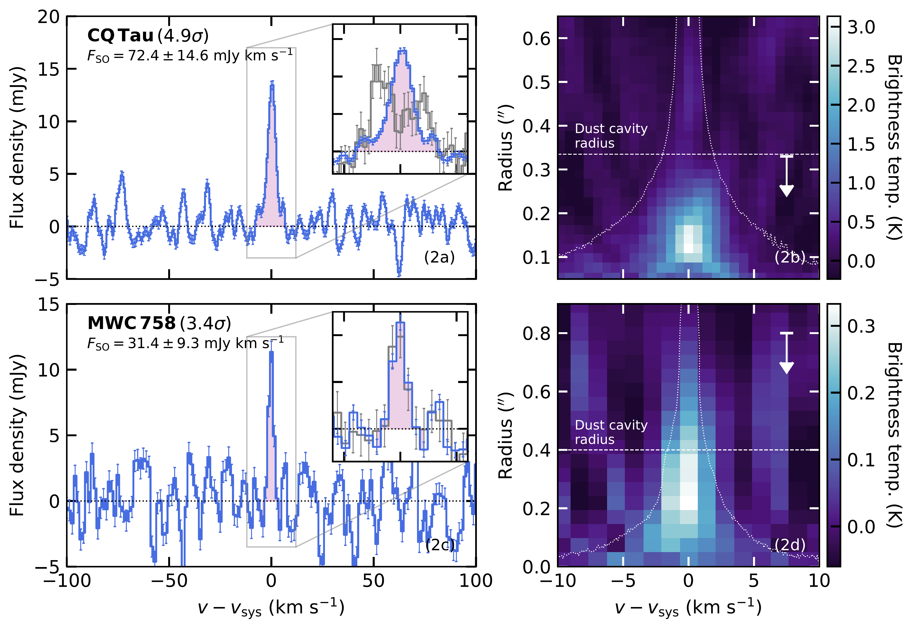
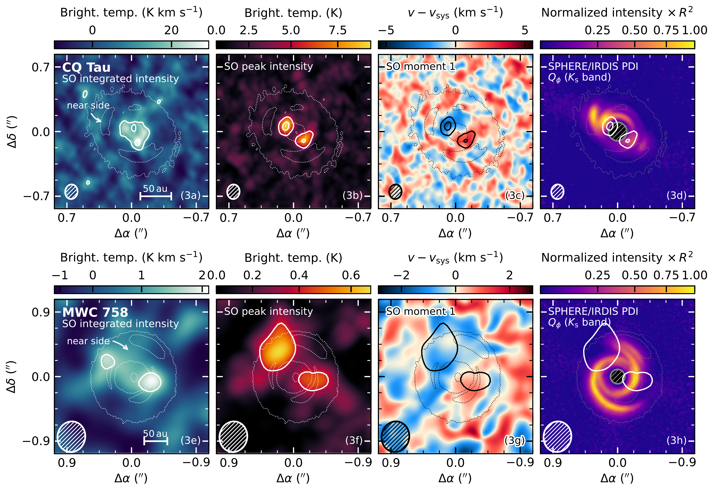
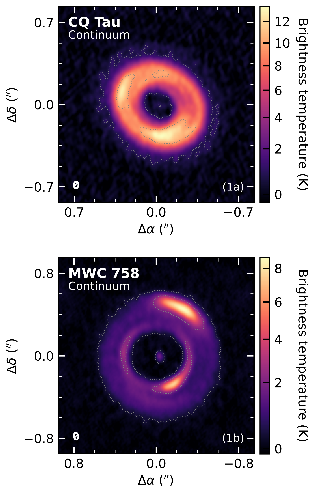

$\newcommand{\ensuremath}{}$
$\newcommand{\xspace}{}$
$\newcommand{\object}[1]{\texttt{#1}}$
$\newcommand{\farcs}{{.}''}$
$\newcommand{\farcm}{{.}'}$
$\newcommand{\arcsec}{''}$
$\newcommand{\arcmin}{'}$
$\newcommand{\ion}[2]{#1#2}$
$\newcommand{\textsc}[1]{\textrm{#1}}$
$\newcommand{\hl}[1]{\textrm{#1}}$
$\newcommand{\footnote}[1]{}$
$\newcommand{\vdag}{(v)^\dagger}$
$\newcommand$
$\newcommand$
$\newcommand{\hjc}[1]{\textcolor{emerald}{[\small HJ: \textit{\small #1}]}}$
$\newcommand{\hjadd}[1]{\textcolor{emerald}{#1}}$
$\newcommand{\fg}[1]{Fig.~\ref{fig:#1}}$
$\newcommand{\Fg}[1]{Figure~\ref{fig:#1}}$
$\newcommand{\fgs}[2]{Figs. \ref{fig:#1} and \ref{fig:#2}}$
$\newcommand{\Fgs}[2]{Figures \ref{fig:#1} and \ref{fig:#2}}$
$\newcommand{\eq}[1]{Eq.~(\ref{eq:#1})\xspace}$
$\newcommand{\Eq}[1]{Equation~(\ref{eq:#1})\xspace}$
$\newcommand{\eqs}[2]{Eqs. (\ref{eq:#1}) and (\ref{eq:#2})}$
$\newcommand{\Eqs}[2]{Equations \ref{eq:#1} and \ref{eq:#2}}$
$\newcommand{\tb}[1]{Table~\ref{tab:#1}\xspace}$
$\newcommand{\Tb}[1]{Table~\ref{tab:#1}\xspace}$
$\newcommand{\se}[1]{Sect.~\ref{sec:#1}\xspace}$
$\newcommand{\Se}[1]{Section~\ref{sec:#1}\xspace}$
$\newcommand{\ses}[2]{Sects. \ref{sec:#1} and \ref{sec:#2}}$
$\newcommand{\sef}[1]{\ref{sec:#1}\xspace}$
$\newcommand{\App}[1]{Appendix~\ref{app:#1}\xspace}$
$\newcommand{\red}[1]{\textcolor{red}{#1}}$
$\newcommand{\cyan}[1]{\textcolor{cyan}{#1}}$
$\newcommand{\arraystretch}{1.25}$

# SO emission in the dynamically perturbed protoplanetary disks around CQ Tau and MWC 758

<mark>Appeared on: 2025-06-23</mark> -  _Accepted for publication in ApJ. 23 pages 7 figures_

<mark>F. Zagaria</mark>, et al. -- incl., <mark>H. Jiang</mark>, <mark>M. Benisty</mark>, <mark>D. Fasano</mark>, <mark>I. Hammond</mark>, <mark>A. Winter</mark>

**Abstract:** We report the serendipitous detection of the SO $J_N=6_5-5_4$ (219.949 GHz) rotational transition in archival Atacama Large Millimeter/submillimeter Array (ALMA) observations of the spiral hosting protoplanetary disks around CQ Tau (with $\approx4.9\sigma$ significance) and MWC 758 (with $\approx3.4\sigma$ significance). In the former, the SO emission comes in the shape of a ring, arises from the edge of the continuum cavity, and is qualitatively consistent, at the currently available spectral resolution, with being in Keplerian rotation.In the latter, instead, while arising primarily from inside the continuum cavity, the SO emission also extends to the continuum ring(s) and its morphology and kinematics are less clear. We put these sources in the context of the other protoplanetary disks where SO detections have been previously reported in the literature and discuss the possible origins of SO in terms of (thermal) desorption or formation in the gas phase. We argue that these processes might be fostered by dynamical perturbations caused by unseen embedded massive companions, shadows, or late-time infall, thus suggestinga possible link between perturbed dynamics and SO emission in (these) protoplanetary disks. If confirmed, our interpretationwould imply that chemical evolution timescales could be significantly shorter in these systems than is commonly assumed,indicating that dynamical perturbations might influence the composition of newborn (proto-)planets by altering the volatile makeup of their formation environment.

**Figure 2. -** Left: Shifted and stacked SO spectra (blue).
    The zoom-in inserts around the systematic velocity also display the native spectra (gray) for comparison. The plum areas highlight the velocity ranges adopted to measure the SO flux and generate moment maps (see \autoref{app:imaging}). Right: Teardrop plots. The dotted white lines mark the region where Keplerian emission from the disk is expected. Those correspond to the location where the CO emission (from the fiducial exoALMA cubes,  ([Teague, Benisty and Facchini 2025]()) ) drops below 3 K. The white arrows indicate the apertures over which the spectra were extracted and integrated over to measure the SO flux. The dust cavity radius is indicated with a white dashed line. SO emission is clearly detected and primarily originates within the cavity. (*fig:2_spectra*)

**Figure 3. -** From left to right: SO integrated intensity ("moment 0"), peak intensity ("moment 8"), velocity ("moment 1") maps, and comparison between scattered-light images and SO peak intensity for CQ Tau (top row) and MWC 758 (bottom row). The dotted contours display the $[5,65]\times\sigma$(CQ Tau) and the $[5,40]\times\sigma$(MWC 758) emission levels. The white (black for panels 3c and 3g) solid contours, instead, mark the $[3,5]\times\sigma$ SO detection levels. The synthesized CLEAN beam is shown as an ellipse in the bottom left corner of each panel. The regions within 0$\farcs$1 of the scattered light images cannot be accessed because of the coronagraph and are masked out. (*fig:3_summary*)

**Figure 1. -** 1.3 mm continuum emission map of CQ Tau (top) and MWC 758 (bottom). The dotted gray lines highlight the $[5,65]\times\sigma$(CQ Tau) and the $[5,40]\times\sigma$(MWC 758) emission contours. The ellipse in the bottom left corner of each panel displays the synthesized CLEAN beam. (*fig:1_continuum*)

