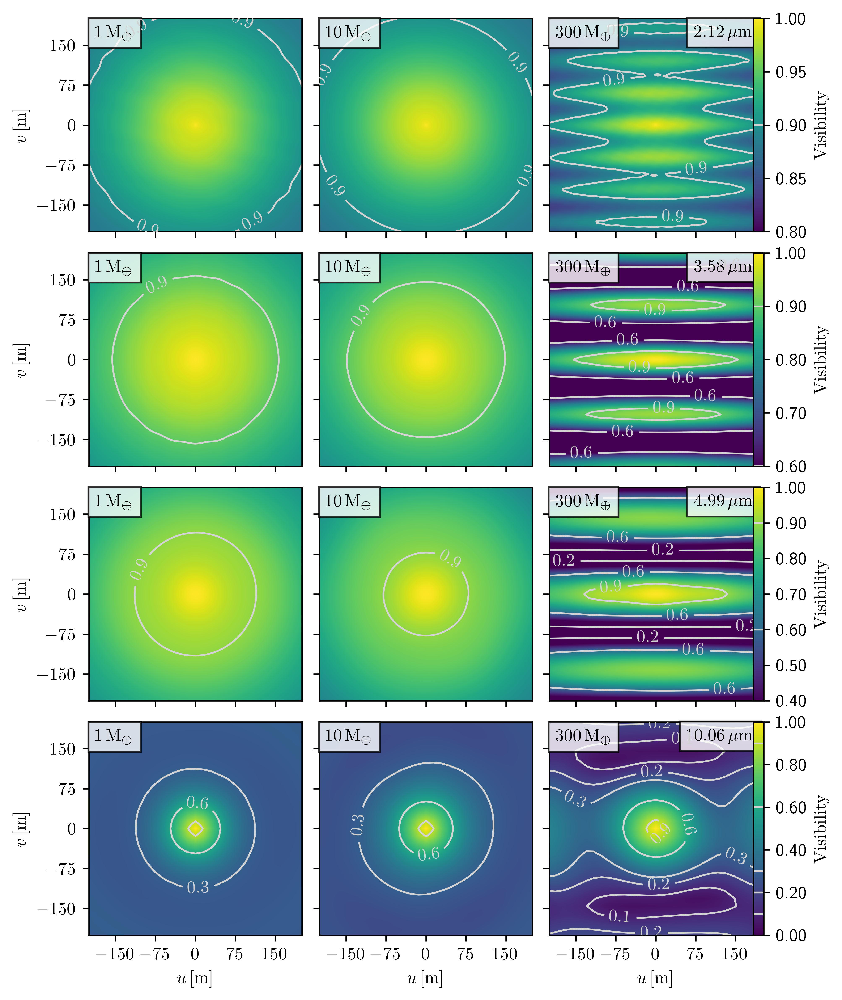
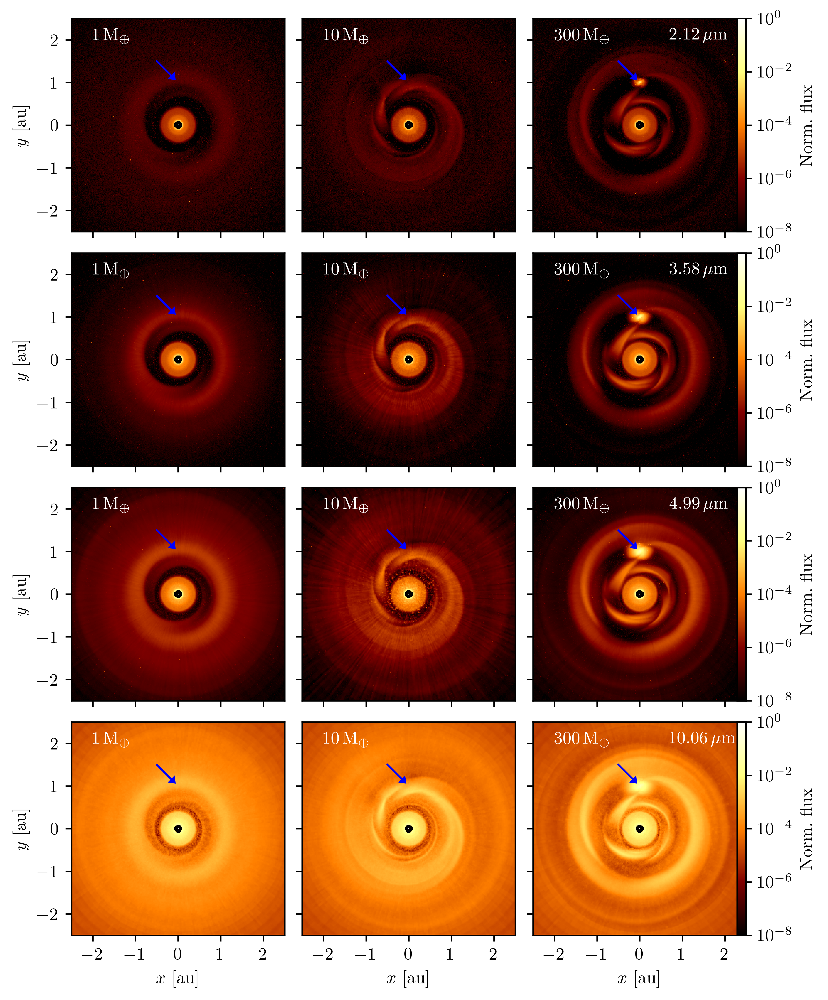
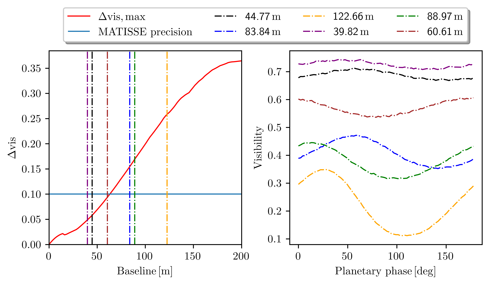

$\newcommand{\ensuremath}{}$
$\newcommand{\xspace}{}$
$\newcommand{\object}[1]{\texttt{#1}}$
$\newcommand{\farcs}{{.}''}$
$\newcommand{\farcm}{{.}'}$
$\newcommand{\arcsec}{''}$
$\newcommand{\arcmin}{'}$
$\newcommand{\ion}[2]{#1#2}$
$\newcommand{\textsc}[1]{\textrm{#1}}$
$\newcommand{\hl}[1]{\textrm{#1}}$
$\newcommand{\footnote}[1]{}$
$\newcommand{\ME}{\(\text{M}_\Earth\) }$
$\newcommand{\ca}{\sim}$

# Feasibility of interferometric observations and characterization of planet-induced structures at sub au to au scales in protoplanetary disks

<mark>Appeared on: 2025-06-23</mark> -  _Accepted for publication in A&A, 16 pages, 11 figures, 1 table_

L. Hildebrandt, et al. -- incl., <mark>H. Klahr</mark>

**Abstract:** Interferometric observations of protoplanetary disks by VLTI and ALMA have greatly improved our understanding of the detailed structure of these planetary birthplaces.   These observations have revealed a variety of large-scale disk substructures, including rings, gaps, and spirals, spanning tens to hundreds of au, supporting the predictions of planet formation models.   Recent instruments, such as MATISSE at the VLTI, allow one to resolve and investigate the inner few au of protoplanetary disks in nearby star formation regions, shedding light on the traces of planet formation and evolution at these small scales. The aim of this work is to assess the feasibility of interferometric observations of small-scale planet-induced substructures in protoplanetary disks in nearby star-forming regions.   We aim to characterize these substructures in multi-wavelength and multi-epoch observations and subsequently differentiate between simulation parameters. On the basis of 3D hydrodynamic simulations of embedded planetary companions and subsequent 3D Monte Carlo radiative transfer simulations, we calculated and analyzed interferometric observables, assuming observations with the VLTI in the K, L, M, and N bands. The hydrodynamic simulations exhibit mass-dependent planet-induced density waves that create observable substructures, most notably for the considered case of a 300 $\ME$ planet. These substructures share similarities with observed large-scale structures and feature a prominent accretion region around the embedded planet. The visibilities show a detectable variability for multi-epoch VLTI/GRAVITY and VLTI/MATISSE observations, caused by the orbital motion of the planet, that are distinguishable from other sources of variability due to their unique combination of timescale and amplitude. Additionally, the non-uniform change of the visibilities at different baselines can be used to identify asymmetric structures. Furthermore, we show that multi-wavelength observations provide an approach to identify the fainter substructures and the signal of the accretion region.

**Figure 4. -** Simulated uv-plane visibilities in the K band (first row), L band (second), M band (third), and N band (fourth)  for the simulations with planet masses of 1 $\ME$(left column), 10 $\ME$(center), and 300 $\ME$(right).   (*fig:visibilities*)

**Figure 3. -** Flux maps for the simulations with planet masses of 1 $\ME$(left column), 10 $\ME$(center), and 300 $\ME$(right) in the K band (first row), L band (second), M band (third), and N band (fourth). The location of the planet, at a radial distance of 1 au north of the center, is indicated with a blue arrow in each simulation. The images are normalized with regard to the flux value of the central pixel where the star is located. (*fig:fluxcrossN*)

**Figure 6. -** Interferometric variability in the simulated N band visibilities at radii in the uv-plane corresponding to all UT baselines for an embedded planet of 300 $\ME$. Shown are the maximum variability, dependent on baseline length (left), and the measured visibility for a given baseline, dependent on the orbital motion of the planet and other disk substructures (right). (*fig:varrot300*)

