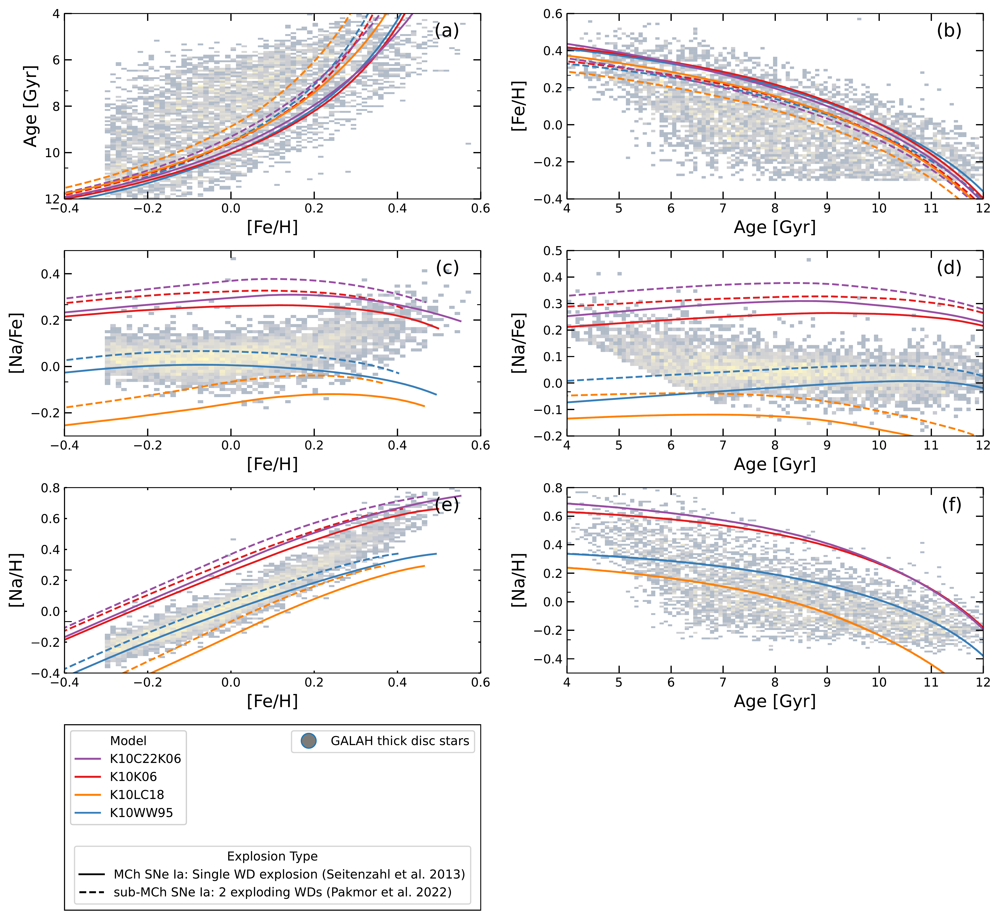
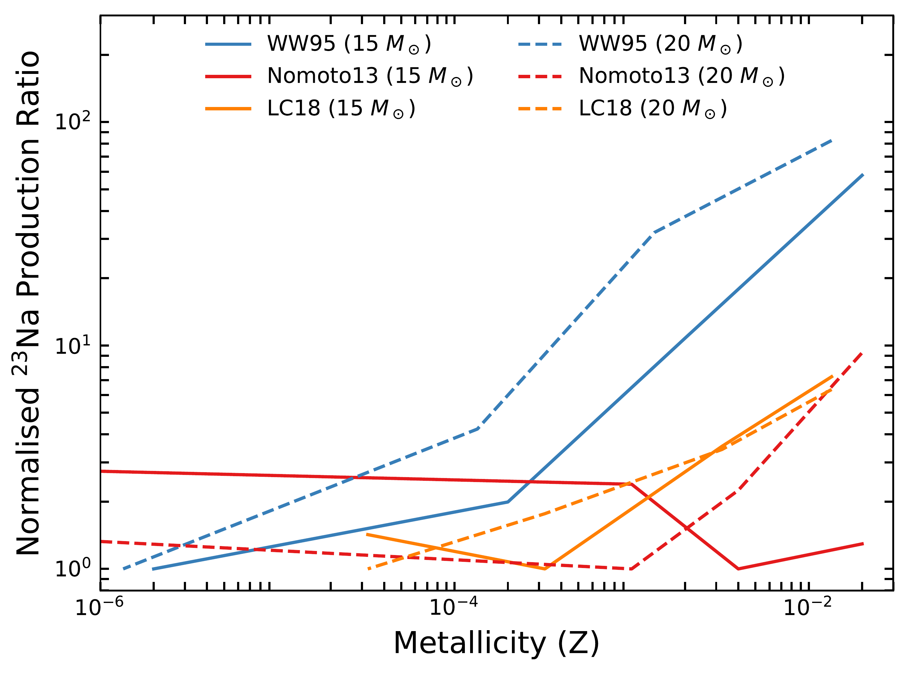
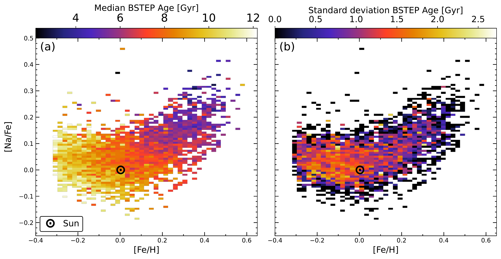

$\newcommand{\ensuremath}{}$
$\newcommand{\xspace}{}$
$\newcommand{\object}[1]{\texttt{#1}}$
$\newcommand{\farcs}{{.}''}$
$\newcommand{\farcm}{{.}'}$
$\newcommand{\arcsec}{''}$
$\newcommand{\arcmin}{'}$
$\newcommand{\ion}[2]{#1#2}$
$\newcommand{\textsc}[1]{\textrm{#1}}$
$\newcommand{\hl}[1]{\textrm{#1}}$
$\newcommand{\footnote}[1]{}$
$\newcommand{\thebibliography}{\DeclareRobustCommand{\VAN}[3]{##3}\VANthebibliography}$

# Current Galactic Chemical Evolution models fail to explain rising Na-abundances of young thick disc stars

<mark>Appeared on: 2025-06-24</mark> -  _12 pages, 5 figures, 3 tables_

E. K. Owusu, et al. -- incl., <mark>N. Storm</mark>, <mark>P. Eitner</mark>, <mark>M. Bergemann</mark>

**Abstract:** We recently identified an upturn in [ Na/Fe ] for the population of Solar-type stars in the Galactic thick disc ( $-0.3 < \mathrm{[Fe/H]} < +0.3$ dex) at super-Solar metallicity in GALactic Archaeology with HERMES (GALAH) data. Here, we investigate the cause of this unexplained Na enrichment between ( [ Fe/H ] $\approx 0$ -- $0.6$ dex) using the OMEGA $+$ galactic chemical evolution code. We investigate the increase of [ Na/Fe ] with four combinations of nucleosynthetic yields from the literature, with source contributions from core-collapse supernovae, asymptotic giant branch stars, and Type Ia supernovae. We focus on two possible causes for the Na-enhancement: the `metallicity effect’ resulting from core-collapse supernovae at super-Solar metallicity and the contribution of metal-rich AGB stars. We adopt two sets of Type Ia supernova yields with one model assuming only Chandrasekhar-mass explosions, and another assuming only sub-Chandrasekhar-mass explosions. We find that the assumed Type Ia explosion has little effect on the [ Na/Fe ] Galactic Chemical Evolution modelling, and all Galactic chemical evolution models tested fail to reproduce the observed [ Na/Fe ] enrichment in the young thick disc population at super-Solar metallicities. Our study indicates a possible `under-pollution effect' by SNe Ia, which are the dominant producers of iron, in the Galactic disc's Solar-type star population. These findings provide a step forward toward understanding the origin of the unexplained sodium enrichment at super-Solar metallicities in the Galactic disc.

**Figure 4. -** Panels (a)-(f) are the [Fe/H]-age, age-[Fe/H], [Fe/H]-[Na/Fe], age-[Na/Fe], [Fe/H]-[Na/H] and age-[Na/H] planes, produced by our adjusted GCE code parameters for this study. `Age' here refers to stellar ages. The grey bins are Solar-type thick disc stars selected from the GALAH DR3 catalogue using Equation \ref{eq:Z_range}, with the yellower area having a higher concentration of stars. Solid lines represent GCE models in which all SN Ia explosions are assumed to be from Chandrasekhar mass WDs, while for the dashed lines, sub-Chandrasekhar mass explosions from WD mergers are assumed. We defined the model label in Table \ref{tab:model}. SN Ia contribution is based on the two-exploding white dwarf from \citep{Pakmor2022} and delayed detonation for Chandrasekhar-mass white dwarfs, as described in \citep{Seitenzahl2013}. (*fig:figure5*)

**Figure 1. -** Normalised Na ($^{23}$Na) production ratios as a function of stellar metallicity (Z) for massive stars with initial masses 15 and 20 M$_{\odot}$. The models shown are massive star yields from \citet[WW95, blue triangles]{Woosley1995}, \citet[Nomoto13, red circles]{Nomoto2013} and \citet[LC18, orange squares]{Limongi2018}. The normalised production ratio (y-axis: Normalised $^{23}$Na Production Ratio) is calculated for each model by dividing the raw $^{23}$Na yield at each metallicity by the minimum $^{23}$Na obtained across all metallicities for that specific model. This normalisation highlights the relative change in Na production as a function of metallicity for each set of stellar models. (*fig:figure2*)

**Figure 2. -** [Na/Fe] as a function of metallicity [Fe/H] for the sample of Solar-type stars from GALAH DR3 used in this work (see Section \ref{sec:data}). The left panel (a) shows the distribution coloured by stellar age, illustrating the median stellar age in (Gyr) at each ([Fe/H], [Na/Fe]) bin. The right panel displays the same distribution, highlighting the standard deviation in stellar age within the corresponding bins. The Bayesian Stellar Parameters Estimator (BSTEP) was used to compute the stellar ages. The Solar abundance position is marked by the symbol $(\odot)$ at [Fe/H], [Na/Fe]$= (0,0)$. (*fig:figure1*)

