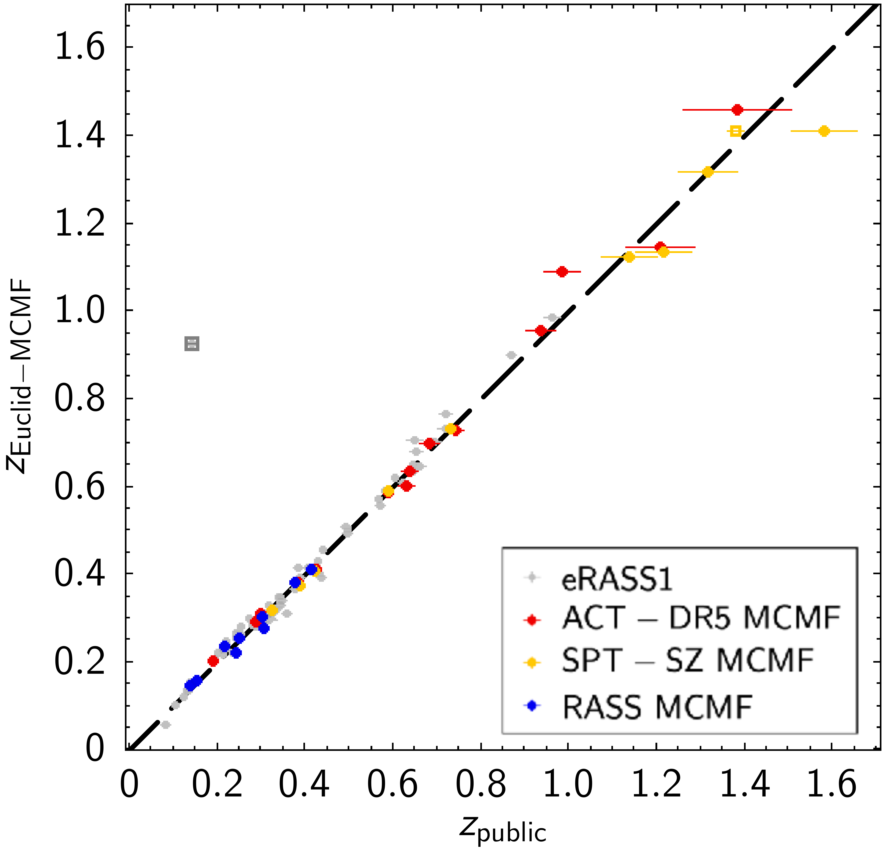
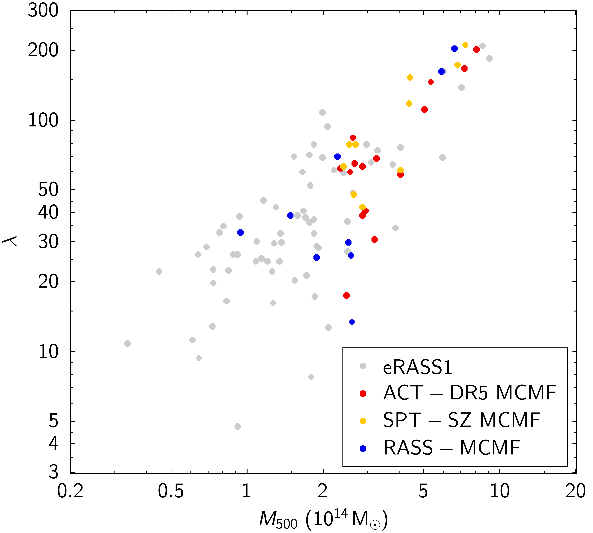
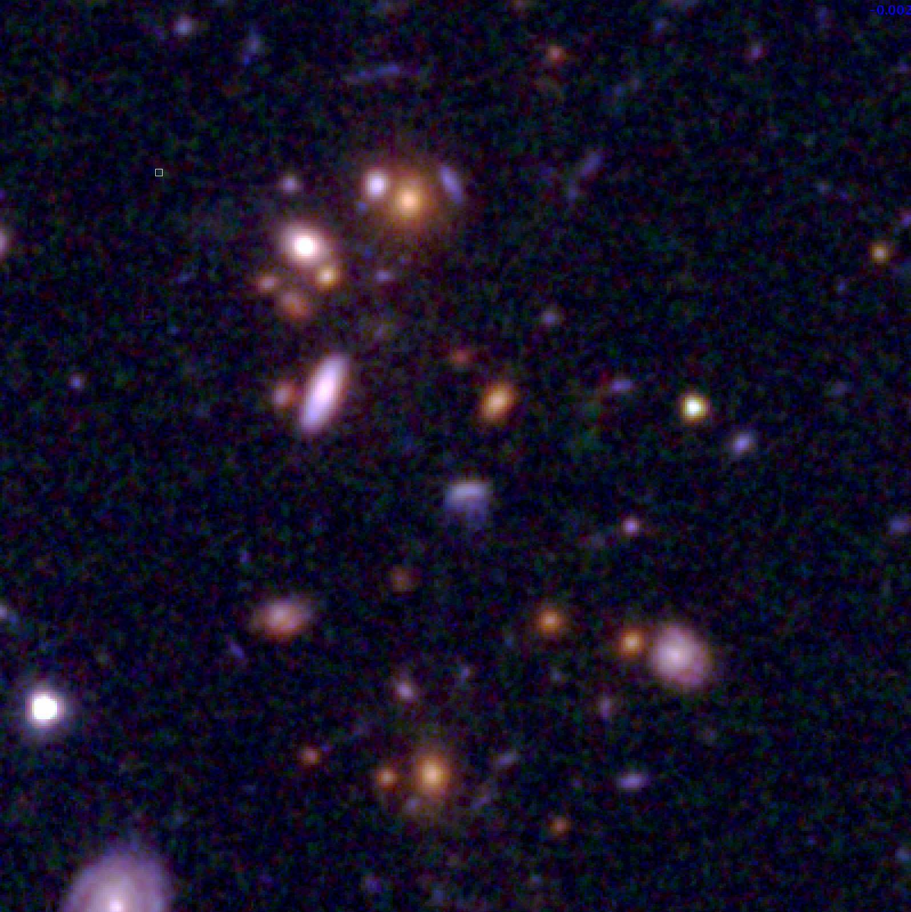
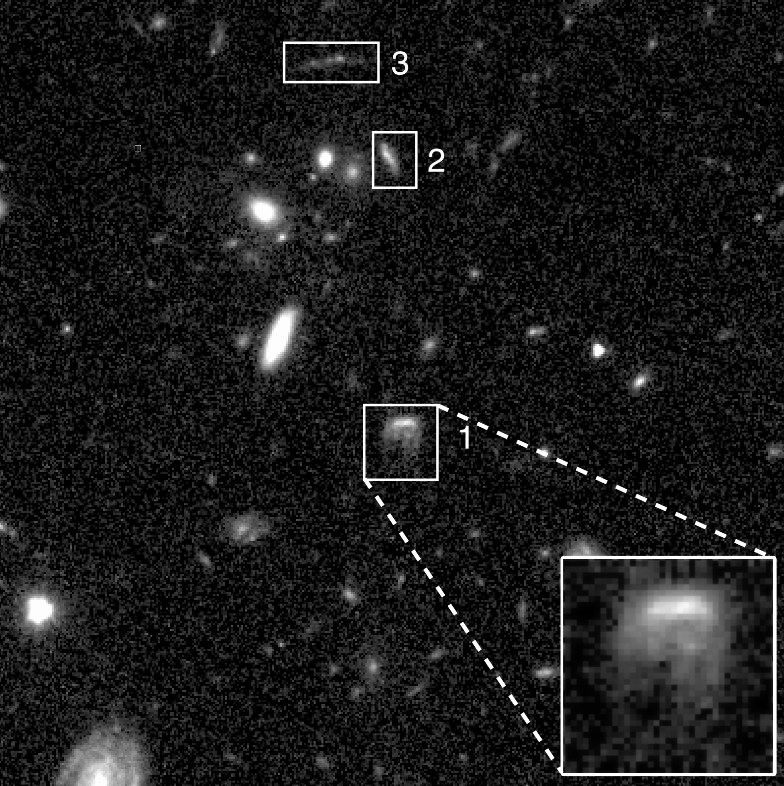
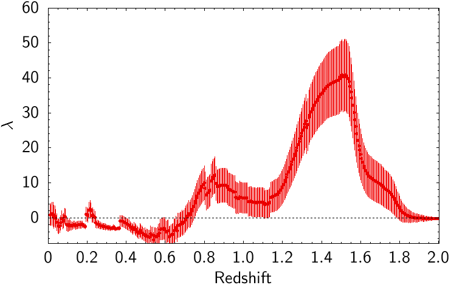

$\newcommand{\ensuremath}{}$
$\newcommand{\xspace}{}$
$\newcommand{\object}[1]{\texttt{#1}}$
$\newcommand{\farcs}{{.}''}$
$\newcommand{\farcm}{{.}'}$
$\newcommand{\arcsec}{''}$
$\newcommand{\arcmin}{'}$
$\newcommand{\ion}[2]{#1#2}$
$\newcommand{\textsc}[1]{\textrm{#1}}$
$\newcommand{\hl}[1]{\textrm{#1}}$
$\newcommand{\footnote}[1]{}$
$\newcommand{\orcid}[1]$

# $\Euclid$\/: Quick Data Release (Q1) -- Watching ICM-selected galaxy clusters with $\Euclid$ eyes - prospects of $\Euclid$ data in the context of large SZ and X-ray based surveys$\thanks{This paper is published on       behalf of the Euclid Consortium}$

<mark>Appeared on: 2025-06-25</mark> -  _11 pages, 10 figures_

M. Klein, et al. -- incl., <mark>K. Jahnke</mark>

**Abstract:** Galaxy clusters detected through their X-ray emission or Sunyaev--Zeldovich effect (SZE), both produced by the intra-cluster medium (ICM), have been successfully used in cosmological and astrophysical studies. To maximise the scientific return and robustness of such studies, these surveys require complementary information from other datasets.Systematic cluster confirmation and redshifts of ICM-selected cluster candidates are typically provided by wide-field optical and infrared imaging surveys, which are becoming increasingly challenged by ongoing ICM-selected samples. Particularly at high redshifts ( $z>1$ ) reached by future SZE-selected samples, current large surveys may not be sufficient for this task.Deep, high-resolution infrared surveys, such as those conducted with $\Euclid$ , are therefore essential for confirming the majority of high-redshift clusters in these future samples.In this context, we present an analysis of the first sizeable $\Euclid$ dataset (Q1), which overlaps with several ICM-selected cluster samples. We apply an adaptation of the MCMF cluster redshift and confirmation tool to $\Euclid$ data to estimate key cluster properties, including redshift and richness and to predict its capabilities to confirm high-redshift galaxy clusters.We find promising performance in redshift and richness estimation, particularly at high redshift. The performance in richness estimation at low redshifts ( $z<0.4$ ) is currently impacted by limitations of the Q1 dataset and are likely to improve in future data releases.By comparing MCMF measurements along random lines of sight with similar measurements from the SZE-based ACT-DR5 MCMF catalogue, we predict that the ability to confirm clusters at $1<z<2$ using $\Euclid$ will be comparable to that of current large optical surveys at $z<0.6$ and will significantly enhance the capability of cluster confirmation at high redshifts. SZE-selected cluster samples will therefore especially benefit from overlap with $\Euclid$ datasets.Studying the five known high- $z$ SZE-selected clusters in Q1, we identify the highest-redshift jellyfish galaxy candidate found to date in an ICM-selected cluster. This galaxy, EUCL J035330.86 $-$ 504347.6, is located in the massive cluster SPT-CL J0353 $-$ 5043 at $z=1.32$ . We also find two massive star-forming galaxies projected close to the core of ACT-CL J0350.0 $-$ 4819 ( $z\simeq1.46$ ), and evidence of strong lensing features in SPT-CL J0353 $-$ 5043 and SPT-CL J0421 $-$ 4845.

**Figure 7. -** _Left:_ Recovery of published cluster redshifts with \Euclid-MCMF. Redshifts of 1eRASS J040527.1$-$490347 (grey square) and SPT-CL J0421$-$4845 (yellow square) are discussed in greater detail in Sect. \ref{sc:indivclusters}. _Right:_\Euclid-MCMF richness ($\lambda$) versus ICM-based mass estimates ($M_{500}$). (*fig:redshiftRichness*)

**Figure 9. -** _Left:_\Euclid\IE, \YE, \HE-band colour composite image of the central $40$\arcsec$ \times 40$\arcsec$$ region of SPT-CL J0353$-$5043. _Right:_ Grey scale image of the same region in \Euclid\IE. Boxes mark the highest redshift jellyfish candidate to date (1) and two strongly lensed galaxies (2,3). (*fig:SPT0353-50*)

**Figure 1. -** $\lambda-z$ plot along the line of sight of ACT-CL J0350.0$-$4819, the ICM-selected cluster
with the highest redshift measured in the sample. (*fig:actlamz*)

