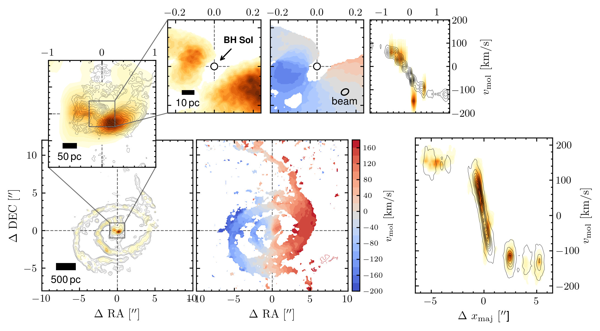
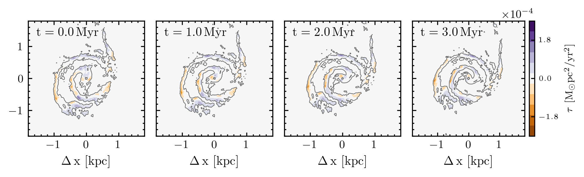

$\newcommand{\ensuremath}{}$
$\newcommand{\xspace}{}$
$\newcommand{\object}[1]{\texttt{#1}}$
$\newcommand{\farcs}{{.}''}$
$\newcommand{\farcm}{{.}'}$
$\newcommand{\arcsec}{''}$
$\newcommand{\arcmin}{'}$
$\newcommand{\ion}[2]{#1#2}$
$\newcommand{\textsc}[1]{\textrm{#1}}$
$\newcommand{\hl}[1]{\textrm{#1}}$
$\newcommand{\footnote}[1]{}$
$\newcommand{\mbh}{M_{\rm BH}\xspace}$
$\newcommand{\ngc}{NGC 4593\xspace}$

# Gravitational torques from a lopsided young stellar component sustain high black hole accretion in NGC 4593

<mark>Appeared on: 2025-06-26</mark> -  _14 pages, 8 figures, accepted for publication in A&A_

N. Winkel, et al. -- incl., <mark>K. Jahnke</mark>, <mark>J. Neumann</mark>

**Abstract:** Supermassive black holes (SMBHs) grow primarily through gas accretion, observed as active galactic nuclei (AGNs).   While mergers can drive luminous AGN episodes, secular processes may fuel a substantial portion of cosmic black hole growth. Whether these mechanisms can sustain high black hole accretion rates remains uncertain. This study aims to identify the secular mechanism driving high SMBH accretion rates, by targeting a galaxy with moderately massive SMBH, high central gas densities, accretion rates of a few percent of the Eddington limit, and gas kinematics resolved close to black hole-dominated scales. A blind search led to the identification of $\ngc$ , which is representative of the AGN population driving BH mass density growth since $z=1$ . Combining HST imaging, VLT/MUSE spectroscopy, and ALMA imaging, we resolve molecular and ionised gas kinematics close to the sphere of influence of the SMBH. A prominent single-arm (" $m=1$ ”) molecular gas spiral with ${\rm log} M_{\rm mol}/{\rm M}_\odot=8.1\pm0.3$ extends from 1.3 kpc down to the SMBH's sphere of influence ( $1.7^{+0.5}_{-0.2} {\rm pc}$ ).   Star formation in the spiral is inefficient ( ${\rm SFR} = 4.9 \times 10^{-2}  {\rm M}_\odot{\rm /yr}$ , $\langle t_{\rm dep}\rangle=3.9 \pm 0.6 \rm{Gyr}$ ), whereas inflow rate exceeds the SFR by two orders of magnitude and is sufficient to sustain the current SMBH accretion rate for $\geq$ 35 Myr, enabling $\sim$ 10 \% SMBH growth.   A young, lopsided stellar component ( ${\rm log} M_\star/{\rm M}_\odot=7.5-9.3$ ) exerts torques on the molecular gas, likely driving the gas inflow. This young stellar component may serve as both a cause and a product of sustained gas funnelling towards the SMBH. These findings provide evidence for the sustained secular $m=1$ feeding mode at high SMBH accretion rates, linking kpc-scale gas dynamics to the black hole’s sphere of influence. This mechanism, consistent with simulation predictions, may represent a key contributor to SMBH growth in luminous AGNs since cosmic noon.

**Figure 9. -** 
     Results of the kinematic modelling carried out with \texttt{KinMS}.
     (Left) Surface brightness distribution and line-of-sight velocity field of the CO(2--1) emission, for the low- (bottom) and high-resolution (top) data set respectively.
     Contours correspond to the best-fit model.
     (Right) Position-velocity diagram along the kinematic major axis.
     The model includes circular rotation with radial motions, which dominate the bulk molecular gas kinematics from 1.3 kpc down to the black hole SOI.
 (*fig:KinMS_modelling*)

**Figure 11. -** 
     Time-evolution of the m=1 torque field.
     We simulate the evolution the mass distribution as described in Sect. \ref{subsec:time_evolution_torque_field}, and derive the resulting torque field. After 3 Myr, the center of mass has rotated around the kinematic centre by ?? $^\circ$ (*fig:KinMS_modelling*)

**Figure 10. -** 
    Photometric decomposition results using \texttt{lenstronomy}.
    (1) HST/ACS HRC F330W flux map with saturated pixels replaced. Grey lines show surface brightness contours of $\Sigma_{\rm mol}$.
    (2) F330W flux map after subtracting the PSF model, revealing a diffuse component near the centre. Dashed contours show the initial guess of the single-Sérsic model fit to this structure.
    (3) F330W residual image after subtracting both the PSF and best-fit single-Sérsic model.
    (4) Residual map normalized by uncertainty.
    (5) Same as (3) but subtracting a 90$^\circ$-rotated PSF from the original image.
    (6) Similar to (4) but the single-Sérsic model was not subtracted.
    The detection of the diffuse component near the AGN does not depend on the PSF subtraction (2 vs 5).
    Aside from compact UV emission from star-forming clumps in the single-arm spiral, no extended UV emission is left over when a single-Sérsic model is subtracted.
 (*fig:lenstronomy_final_qso_fit*)

