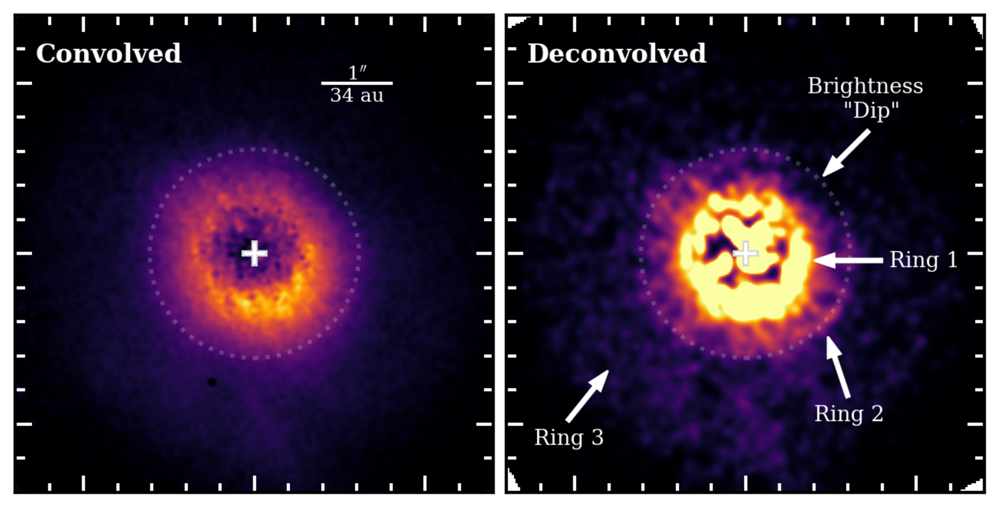
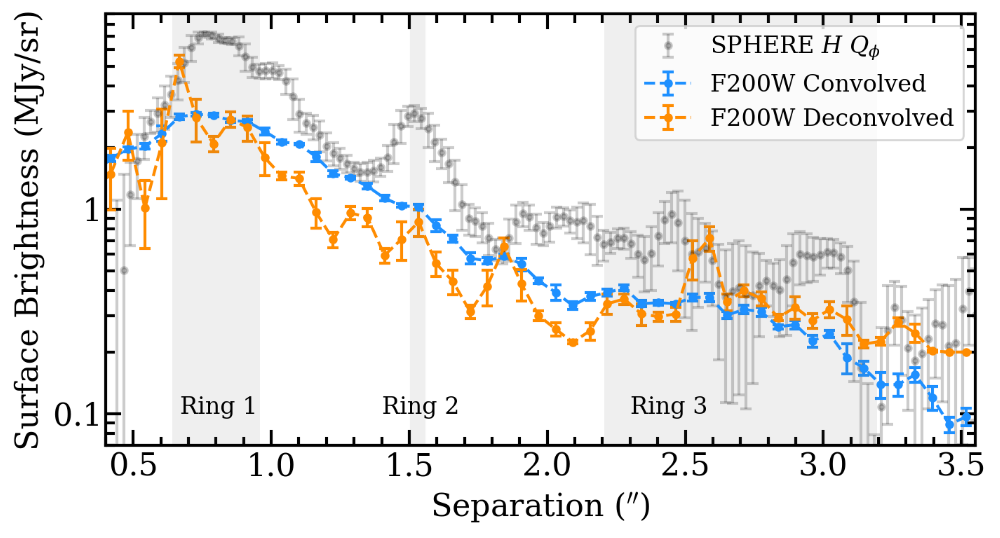
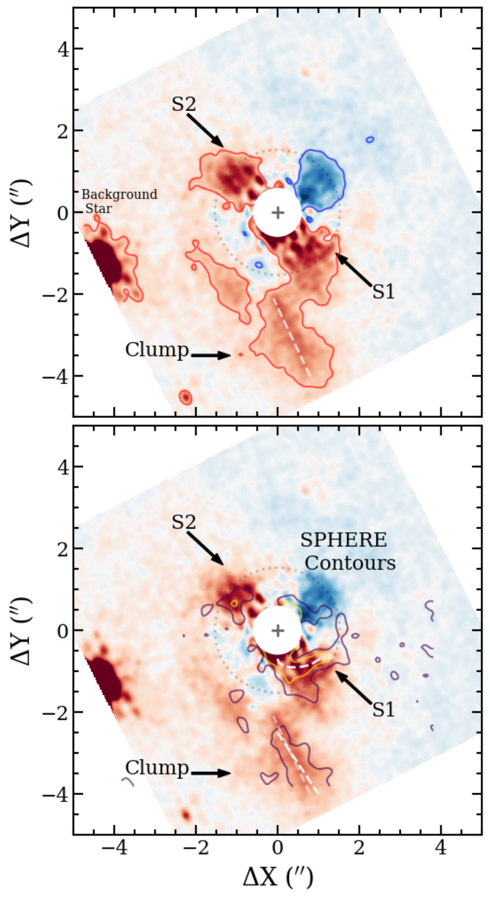
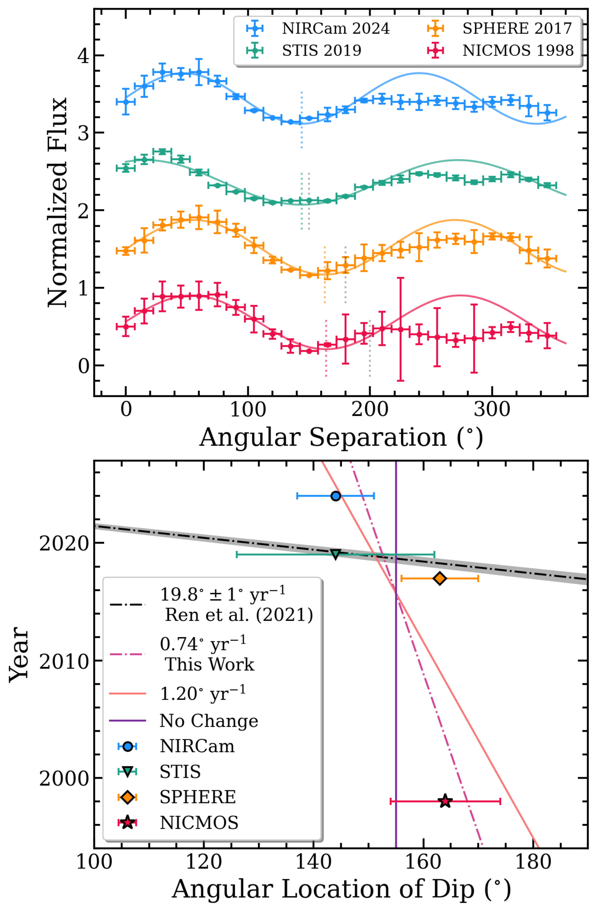

$\newcommand{\ensuremath}{}$
$\newcommand{\xspace}{}$
$\newcommand{\object}[1]{\texttt{#1}}$
$\newcommand{\farcs}{{.}''}$
$\newcommand{\farcm}{{.}'}$
$\newcommand{\arcsec}{''}$
$\newcommand{\arcmin}{'}$
$\newcommand{\ion}[2]{#1#2}$
$\newcommand{\textsc}[1]{\textrm{#1}}$
$\newcommand{\hl}[1]{\textrm{#1}}$
$\newcommand{\footnote}[1]{}$
$\newcommand{\vdag}{(v)^\dagger}$
$\newcommand$
$\newcommand$

# Follow-Up Exploration of the TWA 7 Planet-Disk System with JWST NIRCam

<mark>Appeared on: 2025-06-26</mark> -  _27 pages, 15 figures, 6 tables, accepted for publication in ApJL_

K. A. Crotts, et al. -- incl., <mark>G. Chauvin</mark>

**Abstract:** The young M-star TWA 7 hosts a bright and near face-on debris disk, which has been imaged from the optical to the submillimeter. The disk displays multiple complex substructures such as three disk components, a large dust clump, and spiral arms, suggesting the presence of planets to actively sculpt these features. The evidence for planets in this disk was further strengthened with the recent detection of a point-source compatible with a Saturn-mass planet companion using JWST/MIRI at 11 $\mu$ m, at the location a planet was predicted to reside based on the disk morphology. In this paper, we present new observations of the TWA 7 system with JWST/NIRCam in the F200W and F444W filters. The disk is detected at both wavelengths and presents many of the same substructures as previously imaged, although we do not robustly detect the southern spiral arm. Furthermore, we detect two faint potential companions in the F444W filter at the 2-3 $\sigma$ level. While one of these companions needs further followup to determine its nature, the other one coincides with the location of the planet candidate imaged with MIRI, providing further evidence that this source is a sub-Jupiter mass planet companion rather than a background galaxy. Such discoveries make TWA 7 only the second system, after $\beta$ Pictoris, in which a planet predicted by the debris disk morphology has been detected.

**Figure 1. -** **Top Left:** MCRDI reduction of TWA 7 in the F200W filter. **Top Right:** The same reduction as in the left panel, but deconvolved. Arrows and labels point to the three ring components that make up the disk, as well as the dip in surface brightness observed in the northwest region of Ring 2. The dashed circle represents the location of the second ring component. **Bottom:** Radial surface brightness profile of the TWA 7 disk between our convolved (light blue) and deconvolved (orange) F200W images compared to the 2017 SPHERE data (black). The three ring locations are highlighted. (*fig:deconv_twa7*)

**Figure 2. -**  Residual maps of TWA 7 in the F200W scaled between -0.5 and 0.5 MJy/sr. **Top:** Red contours represent a surface brightness of 0.12 MJy/sr and blue contours represent a surface brightness of -0.12 MJy/sr in the F200W to highlight the positive and negative residuals that remain after the disk model subtraction. The lower left dashed line represents the location of the dust clump as observed by NIRCam. **Bottom:** Contours represent a surface brightness of 7 and 20 $\mu$Jy arcsec$^{-2}$(0.30 and 0.85 MJy/sr) in the model-subtracted SPHERE data to highlight the location of the spiral arms and dust clump  ([Ren, Choquet and Perrin 2021]()) . The lower left dashed lines represent the location of the dust clump as observed by NIRCam (transparent) and SPHERE (opaque), while the curved dashed line just south of the star represents the location of the spiral arm as observed with SPHERE. We label the residuals similar to [Ren, Choquet and Perrin (2021)](), where S1 and S2 are the south and north spiral arms observed with SPHERE and Clump refers to the southeast dust clump. (*fig:twa7*)

**Figure 3. -** **Top:** Azimuthal surface brightness of Ring 2 as a function of angle in degrees normalized between 0 and 1, although we vertically separate each profile for easier viewing. The surface brightness is measured for our F200W data, as well as the 1998 NICMOS, 2017 SPHERE and 2019 STIS data from [Choquet, Perrin and Chen (2016)]() and  ([Ren, Choquet and Perrin 2021]()) . Additionally we include the best fit cosine curves and colored dashed lines representing the measured dip location. The grey dashed lines represent the dip location measured in [Ren, Choquet and Perrin (2021)]() for reference. **Bottom:** Year each dataset were taken, versus the angular separation of the dip in degrees. The black dashed line and grey shaded region represents the fit with uncertainties to the data measured in [Ren, Choquet and Perrin (2021)](). The three colored lines represent the following scenarios; 1) no change in the dip location (solid purple), 2) a rotation of $0\fdg74$ yr$^{-1}$ based on the best fit linear model to all four data point (dashed pink), and 3) a rotation of $1\fdg20$ yr$^{-1}$ based on the expected rotation of Saturn mass planet at $\sim1$\farcs$5$(solid pink-gold). All errorbars represent 1$\sigma$ uncertainties. (*fig:sb_ring2*)

