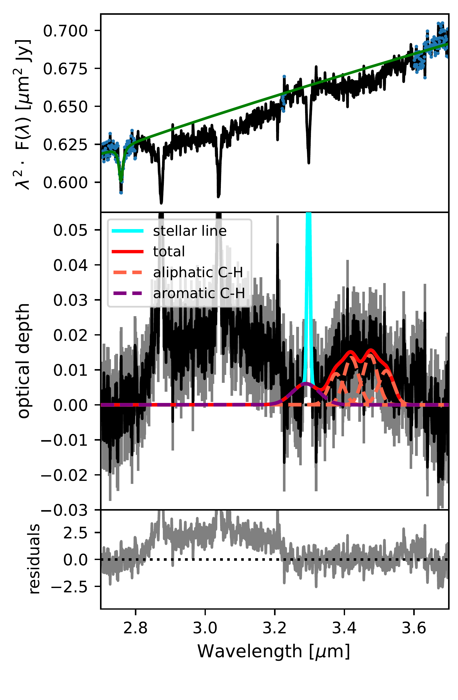
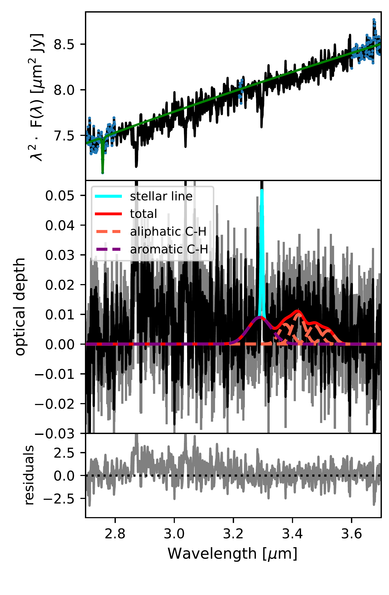
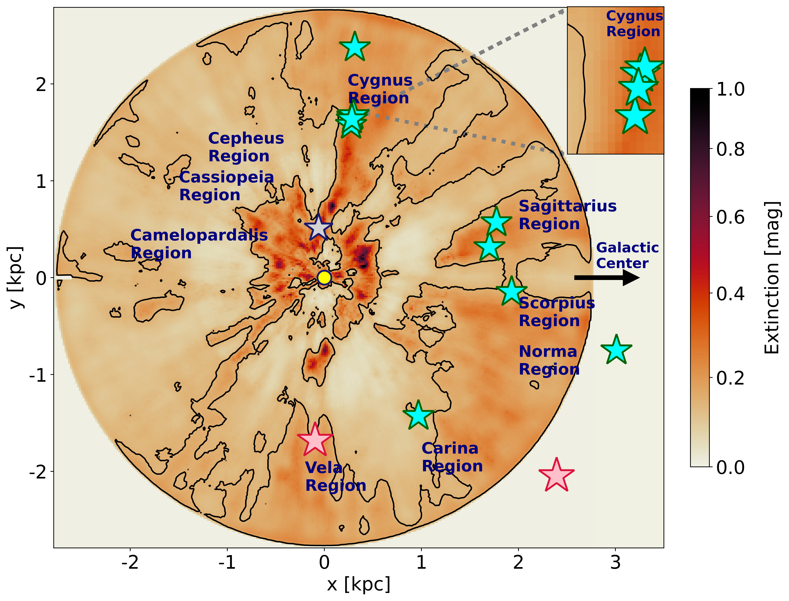
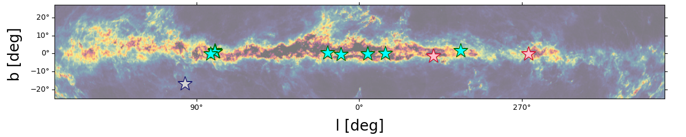
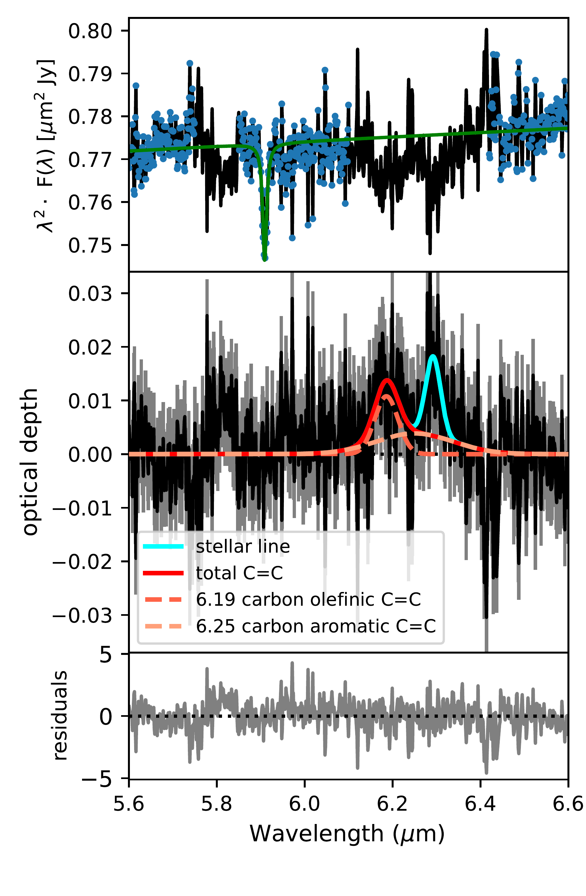

$\newcommand{\ensuremath}{}$
$\newcommand{\xspace}{}$
$\newcommand{\object}[1]{\texttt{#1}}$
$\newcommand{\farcs}{{.}''}$
$\newcommand{\farcm}{{.}'}$
$\newcommand{\arcsec}{''}$
$\newcommand{\arcmin}{'}$
$\newcommand{\ion}[2]{#1#2}$
$\newcommand{\textsc}[1]{\textrm{#1}}$
$\newcommand{\hl}[1]{\textrm{#1}}$
$\newcommand{\footnote}[1]{}$
$\newcommand{\vdag}{(v)^\dagger}$
$\newcommand$
$\newcommand$
$\newcommand{\arraystretch}{1.4}$
$\newcommand{\arraystretch}{1.1}$
$\newcommand{\arraystretch}{1.1}$

# Investigating silicate, carbon, and water in the diffuse interstellar medium:\ the first shots from WISCI

<mark>Appeared on: 2025-06-26</mark> -  _Accepted for publication in ApJ_

S. Zeegers, et al. -- incl., <mark>J. Bouwman</mark>, <mark>T. Henning</mark>

**Abstract:** The dusty interstellar medium (ISM) of the Milky Way is distributed in a complex, cloudy structure.It is fundamental to the radiation balance within the Milky Way, provides areaction surface to form complex molecules, and is the feedstock for future generations of stars and planets.The life cycle of interstellar dust is not completely understood, and neither are its structure nor composition.The abundance, composition, and structure of dust in the diffuse ISM can be determined by combining infrared, optical and ultraviolet spectroscopy. _JWST_ enables measurement of the faint absorption of ISM dust grains against bright stars at kiloparsec distances across the infrared spectrum.Here we present an overview of the project `Webb Investigation of Silicates, Carbons, and Ices' (WISCI) along with interpretation of two targets, GSC 08152-02121 and CPD-59 5831.Observations of 12 WISCI target stars were taken by _JWST_ , _the Hubble Space Telescope_ , Himalayan Chandra Telescope, and the Very Large Telescope. We use these to characterize the targets' spectral types and calculate their line-of-sight extinction parameters, $A_{\rm V}$ and $R_{\rm V}$ .We find absorption in the _JWST_ spectra of GSC 08152-02121, and CPD-59 5831 associated with carbonaceous dust around 3.4 and 6.2 $\micron$ and amorphous silicates at 9.7 $\micron$ . In GSC 08152-02121 we also find indications of absorption by trapped water around 3 $\micron$ \. This first look from WISCI demonstrates the line-of-sight variability within the sample, and the program's potential to identify and correlate features across ultraviolet to mid-infrared wavelengths.

**Figure 5. -** NIRCam spectra of the 3.3 \micron aromatic and 3.4 \micron aliphatic hydrocarbon features for GSC 08152-02121 (left) and CPD-59 5831 (right). In the top panel we show the observed spectrum in black, blue dots denote data points from which the continuum was calculated, and the fitted continuum as a green line. The middle panel shows the Gaussian components of the dust model as orange (aliphatic) and purple (aromatic) dashed lines, with the total denoted by a red solid line, all in units of optical depth. The stellar line (Hydrogen Pfund-$\delta$) contaminating the model fit at 3.3 $\micron$ is denoted by a cyan solid line. The gray contours behind the data indicate the $1\sigma$ statistical uncertainty derived from the continuum. The bottom panel shows the significance of the residuals ($\pm2.5\sigma$) after subtraction of the continuum and line model, and normalization by the standard deviation.
    Shortward of the 3.3 $\micron$ aromatic and 3.4 $\micron$ aliphatic hydrocarbon features the GSC 08152-02121 spectrum shows an absorption feature which may be attributed to trapped water. No comparable absorption is seen at the same wavelength range in the CPD-59 5831 spectrum. (*fig:c34_absorption*)

**Figure 2. -** _Top_: Extinction map of the local ISM viewed top-down taken from \citet{Dharmawardena24}. The Sun (yellow circle) is at $X$, $Y$ = 0, 0 and the Galactic centre is at $X$, $Y$ = 8.2, 0 kpc. The twelve targets (cf. Table \ref{tab:sources}) are represented by colored stars. The two stars analyzed in this paper are shown in red and the other ten are shown in blue. The small gray star near the center of this figure indicates 10 Lac ($A_{\rm V} = 0.21 $mag), which was used as a reference star. The contours represent extinction in steps of 0.2 mag.
_Bottom_: Dust map of the Milky Way galactic plane derived from Gaia photometry (see \citet{Andrae:23} for more details) with the twelve targets following the same color scheme as above. Note that some of the targets overlap in this projection.
 (*fig:map*)

**Figure 6. -** Here we show the MIRI MRS spectrum around 6.2 \micron for GSC 08152-02121 (left) and CPD-59 5831 (right). In the top panel we show the observed spectrum in black with the fitted continuum as a green line. Blue data points denote the parts of the spectrum used to determine the continuum. An unidentified feature is present around 5.8 \micron which is excluded from the continuum. The middle panel shows the Gaussian dust components of the model fit in units of optical depth. The two components are shown by dashed lines and the total dust component is shown by the red line. The cyan line indicates the position and strength of a stellar line (Hydrogen $n=7$ to $n=13$). The gray contours behind the data indicate the $1\sigma$ statistical uncertainty derived from the continuum. The bottom panel shows the significance of the residuals ($\pm5\sigma$) after subtraction of the continuum and line model, and normalization by the standard deviation. (*fig:c62_absorption*)

