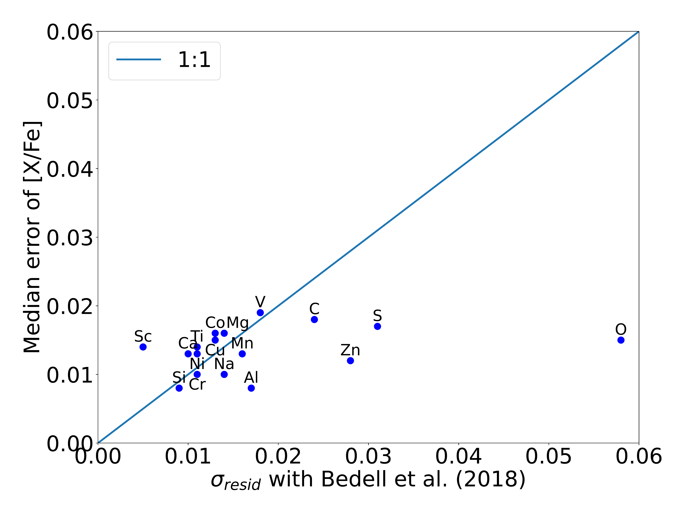
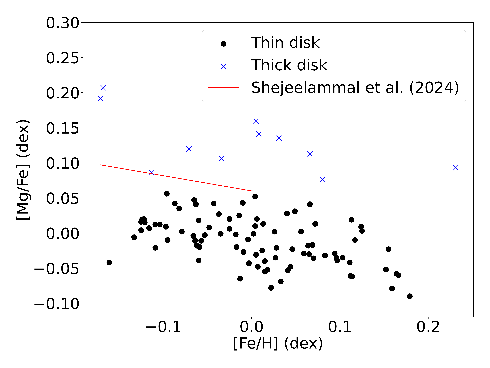
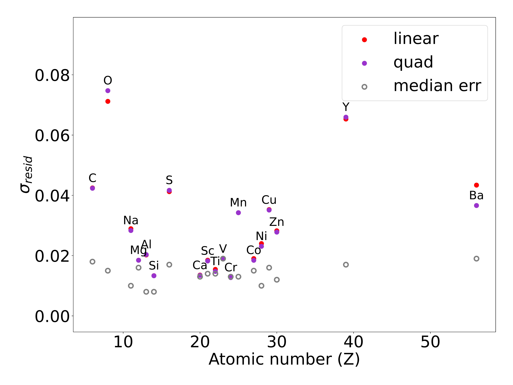

$\newcommand{\ensuremath}{}$
$\newcommand{\xspace}{}$
$\newcommand{\object}[1]{\texttt{#1}}$
$\newcommand{\farcs}{{.}''}$
$\newcommand{\farcm}{{.}'}$
$\newcommand{\arcsec}{''}$
$\newcommand{\arcmin}{'}$
$\newcommand{\ion}[2]{#1#2}$
$\newcommand{\textsc}[1]{\textrm{#1}}$
$\newcommand{\hl}[1]{\textrm{#1}}$
$\newcommand{\footnote}[1]{}$
$\newcommand{\arraystretch}{.8}$
$\newcommand{\arraystretch}{.8}$
$\newcommand{\arraystretch}{0.1}$
$\newcommand{\arraystretch}{0.1}$

# Signatures of planets and Galactic subpopulations in solar analogs: Precise chemical abundances with neural networks

<mark>Appeared on: 2025-06-26</mark> -  _Accepted by A&A_

<mark>G. Martos</mark>, J. Meléndez, L. Spina, a. S. Lucatello

**Abstract:**            The aim of this work is to obtain precise atmospheric parameters and chemical abundances automatically for solar twins and analogs to find signatures of exoplanets, as well as to assess how peculiar the Sun is compared to these stars and to analyze any possible fine structures in the Galactic thin disk. We developed a neural network (NN) algorithm using Python to obtain these parameters for a sample of 99 solar twins and solar analogs previously studied in the literature from normalized high-quality spectra from HARPS, with a resolving power of R $\sim$ 115000 and a signal-to-noise ratio S/N > 400. We obtained precise atmospheric parameters and abundance ratios [X/Fe] of 20 chemical elements (Li, C, O, Na, Mg, Al, Si, S, Ca, Sc, Ti, V, Cr, Mn, Co, Ni, Cu, Zn, Y, and Ba). The results are in line with the literature, with average differences and standard deviations of $(2 \pm 27)$ K for T$_{\rm eff}$, $(0.00 \pm 0.06)$ dex for log g, $(0.00 \pm 0.02)$ dex for [Fe/H], $(-0.01 \pm 0.05)$ km s$^{-1}$ for microturbulence velocity, $(0.02 \pm 0.08)$ km s$^{-1}$ for the macro turbulence velocity, and $(-0.12 \pm 0.26)$ km s$^{-1}$ for the projected rotational velocity (vsin$i$). Regarding the chemical abundances, most of the elements agree with the literature within 0.01 - 0.02 dex. The abundances were corrected from the effects of the Galactic chemical evolution and analyzed with the condensation temperature (T$_{\rm cond}$) to verify whether the stars presented depletion of refractories compared to volatiles. We found that the Sun is more depleted in refractory elements compared to volatiles than 89% of the studied solar analogs, with a significance of 9.5$\sigma$ when compared to the stars without detected exoplanets. We also found the possible presence of three subpopulations in the solar analogs: one Cu-rich, one Cu-poor, and the last one slightly older and poor in Na.         

**Figure 1. -** Median error of the abundance ratios [X/Fe] of the elements versus the standard deviation of the residuals when comparing our automatic abundances with Bedell_2018 (*fig:err_elem_sigma_bedell*)

**Figure 2. -** Separation of the stars of the sample between thin and thick disk according to their [Mg/Fe] ratio in relation to [Fe/H]. The stars above the red line and represented by blue crosses belong to the thick disk. (*fig:sep_disks*)

**Figure 3. -** Standard deviation of the residuals of the fit of [X/Fe] versus age and median error according to the atomic number (Z) of the elements. (*fig:std_Z*)

