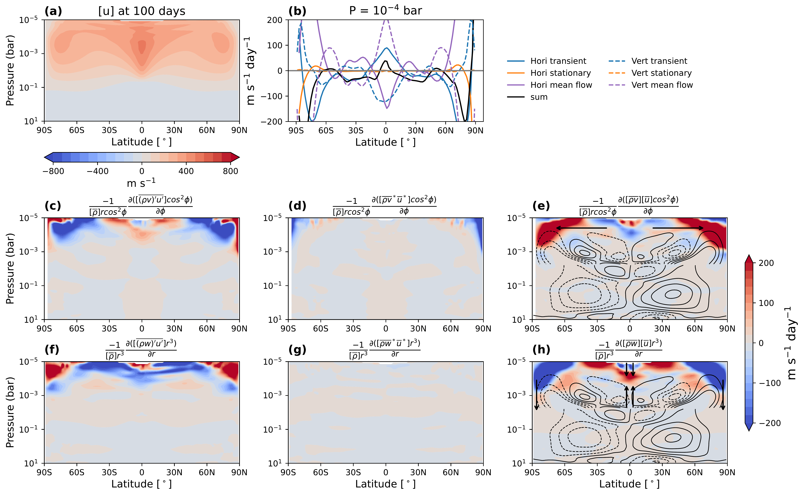
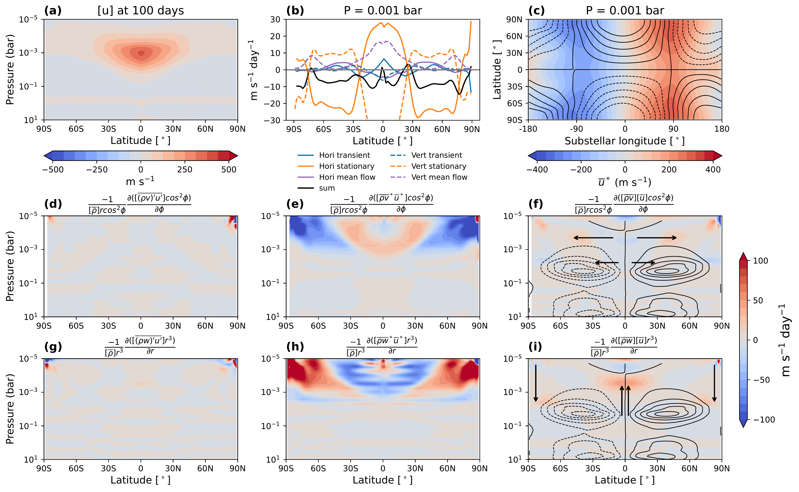
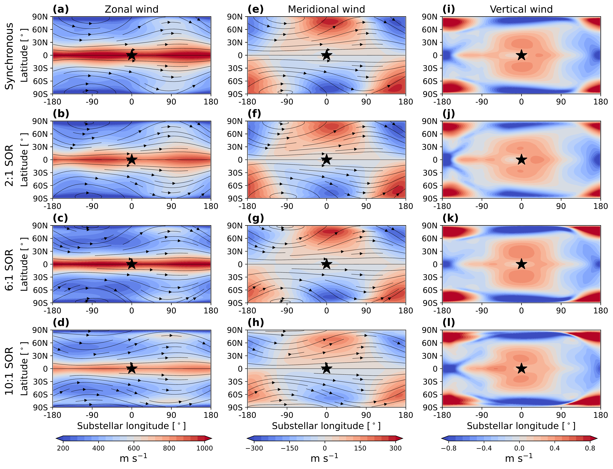

$\newcommand{\ensuremath}{}$
$\newcommand{\xspace}{}$
$\newcommand{\object}[1]{\texttt{#1}}$
$\newcommand{\farcs}{{.}''}$
$\newcommand{\farcm}{{.}'}$
$\newcommand{\arcsec}{''}$
$\newcommand{\arcmin}{'}$
$\newcommand{\ion}[2]{#1#2}$
$\newcommand{\textsc}[1]{\textrm{#1}}$
$\newcommand{\hl}[1]{\textrm{#1}}$
$\newcommand{\footnote}[1]{}$
$\newcommand{\revise}[1]{\textcolor{red}{#1}}$
$\newcommand{\thebibliography}{\DeclareRobustCommand{\VAN}[3]{##3}\VANthebibliography}$

# Three-dimensional Transport-induced Chemistry on Temperate sub-Neptune K2-18b, Part I: the Effects of Atmospheric Dynamics

<mark>Appeared on: 2025-07-01</mark> -  _19 pages, 17 figures, accepted to MNRAS_

<mark>J. Liu</mark>, <mark>D. Christie</mark>, J. Yang

**Abstract:** The low equilibrium temperatures of temperate sub-Neptunes lead to extremely long chemical timescales in their upper atmospheres, causing the abundances of chemical species to be strongly shaped by atmospheric transport. Here, we used a three-dimensional (3D) general circulation model involving a passive tracer to investigate the atmospheric circulation and 3D transport of temperate gas-rich sub-Neptunes, using K2-18b as an example. We model K2-18b as a synchronous or asynchronous rotator, exploring spin-orbit resonances (SOR) of 2:1, 6:1, and 10:1. We find that the strong absorption of $CO_2$ and $CH_4$ induces a detached convective zone between 1 and 5 bar, resulting in strong vertical mixing at these levels. The upper atmosphere is dominated by eastward winds (an equatorial superrotating jet present in all simulations), leading to warmer evening terminators and approximately 20 $\%$ higher passive tracer mass mixing ratios compared to the morning terminators. Rotation rates have minimal impact on the strength of global mean vertical mixing, but significantly influence the latitudinal distribution of passive tracers. For synchronous, 2:1 SOR, and 6:1 SOR simulations, passive tracers are more abundant in the upwelling branches at latitudes within 60 $^\circ$ , while for the 10:1 SOR simulation, strong transient eddies at high latitudes ( $>$ 70 $^\circ$ ) between 0.1 to 1 bar can transport passive tracers upward from the deep atmosphere, making them more abundant there, despite their alignment with the downwelling branch of the large-scale circulation. This study focuses on the atmospheric dynamics and its influence on passive tracer transport, while a follow-up paper will incorporate active chemical species.

**Figure 7. -** Mechanisms of the formation of the equatorial superrotating jet and high-latitude jets for the 10:1 SOR simulation. (a) Zonal-mean zonal wind at 100 days. (b) Zonal-mean zonal wind accelerations at $10^{-4}$ bar due to horizontal (solid) and vertical (dashed) transient eddies (blue), stationary eddies (orange), and mean flow (purple) in equation (\ref{momentum equation new}). The black line in panel (a) represents the sum of these six terms. (c)-(h): Contributions to zonal wind acceleration from horizontal transient eddies, horizontal stationary eddies, horizontal mean flow, vertical transient eddies, vertical stationary eddies, and vertical mean flow in equation (\ref{momentum equation new}). Contour lines in panels (e) and (h) depict the zonal-mean mass streamfunction, with arrows indicating the direction of mean circulation and angular momentum transport by the mean flow. To enhance visibility of the mass streamfunction in the upper atmosphere, two contour intervals are applied: for pressures smaller than 0.006 bar, the interval is $8 \times 10^8$ kg s$^{-1}$ with limits of $-2 \times 10^9$ and $2 \times 10^9$ kg s$^{-1}$, while for pressures larger than 0.006 bar, the interval is $4 \times 10^9$ kg s$^{-1}$ with limits of $-2 \times 10^{10}$ and $2 \times 10^{10}$ kg s$^{-1}$. Results in panels (b)-(h) are derived from simulated data over the first 100 days, with an output interval of 10 days. (*fig:momentum_ini_10to1*)

**Figure 6. -** Mechanism for the formation of the equatorial superrotating jet for the synchronous simulation. (a) The zonal-mean zonal wind at 100 days. (b) Zonal-mean zonal wind accelerations at 0.001 bar due to horizontal (solid) and vertical (dashed) transient eddy (blue), stationary eddy (orange), and mean flow (purple) in equation (\ref{momentum equation new}). The black line in panel (b) is the sum of these six terms. (c) Horizontal distribution of the stationary eddy velocity at 0.001 bar, where $\overline{u}^*$ is depicted as the coloured contour and $\overline{\rho v}^*/[\overline{\rho}]$ is shown as the contour lines, with an interval of 40 m s$^{-2}$ and limits of -200 and 200 m s$^{-2}$. (d)-(i): Contributions to zonal wind acceleration from horizontal transient eddies, horizontal stationary eddies, horizontal mean flow, vertical transient eddies, vertical stationary eddies, and vertical mean flow in equation (\ref{momentum equation new}). Contour lines in panels (f) and (i) show the zonal-mean mass streamfunction, with arrows indicating the direction of mean circulation and angular momentum transport by the mean flow. The contour lines have an interval of 10$^{10}$ kg s$^{-1}$, with limits of -5$\times$10$^{10}$ and 5$\times$10$^{10}$ kg s$^{-1}$. Results in panels (b)-(i) are derived from simulated data over the first 100 days, with an output interval of 10 days. (*fig:momentum_ini_t*)

**Figure 5. -** Horizontal distribution of zonal wind ((a)--(d)), meridional wind ((e)--(h)), and vertical wind ((i)--(l)) at 0.001 bar. The streamlines indicate the direction of the horizontal flow. The results are transforming in the heliocentric frame to show the wind patterns more clearly. The black star-shaped markers indicate the location of the substellar point. Rows from the top to the bottom are results from simulations of synchronous, 2:1 SOR, 6:1 SOR, and 10:1 SOR. (*fig:uvw*)

