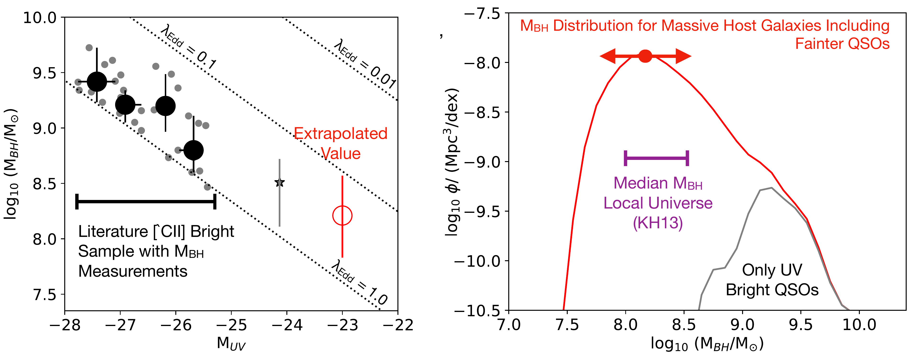
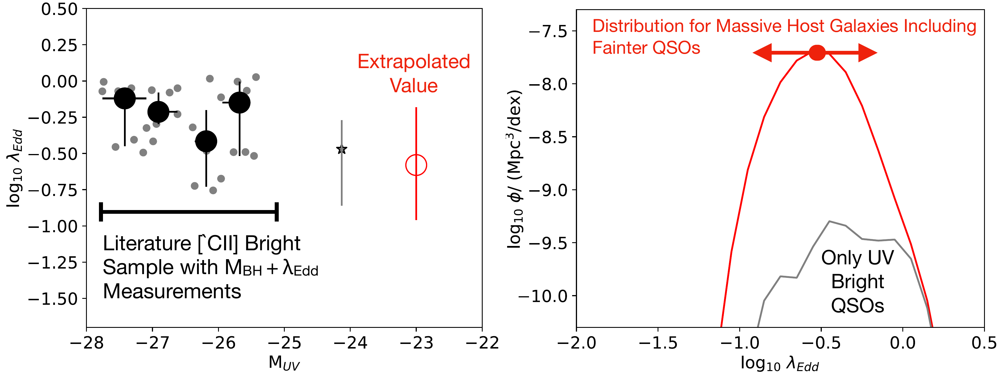
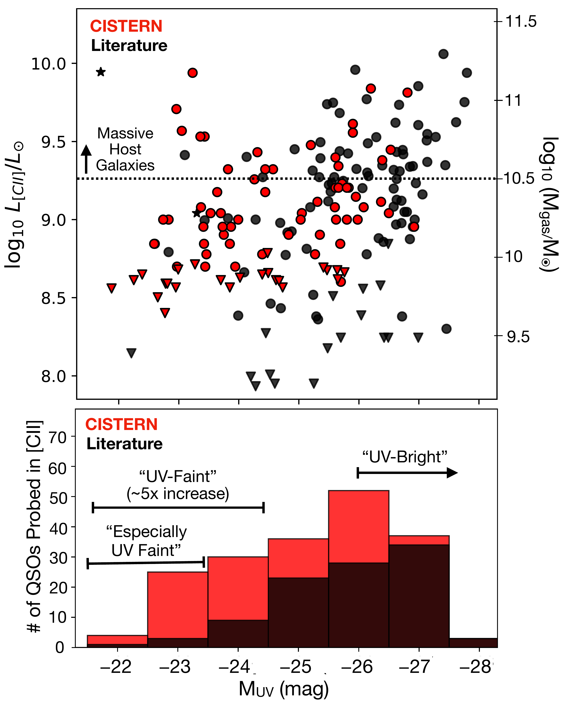

$\newcommand{\ensuremath}{}$
$\newcommand{\xspace}{}$
$\newcommand{\object}[1]{\texttt{#1}}$
$\newcommand{\farcs}{{.}''}$
$\newcommand{\farcm}{{.}'}$
$\newcommand{\arcsec}{''}$
$\newcommand{\arcmin}{'}$
$\newcommand{\ion}[2]{#1#2}$
$\newcommand{\textsc}[1]{\textrm{#1}}$
$\newcommand{\hl}[1]{\textrm{#1}}$
$\newcommand{\footnote}[1]{}$

# Beneath the Surface: $>$85\% of z$>$5.9 QSOs in Massive Host Galaxies are $UV$-Faint

<mark>Appeared on: 2025-07-01</mark> -  _13 pages, 6 figures, 4 tables, submitted to A&A_

R. Bouwens, et al. -- incl., <mark>F. Walter</mark>

**Abstract:** We use [ CII ] ${158\mu\text{m}}$ observations of a large QSO sample to  segregate sources by host galaxy mass, aiming to identify those in  the most massive hosts. [ CII ] luminosity, a known tracer of  molecular gas, is taken as a proxy for host mass and used to rank  190 QSOs at $z>5.9$ , spanning a 6-mag UV luminosity range  ( $-22<M{UV,AB}<-28$ ). Particularly valuable are ALMA data from a  cycle-10 CISTERN program, providing [ CII ] coverage for 46 $UV$ -faint  ( $M_{UV,AB}>-24.5$ ) and 25 especially $UV$ -faint ( $M_{UV,AB}>-23.5$ )  QSOs, improving statistics by 5 $\times$ and 6 $\times$ , respectively.  Taking massive host galaxies to be those where $L_{\text{[CII]}}$ $>1.8\times10^9$ L $_\odot$ (median $L_{[CII]}$ of $UV$ -bright  QSOs), we identify 61 QSOs, including 13 which are $UV$ -faint and 7  especially $UV$ -faint.  Using these selections and recent QSO  luminosity functions (LFs), we present the first characterization of $UV$ luminosity distribution for QSOs in massive host galaxies and  quantify [ CII ] LFs for both $UV$ -bright and $UV$ -faint QSOs.  While $\sim$ 3 \% of massive-host QSOs are $UV$ -bright ( $M_{UV,AB}<-26$ ), $\gtrsim$ 85 \% are $UV$ -faint ( $M_{UV,AB}>-24.5$ ).  This wide  dispersion in $UV$ luminosities reflects variations in dust  obscuration, accretion efficiency, and black hole mass. Though  spectroscopy is needed for definitive conclusions, black hole mass  appears to be the dominant factor driving variations in the $UV$ luminosity, based on 34 [ CII ] -luminous  ( $L_{\text{[CII]}}>1.8\times10^9$ L $_{\odot}$ ) QSOs distributed  across a $\sim$ 3-mag baseline in $UV$ luminosity and with measured $M_{BH}$ .  At $M_{UV,AB}\sim-23$ , the median extrapolated $\log_{10}  (M_{BH}/M_{\odot})$ is $8.1\pm0.4$ , consistent with the local  relation.  SMBHs in $UV$ -bright QSOs thus appear to be $\sim$ 15 $_{-9}^{+25}\times$ more massive than typical for massive  host galaxies at z $\sim$ 6.

**Figure 5. -** _(left)_ Median measured $M_{BH}$(\textit{solid black
    circles}) from the literature for QSOs in Massive Host Galaxies
  with $L_{\text{[CII]}}>$1.8$\times$10$^9$ L$_{\odot}$ vs. $UV$
  luminosity.  The smaller solid grey points show measured $M_{BH}$
  vs. $M_{UV}$ for the massive host galaxy sample.  The $M_{BH}$
  measurements for a $M_{UV,AB}\sim-24.1$ QSO at $z=7.07$ ([Izumi, Matsuoka and Fujimoto 2021]())  is shown with the grey star.  The dotted diagonal lines indicate $M_{BH}$'s corresponding to Eddington ratios $\lambda_{Edd}$ of 1, 0.1, and 0.01.  There is a strongly
  suggestive correlation between the black hole masses of QSOs in
  massive host galaxies and their $UV$ luminosities, suggesting that
  $UV$ brightness of QSOs in massive host galaxies is largely driven by
  the BH mass.  The open red circle shows the extrapolated
  $M_{BH}$ at $M_{UV,AB}\sim-23.0$ mag, together with the $1\sigma$
  uncertainty based on the extrapolation.  _(right)_
  Distribution of $M_{BH}$ in massive host galaxies at $z>6$ in
  $UV$-bright ($M_{UV,AB}<-26$) QSOs (_black line_) and including
  QSOs down to a $UV$ luminosity of $-$22.0 mag (_red line_).
  The precise mass where the $M_{BH}$ distribution peaks has a 1$\sigma$
  uncertainty of $\pm$0.4 dex (_red arrows_) and is sensitive to the $M_{UV,AB}=-22$ cut-off the QSO LF we assume and also the best-fit slope of the $M_{BH}$ vs. $M_{UV}$ relation.  The purple bracketed region indicates the approximate
  range of $M_{BH}$ for QSOs in similar mass host galaxies in the
  local universe (e.g.,  ([ and Kormendy 2013]()) : KH13).  The median $M_{BH}$ for
  QSOs in massive host galaxies at $z\sim6$ appears to be consistent
  with the local value (see \S\ref{sec:mbhdist}), but the uncertainties
  are too large to be sure.  Further measurements
  of $M_{BH}$ for the $UV$-faint QSOs in massive host galaxies at
  $z\sim6$ are required to resolve this open
  question. (*fig:mbhdist*)

**Figure 6. -** _(left)_ Median inferred $\lambda_{Edd}$(_solid black circles_) from the literature for QSOs in
  Massive Host Galaxies with $L_{\text{[CII]}}>$1.8$\times$10$^9$
  L$_{\odot}$ vs. $UV$ luminosity.  The grey points and grey star are
  as in Figure \ref{fig:mbhdist}.  No strong correlation is seen
  between the $UV$ luminosity of QSOs in massive host galaxies and
  their accretion efficiency $\lambda_{Edd}$.  As such, it would
  appear that $M_{BH}$ is the dominant factor impacting the $UV$
  brightness (or $L_{bol}$) of $z\sim6$-7 QSOs and the duty cycle
  cycle (i.e., variations in $\lambda_{Edd}$ has a more limited
  impact.  The open red circle shows the extrapolated $M_{BH}$ at $-$23.0 mag, together with the $1\sigma$ uncertainty
  based on the extrapolation.  _(right)_ Distribution of
  $\lambda_{Edd}$ in massive host galaxies at $z>6$ in $UV$-bright
  ($M_{UV,AB}<-26$) QSOs (_black line_) and including QSOs down
  to a $UV$ luminosity of $-$22.0 mag (_red line_).  Given
  the large uncertainties in the precise dependence $\lambda_{Edd}$
  shows on $UV$ luminosity, the peak of the distribution is very
  uncertain ($\pm$0.4 dex: _red arrows indicate the 1$\sigma$ uncertainties_). (*fig:erdist*)

**Figure 1. -** (_upper panel_) Measured [CII] luminosities
     vs. $M_{UV}$ luminosities for $z>5.9$ QSOs from CISTERN
     (_red circles_) and from the literature (_black circles_).  The solid downward pointing triangles indicate
     $5\sigma$ upper limits on the [CII] luminosities of QSO where no
     line is detected with ALMA.  The black stars correspond to the
     [Fujimoto, Brammer and Watson (2022)]() and [Endsley, Stark and Lyu (2023)]() QSO that
     were identified in deep multiwavelength data over legacy fields
     and not from wide-area QSO searches.  Shown along the right
     vertical axis is the approximate gas mass one would expect for
     the host galaxy of a given [CII] luminosity using the canonical
     [Zanella, Daddi and Magdis (2018)]() relation.  $\sim$21\% of $UV$-faint QSOs
     show luminous [CII] emission and thus appear to reside in massive
     host galaxies.  (_lower panel_) Number of [CII]
     observations for $z>5.9$ QSOs vs. $UV$ luminosity from the
     literature (_filled black histogram_) and from CISTERN
     (_filled red histogram_).  Thanks to observations from
     CISTERN, there has been a dramatic $\sim$5$\times$ increase in
     coverage of [CII] in $UV$-faint ($M_{UV,AB}>-24.5$) QSOs with ALMA.
    (*fig:muvcii*)

