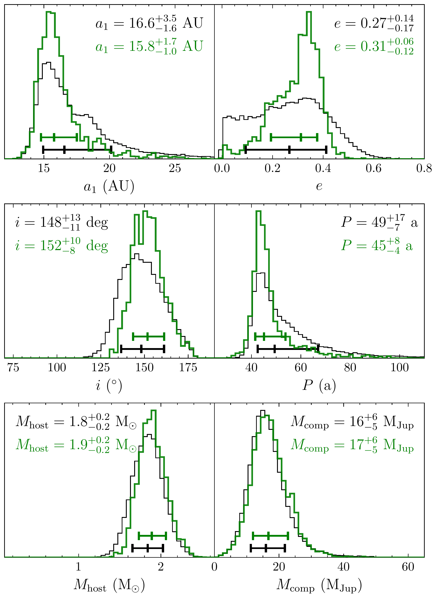
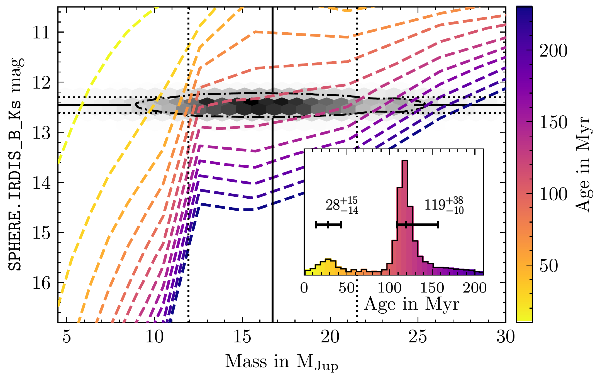
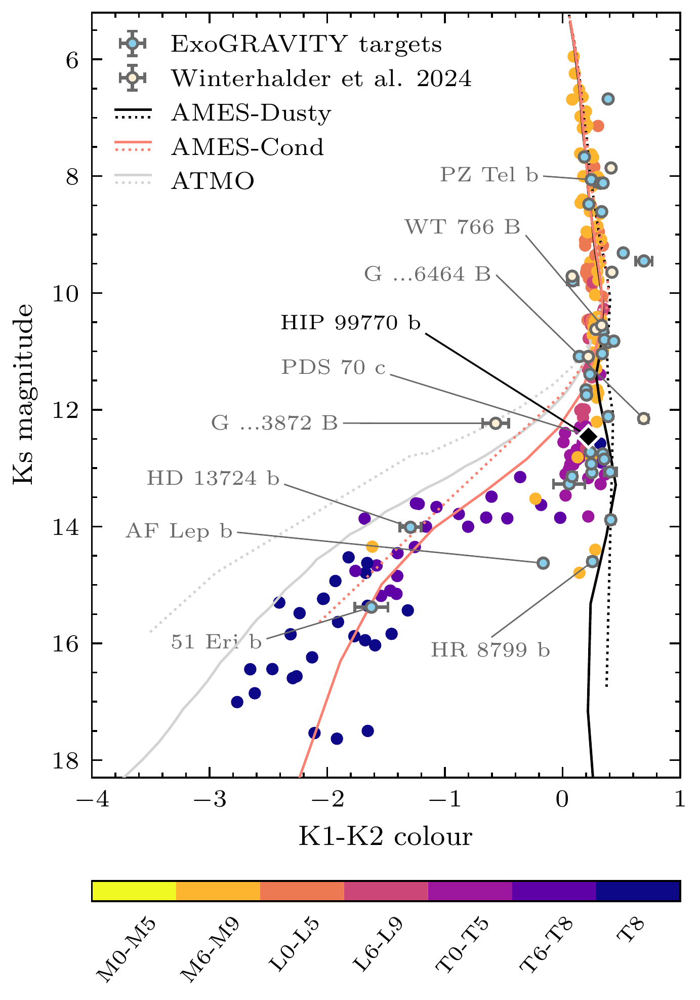

$\newcommand{\ensuremath}{}$
$\newcommand{\xspace}{}$
$\newcommand{\object}[1]{\texttt{#1}}$
$\newcommand{\farcs}{{.}''}$
$\newcommand{\farcm}{{.}'}$
$\newcommand{\arcsec}{''}$
$\newcommand{\arcmin}{'}$
$\newcommand{\ion}[2]{#1#2}$
$\newcommand{\textsc}[1]{\textrm{#1}}$
$\newcommand{\hl}[1]{\textrm{#1}}$
$\newcommand{\footnote}[1]{}$
$\newcommand$
$\newcommand{\arraystretch}{1.4}$
$\newcommand{\arraystretch}{1.4}$
$\newcommand{\fsed}{f_{\textrm{sed}}}$

# Orbit and atmosphere of HIP 99770 b through the eyes of VLTI/GRAVITY

<mark>Appeared on: 2025-07-02</mark> -  _Accepted for publication in Astronomy and Astrophysics_

T. O. Winterhalder, et al. -- incl., <mark>W. Brandner</mark>, <mark>G. Chauvin</mark>, <mark>P. Garcia</mark>, <mark>T. Henning</mark>, <mark>L. Kreidberg</mark>, <mark>P. Mollière</mark>

**Abstract:** Inferring the likely formation channel of giant exoplanets and brown dwarf companions from orbital and atmospheric observables remains a formidable challenge.Further and more precise directly measured dynamical masses of these companions are required to inform and gauge formation, evolutionary, and atmospheric models.We present an updated study of the recently discovered companion to HIP 99770 based on observations conducted with the near-infrared interferometer VLTI/GRAVITY. Through renewed orbital and spectral analyses based on the GRAVITY data, we characterise HIP 99770 b to better constrain its orbit, dynamical mass, and atmospheric properties, as well as to shed light on its likely formation channel. Upon inclusion of the new high-precision astrometry epoch, we ran an orbit fit to further constrain the dynamical mass of the companion and the orbit solution.We also analysed the GRAVITY K-band spectrum, placing it into context with literature data, and extracting magnitude, age, spectral type, bulk properties and atmospheric characteristics of HIP 99770 b. We detected the companion at a radial separation of $\SI{417}{mas}$ from its host. The new orbit fit yields a dynamical mass of $17_{-5}^{+6} \mathrm{M}_\mathrm{Jup}$ and an eccentricity of $0.31_{-0.12}^{+0.06}$ . We also find that additional relative astrometry epochs in the future will not enable further constraints on the dynamical mass due to the dominating relative uncertainty on the Hipparcos-- _Gaia_ proper motion anomaly that is used in the orbit-fitting routine. The publication of Gaia DR4 will likely ease this predicament.Based on the spectral analysis, we find that the companion is consistent with spectral type L8 and exhibits a potential metal enrichment in its atmosphere.Adopting the AMES-DUSTY model to infer its age, within its dynamical mass constraint the companion conceivably corresponds to either a younger ( $28_{-14}^{+15} \mathrm{Myr}$ ) object with a mass just below the deuterium-burning limit or an older ( $119_{-10}^{+37} \mathrm{Myr}$ ) body with a mass just above the deuterium-burning limit. These results do not yet allow for a definite inference of the companion's formation channel.Nevertheless, the new constraints on its bulk properties and the additional GRAVITY spectrum presented here will aid future efforts to determine the formation history of HIP 99770 b.

**Figure 4. -** Marginalised posterior distributions of a subset of the fitted orbital parameters. The black posteriors were sampled considering the previously available data only, while the green posteriors result from the inclusion of the new GRAVITY epoch from 31 May 2023. The median values and intervals between the 16th and 84th percentiles of the distribution are indicated by the horizontal bars. The inferred values resulting from the two runs, which were rounded to the respective significant figure, are displayed at the top of each panel. While technically not one of the parameters explored by the walkers during the sampling procedure, we also plot the period, $P$, as computed from the other posteriors via Kepler's third law. The full posterior samplings can be found in Appendix \ref{app_section_additional_orbital_fitting_plots}.
         (*figure_posteriors*)

**Figure 7. -** Isochrones from the AMES-Dusty model grid  ([Chabrier, et. al 2000](), [Allard, et. al 2001]())  in the mass-magnitude plane. The colours indicate the respective age. The solid black lines show the dynamical mass  of the companion and the \texttt{IRDIS\_B\_Ks} filter magnitude, and the dotted lines delineate the 16th and 84th percentiles. For the filter magnitude, we adopted a conservative systematic error (see text).
        The grey colour map in the background visualises the two-dimensional distribution of randomly drawn masses and magnitudes from their respective distributions. The dash-dotted line encircles \SI{68}{\percent} of all draws.
        The shoulder in the isochrones in this particular region of the mass-magnitude plane is caused by the onset of deuterium burning and the mass dependence of its time evolution.
        The panel in the bottom right corner shows the companion age posterior obtained by bootstrapping the drawn mass and magnitude pairs onto the age manifold as defined by the isochrones.
         (*figure_age_plot*)

**Figure 5. -** Colour-magnitude diagram showing HIP 99770 b, indicated by the black diamond, in relation to a literature population of low-mass stars, brown dwarfs, and exoplanets (see Appendix C of  ([Bonnefoy, Perraut and Lagrange 2018]())  and references therein). All ExoGRAVITY targets (ESO ID 1104.C-0651;  ([Lacour, Wang and Nowak 2020]()) ) and the companions so far detected via the _Gaia_--GRAVITY synergy  ([Winterhalder, Lacour and Mérand 2024]())  are shown in light blue and ochre, respectively.
        Additionally, isochrones computed using the AMES-Dusty  ([Chabrier, et. al 2000](), [Allard, et. al 2001]()) , AMES-Cond  ([Allard, et. al 2001](), [Baraffe, et. al 2003]()) , and \texttt{ATMO} ([Phillips, Tremblin and Baraffe 2020]())  evolutionary models are shown for two ages: \SI{1}{Gyr}(solid lines), and \SI{100}{Myr}(dotted lines).
        The filters we used to extract these magnitudes and colours from the spectra are \texttt{Paranal}\texttt{/}\texttt{SPHERE}\texttt{.}\texttt{IRDIS\_B\_Ks}, \texttt{IRDIS\_D\_K12\_1}, and \texttt{IRDIS\_D\_K12\_2}.
         (*figure_cmd*)

