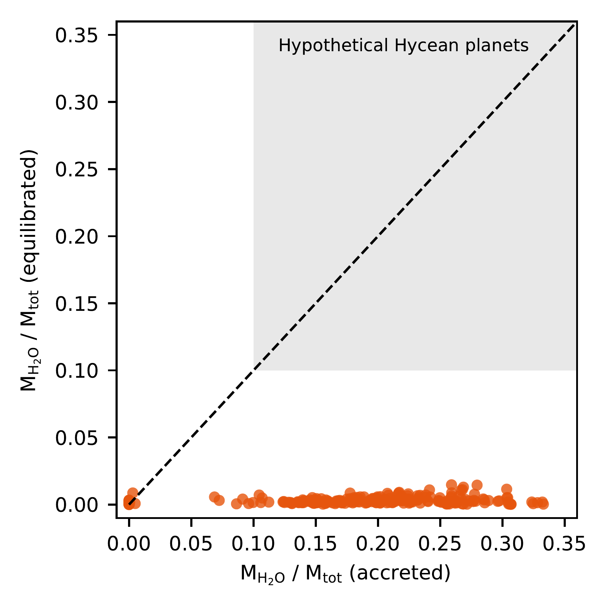
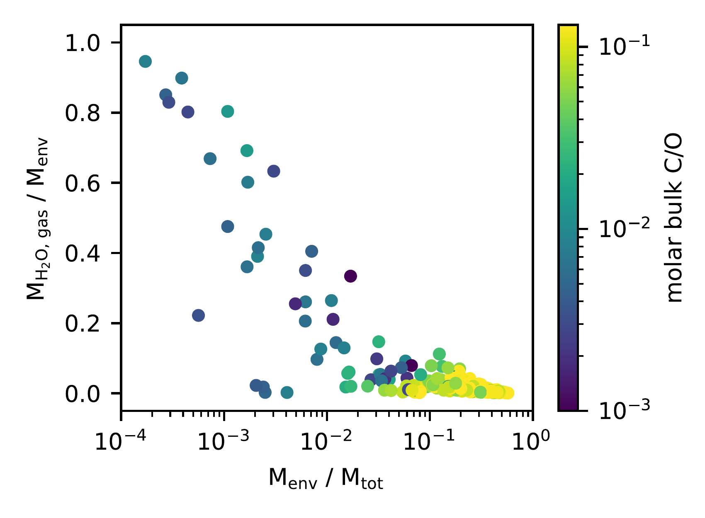
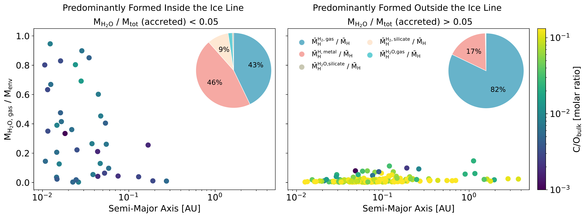

$\newcommand{\ensuremath}{}$
$\newcommand{\xspace}{}$
$\newcommand{\object}[1]{\texttt{#1}}$
$\newcommand{\farcs}{{.}''}$
$\newcommand{\farcm}{{.}'}$
$\newcommand{\arcsec}{''}$
$\newcommand{\arcmin}{'}$
$\newcommand{\ion}[2]{#1#2}$
$\newcommand{\textsc}[1]{\textrm{#1}}$
$\newcommand{\hl}[1]{\textrm{#1}}$
$\newcommand{\footnote}[1]{}$

# Sub-Neptunes Are Drier Than They Seem: Rethinking the Origins of Water-Rich Worlds

<mark>Appeared on: 2025-07-02</mark> -  _Submitted to ApJL_

A. Werlen, et al. -- incl., <mark>R. Burn</mark>

**Abstract:** Recent claims of biosignature gases in sub-Neptune atmospheres have renewed interest in water-rich sub-Neptunes with surface oceans, often referred to as Hycean planets. These planets are hypothesized to form beyond the snow line, accreting large amounts of $\ce{H2O}$ ( $>$ 10 wt \% ) before migrating inward. However, current interior models often neglect chemical equilibration between primordial atmospheres and molten interiors. Here, we compute global chemical equilibrium states for a synthetic population of sub-Neptunes with magma oceans. Although many initially accrete 5–30 wt \% water, interior–atmosphere interactions destroy most of it, reducing final $\ce{H2O}$ mass fractions to below 1.5 wt \% . As a result, none meet the threshold for Hycean planets. Despite that, we find $\ce{H2O}$ -dominated atmospheres exclusively on planets that accreted the least ice. These planets form inside the snow line, are depleted in carbon and hydrogen, and develop small envelopes with envelope mass fractions below 1 \% , dominated by endogenic water. In contrast, planets formed beyond the snow line accrete more volatiles, but their water is largely converted to $H_2$ gas or sequestered into the interior, resulting in low atmospheric $\ce{H2O}$ mass fractions. Most $\ce{H2O}$ -rich envelopes are also fully miscible with $\ce{H2}$ , making a separate water layer unlikely. Our results topple the conventional link between ice accretion and water-rich atmospheres, showing instead that $\ce{H2O}$ -dominated envelopes emerge through chemical equilibration in hydrogen-poor planets formed inside the snow line.

**Figure 1. -** Comparison between the accreted and equilibrated water mass fractions of sub-Neptunes. The black dashed line indicates the 1:1 correlation; in the absence of chemistry, all planets would lie along this line. The grey shaded region denotes the 10–90 wt\% water mass fraction range proposed for Hycean planets by madhusudhan_habitability_2021. All planets in our sample exhibit significant water depletion following equilibration and fall well below the Hycean threshold. (*fig:H2O_comparison*)

**Figure 2. -** Envelope $H_2$O mass fraction as a function of envelope mass fraction, using the same dataset as in Figure \ref{fig:H2O_comparison}. The colorbar indicates the molar bulk C/O ratio. Planets with low envelope mass fractions tend to retain a higher proportion of $H_2$O in the gas phase. Moreover, planets with low C/O ratios consistently show higher $H_2$O content compared to their carbon-rich counterparts. (*fig:H2O_comparison_env*)

**Figure 5. -** Envelope $H_2$O mass fraction as a function of semi-major axis. The same dataset as in Figure \ref{fig:H2O_comparison} is shown. The left panel shows planets that predominantly formed inside the water ice line; the right panel shows those that formed outside. Classification is based on the accreted $H_2$O mass fraction, with a threshold set at 5\% of the total planetary mass. The colorbar indicates the molar bulk C/O ratio. Planets formed inside the ice line are systematically depleted in carbon due to the lack of volatile ice accretion and exhibit higher envelope $H_2$O mass fractions. In contrast, planets formed beyond the ice line retain lower $H_2$O content despite higher bulk volatile abundances. Each pie chart shows the mean mass fraction of hydrogen in $H_2$(gas), H (metal), $H_2$(silicate), $H_2$O (gas), and $H_2$O (silicate), normalized to the total mean hydrogen inventory for each population. Only components contributing more than 5\% are labeled. Planets that formed beyond the ice line store most hydrogen as $H_2$(gas) and H (metal), while those that formed inside the ice line retain a larger share of hydrogen in H (metal) $H_2$(silicate) and $H_2$O (gas + silicate). (*fig:orbital_distr.*)

