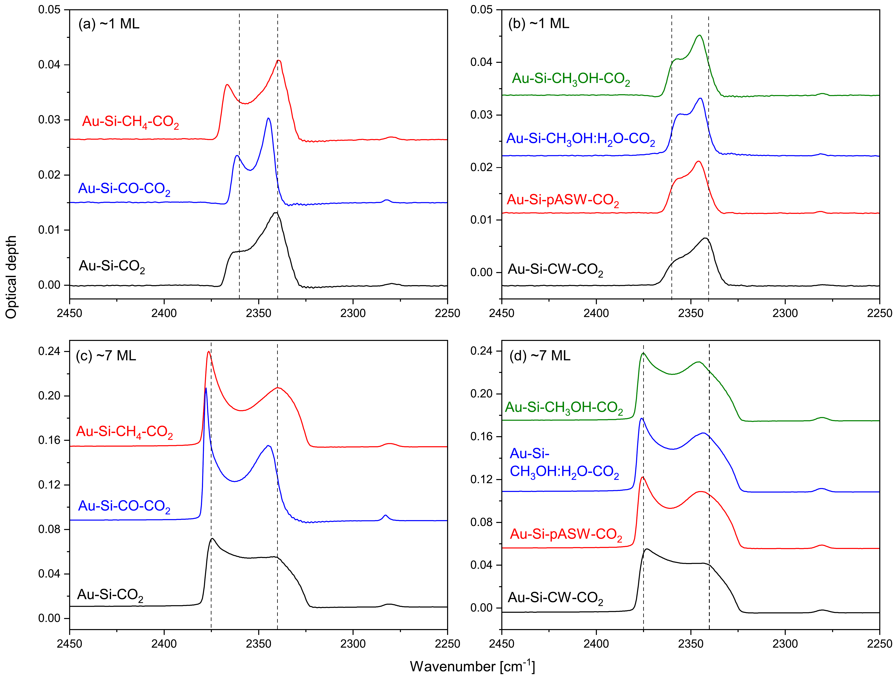
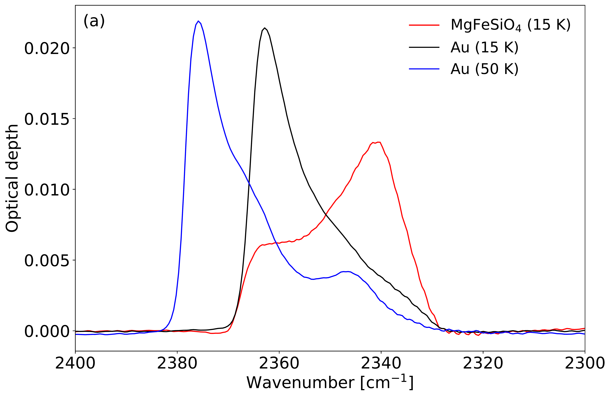
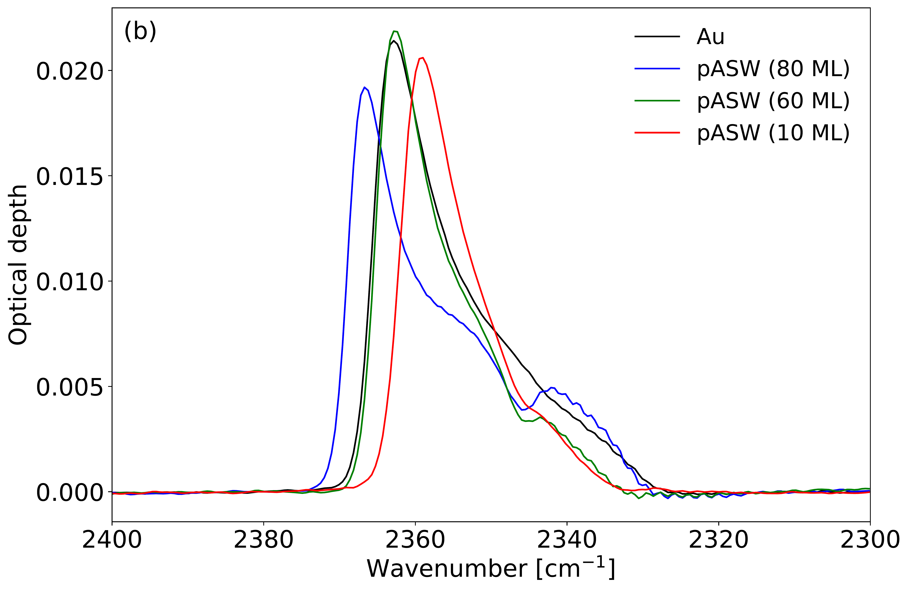
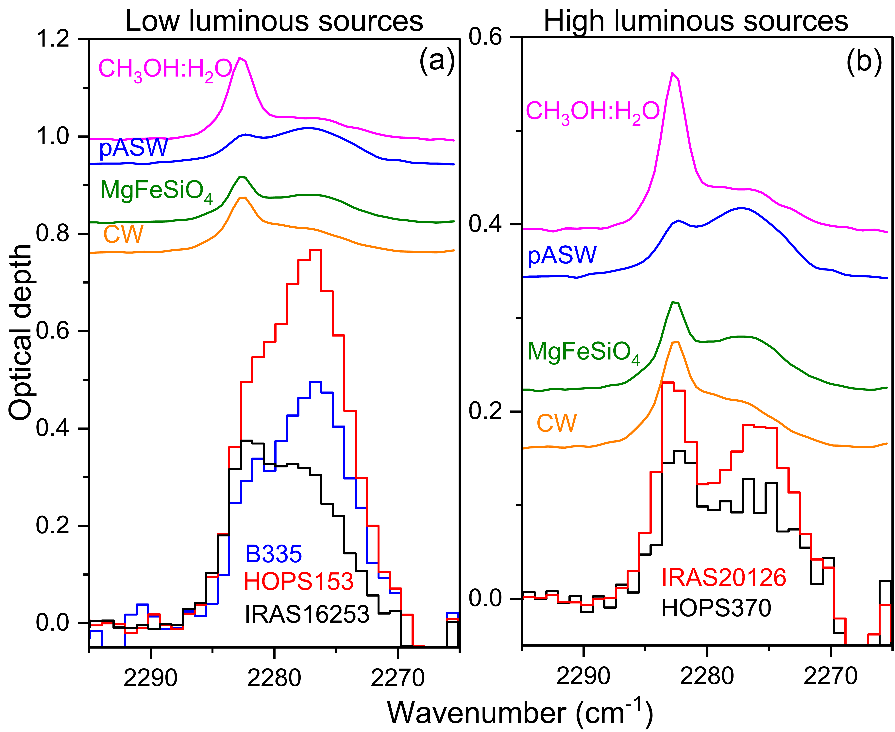

$\newcommand{\ensuremath}{}$
$\newcommand{\xspace}{}$
$\newcommand{\object}[1]{\texttt{#1}}$
$\newcommand{\farcs}{{.}''}$
$\newcommand{\farcm}{{.}'}$
$\newcommand{\arcsec}{''}$
$\newcommand{\arcmin}{'}$
$\newcommand{\ion}[2]{#1#2}$
$\newcommand{\textsc}[1]{\textrm{#1}}$
$\newcommand{\hl}[1]{\textrm{#1}}$
$\newcommand{\footnote}[1]{}$
$\newcommand{\vdag}{(v)^\dagger}$
$\newcommand$
$\newcommand$
$\newcommand{\arraystretch}{1.3}$

# $CO_2$ infrared spectra on silicate dust grain analogs: Implications for JWST observations

<mark>Appeared on: 2025-07-02</mark> -  _13 pages, 6 figures, 2 tables_

<mark>T. Suhasaria</mark>, et al. -- incl., <mark>V. Leuschner</mark>, <mark>C. Gieser</mark>, <mark>T. Henning</mark>

**Abstract:** Carbon dioxide is one of the three most abundant species within the ice mantles around dust grains inside molecular clouds. Since a substantial amount of interstellar grains is made of siliceous materials, we have studied the infrared profile of $CO_2$ deposited on top of a bare and ice-coated amorphous silicate ($MgFeSiO_4$ ) film using reflection absorption infrared spectroscopy (RAIRS). In contrast to a metal surface, the $CO_2$ IR profile shows a relaxation of the metal surface selection rule in the presence of the bare $MgFeSiO_4$ dust grain analog, which brings the IR profile closer to the observational spectra while maintaining the sensitivity of RAIRS. Experiments with the underlying CO and $CH_4$ ices show that their presence facilitates structural changes toward crystalline ice for the deposited $CO_2$ at much lower temperatures than on the polar ice layers. Warming-up experiments of $CO_2$ showed that it tends to stay on the silicate surface for much longer than on the gold surface without the silicate layer. We noticed for the first time a split in the $^{13}$ $CO_2$ IR feature on the pure or ice-covered silicate grain as a marker for the onset of diffusion. The laboratory $^{13}$ $CO_2$ profile then closely resembles recent JWST observations of this feature around young and embedded protostars, suggesting that it can be linked to the observed feature.

**Figure 3. -** RAIRS spectra of $CO_2$($\nu_3$ vibrational mode) deposited at 15 K on gold coated with a 100 nm amorphous silicate film, with or without an additional $\sim$10 ML layer of pure or mixed ice. The top column shows 1 ML $CO_2$ spectra on (a) the silicate film without additional ice layer and on pure apolar ices, (b) on pure polar ices and an ice mixture. The bottom panels (c) and (d) (*fig:(a)polar*)

**Figure 2. -** (a) RAIRS spectra of $\sim$1 ML $CO_2$($\nu_3$ vibrational mode) deposited on bare gold at 15 and 50 K and on gold coated with a 100 nm amorphous silicate film at 15 K. (b) Spectra of $\sim$1 ML $CO_2$ deposited on varying thickness of porous amorphous water layers on gold at 15 K are shown alongside the spectrum on bare gold for comparison. (*fig:LOTOsplitting*)

**Figure 6. -** Comparison of the $^{13}$$CO_2$ ice feature toward (a) low luminous and (b) high luminous protostars with laboratory spectra on different surfaces. To facilitate comparison, all laboratory spectra have been scaled by a factor of 40. Additionally, in panel (b), the $CH_3$OH:$H_2$O spectrum is vertically offset by 0.4, while in panel (a), all laboratory spectra from panel (b) are offset by 0.6. (*fig5*)

