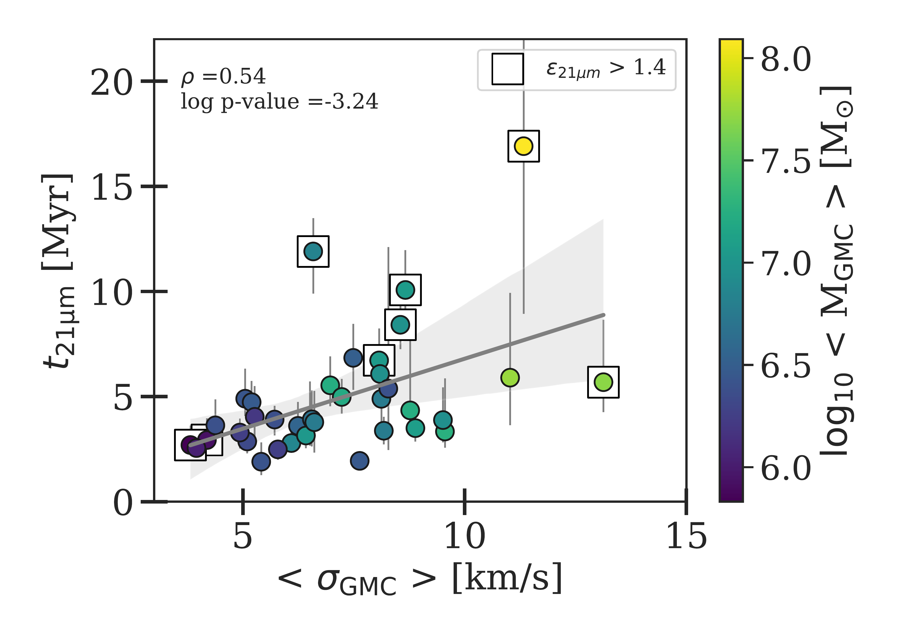
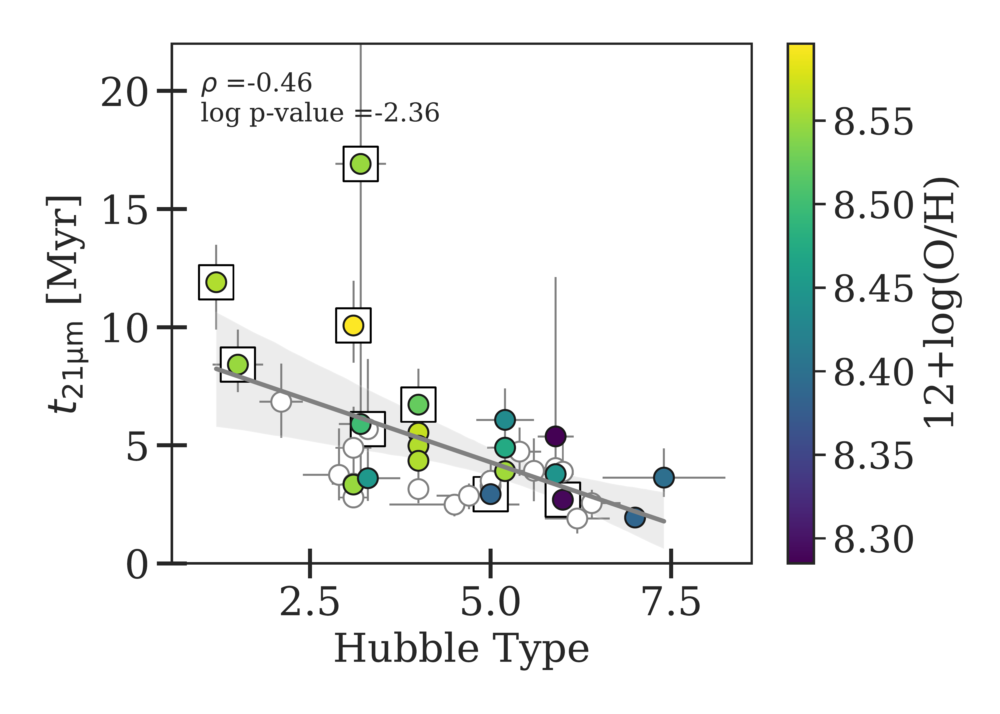

$\newcommand{\ensuremath}{}$
$\newcommand{\xspace}{}$
$\newcommand{\object}[1]{\texttt{#1}}$
$\newcommand{\farcs}{{.}''}$
$\newcommand{\farcm}{{.}'}$
$\newcommand{\arcsec}{''}$
$\newcommand{\arcmin}{'}$
$\newcommand{\ion}[2]{#1#2}$
$\newcommand{\textsc}[1]{\textrm{#1}}$
$\newcommand{\hl}[1]{\textrm{#1}}$
$\newcommand{\footnote}[1]{}$
$\newcommand{\toadd}[1]{{\color{red}{{[TO ADD: \bf #1]}}}}$
$\newcommand{\hi}{H~{\sc i}}$
$\newcommand{\hii}{H~{\sc ii}}$
$\newcommand{\ha}{\ifmmode{\rm H}\alpha \else H\alpha\fi}$
$\newcommand{\hb}{\ifmmode{\rm H}\beta \else H\beta\fi}$
$\newcommand{\lya}{\ifmmode{\rm Ly}\alpha \else Ly\alpha\fi}$
$\newcommand{\hei}{He~{\sc i}}$
$\newcommand{\Hei}{He~{\sc i} \lambda4471}$
$\newcommand{\heii}{He~{\sc ii}}$
$\newcommand{\Heiiuv}{He~{\sc ii} \lambda1640}$
$\newcommand{\Heiiopt}{He~{\sc ii} \lambda4686}$
$\newcommand{\ebv}{\ifmmode E_{\rm B-V} \else E_{\rm B-V}\fi}$
$\newcommand{\av}{\ifmmode A_{\rm V} \else A_{\rm V}\fi}$
$\newcommand{\alphaCO}{\ifmmode \alpha_{\rm CO} \else \alpha_{\rm CO}\fi}$
$\newcommand{\oh}{\ifmmode 12 + \log({\rm O/H}) \else12 + \log({\rm O/H})\fi}$
$\newcommand{\nii}{[N~{\sc ii}]}$
$\newcommand{\niii}{[N~{\sc iii}]}$
$\newcommand{\oi}{[O~{\sc i}]}$
$\newcommand{\oii}{[O~{\sc ii}]}$
$\newcommand{\oiii}{[O~{\sc iii}]}$
$\newcommand{\oiv}{[O~{\sc iv}]}$
$\newcommand{\sii}{[S~{\sc ii}]}$
$\newcommand{\siii}{[S~{\sc iii}]}$
$\newcommand{\siv}{[S~{\sc iv}]}$
$\newcommand{\ci}{[C~{\sc i}]}$
$\newcommand{\cii}{[C~{\sc ii}]}$
$\newcommand{\civ}{[C~{\sc iv}]}$
$\newcommand{\neiii}{[Ne~{\sc iii}]}$
$\newcommand{\neii}{[Ne~{\sc ii}]}$
$\newcommand{\nev}{[Ne~{\sc v}]}$
$\newcommand{\nevi}{[Ne~{\sc vi}]}$
$\newcommand{\neiv}{[Ne~{\sc iv}]}$
$\newcommand{\feii}{[Fe~{\sc ii}]}$
$\newcommand{\feiii}{[Fe~{\sc iii}]}$
$\newcommand{\feiv}{[Fe~{\sc iv}]}$
$\newcommand{\fev}{[Fe~{\sc v}]}$
$\newcommand{\fevi}{[Fe~{\sc vi}]}$
$\newcommand{\fevii}{[Fe~{\sc vii}]}$
$\newcommand{\silii}{[Si~{\sc ii}]}$
$\newcommand{\arii}{[Ar~{\sc ii}]}$
$\newcommand{\ariii}{[Ar~{\sc iii}]}$
$\newcommand{\ariv}{[Ar~{\sc iv}]}$
$\newcommand{\mgiv}{[Mg~{\sc iv}]}$
$\newcommand{\Niiib}{N~{\sc iii} \lambda4512Å}$
$\newcommand{\Nv}{N~{\sc v} \lambda4612Å}$
$\newcommand{\Niii}{N~{\sc iii} \lambda4640Å}$
$\newcommand{\Civb}{C~{\sc iv} \lambda4658Å}$
$\newcommand{\Heii}{He~{\sc ii} \lambda4686}$
$\newcommand{\Ciii}{C~{\sc iii} \lambda5696}$
$\newcommand{\Civ}{C~{\sc iv} \lambda5808}$
$\newcommand{\Ciiiuv}{C~{\sc iii}] \lambda1909}$
$\newcommand{\Oiiiuv}{O~{\sc iii}] \lambda1666}$
$\newcommand{\arraystretch}{1.3}$
$\newcommand{\micron}{\mum}$
$\newcommand{\kms}{km s^{-1}}$
$\newcommand{\kmsmpc}{km s^{-1} Mpc^{-1}}$
$\newcommand{\cmc}{cm^{-3}}$
$\newcommand{\erg}{erg s^{-1} cm^{-2} Å^{-1}}$
$\newcommand{\ergs}{erg s^{-1}}$
$\newcommand{\ergscm}{erg s^{-1} cm^{-2}}$
$\newcommand{\msun}{\ifmmode M_{\odot} \else M_{\odot}\fi}$
$\newcommand{\msunyr}{\ifmmode M_{\odot} {\rm yr}^{-1} \else M_{\odot} yr^{-1}\fi}$
$\newcommand{\zsun}{\ifmmode Z_{\odot} \else Z_{\odot}\fi}$
$\newcommand{\lsun}{\ifmmode L_{\odot} \else L_{\odot}\fi}$
$\newcommand{\mup}{\ifmmode M_{\rm up} \else M_{\rm up}\fi}$
$\newcommand{\mlow}{\ifmmode M_{\rm low} \else M_{\rm low}\fi}$
$\newcommand{\aap}{A\&A}$
$\newcommand{\aaps}{A\&AS}$
$\newcommand{\aas}{A\&AS}$
$\newcommand{\aj}{AJ}$
$\newcommand{\apj}{ApJ}$
$\newcommand{\apjl}{ApJL}$
$\newcommand{\apjs}{ApJS}$
$\newcommand{\mnras}{MNRAS}$
$\newcommand{\pasp}{PASP}$
$\newcommand{\rmxaa}{Revista Mexicana de Astronomía y Astrofísica}$
$\newcommand{\Nii}{[N\small II]\normalsize \lambda\lambda6548,6584A}$
$\newcommand{\Sii}{[S~{\sc ii}] \lambda\lambda6716,6731Å}$
$\newcommand{\Siii}{[S~{\sc iii}] \lambda\lambda9068,9532Å}$
$\newcommand{\Oi}{[O~{\sc i}] \lambda6300Å}$
$\newcommand{\Oii}{[O~{\sc ii}] \lambda\lambda3726, 3728Å}$
$\newcommand{\Oiii}{[O~{\sc iii}] \lambda\lambda4959,5007Å}$
$\newcommand{\oiiil}{[O~{\sc iii}]\lambda 5007Å}$
$\newcommand{\oiiill}{[O~{\sc iii}]\lambda 4959Å}$
$\newcommand{\fesc}{\ifmmode f_{\rm esc} \else f_{\rm esc}\fi}$
$\newcommand{\feschii}{\ifmmode f_{\rm esc,HII} \else f_{\rm esc,HII}\fi}$

# Duration and properties of the embedded phase of star formation in 37 nearby galaxies from PHANGS-JWST

<mark>Appeared on: 2025-07-03</mark> -  _20 pages, 14 figures, submitted to A&A, comments welcome_

L. Ramambason, et al. -- incl., <mark>K. Kreckel</mark>, <mark>J. Neumann</mark>, <mark>E. Schinnerer</mark>

**Abstract:** Light reprocessed by dust grains emitting in the infrared allows the study of the physics at play in dusty, embedded regions, where ultraviolet and optical wavelengths are attenuated. Infrared telescopes such as JWST have made it possible to study the earliest feedback phases, when stars are shielded by cocoons of gas and dust. This phase is crucial for unravelling the effects of feedback from young stars, leading to their emergence and the dispersal of their host molecular clouds. Here we show that the transition from the embedded to the exposed phase of star formation is short ( $< 4$ Myr) and sometimes almost absent ( $< 1$ Myr), across a sample of 37 nearby star-forming galaxies, covering a wide range of morphologies from massive barred spirals to irregular dwarfs. The short duration of the dust-clearing timescales suggests a predominant role of pre-supernova feedback mechanisms in revealing newborn stars, confirming previous results on smaller samples and allowing, for the first time, a statistical analysis of their dependencies. We find that the timescales associated with mid-infrared emission at 21 $\mu$ m, tracing a dust-embedded feedback phase, are controlled by a complex interplay between giant molecular cloud properties (masses and velocity dispersions) and galaxy morphology. We report relatively longer durations of the embedded phase of star formation in barred spiral galaxies, while this phase is significantly reduced in low-mass irregular dwarf galaxies. We discuss tentative trends with gas-phase metallicity, which may favour faster cloud dispersal at low metallicities.

**Figure 13. -** Spearman's rank correlation coefficients and associated p-values measured between galaxy properties (columns) and our measurements (rows). Statistically significant correlations according to the Holm-Bonferroni method (described in Section \ref{subsec_significance}) are highlighted as black squares, and marginally significant correlations ($\log p$-values < -2) are shown as blue squares. Our measurements are the total timescale of 21 $\mu$m emission ($t_{\rm 21 \mu m}$), the ratio between timescales of SFR and gas($t_{\rm 21 \mu m}$/$t_{\rm CO}$), and the diffuse emission fractions of 21 $\mu$m (f$_{\rm diffuse}^{21 \mu m}$). We correlate these measurements with various parameters grouped in six categories, described in \ref{subsec_selected_params}, along with the corresponding references. (*correlation*)

**Figure 14. -** **Left**: Total duration of the 21 $\mu$m vs. CO-luminosity-weighted average velocity dispersion of GMCs. The colorbar shows the CO luminosity-weighted average mass of GMCs. Galaxies with high surface density contrasts are identified with squares. We show in gray a linear regression fitted to the data and the gray-shaded area represents the 95\% confidence interval on the regression, obtained with bootstrapping data. **Right**: Total duration of the 21 $\mu$m vs. the Hubble morphological type. The colorbar shows the metallicity measurements for the galaxies observed with MUSE. (*plot_corr_t21*)

**Figure 12. -** Measured deviation of the gas-to-stellar flux ratio with respect to the galactic average, as a function of aperture sizes for each galaxy, obtained by contrasting CO emission as a gas tracer with respectively H$\alpha$(black triangles) and 21 $\mu$m (blue circles) as a SFR tracer. The positive deviations correspond to measurements focusing on gas peaks (traced by CO), while the negative deviations are obtained focusing on stellar peaks (traced respectively by H$\alpha$ or 21 $\mu$m). For each data point, we also show the effective 1$\sigma$ error, after the covariance between data points is taken into account. The horizontal plain line corresponding to a deviation of zero in log represents the galactic average. The dotted gray lines connecting the measurements correspond to a polynomial fit of the tuning-fork branches, following $\ci$te{Kruijssen_tf_2018}. The arrows indicate the typical separation length, $\lambda$, at which the two tracers decorrelate. The two last panels show the histograms of $\lambda$ and inferred feedback timescales ($t_{\rm fb}$, defined in Section \ref{subsec_measuring_timescales}), derived for the whole sample using either H$\alpha$ or 21 $\mu$m as a proxy for SFR, as well as the median and 1$\sigma$ standard deviations associated with these distributions. (*tuning_fork_ha_21*)

