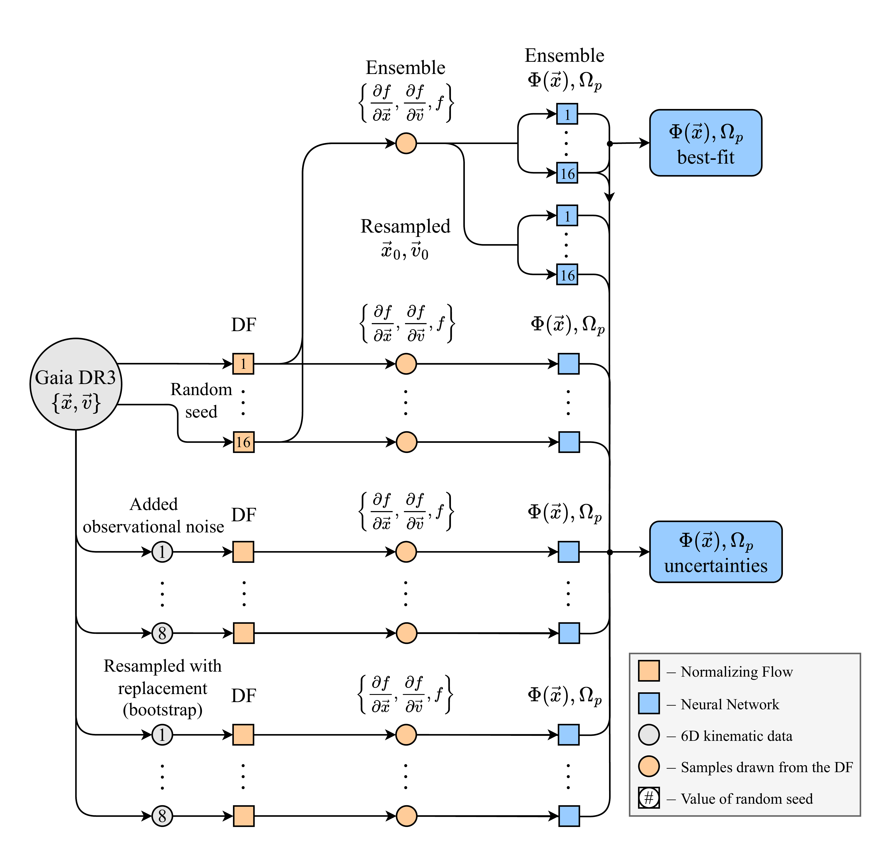
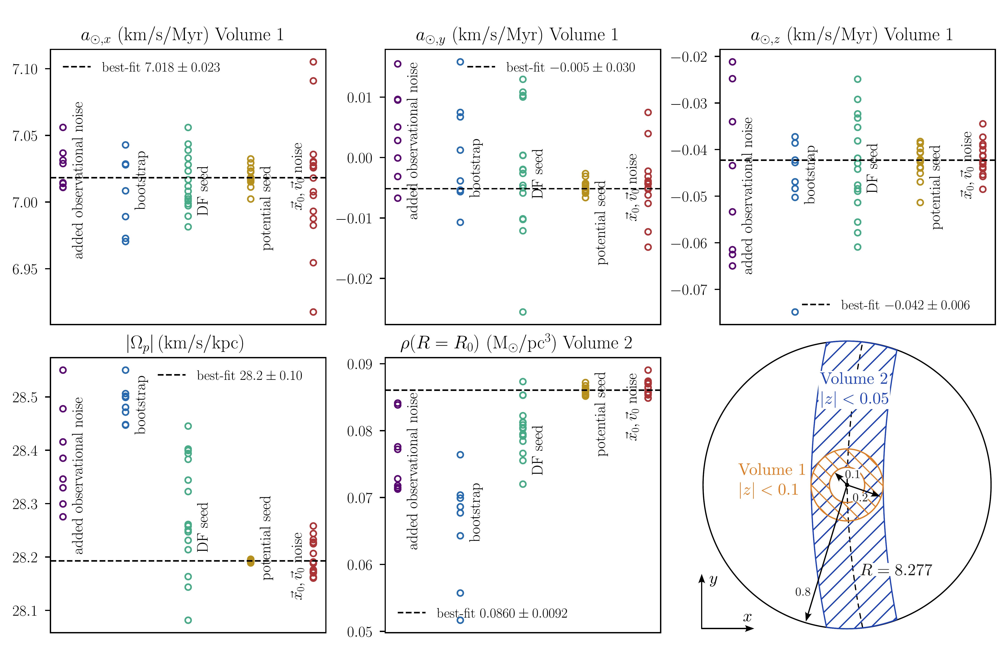
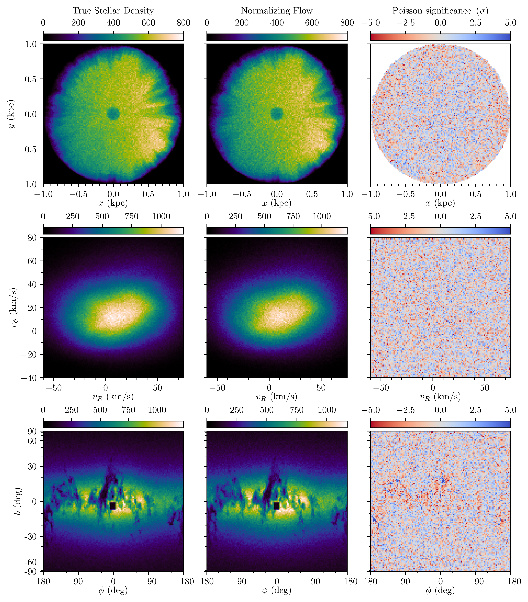

$\newcommand{\ensuremath}{}$
$\newcommand{\xspace}{}$
$\newcommand{\object}[1]{\texttt{#1}}$
$\newcommand{\farcs}{{.}''}$
$\newcommand{\farcm}{{.}'}$
$\newcommand{\arcsec}{''}$
$\newcommand{\arcmin}{'}$
$\newcommand{\ion}[2]{#1#2}$
$\newcommand{\textsc}[1]{\textrm{#1}}$
$\newcommand{\hl}[1]{\textrm{#1}}$
$\newcommand{\footnote}[1]{}$
$\newcommand{\vdag}{(v)^\dagger}$
$\newcommand$
$\newcommand$
$\newcommand$
$\newcommand$
$\newcommand$

# Deep Potential: Recovering the gravitational potential and local pattern speed in the solar neighborhood with GDR3 using normalizing flows

<mark>Appeared on: 2025-07-08</mark> -  _24 pages, 13 figures_

<mark>T. Kalda</mark>, G. M. Green

**Abstract:** The gravitational potential of the Milky Way encodes information about the distribution of all matter -- including dark matter -- throughout the Galaxy. _Gaia_ data release 3 has revealed a complex structure that necessitates flexible models of the Galactic gravitational potential.We make use of a sample of 5.6 million upper-main-sequence stars to map the full 3D gravitational potential in a one-kiloparsec radius from the Sun using a data-driven approach called "Deep Potential". This method makes minimal assumptions about the dynamics of the Galaxy -- that the stars are a collisionless system that is statistically stationary in a rotating frame (with pattern speed to be determined). We model the distribution of stars in 6D phase space using a normalizing flow and the gravitational network using a neural network. We recover a local pattern speed of $\Omega_p = 28.2\pm0.1\mathrm{ km/s/kpc}$ , a local total matter density of $\rho=0.086\pm0.010\mathrm{ M_\odot/pc^3}$ and local dark matter density of $\rho_\mathrm{DM}=0.007\pm0.011\mathrm{ M_\odot/pc^3}$ . The full 3D model exhibits spatial fluctuations, which may stem from the model architecture and non-stationarity in the Milky Way.

**Figure 5. -** Illustration of the various models trained for Deep Potential, which are used to both determine a best estimate of the potential and to quantify its uncertainties. Squares indicate models, circles indicate datasets, nodes colored orange pertain to the distribution function, and nodes colored blue pertain to the gravitational potential and pattern speed $\Omega_p$.
    To obtain the best-fit value for the gravitational potential and $\Omega_p$, we first train 16 normalizing flows (with different random seeds) to approximate the distribution function. We obtain a best estimate of the distribution function and its gradients by taking the median of the 16 flows and of their gradients (Ensemble $\{\pdv*{f}{\vec x}, \pdv*{f}{\vec v}, f\})$. We use this best-fit distribution function to train 16 neural networks and pattern speeds (with different random seeds). The best-fit pattern speed and potential (or its derivatives) are defined by the median of these 16 pattern speeds and neural networks (or of their derivatives).
    We additionally estimate various sources of errors in the potential. For example, to quantify the effect of observational noise, we train 8 distribution functions on Gaia data with added noise. For each distribution function, we train a potential. From this ensemble, we can calculate variance in the inferred pattern speed, potential and derived quantities.
    From top to bottom on the figure, the following uncertainties are quantified: observational errors in $\vec x_0$ and $\vec v_0$ by resampling the respective quantities based on variations in the literature values, fluctuations in the random seed and convergence of the normalizing flow and neural network architecture, observational errors in the source data by resampling the 6D positions of stars based on their quoted errors, and finally, statistical uncertainties from the finite size of the dataset using bootstrap on the training data. (*fig:dpot_diagram*)

**Figure 6. -** Distribution of scalar value quantities from different uncertainty estimation pipelines visualized in Figure \ref{fig:dpot_diagram}. The scalar quantities are: the average acceleration in the solar neighborhood $a_{\odot,x}, a_{\odot,y}, a_{\odot,z}$, the pattern speed of the solar neighborhood within \SI{1}{kpc} from the Sun, and the average total matter density $\rho(R=R_0)$ at the solar distance $R = R_0$ from the Galactic Center. The bottom right diagram visualizes which volumes the quantities are averaged over. The central \SI{0.1}{kpc} and outer \SI{0.8}{kpc} are excluded due to a lack of data and systematics from edge effects, respectively. In each subplot, the columns represent the spread of values due to the following five effects: adding observational noise to the observed 6D kinematics of the training data ("added observational noise"), resampling the stars in the training data using bootstrap ("bootstrap"), variations in the starting seed of the normalizing flows representing the DF ("DF seed"), variations in the starting seed of the neural network representing the gravitational potential while using the best-fit DF ("potential seed"), and adding observational noise to the literature values of $\vec x_0, \vec v_0$ while using the best-fit DF ("$\vec x_0, \vec v_0$ noise"). The best-fit value is calculated using the median of "potential seed". For discussion, see \ref{appendix:uncertainties} (*fig:scalar_values*)

**Figure 9. -** A demonstration of the performance of our normalizing flow model of the stellar phase-space distribution function in three different projections. We plot 2D histograms of the selected stars (left column) and of $2^{21}=2097152$ points sampled from the trained normalizing flow (middle column), as well as a comparison between the two (right column). The top row shows a face-on view of the \SI{1000}{pc} dataset, projected onto the $x-y$ plane. The middle row shows one velocity-space projection ($v_{\phi}$ vs. $v_R$), and the bottom row shows the sky projection (in a Lambert cylindrical equal-area projection: $\ell$ vs. $\sin b$). The density of the sampled normalizing flow points has been renormalized by an overall constant to match the density of the stars in the training set. For each bin, we define the Poisson significance as $(n_\mathrm{NF} - n_\mathrm{data})/\sqrt{n_\mathrm{data}}$, where $n_\mathrm{NF}$ is the renormalized number of samples in the bin drawn from the normalizing flow and $n_\mathrm{data}$ is the number of sources in the dataset in the same bin. As can be seen above, our normalizing flow captures nearly all prominent features in the stellar distribution, with the exception of some residuals seen in areas of high dust extinction in the sky projection. We thus obtain a smooth, differentiable representation of the Galactic stellar population. (*fig:df*)

