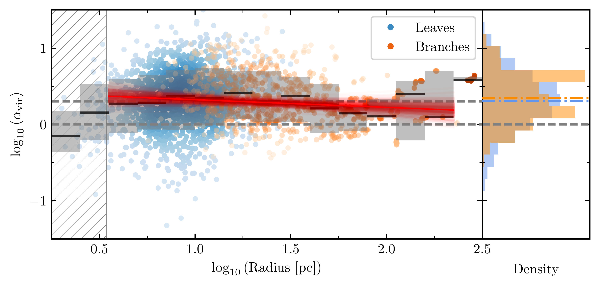
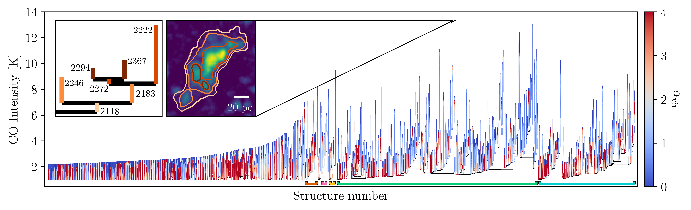
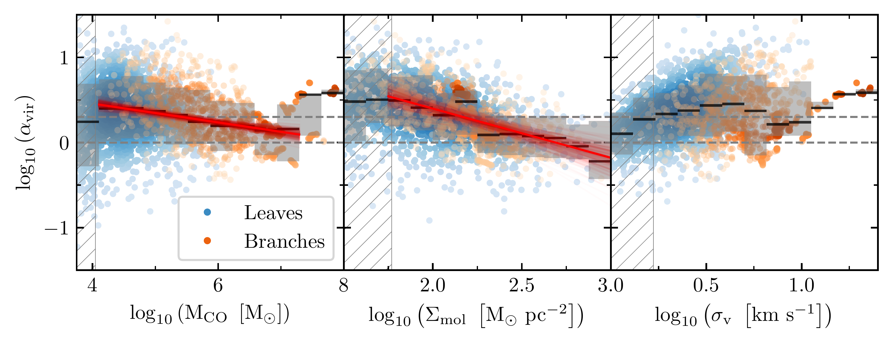

$\newcommand{\ensuremath}{}$
$\newcommand{\xspace}{}$
$\newcommand{\object}[1]{\texttt{#1}}$
$\newcommand{\farcs}{{.}''}$
$\newcommand{\farcm}{{.}'}$
$\newcommand{\arcsec}{''}$
$\newcommand{\arcmin}{'}$
$\newcommand{\ion}[2]{#1#2}$
$\newcommand{\textsc}[1]{\textrm{#1}}$
$\newcommand{\hl}[1]{\textrm{#1}}$
$\newcommand{\footnote}[1]{}$
$\newcommand{\co}{^{12}\mathrm{CO}(2-1)}$
$\newcommand{\avir}{\alpha_\mathrm{vir}}$
$\newcommand{\rvir}{R_\mathrm{vir}}$
$\newcommand{\onesigma}{16--84\%}$
$\newcommand{\mco}{M_\mathrm{CO}}$
$\newcommand{\sigmol}{\Sigma_\mathrm{mol}}$
$\newcommand{\sigv}{\sigma_\mathrm{v}}$
$\newcommand{\msun}{\mathrm{M_\odot}}$
$\newcommand{\alphaco}{\alpha_\mathrm{CO}}$
$\newcommand{\rtwoone}{R_{21}}$
$\newcommand{\UConn}{\affiliation{Department of Physics, University of Connecticut, 196A Auditorium Road, Storrs, CT 06269, USA}}$
$\newcommand{\Alberta}{\affiliation{Department of Physics, University of Alberta, Edmonton, Alberta, T6G 2E1, Canada}}$
$\newcommand{\OSU}{\affiliation{Department of Astronomy, The Ohio State University, 140 West 18th Avenue, Columbus, OH 43210, USA}}$
$\newcommand{ÇAPP}{\affiliation{Center for Cosmology and Astroparticle Physics (CCAPP), 191 West Woodruff Avenue, Columbus, OH 43210, USA}}$
$\newcommand{\MPIA}{\affiliation{Max Planck Institut für Astronomie, Königstuhl 17, 69117 Heidelberg, Germany}}$
$\newcommand{\Princeton}{\affiliation{Department of Astrophysical Sciences, Princeton University, 4 Ivy Lane, Princeton, NJ 08544, USA}}$
$\newcommand{\JHU}{\affiliation{Department of Physics and Astronomy, Johns Hopkins University, Baltimore, MD 21218, USA}}$
$\newcommand{\UBonn}{\affiliation{Argelander-Institut für Astronomie, University of Bonn, Auf dem Hügel 71, 53121 Bonn, Germany}}$
$\newcommand{\CfA}{\affiliation{Center for Astrophysics \mid Harvard \& Smithsonian, 60 Garden St., Cambridge, MA 02138, USA}}$
$\newcommand{\ESO}{\affiliation{European Southern Observatory, Karl-Schwarzschild-Strasse 2, 85748 Garching bei München, Germany}}$
$\newcommand{\HD}{\affiliation{Astronomisches Rechen-Institut, Zentrum für Astronomie der Universität Heidelberg, Mönchhofstra\ss e 12-14, 69120 Heidelberg, Germany}}$
$\newcommand{\UOA}{\affiliation{Department of Physics, University of Arkansas, 226 Physics Building, 825 West Dickson Street, Fayetteville, AR 72701, USA}}$
$\newcommand{\UCT}{\affiliation{Department of Astronomy, University of Cape Town, Rondebosch 7701, South Africa}}$
$\newcommand{\ESOcl}{\affiliation{European Southern Observatory (ESO), Alonso de Córdova 3107, Casilla 19, Santiago 19001, Chile}}$
$\newcommand{\OAN}{\affiliation{Observatorio Astron{ó}mico Nacional (IGN), C/Alfonso XII 3, Madrid E-28014, Spain}}$
$\newcommand{\ITA}{\affiliation{Universität Heidelberg, Zentrum für Astronomie, Institut für Theoretische Astrophysik, Albert-Ueberle-Str 2, D-69120 Heidelberg, Germany}}$
$\newcommand{\UWyoming}{\affiliation{Department of Physics and Astronomy, University of Wyoming, Laramie, WY 82071, USA}}$
$\newcommand{\UGent}{\affil{Sterrenkundig Observatorium, Universiteit Gent, Krijgslaan 281 S9, B-9000 Gent, Belgium}}$
$\newcommand{\Oxford}{\affil{Sub-department of Astrophysics, Department of Physics, University of Oxford, Keble Road, Oxford OX1 3RH, UK}}$
$\newcommand{\Carnegie}{\affiliation{Observatories of the Carnegie Institution for Science, 813 Santa Barbara Street, Pasadena, CA 91101, USA}}$
$\newcommand{\UChile}{\affiliation{Departamento de Astronomía, Universidad de Chile, Camino del Observatorio 1515, Las Condes, Santiago, Chile}}$
$\newcommand{\IRAP}{\affiliation{IRAP/OMP/Université de Toulouse, 9 Av. du Colonel Roche, BP 44346, F-31028 Toulouse cedex 4, France}}$
$\newcommand{\LUX}{\affiliation{LUX, Observatoire de Paris, PSL Research University, CNRS, Sorbonne Universités, 75014 Paris, France}}$

# Assessing the hierarchical dynamical state of molecular gas: virial parameters from 3 to 300 pc in NGC 253

<mark>Appeared on: 2025-07-08</mark> -  _31 pages, 16 figures, submitted to ApJ_

Elias~K.~Oakes, et al. -- incl., <mark>A. Hughes</mark>, <mark>E. Schinnerer</mark>

**Abstract:** Understanding how the dynamical state of the interstellar medium (ISM) changes across spatial scales can provide important insights into how the gas is organized and ultimately collapses to form stars. To this end, we present ALMA $\co$ observations at $7$ pc ( $0.4\arcsec$ ) spatial resolution across a $1.4 \mathrm{kpc}\times5.6 \mathrm{kpc}$ ( $1'.3\times1'.3$ ) region located in the disk of the nearby ( $D = 3.5$ Mpc), massive, star-forming galaxy NGC 253. We decompose this emission with a hierarchical, multiscale dendrogram algorithm to identify 2463 structures with deconvolved sizes ranging from $\sim3$ to $300$ pc, complete to a limiting mass of $10^4$  $\msun$ . By comparing the virial parameter of these structures against physical properties including size, mass, surface density, velocity dispersion, and hierarchical position, we carry out a comprehensive search for a preferred scale at which gravitationally bound structures emerge. Ultimately, we do not identify any emergent scale for bound objects in our data, nor do we find a correlation between the virial parameter and structure sizes. These findings suggest that gravitational binding cannot be used to define molecular clouds and emphasize the need for multiscale approaches to characterize the ISM.

**Figure 8. -** **Left:** The virial parameter against structure radius for all leaves (blue) and branches (orange) in the dendrogram. Each point's lightness is scaled by a Gaussian kernel density estimator (KDE) to reflect the smoothed density distribution. Bins of 0.15 dex are shown with their medians in black and $\onesigma$ ranges in gray. In red, we fit the centers of these bins and show each iteration of a Bayesian linear regression using \texttt{linmix}, finding a slope of $-0.10\pm0.08$. We exclude the largest-radius bin because it is strongly affected by a single, very large lineage with duplicate flux, discussed more in \S \ref{subsec:disc_largescale}. The two dashed, horizontal lines in gray show $\alpha_\mathrm{vir} = 1$ and $2$. The estimated 50\% completeness limit for structures of typical $\sigmol$ and $\avir$(\S \ref{subsec:completeness}) is shown by the hatched boundary. $\avir$ is remarkably flat with $R$, for structures from $\sim3$ to 250 pc. **Right:** Virial parameter distributions for leaves (blue) and branches (orange). Median values are indicated by the horizontal, colored lines. (*fig:virial_radius*)

**Figure 7. -** **Main panel:** Full dendrogram of the NGC 253 field, showing 2463 structures ordered by peak intensity within a lineage. The virial parameter $\avir$ is plotted within each structure as a function of the contour intensity level, showing a substantial decrease with intensity both between (\S \ref{subsubsec:virial_hierarchical}) and within (\S \ref{subsubsec:avir_intensity_levelprops}) individual structures. The trunks corresponding to base structures \#1018 (orange), 1560 (pink), 1439 (yellow), 488 (green), and 87 (cyan) are indicated at the bottom, using the same colors as Fig. \ref{fig:zoomfield}, panel (b).
    **Inset panels:** A subset of the dendrogram (left) and corresponding contours over the peak intensity map (right) highlight the tree-like hierarchy of the dendrogram, in which leaves (the high-intensity, peak-level structures) are nested within lower-intensity parent branches, which can in turn be nested within their own parent structures. In these panels, the orange gradient represents each structure's level. (*fig:levelprops_dendrogram*)

**Figure 9. -** Similar to Fig. \ref{fig:virial_radius} but with $\avir$ plotted against structure mass ($\mathrm{M_{CO}}$), surface density ($\sigmol$), and velocity dispersion ($\sigv$) for 12 bins. \texttt{linmix} fits above the completeness limits return $\alpha_\mathrm{vir} \propto M_\mathrm{CO}^{-0.11\pm0.03}$ below $\log_\mathrm{10}\left(\mathrm{M_{CO}}\right) \lesssim 7.3$ and $\alpha_\mathrm{vir} \propto \Sigma_\mathrm{mol}^{-0.58\pm0.16}$. (*fig:physical_params*)

