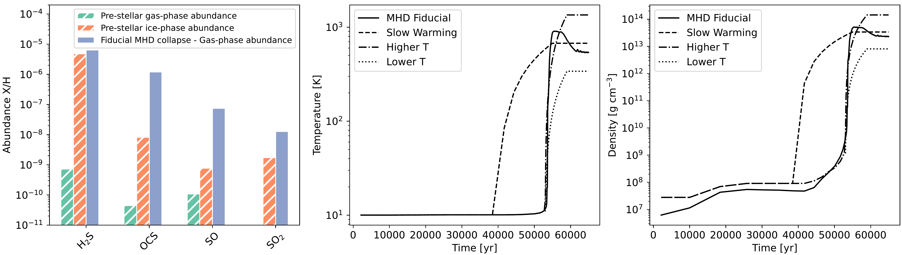
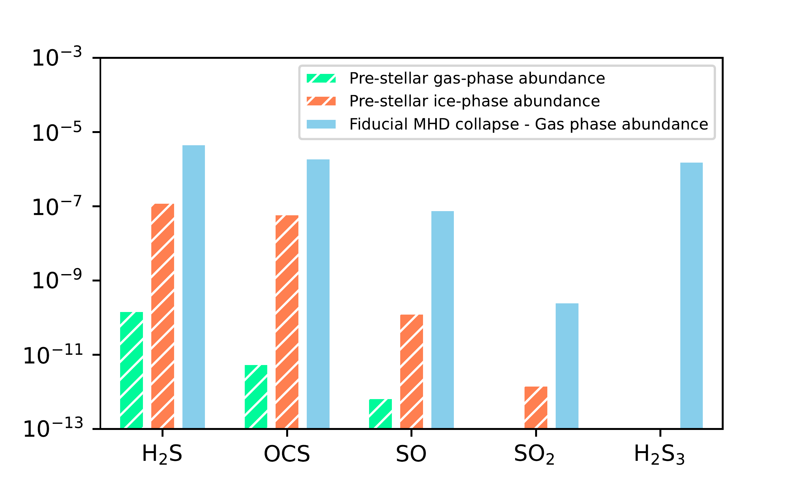
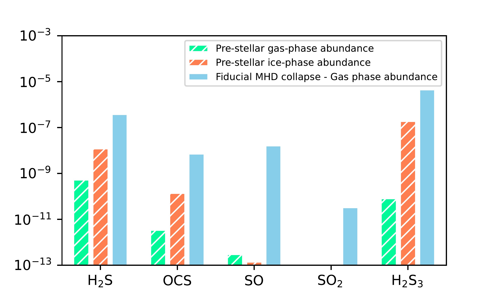
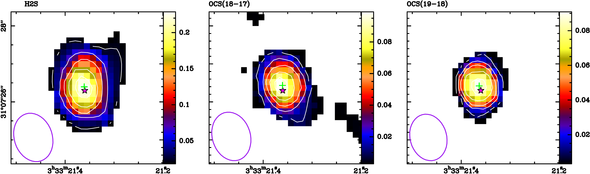
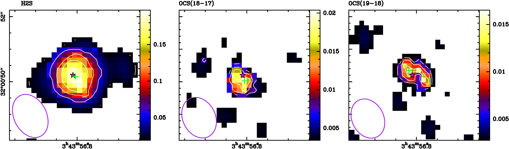
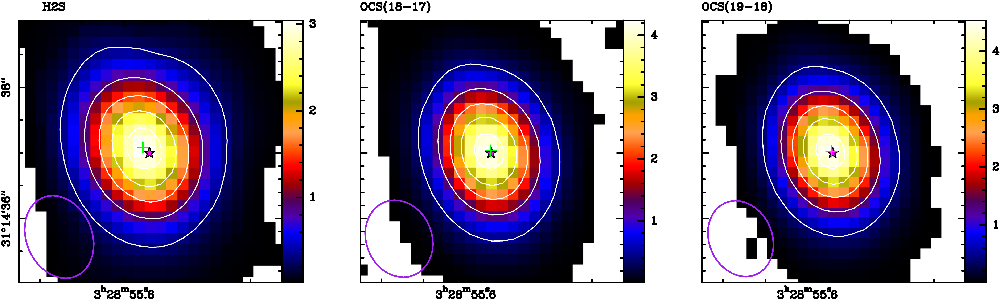

$\newcommand{\ensuremath}{}$
$\newcommand{\xspace}{}$
$\newcommand{\object}[1]{\texttt{#1}}$
$\newcommand{\farcs}{{.}''}$
$\newcommand{\farcm}{{.}'}$
$\newcommand{\arcsec}{''}$
$\newcommand{\arcmin}{'}$
$\newcommand{\ion}[2]{#1#2}$
$\newcommand{\textsc}[1]{\textrm{#1}}$
$\newcommand{\hl}[1]{\textrm{#1}}$
$\newcommand{\footnote}[1]{}$
$\newcommand{\citet}[1]{\textcolor[rgb]{0,0,1}{\oldcitet{#1}}}$
$\newcommand{\citep}[1]{\textcolor[rgb]{0,0,1}{\oldcitep{#1}}}$
$\newcommand{\citealp}[1]{\textcolor[rgb]{0,0,1}{\oldcitealp{#1}}}$
$\newcommand{\arraystretch}{1.5}$
$\newcommand{\arraystretch}{1}$
$\newcommand{\arraystretch}{1.5}$
$\newcommand{\arraystretch}{1.5}$
$\newcommand{\arraystretch}{1.5}$
$\newcommand{\arraystretch}{1.5}$
$\newcommand{\arraystretch}{1.5}$

# PRODIGE - Envelope to Disk with NOEMA$\thanks{Based on observations carried out under project number L19MB with the IRAM NOEMA Interferometer. IRAM is supported by INSU/CNRS (France), MPG (Germany) and IGN (Spain)}$: VI: The missing Sulfur Problem

<mark>Appeared on: 2025-07-09</mark> -  _Main text: 20 pages, 11 figures. Appendixes: 10 pages, 5 figures. Article accepted for publication on Astronomy & Astrophysics_

J. J. Miranzo-Pastor, et al. -- incl., <mark>T. Henning</mark>, <mark>C. Gieser</mark>, <mark>D. Semenov</mark>

**Abstract:** Determining the amount of sulfur in volatiles and refractories in the interstellar medium remains one of the main problems in astrochemistry. The detection of $H_2$ S ices, which are thought to be one of the main sulfur reservoirs, is still a great challenge and has not been achieved yet, and the only sulfur-bearing species detected in the ices to date is OCS. PRODIGE (PROtostars and DIsks: Global Evolution) large survey observations with the NOrthern Extended Millimeter Array (NOEMA) of several Class 0/I protostars in the Perseus Molecular Cloud provide a perfect opportunity to study the $H_2$ S and OCS composition of the ices through the volatiles sublimated in the warm inner core (T>100K, $n\sim$ 10 $^6$ cm $^{-3}$ ) of these protostars. Our aim is to determine the $H_2$ S/OCS ratio in the warm inner core of the protostars of our sample in order to study how it is affected by different factors during its evolution. We used the NOEMA millimeter observations from the PRODIGE program of $H_2$ S, $H_2^{33}$ S, OCS, OC $^{33}$ S and OC $^{34}$ S to estimate the $H_2$ S and OCS column densities in the warm inner core of 24 protostars of Perseus. In addition, we used SO and $SO_2$ data from the Atacama Large Millimeter/submillimeter Array (ALMA) archive to complete the sulfur budget and give a rough estimate of the total sulfur abundance in each of the sources. We explore the chemistry of $H_2$ S and OCS in the warm cores using chemical and dynamical simulations of the collapse of a dense core to form a protostar. The compound $H_2$ S is detected in 21 protostars and OCS in 17 protostars of our sample. The estimated $H_2$ S/OCS ratio reveals a segregation of the sources into "OCS-poor" and "OCS-rich" protostars, where the OCS-poor protostars present higher $H_2$ S/OCS ratios than the OCS-rich ones. Total sulfur abundance, which is always dominated by either $H_2$ S or OCS, grows with evolution during the Class 0 phase, reaching a minimum depletion of a factor $<$ 8 in the Class 0/I objects, and decreasing again in the Class I. Simulations show that temperature changes in the pre-stellar phase and during the collapse can produce substantial differences in the $H_2$ S and OCS (ice and gas-phase) abundances and in the $H_2$ S/OCS ratio. Our analysis shows that the $H_2$ S/OCS ratio is strongly influenced by the environment and the initial conditions of the cloud.

**Figure 10. -** Evolution of the models with different warming curves. _Left:_ Initial ice and gas-phase components of the $H_2$S, OCS, SO and $SO_2$ species in the inner core before the collapse. Comparison with the final abundance of these species in the gas-phase after the Fiducial MHD collapse. _Center:_ Comparison of the Fiducial MHD warming curve with the rest of warming curves explored in the section. _Right:_ Comparison of the Fiducial MHD density curve with the rest of warming curves explored in the section. The different density curves are obtained using the barotropic equation of state from $\citet${Machida2006}.
             (*fig:histoCompPreMHD*)

**Figure 13. -** Comparison between the 15 K and 25 K models. Initial ice and gas-phase components of the $H_2$S, OCS, SO, $SO_2$ and $H_2$$S_3$ species in the inner core before the collapse. Comparison with the final abundance of these species in the gas-phase after the collapse. There is a significant fall of $H_2$S, OCS, SO and $SO_2$ in the ices after the 25 K pre-phase, compared with the 15 K pre-stellar phase. On the contrary, $H_2$$S_3$ is formed in the ices during the warmer pre-phase, something that did not happen in the cooler one. After the collapse of the 25 K model, the final $H_2$S, SO and $SO_2$ drops in $\sim$1 order of magnitude with respect to the 15 K simulation. This is not true for OCS, whose abundance falls more than 2 orders of magnitude. $H_2$$S_3$ final gas-phase abundance is greater in the warmer model, reaching an abundance of $\sim$5$\times$10$^{-6}$.Initial Temperature before the pre-phase: 15 KInitial Temperature before de pre-phase: 25 K (*fig:model_comparison*)

**Figure 6. -** Emission of the main species ($H_2$S, and both OCS lines) in the inner core of protostars B1bS, HH211MMS, IRAS2A, IRAS4B. The colormap represents the >3$\sigma$ emission integrated images in a 4$\arcsec\times$4$\arcsec$ square region. The color scale, shown at the right of each map, is the brightness temperature in K. The white contours represent 10\%, 30\%, 50\%, 70\% and 90\% of the peak temperature. The pink star shows the position of the protostar, determined by the position of the maximum emission in the continuum $\citep${Tobin2016}. The green cross marks the point with maximum emission of the line.B1bSHH211MMSIRAS2AIRAS4B (*fig:moment-0-maps*)

