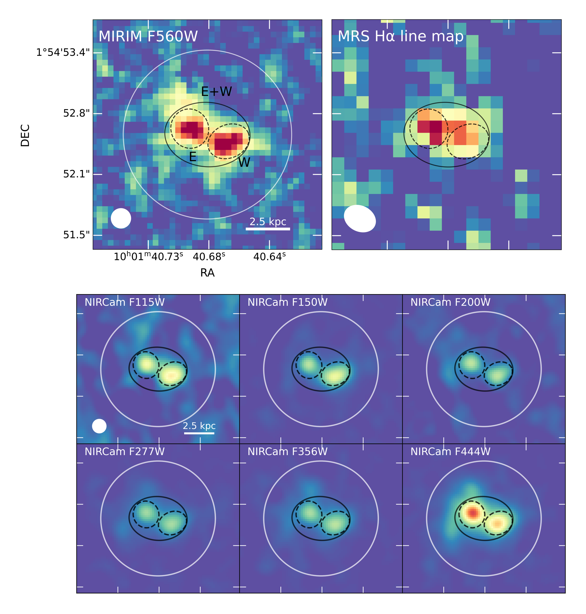
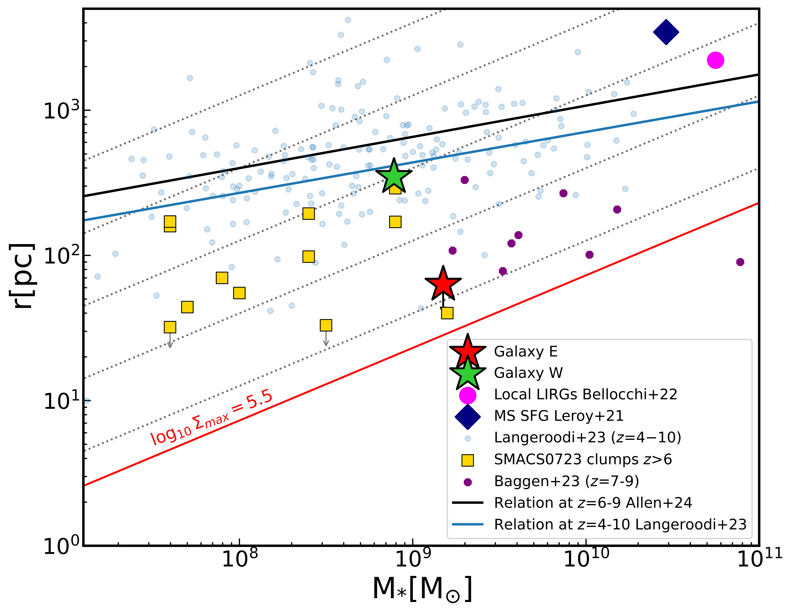

$\newcommand{\ensuremath}{}$
$\newcommand{\xspace}{}$
$\newcommand{\object}[1]{\texttt{#1}}$
$\newcommand{\farcs}{{.}''}$
$\newcommand{\farcm}{{.}'}$
$\newcommand{\arcsec}{''}$
$\newcommand{\arcmin}{'}$
$\newcommand{\ion}[2]{#1#2}$
$\newcommand{\textsc}[1]{\textrm{#1}}$
$\newcommand{\hl}[1]{\textrm{#1}}$
$\newcommand{\footnote}[1]{}$
$\newcommand{\CII}{[\ion{C}{II}]158\mum}$
$\newcommand{\oddpm}[2]{\raisebox{0.5ex}{\tiny\substack{+#1 \ -#2}}}$

# Spatially resolved H$\alpha$ emission in B14-65666: compact starbursts, ionizing efficiency and gas kinematics in an advanced merger at the Epoch of Reionization

<mark>Appeared on: 2025-07-10</mark> -  _16 pages, 9 figures, accepted for publication in Astronomy and Astrophysics_

C. Prieto-Jiménez, et al. -- incl., <mark>F. Walter</mark>, <mark>T. Henning</mark>

**Abstract:** We present MIRI/JWST medium resolution spectroscopy (MRS) and imaging (MIRIM) of B14-65666, a source identified as a Lyman-break and interacting galaxy at a redshift of $z$ = 7.15. We detect the H $\alpha$ line emission in this system, revealing a spatially-resolved structure of the H $\alpha$ emitting gas, which consists of two distinct galaxies, E and W, at a projected distance of 0.4 arcsec apart (i.e. 2.2 kpc).One of the galaxies (E) is very compact (upper limit for the effective radius of 63 pc) in the rest-frame ultraviolet light, while the other galaxy (W) is more extended (effective radius of 348 pc), showing a clumpy structure reminiscent of a tidal tail.The total H $\alpha$ luminosity implies that the system is forming stars at a rate of 76 ± 8 M $_{\odot}$ yr $^{-1}$ and 30 ± 4 M $_{\odot}$ yr $^{-1}$ for E and W galaxies, respectively. The ionizing photon production efficiency, $\log(\zeta_\mathrm{ion}$ ), for galaxies E and W has values of 25.1 ± 0.1 Hz erg $^{-1}$ and 25.5 ± 0.1 Hz erg $^{-1}$ , within the range measured in galaxies at similar redshifts. The high values derived for the H $\alpha$ equivalent widths (832 ± 100 and 536 ± 78 $Å$ ) and the distinct locations of the E and W galaxies in the $\log(\zeta_\mathrm{ion}$ ) $-$ equivalent width (H $\alpha$ ) plane, indicate that the system is dominated by a young (less than 10 Myr) stellar population.  The overall spectral energy distribution suggests that in addition to a young stellar population, the two galaxies may have mature (more than 100 Myr) stellar population and very different dust attenuation with galaxy E showing a larger attenuation (A $_{V}$ = 1.5 mag), compared to the almost dust-free (A $_{V}$ = 0.1 mag) galaxy W. The derived Star Formation Rate (SFR) and stellar masses identify the two galaxies as going through a starburst phase characterized by a specific SFR (sSFR) of 40 -- 50 Gyr $^{-1}$ . Galaxy E has an extreme stellar mass surface density (6 $\times$ 10 $^4$ M $_{\odot}$ pc $^{-2}$ ), close to that of the nuclei of low- $z$ galaxies while galaxy W (10 $^3$ M $_{\odot}$ pc $^{-2}$ ) is consistent with the surface densities measured in galaxies at these redshifts.The kinematics of the ionized gas traced by the H $\alpha$ line show a velocity difference of 175 $\pm$ 28 km s $^{-1}$ between the two components of B14-65666, and a broader profile for galaxy W (312 $\pm $ 44 km s $^{-1}$ ) relative to galaxy E (243 $\pm$ 41 km s $^{-1}$ ).The detailed study of B14-65666 shows the complex stellar and Interstellar Medium structure in merging galaxy systems was already in place by the Epoch of Reionization. The general properties of B14-65666 agree with those predicted for massive merging systems at redshifts of 7 and above in the FIRSTLIGHT cosmological simulations.The in-depth study of systems like B14-65666 reveal how galaxy mergers in the early Universe drive intense star formation, shape the interstellar medium, and influence the buildup of stellar mass, just 700 -- 800 Myr after the Big Bang.

**Figure 5. -** _Top left_: MIRI Image F560W. The white circumference represents an aperture of radius 0.9 ". The black solid elliptical line represents the galaxies E+W aperture for the H$\alpha$ emission of the whole galaxy, the black dashed lines represent the apertures for galaxies E and W respectively. The white filled circle area on the bottom left represents the spatial resolution (PSF FWHM) of MIRI Image F560W. _Top right_: H$\alpha$ line map. The H$\alpha$ line map is generated by integrating H$\alpha$ line emission in the velocity range, -500 < _ v_[km s$^{-1}$] < 300. The white filled area represents the spatial resolution (PSF FWHM) of the MRS. _Bottom_: NIRCam cutouts in six filters, F115W to F444W (left to right and top to bottom). The images are homogenized to the PSF of MIRI Image, represented with the white filled circle on NIRCam F115W Image. (*fig:all*)

**Figure 3. -** Mass-size relation for galaxies E (red star) and W (green star) in B14-65666,
    together with clumps of SMACS0723 at redshifts 6.4 to 8.5 (yellow squares, \citealt{Claeyssens_2023}) and a subsample of massive and compact galaxies from the CEERS program (purple circles, \citealt{baggen23}). The blue line represents the mass-size relation for galaxies (blue dots) at redshifts 4 to 10
(\citealt{langeroodi_2023})
    while the solid black line indicates the mass-size relation for redshifts 6 -- 9 derived for the NIRCam filter F150W (\citealt{allen2024galaxysizemassbuildup}). As B14-65666 is an interacting system, we also represent the mean values of the mass and size for local LIRGs and MS SFGs (\citealt{bellocchi_2022} and \citealt{leroy21}).
    Dotted gray lines represent constant stellar mass surface density for 10, 10$^2$, 10$^3$, 10$^4$ and 10$^5$ M$_\odot  \text{pc}^{-2}$. The red line indicates the observed maximum value of stellar mass surface density in clusters and nuclei of galaxies, 10$^{5.5}$ M$_\odot  \text{pc}^{-2}$. (*fig:mass-size*)

**Figure 1. -** $\log(\zeta_\mathrm{ion})$ as a function of the H$\alpha$ equivalent width, both of them corrected from dust attenuation. The red star represents galaxy E of B14-65666 and the green star the galaxy W of B14-65666. Blue line represents the relation for galaxies at redshifts 3 to 7 (\citealt{Prieto-Lyon+23}). B14-65666 is compared with the galaxy MACS1149-JD1 (\citealt{alvarez-marquez+23c}), RXCJ0600-z6-3 (\citealt{gimenez-arteaga_2024}), mean of 102 Lyman-break galaxies at redshift 8 (\citealt{Stefanon+22}), MIDIS H$\alpha$ emitters at redshift 7-8 (\citealt{Rinaldi+23}), faint Ly$\alpha$ emitters (LAEs) at redshifts 4-5 (\citealt{Lam+19}), LAEs at 3.8-5 (\citealt{Maseda+20}), a LAE subsample at 4.9 (\citealt{harikane2018}), line emitters at 6.11 -- 6.35 (\citealt{sun_2023}) and LAEs at 6 (\citealt{Ning+23}). We also present the BPASS models of a binary stellar population for an instantaneous burst with ages from 1 to  20 Myr
   (crosses, from red to blue the ages are 20, 16, 13, 10, 8, 6, 4, 3, 2 and 1 Myr and connected with the black solid line)
  (\citealt{Stanway+Eldridge-23}). (*fig:log_Ion-EW*)

