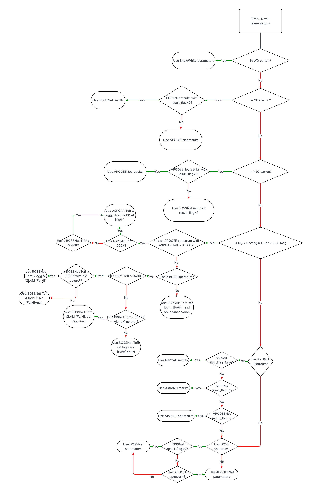
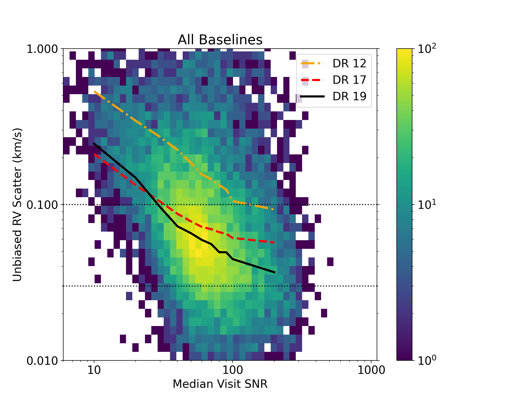
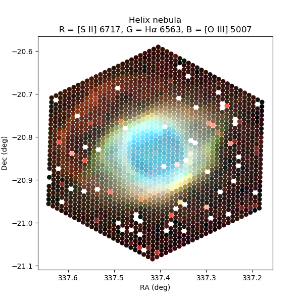

$\newcommand{\ensuremath}{}$
$\newcommand{\xspace}{}$
$\newcommand{\object}[1]{\texttt{#1}}$
$\newcommand{\farcs}{{.}''}$
$\newcommand{\farcm}{{.}'}$
$\newcommand{\arcsec}{''}$
$\newcommand{\arcmin}{'}$
$\newcommand{\ion}[2]{#1#2}$
$\newcommand{\textsc}[1]{\textrm{#1}}$
$\newcommand{\hl}[1]{\textrm{#1}}$
$\newcommand{\footnote}[1]{}$
$\newcommand{\teff}{T_{\mathrm{eff}}}$
$\newcommand{\Teff}{T_{\mathrm{eff}}}$
$\newcommand{\logg}{log~g}$
$\newcommand{\feh}{[Fe/H]}$
$\newcommand{\oh}{[O/H]}$
$\newcommand{\mgh}{[Mg/H]}$
$\newcommand{\kms}{km~s^{-1}}$
$\newcommand{\vsini}{V\sin{i}}$
$\newcommand{\vmicro}{\xi}$
$\newcommand{\afe}{[\alpha/Fe]}$
$\newcommand{\jmk}{(J-K_{s})}$
$\newcommand{\Ks}{K_{s}}$
$\newcommand{\fout}{f_\mathrm{out}}$
$\newcommand{\Gmk}{(G-K_s)}$
$\newcommand{\MK}{\mathrm{M}_{\mathrm{K_s}}}$
$\newcommand{\Mgrad}{\Delta[Fe/H]/\DeltaR}$
$\newcommand{\mygrad}{-0.066}$
$\newcommand{\Vgrad}{\Delta[Fe/H]/\DeltaZ}$
$\newcommand{\fehex}{\Delta[Fe/H]_{\text{excess}}}$
$\newcommand{\acronym}[1]{{\small{#1}}}$
$\newcommand{\Msun}{M\textsubscript{\(\odot\)}}$
$\newcommand{\project}[1]{\textsl{#1}}$
$\newcommand{\gaia}{\project{Gaia}}$
$\newcommand{\WISE}{\project{WISE}}$
$\newcommand{\tmass}{\project{2MASS}}$
$\newcommand{\thecannon}{\project{The~Cannon}}$
$\newcommand{\thepayne}{\project{The~Payne}}$
$\newcommand{\rave}{\project{\acronym{RAVE}}}$
$\newcommand{\galah}{\project{\acronym{GALAH}}}$
$\newcommand{\ges}{\project{GES}}$
$\newcommand{\apogee}{\project{\acronym{APOGEE}}}$
$\newcommand{\aspcap}{\project{\acronym{ASPCAP}}}$
$\newcommand{\astronn}{\texttt{astroNN}}$
$\newcommand{\lamost}{\project{\acronym{LAMOST}}}$
$\newcommand{\hipparcos}{\project{Hipparcos}}$
$\newcommand{\epic}{\project{K2/EPIC}}$
$\newcommand{\sdss}{\project{\acronym{SDSS}}}$
$\newcommand{\tgas}{\project{\acronym{TGAS}}}$
$\newcommand{\hmodel}{hierarchical model}$
$\newcommand{◦ee}{^{\circ}}$
$\newcommand{\hii}{\hbox{{\rm H}\kern 0.1em{\sc ii}{\rm }}}$
$\newcommand{\sean}[1]{{\color{green} \textbf{#1}}}$
$\newcommand{\chris}[1]{{\color{blue} \textbf{#1}}}$
$\newcommand{\carrie}[1]{{\color{orange}{\textbf{#1}}}}$
$\newcommand{\khcom}[1]{{\color{red}{\textbf{#1}}}}$
$\newcommand{\vdag}{(v)^\dagger}$
$\newcommand$
$\newcommand$
$\newcommand\code{#1}$

# The Nineteenth Data Release of the Sloan Digital Sky Survey 

<mark>Appeared on: 2025-07-10</mark> -  _Submitted to AASJournals. 56 Pages, 9 Tables, 11 Figures_

S. Collaboration, et al. -- incl., <mark>N. Deacon</mark>, <mark>M. Demianenko</mark>, <mark>K. El-Badry</mark>, <mark>M. Häberle</mark>

**Abstract:** Mapping the local and distant Universe is key to our understanding of it. For decades, the Sloan Digital Sky Survey (SDSS) has made a concerted effort to map millions of celestial objects to constrain the physical processes that govern our Universe. The most recent and fifth generation of SDSS (SDSS-V) is organized into three scientific "mappers". Milky Way Mapper (MWM) that aims to chart the various components of the Milky Way and constrain its formation and assembly, Black Hole Mapper (BHM), which focuses on understanding supermassive black holes in distant galaxies across the Universe, and Local Volume Mapper (LVM), which uses integral field spectroscopy to map the ionized interstellar medium in the local group. This paper describes and outlines the scope and content for the nineteenth data release (DR19) of SDSS and the most substantial to date in SDSS-V. DR19 is the first to contain data from all three mappers. Additionally, we also describe nine value added catalogs (VACs) that enhance the science that can be conducted with the SDSS-V data. Finally, we discuss how to access SDSS DR19 and provide illustrative examples and tutorials.

**Figure 6. -** This flowchart contains the decision tree used to determine which pipeline and reported parameters Astra are preferred for an individual unique source (i.e., with a unique SDSS\_ID). (*fig:flow_lite*)

**Figure 2. -** The relationship between the median visit SNR versus the unbiased radial velocity scatter for stars with the following cuts: $T_{\rm eff} < 6250$ K, $\logg \: > 1.5$, and unbiased RV scatter $< 1.0$ km/s. The underlying color map shows the number of stars in each logarithmic 2-dimension bin. Each line shows the median unbiased RV scatter in each SNR bin for SDSS Data Releases 12 (orange dot dashed line), 17 (red dashed line), and 19 (black line). The The data is binned by logarithmic x-coordinate (e.g. 10, 20, 30...100, 200 etc.) The horizontal dotted lines are at 100 m/s and 30 m/s respectively. (*fig:apogeerv*)

**Figure 5. -** Composite red (R), green (G), blue (B) map of the Helix nebula constructed by using spectral windows that capture the three emission lines given in the title. Fibers with known issues have been removed. We include fibers that catch contaminating stars. (*fig:helix*)

