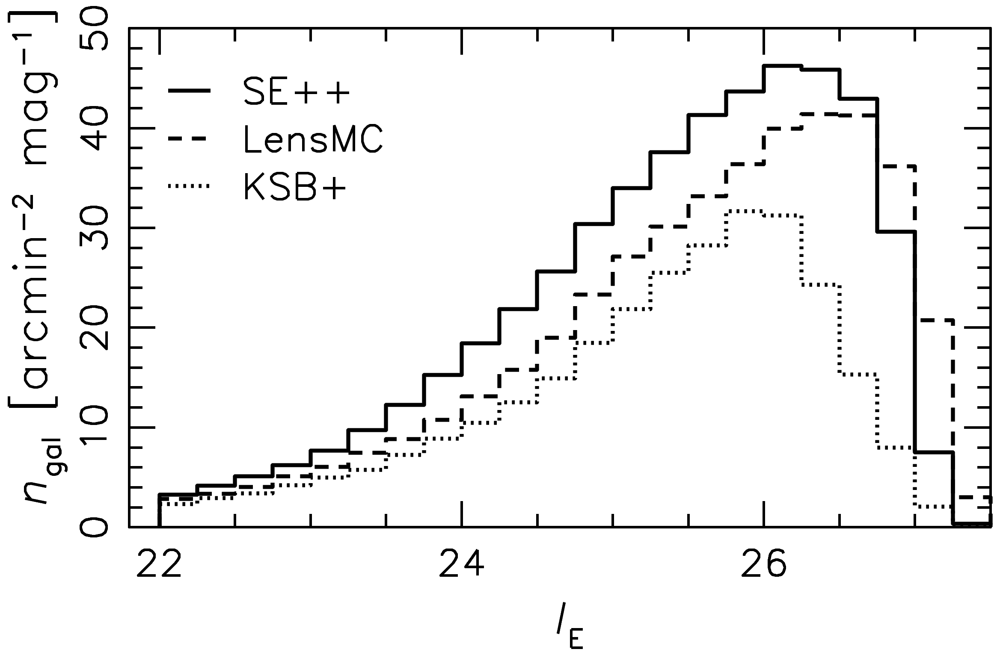
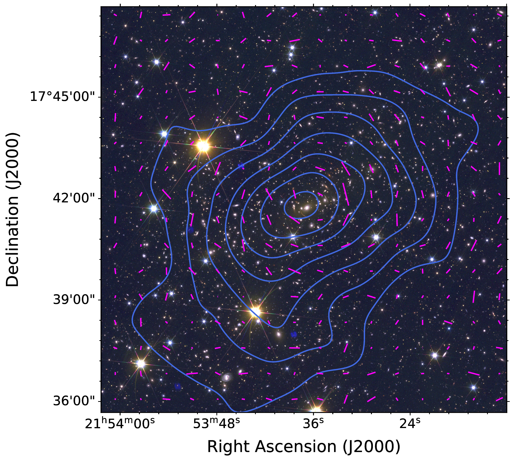
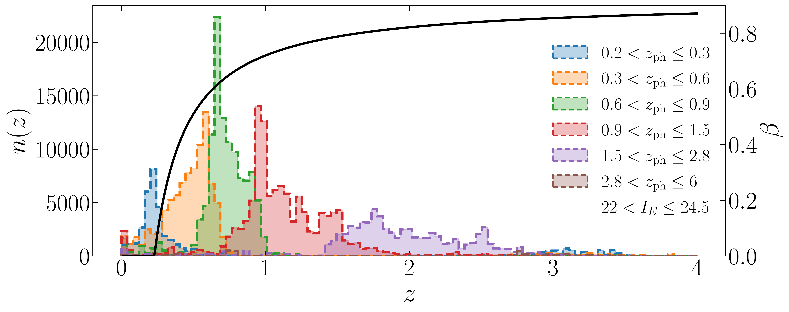
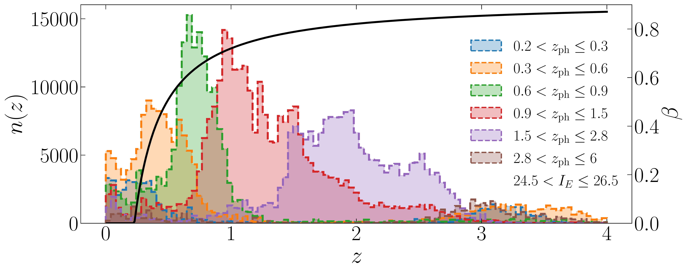

$\newcommand{\ensuremath}{}$
$\newcommand{\xspace}{}$
$\newcommand{\object}[1]{\texttt{#1}}$
$\newcommand{\farcs}{{.}''}$
$\newcommand{\farcm}{{.}'}$
$\newcommand{\arcsec}{''}$
$\newcommand{\arcmin}{'}$
$\newcommand{\ion}[2]{#1#2}$
$\newcommand{\textsc}[1]{\textrm{#1}}$
$\newcommand{\hl}[1]{\textrm{#1}}$
$\newcommand{\footnote}[1]{}$
$\newcommand{\mat}[1]{\tens{#1}}$
$\newcommand{\comm}[1]{\textcolor{red}{#1}}$
$\newcommand{\orcid}[1]$
$\newcommand{\pdr}{PDR}$

# $\Euclid$: Early Release Observations. Weak gravitational lensing analysis of Abell 2390$\thanks{This paper is published on behalf of the Euclid Consortium.}$

<mark>Appeared on: 2025-07-11</mark> -  _This paper is published on behalf of the Euclid Consortium. 28 pages, 27 figures, 7 tables. Submitted to A&A_

T. Schrabback, et al. -- incl., <mark>K. Jahnke</mark>

**Abstract:** The $\Euclid$ space telescope of the  European Space Agency (ESA) is designed to provide sensitive and accurate measurements of weak gravitational lensing distortions over wide areas on the sky.   Here we present a weak gravitational lensing analysis of early $\Euclid$ observations obtained for the field around the massive galaxy cluster Abell 2390 as part of the $\Euclid$ Early Release Observations programme.   We conduct   galaxy shape measurements   using three independent   algorithms ( \texttt{LensMC} , \texttt{KSB+} , and \texttt{SourceXtractor++} ).  Incorporating multi-band photometry from $\Euclid$ and Subaru/Suprime-Cam,  we estimate photometric  redshifts to preferentially select background sources from tomographic redshift bins,  for which we calibrate the redshift distributions using the self-organising map approach and  data from the Cosmic Evolution Survey (COSMOS).  We quantify the residual cluster member contamination and correct for it in bins of photometric redshift and magnitude using their source density profiles, including corrections for source obscuration and magnification. We reconstruct the cluster mass distribution and jointly fit the tangential reduced shear profiles of the different tomographic binswith spherical Navarro--Frenk--White profile predictions to constrain the cluster mass, finding consistent results for the three shape catalogues and good agreement with earlier measurements.        As an important validation test       we compare these joint constraints to mass measurements obtained individually for the different tomographic bins,finding good consistency.    More detailed    constraints on the cluster properties are presented in a companion paper    that additionally incorporates strong lensing measurements.    Our analysis provides a first demonstration of the outstanding capabilities of $\Euclid$ for tomographic  weak lensing measurements.

**Figure 6. -** Number density of objects in the \texttt{LensMC}(dashed),  \texttt{SE++}(solid), and \texttt{KSB+}(dotted) weak lensing source catalogues, computed
within the central
$0\fdg555 \times 0\fdg555$
of the VIS stack, after applying shear selection cuts and removal of objects in masked areas, but without applying photometric redshift selections. (*fig:count_joint*)

**Figure 26. -** As Fig.\thinspace\ref{fig:image_mass_overlay_lensMC}, but employing the \texttt{KSB+} shear catalogue.  (*fig:image_mass_overlay_KSB*)

**Figure 5. -** Redshift distributions for each of our redshift and magnitude bins using the \texttt{SE++} shear weights. The upper panel shows the distributions for the magnitude range $22<\IE<24.5$, and the lower panel for the range $24.5<\IE<26.5$. The black curve shows the geometric lensing efficiency $\beta(z)$, with the corresponding axis plotted on the right. (*fig:nz*)

