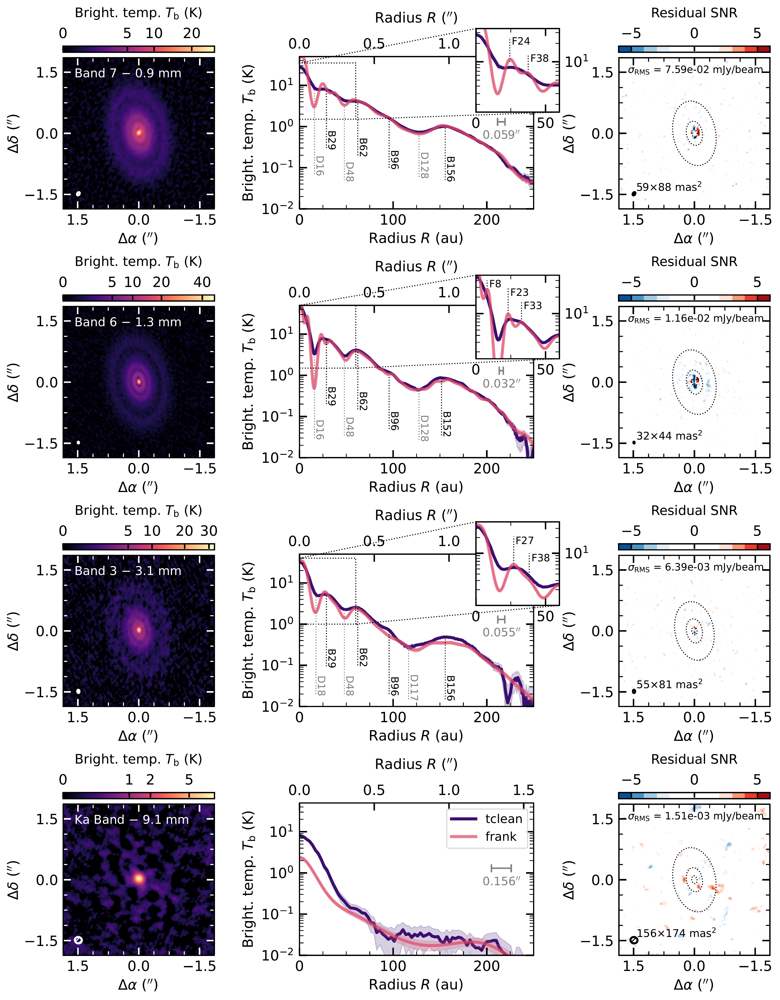
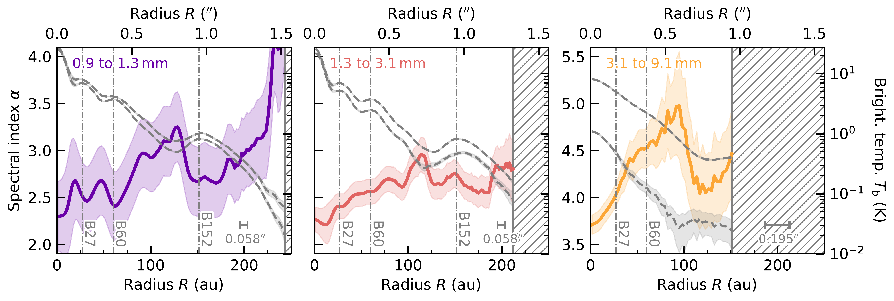
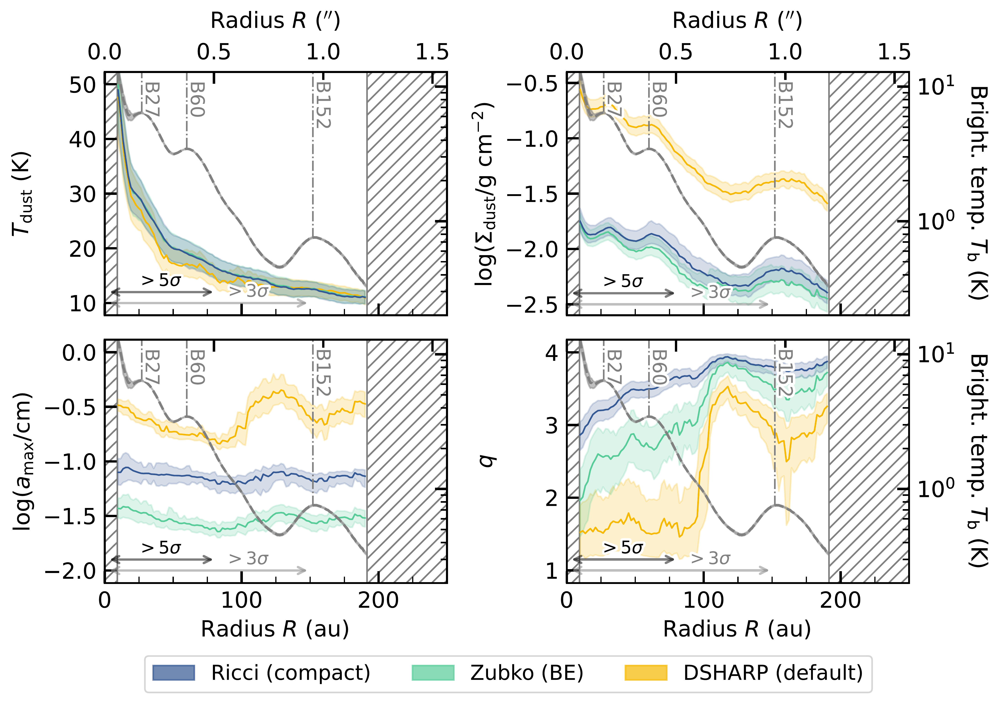

$\newcommand{\ensuremath}{}$
$\newcommand{\xspace}{}$
$\newcommand{\object}[1]{\texttt{#1}}$
$\newcommand{\farcs}{{.}''}$
$\newcommand{\farcm}{{.}'}$
$\newcommand{\arcsec}{''}$
$\newcommand{\arcmin}{'}$
$\newcommand{\ion}[2]{#1#2}$
$\newcommand{\textsc}[1]{\textrm{#1}}$
$\newcommand{\hl}[1]{\textrm{#1}}$
$\newcommand{\footnote}[1]{}$
$\newcommand{\arraystretch}{1.25}$
$\newcommand{\arraystretch}{1.25}$
$\newcommand{\arraystretch}{1.25}$
$\newcommand{\arraystretch}{1.25}$
$\newcommand{\arraystretch}{1.25}$
$\newcommand{\arraystretch}{1.25}$
$\newcommand\orcid{#1}$

# Multi-frequency analysis of the ALMA and VLA high resolution continuum observations of the substructured disc around CI Tau: Preference for sub-mm-sized low-porosity amorphous carbonaceous grains

<mark>Appeared on: 2025-07-14</mark> -  _43 pages, 23 figures, 6 tables. Accepted for publication on A&A_

<mark>F. Zagaria</mark>, et al.

**Abstract:** We present high angular resolution ( $50 {\rm mas}$ ) and sensitivity Atacama Large Millimeter/submillimeter Array (ALMA) Band 3 ( $3.1 {\rm mm}$ ) and Very Large Array (VLA) Ka Band ( $9.1 {\rm mm}$ ) observations of the multi-ringed disc around the $3 {\rm Myr}$ -old solar-mass star CI Tau. These new data were combined with similar-resolution archival ALMA Band 7 ( $0.9 {\rm mm}$ ) and 6 ( $1.3 {\rm mm}$ ) observations, and new and archival VLA Q ( $7.1 {\rm mm}$ ), Ku ( $2.0 {\rm cm}$ ), X ( $3.0 {\rm cm}$ ), and C Band ( $6.0 {\rm cm}$ ) photometry to study the properties of dust in this system. At wavelengths $\leq3.1 {\rm mm}$ the continuum emission from CI Tau is very extended ( $\geq200 {\rm au}$ ) and highly substructured (with three gaps, four rings, and two additional gap-ring pairs identified by non-parametric visibility modelling). Instead, the VLA Ka Band data are dominated by a centrally peaked bright component, only partially ( $\leq 50\%$ ) due to dust emission, surrounded by a marginally-detected, faint and smooth halo. We fitted the ALMA and VLA Ka Band data together, adopting a physical model that accounts for the effects of dust absorption and scattering. For our fiducial dust composition ("Ricci" opacities), we retrieved a flat maximum grain size distribution across the disc radius, with $a_{\rm max}=(7.1\pm0.8)\times10^{-2} {\rm cm}$ , that we tentatively attributed to fragmentation of fragile dust or bouncing. We tested, for the first time, the dependence of our results on the adopted dust composition model to assess which mixture can best reproduce the observations. We found that the "Ricci" opacities work better than the traditionally adopted "DSHARP" ones, while graphite-rich mixtures perform significantly worse.        We also show that, for our fiducial composition, the data prefer low porosity ( $\leq70\%$ ) grains. This is in contrast with recent claims of highly porous aggregates in younger sources, which we tentatively justified by time-dependent compaction at the fragmentation or bouncing barrier. Our results on composition and porosity are in line with constraints from disc population synthesis models and naturally arise from CI Tau's peculiar spectral behaviour (i.e., the abrupt steepening of its spectral index at wavelengths longer than $3.1 {\rm mm}$ ), making this disc a unique target to characterise the properties of disc solids, thus ideal for deeper cm-wavelength observations and follow-up dust polarisation studies.

**Figure 1. -** From top to bottom CI Tau's ALMA Band 7, 6, 3 and VLA Ka Band continuum emission. Left column: \texttt{CLEAN}ed images. Central column: azimuthally averaged surface brightness radial profiles, in violet for \texttt{tclean} images and purple for the best fit \texttt{frank} profiles (a point-source component was subtracted from the 3.1 and $9.1 {\rm mm}$ visibilities before fitting). Right column: \texttt{frank} fit residual images; dotted ellipses mark the location of the dark rings in the \texttt{CLEAN}ed images. The synthesised \texttt{CLEAN} beam is shown as an ellipse in the bottom left corner of each image, and as a segment with FWHM equal to the beam minor axis, in each radial profile subplot. (*fig:1*)

**Figure 3. -** Spectral index radial profiles (solid lines) and their $1\sigma$ uncertainty (shaded areas). The hatched regions mark those locations where ${\rm SNR}\leq5$(left and central panel) and 3 (right panel), for at least one of the emission profiles. The dashed grey lines in each panel display the surface brightness radial profiles combined to determine the spectral index. (*fig:3*)

**Figure 17. -** Same as in \autoref{fig:4} but showing a comparison among the best fit results for different compositions: "Ricci (compact)" in blue, "Zubko (BE)" in turquoise, and "DSHARP (default)" in yellow. The highest quality (i.e., lowest $\chi^2$) fits, obtained adopting the "Ricci (compact)" and "Zubko (BE)" optical properties, provide similar marginalised posterior distributions for all the parameters (within a factor of 3 for $a_{\rm max}$ and 2 for $\Sigma_{\rm dust}$). (*fig:A12*)

