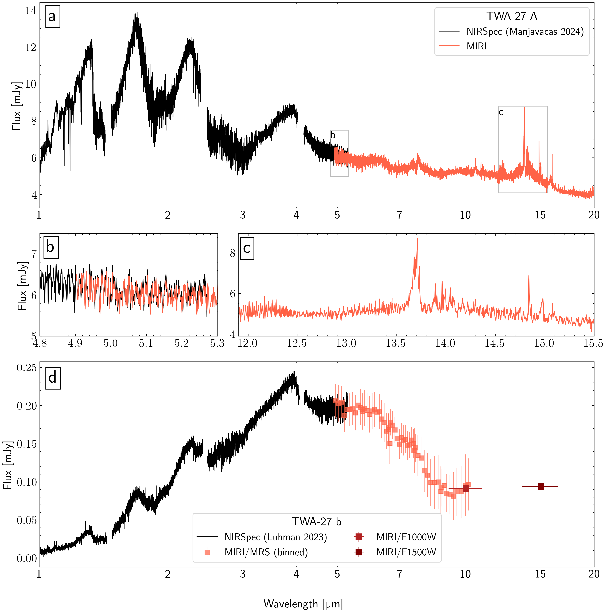
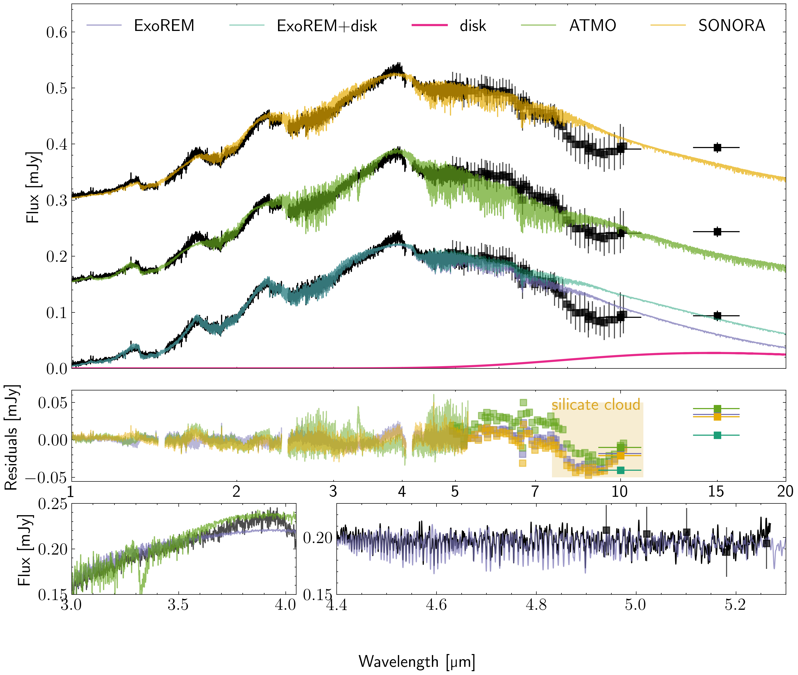

$\newcommand{\ensuremath}{}$
$\newcommand{\xspace}{}$
$\newcommand{\object}[1]{\texttt{#1}}$
$\newcommand{\farcs}{{.}''}$
$\newcommand{\farcm}{{.}'}$
$\newcommand{\arcsec}{''}$
$\newcommand{\arcmin}{'}$
$\newcommand{\ion}[2]{#1#2}$
$\newcommand{\textsc}[1]{\textrm{#1}}$
$\newcommand{\hl}[1]{\textrm{#1}}$
$\newcommand{\footnote}[1]{}$
$\newcommand{\todo}[1]{\textcolor{red}{#1}}$
$\newcommand{\danny}{\textcolor{green}}$
$\newcommand{\mmc}{\textcolor{purple}}$
$\newcommand{\mum}{\mum\xspace}$
$\newcommand{\ama}[1]{\textcolor{red}{\rm #1^{(\rm AMA)}}}$
$\newcommand{\Lsun}{L_\odot}$
$\newcommand{\Msun}{M_\odot}$
$\newcommand{\MJ}{M_\mathrm{J}}$
$\newcommand{\Mp}{M_\mathrm{p}}$
$\newcommand{\Macc}{\dot{M}_\mathrm{acc}}$
$\newcommand{\RJ}{R_\mathrm{J}}$
$\newcommand{\Rp}{R_\mathrm{p}}$
$\newcommand{\Teff}{T_{\text{eff}}}$
$\newcommand{\MJyr}{\MJ \mathrm{yr}^{-1}}$
$\newcommand{\Rd}{R_\mathrm{dust}}$
$\newcommand{\Rcav}{R_\mathrm{cav}}$
$\newcommand{\Rout}{R_\mathrm{out}}$
$\newcommand{\Rg}{R_\mathrm{gas}}$
$\newcommand{\Lacc}{L_\mathrm{acc}}$
$\newcommand{\LHa}{L_\mathrm{H\alpha}}$
$\newcommand{\FHa}{F_\mathrm{H\alpha}}$
$\newcommand{\AHa}{A_\mathrm{H\alpha}}$
$\newcommand{\Av}{A_\mathrm{V}}$
$\newcommand{\MaccAv}{\overline{\dot{M}_\mathrm{acc}}}$
$\newcommand{\c2h2}{C_\mathrm{2}H_\mathrm{2}\xspace}$
$\newcommand{\c6h6}{C_\mathrm{6}H_\mathrm{6}\xspace}$
$\newcommand{\c2h6}{C_\mathrm{2}H_\mathrm{6}\xspace}$
$\newcommand{\co2}{CO_\mathrm{2}\xspace}$

# JWST/MIRI observations of the young TWA 27 system: hydrocarbon disk chemistry, silicate clouds, evidence for a CPD

<mark>Appeared on: 2025-07-15</mark> -  _Submitted to Astronomy&Astrophysics_

P. Patapis, et al. -- incl., <mark>E. Matthews</mark>, <mark>T. Henning</mark>, <mark>J. Bouwman</mark>, <mark>S. Scheithauer</mark>

**Abstract:** The Mid-Infrared Instrument (MIRI) on board the James Webb Space Telescope (JWST) enables the characterisation of young self-luminous gas giants in a wavelength range previously inaccessible, revealing insights into physical processes of the gas, dust, and clouds. We aim to characterise the young planetary system TWA 27 (2M1207) in the mid-infrared (MIR), revealing the atmosphere and disk spectra of the M9 brown dwarf TWA 27A and its L6 planetary mass companion TWA 27b. We obtain data from the MIRI Medium Resolution Spectrometer (MRS) from 4.9 to 20 $\mum$ , and MIRI Imaging in the F1000W and F1500W filters. We apply high-contrast-imaging data processing methods in order to extract the companion spectral energy distribution up to 15 $\mum$ at a separation of 0 $\farcs$ 78 and contrast of 60. Using published spectra from JWST/NIRSpec, we analyse the 1-20 $\mum$ spectra with self-consistent atmosphere grids, and the molecular disk emission from TWA 27A with 0D slab models. We find that the atmosphere of TWA 27A is well fitted with the \texttt{BT-SETTL} model of effective temperature $T_{\text{eff}}\sim 2780$ K, $\mathrm{log} g \sim 4.3$ , and a blackbody component of $\sim$ 740 K for the circumstellar disk inner rim. The disk consists of at least 11 organic molecules, and neither water or silicate dust emission are detected.   The atmosphere of the planet TWA 27b matches with a $T_{\text{eff}}\sim$ 1400 K low gravity model when adding extinction, with the \texttt{ExoREM} grid fitting the best. MIRI spectra and photometry for TWA 27b reveal a silicate cloud absorption feature between 8-10 $\mum$ , and evidence (>5 $\sigma$ ) for infrared excess at 15 $\mum$ that is consistent with predictions from circumplanetary disk emission. The MIRI observations present novel insights into the young planetary system TWA 27, showing a diversity of features that can be studied to understand the formation and evolution of circumplanetary disks and young dusty atmospheres.

**Figure 2. -** Complete 1-20 $\mum$ spectra of TWA 27A (a) and TWA 27b (d) with JWST/NIRSpec and JWST/MIRI. Details of TWA 27A are presented in panel (b) for the instrument overlap between NIRSpec and MIRI, and in panel (c) for the molecular emission of the TWA 27A disk. Error bars for the NIRSpec spectra, and MIRI spectrum of TWA 27A are not visible. (*fig:twa-27-A*)

**Figure 4. -** Model fit to TWA 27A. Top: data and model fit using the \texttt{BT-SETTL} grid. The atmosphere model is shown in gray, the blackbody disk component in red, and the combined model in gold. Middle: residuals between data and model in physical units (mJy). Bottom: details of model fit for two regions of the spectrum. (*fig:twa-27-A_modelfit*)

**Figure 5. -** Model fit to TWA 27b. Top: data and model fit using the \texttt{ATMO}, \texttt{ExoREM}, and \texttt{SONORA} grids, including extinction and an offset of 0.15 mJy for visibility. In order to explain the 15 $\mum$ IR excess due to a cold disk a blackbody component (350 K) is shown in magenta and added to the \texttt{ExoREM} flux. Middle: residuals between data and model in physical units (mJy). The discrepancy of data and models at 7.5-10 $\mum$ is most likely attributed to a silicate cloud. Bottom: details of model fit for two regions of the spectrum, including the methane and CO bands, only showing \texttt{ExoREM}. (*fig:twa-27-b_modelfit*)

