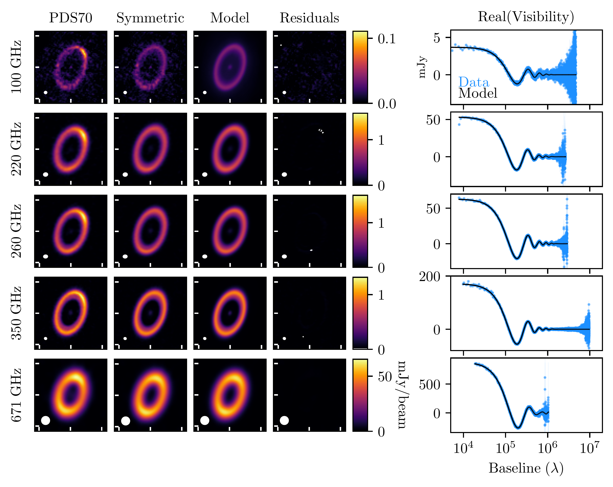
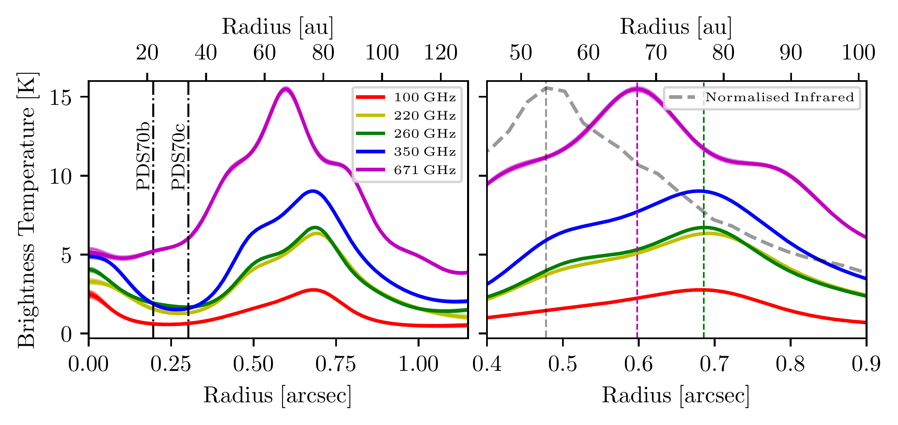
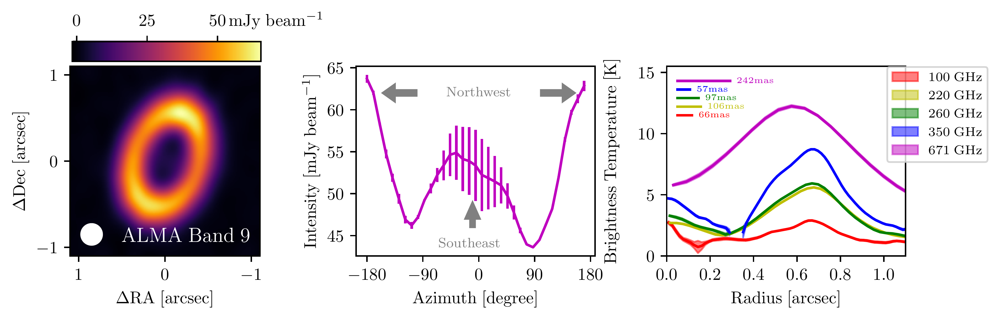

$\newcommand{\ensuremath}{}$
$\newcommand{\xspace}{}$
$\newcommand{\object}[1]{\texttt{#1}}$
$\newcommand{\farcs}{{.}''}$
$\newcommand{\farcm}{{.}'}$
$\newcommand{\arcsec}{''}$
$\newcommand{\arcmin}{'}$
$\newcommand{\ion}[2]{#1#2}$
$\newcommand{\textsc}[1]{\textrm{#1}}$
$\newcommand{\hl}[1]{\textrm{#1}}$
$\newcommand{\footnote}[1]{}$
$\newcommand{\anibal}[1]{{\color{orange} [AS: #1]}}$
$\newcommand{\thebibliography}{\DeclareRobustCommand{\VAN}[3]{##3}\VANthebibliography}$

# Leaky dust trap in the PDS 70 disk revealed by ALMA Band 9 observations

<mark>Appeared on: 2025-07-15</mark> -  _12 pages_

A. Sierra, et al. -- incl., <mark>M. Benisty</mark>, <mark>K. Doi</mark>, <mark>D. Fasano</mark>

**Abstract:** We present new observations of the PDS 70 disc obtained with the Atacama Large Millimeter/sub-millimeter Array (ALMA) in Band 9 (671 GHz) at 0.242 $^{\prime\prime}$ resolution, which provide valuable insights into the spatial distribution of sub-millimetre grains in the disc. The data reveal a ring-like morphology, with a radial peak located between those previously observed at infrared wavelengths and longer millimetre observations. Additionally, we detect a tentative outer shoulder in Band 9 that is not observed at longer wavelengths. These findings suggest that small grains ( $\sim 100 \mu$ m) traced by Band 9 may be escaping from the pressure bump both radially inwards and outwards, or may be tracing different disc layers than those probed at longer wavelengths.A multi-wavelength analysis of the disc at millimetre wavelengths and the best fit to the spectral energy distribution shows the presence of centimetre grains around the ring location, where the dust surface density also peaks, compatible with dust trap models. The grain size in the disc cavity is not well constrained but is consistent with grains as small as 10 $\mu$ m, supporting the hypothesis that small dust grain filters through the cavity.We use dust evolution models to demonstrate that a turbulent viscosity of $\alpha \gtrsim 10^{-3}$ allows small grains to filter through the disc gap, while $\alpha \lesssim 5 \times 10^{-3}$ is required to retain large grains in the pressure bump. The Band 9 observations of PDS 70 validate theoretical models and confirm the presence of pebble flux through the disc gap.

**Figure 8. -** Visibility modelling of the disc around PDS 70 at different wavelengths.
    Left: tclean image of the dust continuum data. Middle left: tclean image of the symmetric dust continuum data. Middle right: tclean image of the Frankenstein model. Right: tclean map of the residual visibilities (Symmetric - Model). The white iso-contour show the region with residuals above/below $\pm 5\sigma$.
    The units of all colour bars are mJy beam$^{-1}$.
    Right panels show the real part of the continuum visibilities (blue dots) as a function of the uv-distance (baseline). The flux units in all right panels are mJy.
    The solid black line shows the visibility Frankenstein model.
     (*fig:visibility_modelling*)

**Figure 9. -** Left: Radial profiles of the brightness temperature obtained from the visibility fit at different ALMA wavelengths (see colour code). The vertical dashed-dotted lines indicate the orbits of PDS 70b, and PDS 70c.
    Right: Zoom-in around the ring peaks. The grey dashed line shows the normalised brightness radial profile from infrared observations at H band ($\lambda = 1.625 \mu$m). The radial positions of the peaks are shown as vertical dashed lines. (*fig:BrightnessTemperature*)

**Figure 7. -** Left: Dust continuum image at ALMA Band 9 (671 GHz).
    Middle: Azimuthal profile around the ring. The arrows indicate the azimuth of the northwest and southeast major axes.
    Right: Brightness temperature radial profile of PDS 70 extracted from the ALMA images at different wavelengths: 100 GHz (red), 220 GHz (yellow), 260 GHz (green), 350 GHz (blue), 671 GHz (purple). The horizontal lines show the angular resolution for each data set. (*fig:continuum-map*)

