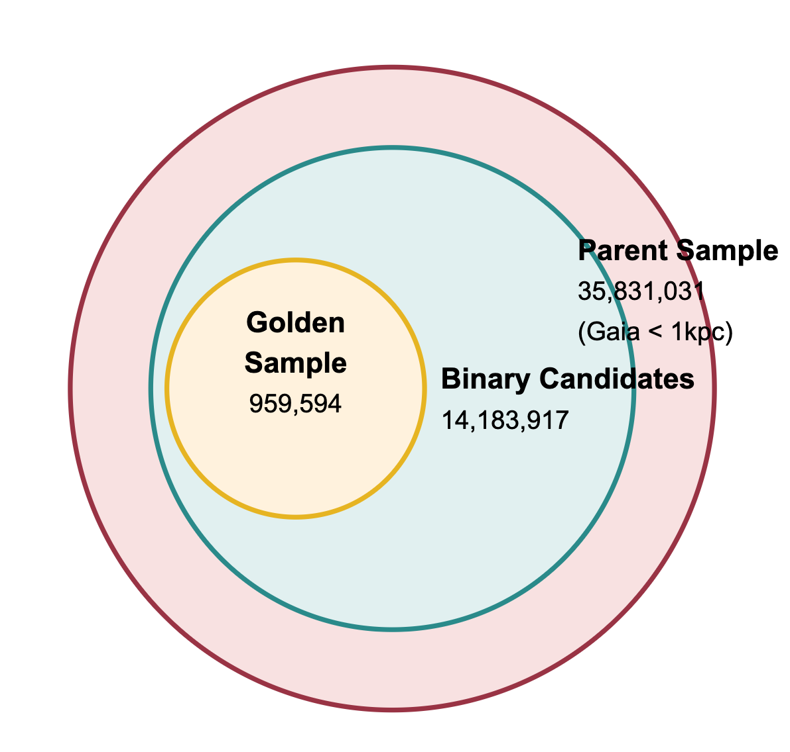
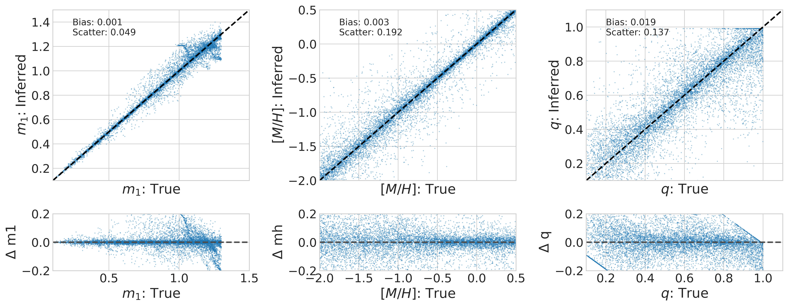
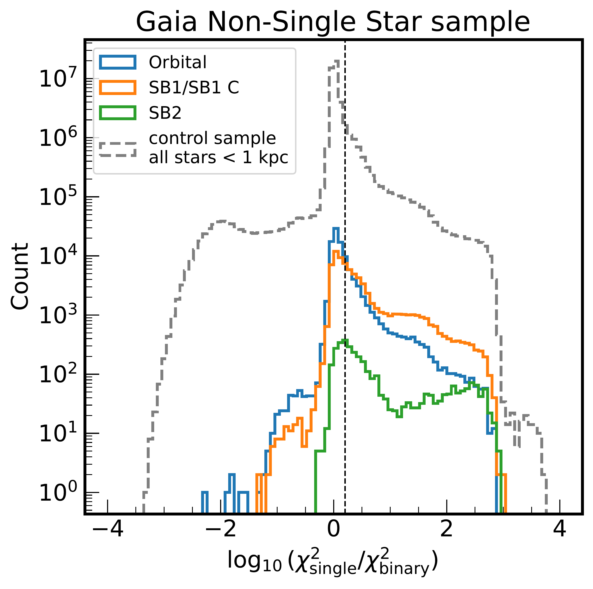
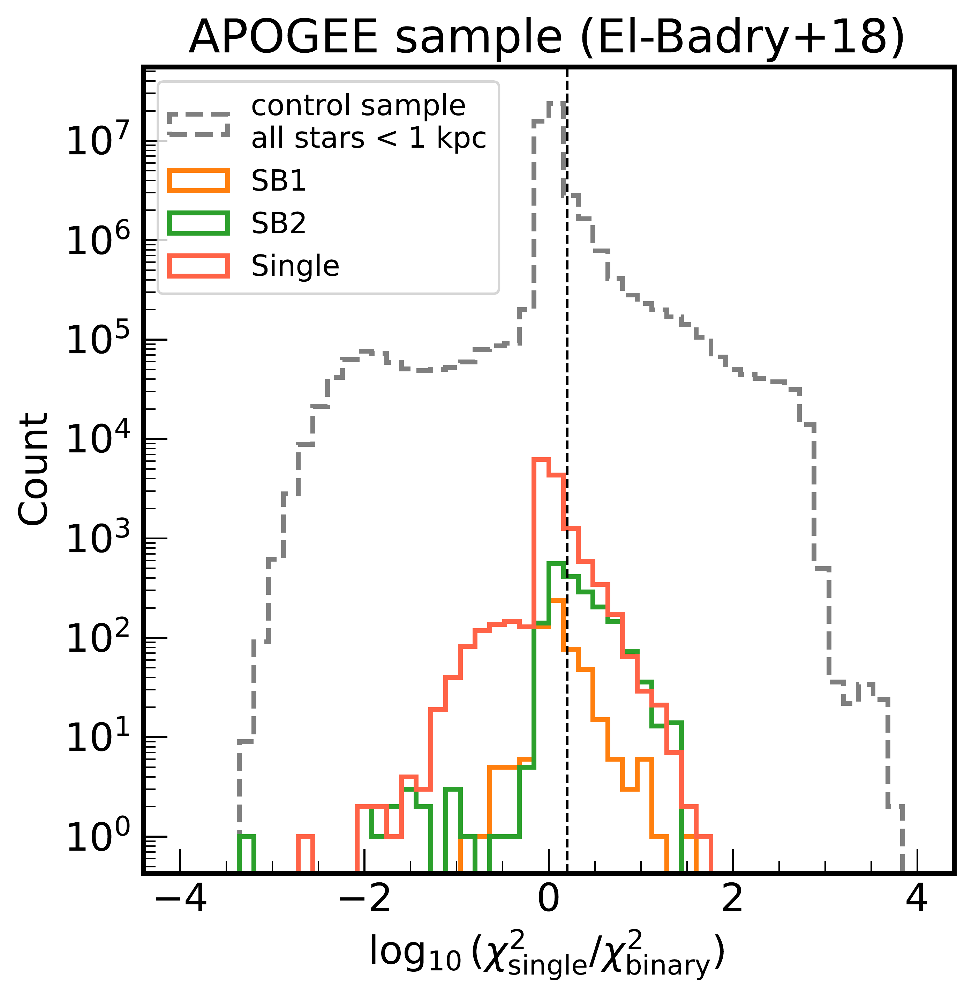
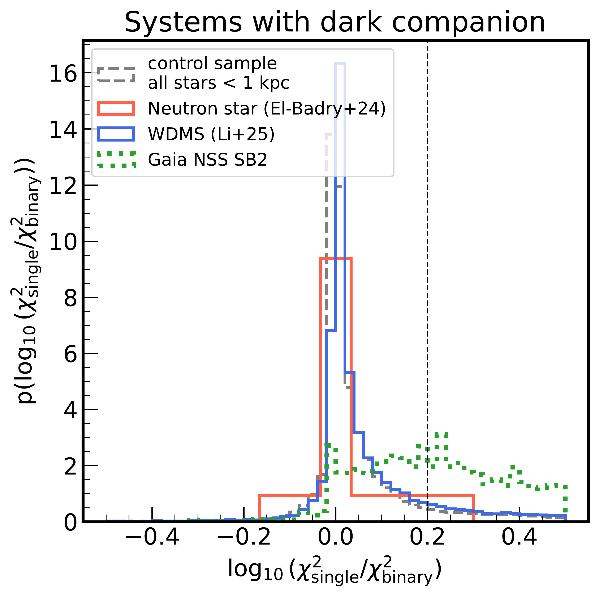

$\newcommand{\ensuremath}{}$
$\newcommand{\xspace}{}$
$\newcommand{\object}[1]{\texttt{#1}}$
$\newcommand{\farcs}{{.}''}$
$\newcommand{\farcm}{{.}'}$
$\newcommand{\arcsec}{''}$
$\newcommand{\arcmin}{'}$
$\newcommand{\ion}[2]{#1#2}$
$\newcommand{\textsc}[1]{\textrm{#1}}$
$\newcommand{\hl}[1]{\textrm{#1}}$
$\newcommand{\footnote}[1]{}$
$\newcommand{\photmoh}{[M/H]_{\rm phot}}$
$\newcommand{\moh}{[M/H]_{\rm phot}}$
$\newcommand{\msun}{M_{\odot}}$
$\newcommand{\singlechi}{\chi^2_{\mathrm{single}}}$
$\newcommand{\binarychi}{\chi^2_{\mathrm{binary}}}$
$\newcommand{\chisqimprove}{\log_{10}(\chi^2_{\text{single}} / \chi^2_{\text{binary}})}$
$\newcommand{\Gaia}{\textit{Gaia}}$
$\newcommand{\jd}[1]{\textcolor{blue}{JD:~#1}}$
$\newcommand{\gaia}{\textsl{Gaia}}$

# Millions of Main-Sequence Binary Stars from Gaia BP/RP Spectra

<mark>Appeared on: 2025-07-15</mark> -  _14 pages, 15 figures, submitted to A&A_

<mark>J. Li</mark>, et al. -- incl., <mark>H.-W. Rix</mark>, <mark>J. Müller-Horn</mark>, <mark>K. El-Badry</mark>, <mark>R. Seeburger</mark>, <mark>X. Zhang</mark>

**Abstract:** We present an extensive catalog of likely main-sequence binary stars systems (MSMS), derived from Gaia Data Release 3 BP/RP (XP) spectra through the comparison of single- and binary-star model fits. Leveraging the large sample of low-resolution Gaia XP spectra, we use a neural network to build a forward modeling for spectral luminosities of single-stars, as a function of stellar mass and photometric metallicity. Applying this model to XP spctra, we find that this enables the identification of binaries with mass ratios between 0.5 and 1.0 and flux ratios $>0.1$ as "poor" fits to the data, either in spectral shape or flux normalization. From an initial sample of 35 million stars within 1 kpc, we identify 14 million possible binary candidates, and a high-confidence "golden sample" of 1 million binary systems. This large, homogeneous sample of SED-based binaries enables population studies of luminous MSMS binaries, and -- in conjunction with kinematic or astrometric probes -- permits to identify binaries with dark or dim companions, such as white dwarfs, neutron stars and black hole candidates, improving our understanding of compact object populations.

**Figure 6. -** Venn diagram showing the hierarchical relationship between our sample selections.
The parent sample consists of 35 million stars within 1 kpc from Gaia DR3.
From this population, we identify 14 million binary candidates based on spectral model fitting criteria.
The golden sample is identified through selection criteria in Table \ref{tab:golden_sample}.
 (*fig:venn*)

**Figure 13. -** Validation of parameter recovery for the MSMS mock data. Top row: Comparison between true and inferred values for primary mass ($m_1$, left), $\moh$([M/H], middle), and mass ratio ($q$, right).
    The black dashed lines show the one-to-one relation, while blue points represent individual systems in our validation sample. Inset text shows the median bias and scatter for each parameter. Bottom row: Residuals (inferred minus true values) as a function of the true parameter values, highlighting the consistency of our parameter recovery across the full range of stellar properties.
    Primary masses are recovered with high precision (scatter of 0.049 $M_\odot$), while $\moh$ show broader but still reliable recovery (scatter of 0.192 dex). Mass ratios are determined with good precision (scatter of 0.137) with a small positive bias (0.019) at low $q$ values because of the detection sensitivity limitations.
    The hard limits in the right panel result from enforcing $q < 1$.
     (*fig:compare_qfit*)

**Figure 15. -** Distribution of the logarithmic $\chi^2$ improvement, $\log_{10}(\chi^2_{\text{single}} / \chi^2_{\text{binary}})$, showing the statistical evidence favouring binary over single-star spectral models.
Left panel: Distributions for Gaia DR3 Non-Single Star (NSS) sources: systems with orbital solutions (blue), single-lined spectroscopic binaries (SB1/SB1C; orange), and double-lined spectroscopic binaries (SB2; green).
Right panel: Distributions for specialized populations with likely dark companions: neutron star binaries  ([ and El-Badry 2024]()) (red) and white dwarf-main sequence binaries (WDMS)  ([Li, Ting and Rix 2025]()) (blue). The Gaia DR3 NSS SB2 sample (green dotted line) is shown for reference.
Common elements in each panel: The distribution for all stars within 1 kpc (black dashed line) acts as a control representing the general population. A vertical dashed line marks 0.2 for reference. Higher values of the $\chi^2$ improvement indicate stronger evidence for binarity; known binaries typically show significant positive values. (*fig:chi2_diff_gnss_dark*)

