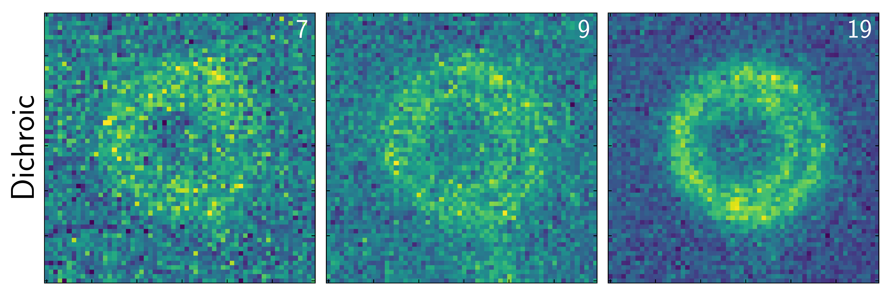
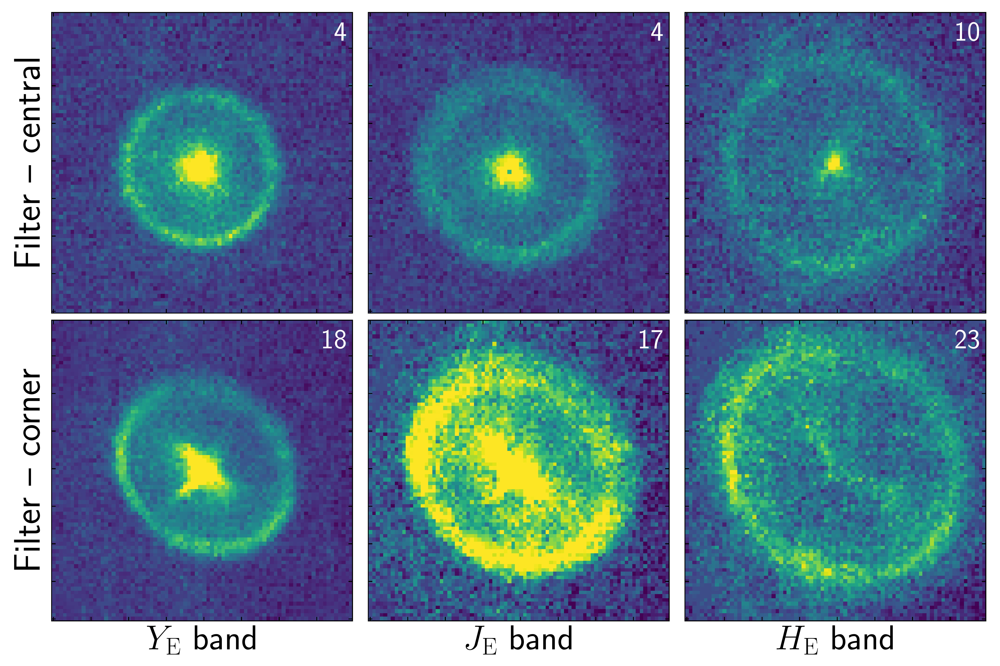
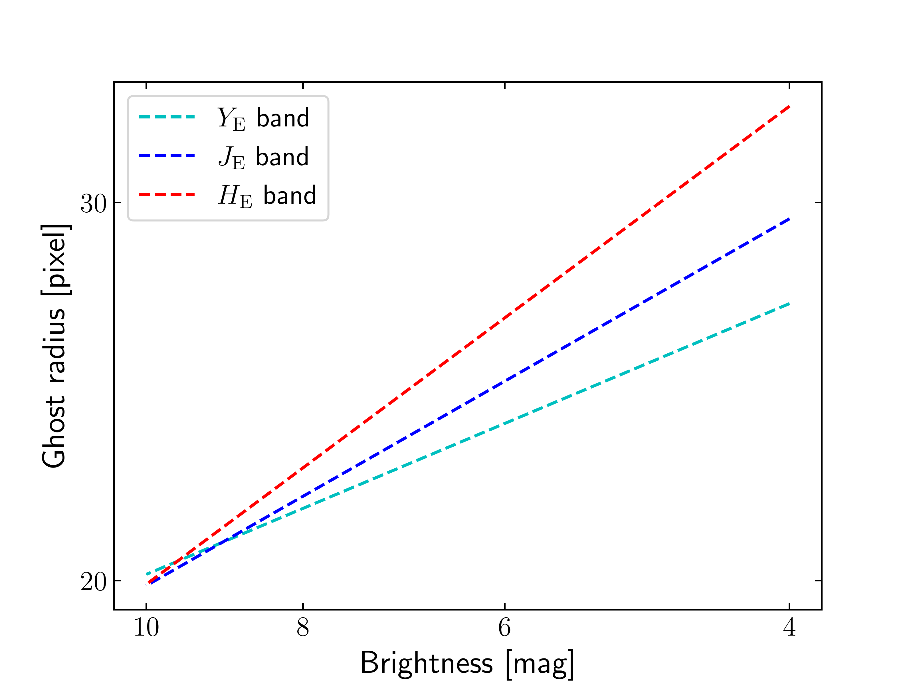
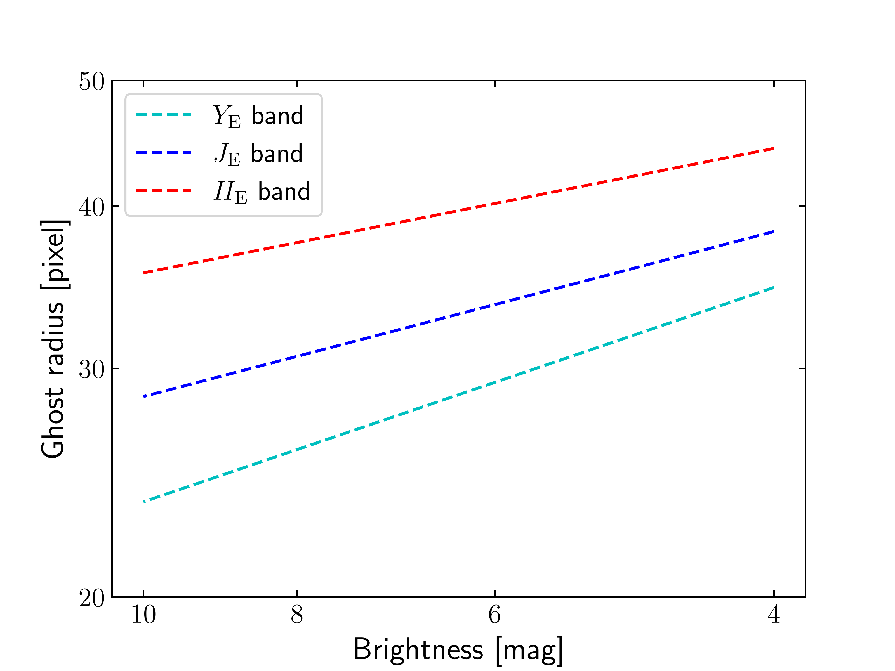
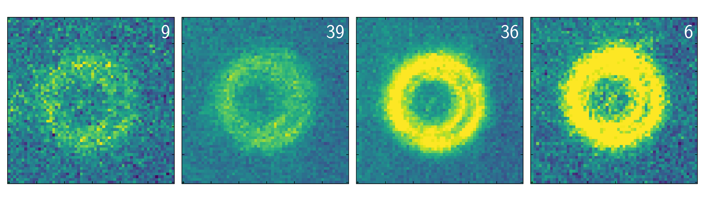
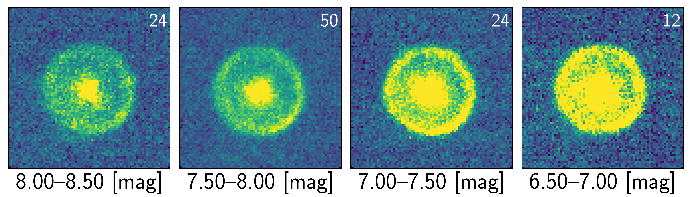

$\newcommand{\ensuremath}{}$
$\newcommand{\xspace}{}$
$\newcommand{\object}[1]{\texttt{#1}}$
$\newcommand{\farcs}{{.}''}$
$\newcommand{\farcm}{{.}'}$
$\newcommand{\arcsec}{''}$
$\newcommand{\arcmin}{'}$
$\newcommand{\ion}[2]{#1#2}$
$\newcommand{\textsc}[1]{\textrm{#1}}$
$\newcommand{\hl}[1]{\textrm{#1}}$
$\newcommand{\footnote}[1]{}$
$\newcommand{\orcid}[1]$

# Euclid: VI. NISP-P optical ghosts

<mark>Appeared on: 2025-07-16</mark> -  _13 pages, 10 figures, submitted_

E. Collaboration, et al. -- incl., <mark>K. Paterson</mark>, <mark>M. Schirmer</mark>, <mark>K. Jahnke</mark>

**Abstract:** The Near-Infrared Spectrometer and Photometer (NISP) onboard $\Euclid$ includes several optical elements in its path, which introduce artefacts into the data from non-nominal light paths. To ensure uncontaminated source photometry, these artefacts must be accurately accounted for. This paper focuses on two specific optical features in NISP's photometric data (NISP-P): ghosts caused by the telescope's dichroic beamsplitter, and the bandpass filters within the NISP fore-optics. Both ghost types  exhibit a characteristic morphology and are offset from the originating stars. The offsets are well modelled using 2D polynomials, with only stars brighter than approximately 10 magnitudes in each filter producing significant ghost contributions. The masking radii for these ghosts depend on both the source-star brightness and the filter wavelength, ranging from 20 to 40 pixels. We present the final relations and models used in the near-infrared (NIR) data pipeline to mask these ghosts for $\Euclid$ 's Quick Data Release (Q1).

**Figure 3. -** Shape of the dichroic ghost (_top row_) and filter ghost (_lower rows_) as a function of waveband. For the dichroic ghosts, images are made from a median combination of 60 $\times$ 60 pixel (18 $\times$ 18$\arcsec$) cutouts, restricted to one region of the FPA and a single magnitude bin. For the filter ghosts, since there is a dependency of the shape on the FPA position, images are made from a median combination of 80 $\times$ 80 pixel (24 $\times$ 24$\arcsec$) cutouts, restricted to either the central region (middle) or a corner region (bottom) of the FPA and a single magnitude bin. The number of cutouts used to create each median is given in the top right of each median cutout. (*fig:wave*)

**Figure 8. -** The radius-magnitude relation, given by the coefficients in \cref{table:rad}, for each filter for the dichroic ghost (_left_) and filter ghost (_right_); described in \cref{sc:Rad_di}. (*fig:rad_mag*)

**Figure 2. -** Appearance of the dichroic ghost (_top row_) and filter ghost (_bottom row_) as a function of source-star brightness. For the dichroic ghosts, images are made from a median combination of 60 $\times$ 60 pixel (18 $\times$ 18$\arcsec$) cutouts, restricted to one region of the FPA for the \HE band. For the filter ghosts, images are made from a median combination of 80 $\times$ 80 pixel (24 $\times$ 24$\arcsec$) cutouts, restricted to the central region of the FPA for the \YE band. The number of cutouts used to create each median is given in the top right of each median cutout. (*fig:flux*)

