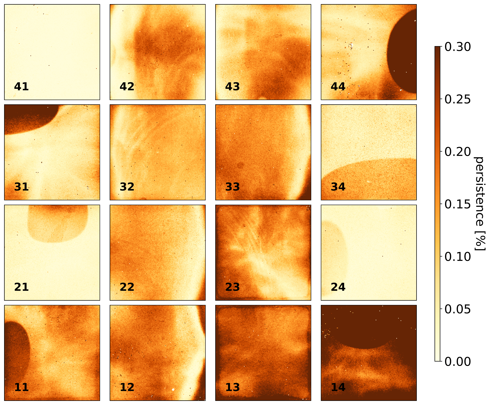
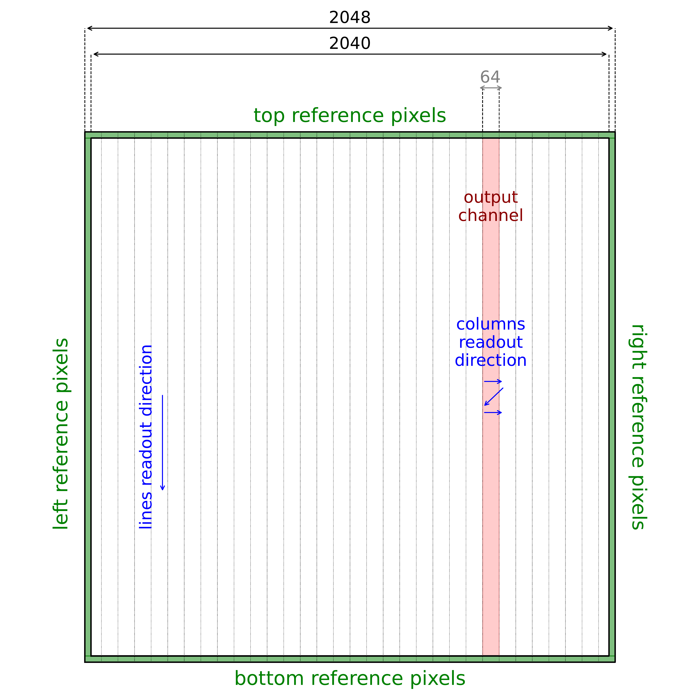
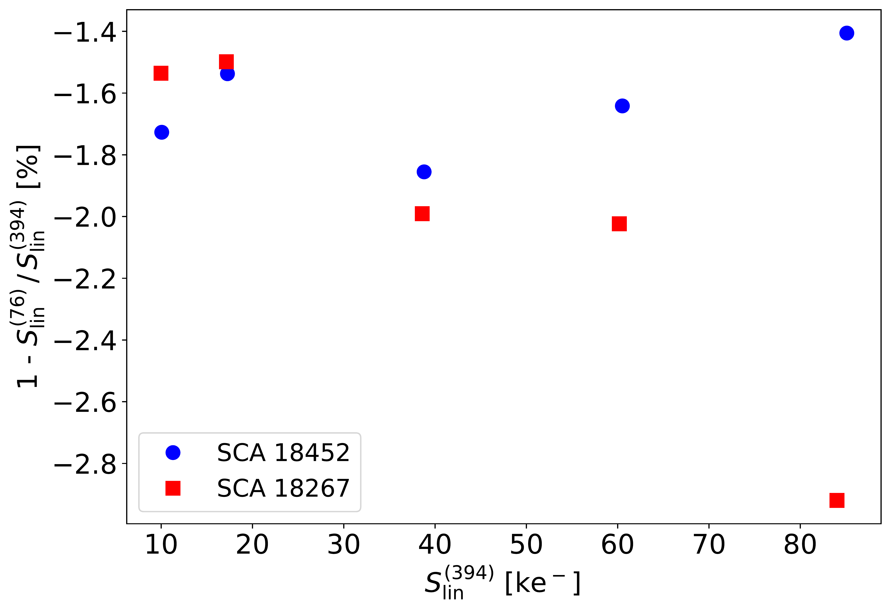

$\newcommand{\ensuremath}{}$
$\newcommand{\xspace}{}$
$\newcommand{\object}[1]{\texttt{#1}}$
$\newcommand{\farcs}{{.}''}$
$\newcommand{\farcm}{{.}'}$
$\newcommand{\arcsec}{''}$
$\newcommand{\arcmin}{'}$
$\newcommand{\ion}[2]{#1#2}$
$\newcommand{\textsc}[1]{\textrm{#1}}$
$\newcommand{\hl}[1]{\textrm{#1}}$
$\newcommand{\footnote}[1]{}$
$\newcommand{\WG}[1]{\textcolor{green}{#1}}$
$\newcommand{\as}[1]{\textcolor{cyan}{#1}}$
$\newcommand{\Ha}{\ensuremath{\text{H}\alpha} }$
$\newcommand{\TBD}[1]{\textcolor{red}{\bf #1}}$
$\newcommand{\orcid}[1]$

# $\Euclid$ preparation: TBD. Overview of $\Euclid$ infrared detector performance from ground tests

<mark>Appeared on: 2025-07-16</mark> -  _22 pages, 20 figures, 4 pages of annexes. Submitted to A&A_

E. Collaboration, et al. -- incl., <mark>K. Jahnke</mark>

**Abstract:** The paper describes the objectives, design and findings of the pre-launch ground characterisation campaigns of the $\Euclid$ infrared detectors. The aim of the ground characterisations is to evaluate the performance of the detectors, to calibrate the pixel response, and to derive the pixel response correction methods. The detectors have been tested and characterised in the facilities set up for this purpose. The pixel properties, including baseline, bad pixels, quantum efficiency, inter pixel capacitance, quantum efficiency, dark current, readout noise, conversion gain, response nonlinearity, and image persistence were measured and characterised for each pixel. We describe in detail the test flow definition that allows us to derive the pixel properties and we present the data acquisition and data quality check software implemented for this purpose. We also outline the measurement protocols of all the pixel properties presented and we provide a comprehensive overview of the performance of the $\Euclid$ infrared detectors as derived after tuning the operating parameters of the detectors.The main conclusion of this work is that the performance of the infrared detectors $\Euclid$ meets the requirements. Pixels classified as non-functioning accounted for less than 0.2 \% of all science pixels. IPC coupling is minimal and crosstalk between adjacent pixels is less than 1 \% between adjacent pixels. 95 \% of the pixels show a QE greater than 80 \% across the entire spectral range of the Euclid mission. The conversion gain is approximately 0.52 ADU/e $^-$ , with a variation less than 1 \% between channels of the same detector. The reset noise is approximately equal to 23 ADU after reference pixels correction. The readout noise of a single frame is approximately $\SI{13}{e^-}$ while the signal estimator noise is measured at 7 e $^-$ in photometric mode and 9 e $^-$ in spectroscopic acquisition mode. The deviation from linear response at signal levels up to 80 ke $^-$ is less than 5 \% for 95 \% of the pixels. Median persistence amplitudes are less than 0.3 \% of the signal, though persistence exhibits significant spatial variation and differences between detectors.

**Figure 17. -** Persistence amplitudes in percentage of the previous flat-field illumination below saturation. (*fig:pers_det_structures*)

**Figure 3. -**  H2RG frame geometry definition with reference pixels on the edges of the array in the 32-output channel mode. The read directions are indicated by the blue arrows. The widths are not in scale.  (*fig:frame_geometry*)

**Figure 15. -**  Example of linear flux definition using ramps acquired in UTR(394). Fit performed using 76 frames $S_\textrm{lin}^{(76)}$ and 394 frames $S_\textrm{lin}^{(394)}$. The difference per pixel of first order coefficients was computed and the relative differences between the median signals per detector are shown for two detectors: low persistence SCA18452 (blue points) a higher persistence SCA18267 (red squares). (*fig:nl_ref_lin*)

