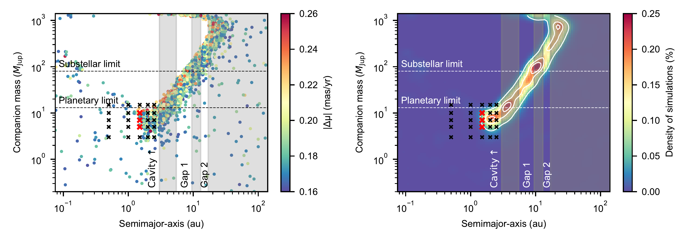
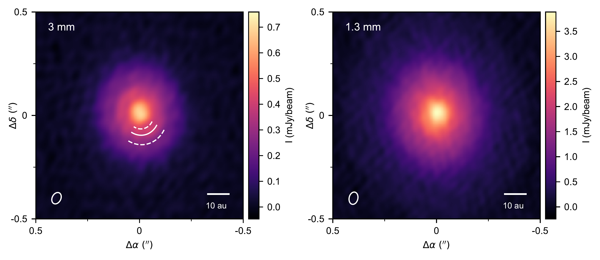
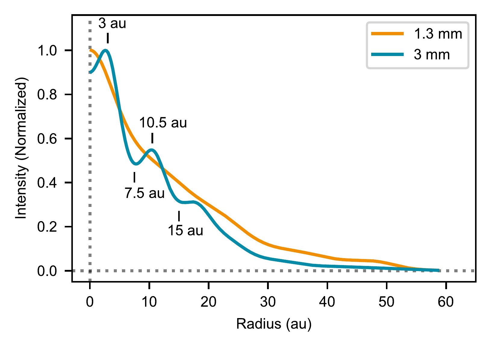

$\newcommand{\ensuremath}{}$
$\newcommand{\xspace}{}$
$\newcommand{\object}[1]{\texttt{#1}}$
$\newcommand{\farcs}{{.}''}$
$\newcommand{\farcm}{{.}'}$
$\newcommand{\arcsec}{''}$
$\newcommand{\arcmin}{'}$
$\newcommand{\ion}[2]{#1#2}$
$\newcommand{\textsc}[1]{\textrm{#1}}$
$\newcommand{\hl}[1]{\textrm{#1}}$
$\newcommand{\footnote}[1]{}$
$\newcommand{\aj}{Astron. J.}$
$\newcommand{\ac}{Astron. Comput.}$
$\newcommand{\apj}{Astrophys. J.}$
$\newcommand{\apjl}{Astrophys. J. Lett.}$
$\newcommand{\apjs}{Astrophys. J. Suppl. Ser.}$
$\newcommand{\aap}{Astron. Astrophys.}$
$\newcommand{\mnras}{Mon. Not. R. Astron. Soc.}$
$\newcommand{\nat}{Nature}$
$\newcommand{\nastro}{Nat. Astron.}$
$\newcommand{\pasa}{Publ. Astron. Soc. Aust.}$
$\newcommand{\pasp}{Publ. Astron. Soc. Pac.}$
$\newcommand{\sci}{Science}$

# A young gas giant and hidden substructures in a protoplanetary disk

<mark>Appeared on: 2025-07-17</mark> -  _Nature Astronomy, 13 pages and 4 figures + Supplementary material_

Á. Ribas, et al. -- incl., <mark>F. Zagaria</mark>

**Abstract:** The detection of planets in protoplanetary disks has proven to be extremely challenging. In contrast, rings and gaps, usually attributed to planet-disk interactions, have been found in virtually every large protoplanetary (Class II) disk observed at 0.9-1.3 mm with sufficient spatial resolution (5 au). The nearby disk around MP Mus (PDS 66) stands as an exception to this rule, and its advanced age (7-10 Myr) is particularly difficult to reconcile with its apparent lack of substructures. Despite the disk's smooth appearance, _Gaia_ data of MP Mus show a significant proper motion anomaly, signalling the presence of a companion. Here we present ALMA 3 mm observations of the system with comparable high spatial resolution to previous 1.3 mm data. The new observations pierce deeper into the disk midplane and reveal an inner cavity ( $<$ 3 au) and a ring at 10 au. The disk structure inferred from ALMA observations narrows down the properties of the companion to a gas giant orbiting at 1-3 au, and hydrodynamic simulations further confirm that such a planet can produce the observed cavity. These independent pieces of evidence constitute an indirect but compelling detection of an exoplanet within a protoplanetary disk using _Gaia_ astrometry. MP Mus is the first system in which undetected substructures are revealed thanks to the lower optical depths at longer wavelengths, suggesting that rings and gaps are even more abundant than what is currently believed.

**Figure 1. -** Orbital separation and mass of a companion that could produce the _Gaia_ proper motion anomaly of MP Mus. The left panel shows the individual _Gaia_ simulations which produce an astrometric signal compatible with the observations ($0.26>|\Delta \mu|>0.16$ mas yr$ ^{-1}$, $|\Delta \mu|/\sigma_{|\Delta \mu|}>4$, and $\rm{UWE_{DR3}}<1.1$). The right panel presents the same simulations but smoothed over a 2d histogram (contours correspond to 0.05, 0.15, and 0.2 \%). When considering the disk structure traced in the millimetre (shaded area), the most likely companion is a gas giant at 1-2 au. Crosses indicate the parameters used for the hydrodynamical simulations in Sec. \ref{sec:simulations}. The simulations that best reproduce both _Gaia_ and ALMA observations are show in red (Sec. \ref{sec:discussion}). (*fig:PMa*)

**Figure 2. -** ALMA continuum observations of MP Mus at 3 mm and 1.3 mm. The solid and dashed white arcs in the 3 mm image mark the ring and two gaps. The beam of each observation is indicated as a white ellipse in the bottom left corners. (*fig:ALMA*)

**Figure 3. -** Intensity radial profiles of MP Mus derived using frank. The 3 mm profile shows structures undetected at shorter wavelengths, including an inner cavity, a ring, and two gaps. These features are indicated in the figure. (*fig:rad_profiles*)

