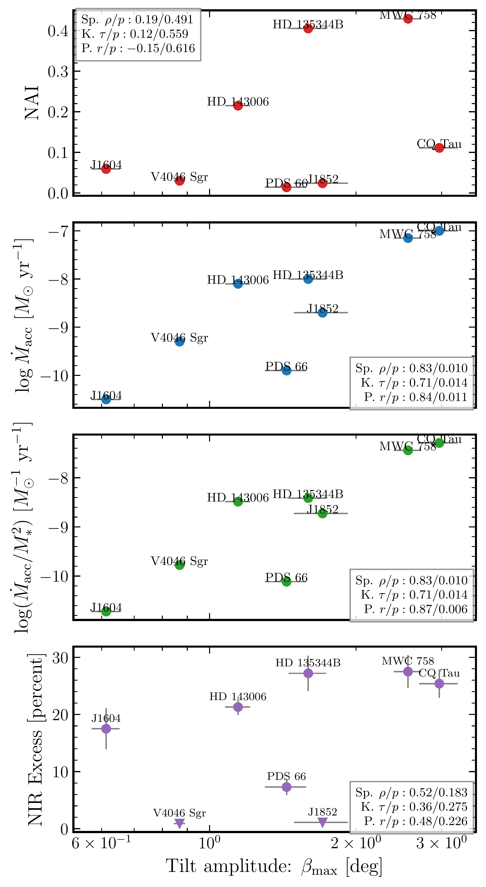

$\newcommand{\ensuremath}{}$
$\newcommand{\xspace}{}$
$\newcommand{\object}[1]{\texttt{#1}}$
$\newcommand{\farcs}{{.}''}$
$\newcommand{\farcm}{{.}'}$
$\newcommand{\arcsec}{''}$
$\newcommand{\arcmin}{'}$
$\newcommand{\ion}[2]{#1#2}$
$\newcommand{\textsc}[1]{\textrm{#1}}$
$\newcommand{\hl}[1]{\textrm{#1}}$
$\newcommand{\footnote}[1]{}$
$\newcommand{\cp}[1]{\textcolor{red}{{CP:} #1}}$
$\newcommand{\InstMPIA}{Max-Planck Institute for Astronomy (MPIA), Königstuhl 17, 69117 Heidelberg, Germany}$
$\newcommand{\InstMIT}{Department of Earth, Atmospheric, and Planetary Sciences, Massachusetts Institute of Technology, Cambridge, MA 02139, USA}$
$\newcommand{\InstOCA}{Université Côte d’Azur, Observatoire de la Côte d’Azur, CNRS, Laboratoire Lagrange, France}$
$\newcommand{\InstMilano}{Dipartimento di Fisica, Università degli Studi di Milano, Via Celoria 16, 20133 Milano, Italy}$
$\newcommand{\InstNAOJ}{National Astronomical Observatory of Japan, Osawa 2-21-1, Mitaka, Tokyo 181-8588, Japan}$
$\newcommand{\InstIPAGGrenoble}{Univ. Grenoble Alpes, CNRS, IPAG, 38000 Grenoble, France}$
$\newcommand{\InstMonash}{School of Physics and Astronomy, Monash University, Clayton VIC 3800, Australia}$
$\newcommand{\InstCfA}{Center for Astrophysics | Harvard \& Smithsonian, Cambridge, MA 02138, USA}$
$\newcommand{\InstFlorida}{Department of Astronomy, University of Florida, Gainesville, FL 32611, USA}$
$\newcommand{\InstChile}{Departamento de Astronomía, Universidad de Chile, Camino El Observatorio 1515, Las Condes, Santiago, Chile}$
$\newcommand{\InstStAndrewsPhysics}{School of Physics \& Astronomy, University of St. Andrews, North Haugh, St. Andrews KY16 9SS, UK}$
$\newcommand{\InstStAndrewsExoplanets}{Centre for Exoplanet Science, University of St. Andrews, North Haugh, St. Andrews, KY16 9SS, UK}$
$\newcommand{\InstRicePhysics}{Department of Physics and Astronomy, Rice University, Houston, TX 77005, USA}$
$\newcommand{\InstLANL}{Los Alamos National Laboratory, Los Alamos, NM 87545, USA}$
$\newcommand{\InstUGAphysics}{Department of Physics and Astronomy, The University of Georgia, Athens, GA 30602, USA}$
$\newcommand{\InstUGACSP}{Center for Simulational Physics, The University of Georgia, Athens, GA 30602, USA}$
$\newcommand{\InstUGAIA}{Institute for Artificial Intelligence, The University of Georgia, Athens, GA, 30602, USA}$
$\newcommand{\InstColumbia}{Department of Astronomy, Columbia University, 538 W. 120th Street, Pupin Hall, New York, NY, USA}$
$\newcommand{\InstLeeds}{School of Physics and Astronomy, University of Leeds, Leeds, UK, LS2 9JT}$
$\newcommand{\InstRiceSpace}{Rice Space Institute, Rice University, 6100 Main St, Houston, TX 77005, USA}$
$\newcommand{\InstLeiden}{Leiden Observatory, Leiden University, P.O. Box 9513, NL-2300 RA Leiden, The Netherlands}$
$\newcommand{\InstESO}{European Southern Observatory, Karl-Schwarzschild-Str. 2, D-85748 Garching bei München, Germany}$
$\newcommand{\InstNHFP}{NASA Hubble Fellowship Program Sagan Fellow}$
$\newcommand{\InstIbaraki}{College of Science, Ibaraki University, 2-1-1 Bunkyo, Mito, Ibaraki 310-8512, Japan}$
$\newcommand{\InstCambridge}{Institute of Astronomy, University of Cambridge, Madingley Road, CB3 0HA, Cambridge, UK}$
$\newcommand{\InstNRAO}{National Radio Astronomy Observatory, 520 Edgemont Rd., Charlottesville, VA 22903, USA}$
$\newcommand{\InstUNAM}{Instituto de Ciencias Físicas, Universidad Nacional Autónoma de México, Av. Universidad s/n, 62210 Cuernavaca, Mor., Mexico}$
$\newcommand{\InstBologna}{Alma Mater Studiorum Università di Bologna, Dipartimento di Fisica e Astronomia (DIFA), Via Gobetti 93/2, 40129 Bologna, Italy}$
$\newcommand{\InstArcetri}{INAF-Osservatorio Astrofisico di Arcetri, Largo E. Fermi 5, 50125 Firenze, Italy}$
$\newcommand{\InstASIAA}{Academia Sinica Institute of Astronomy \& Astrophysics, 11F of Astronomy-Mathematics Building, AS/NTU, No.1, Sec. 4, Roosevelt Rd, Taipei 10617, Taiwan}$
$\newcommand{\InstWesleyan}{Department of Astronomy, Van Vleck Observatory, Wesleyan University, 96 Foss Hill Drive, Middletown, CT 06459, USA}$
$\newcommand{\InstPennState}{Department of Astronomy \& Astrophysics, 525 Davey Laboratory, The Pennsylvania State University, University Park, PA 16802, USA}$
$\newcommand{\InstSOKENDAI}{Department of Astronomical Science, The Graduate University for Advanced Studies, SOKENDAI, 2-21-1 Osawa, Mitaka, Tokyo 181-8588, Japan}$
$\newcommand{\InstQMUL}{Astronomy Unit, School of Physics and Astronomy, Queen Mary University of London, London E1 4NS, UK}$
$\newcommand{\thefigure}{A\arabic{figure}}$
$\newcommand{\thefigure}{B\arabic{figure}}$
$\newcommand{\thefigure}{C\arabic{figure}}$

# exoALMA. XVIII. Interpreting large scale kinematic structures as moderate warping

<mark>Appeared on: 2025-07-17</mark> -  _Accepted for publication in ApJL as part of the exoALMA series. 53 pages, 37 figures_

A. J. Winter, et al. -- incl., <mark>M. Benisty</mark>, <mark>D. Fasano</mark>

**Abstract:** The exoALMA program gave an unprecedented view of the complex kinematics of protoplanetary disks, revealing diverse structures that remain poorly understood. We show that moderate disk warps ( $\sim 0.5-2^\circ$ ) can naturally explain many of the observed large-scale velocity features with azimuthal wavenumber $m = 1$ . Using a simple model, we interpret line-of-sight velocity variations as changes in the projected Keplerian rotation caused by warping of the disk. While not a unique explanation, this interpretation aligns with growing observational evidence that warps are common. We demonstrate that such warps can also produce spiral structures in scattered light and CO brightness temperature, with $\sim 10$ K variations in MWC 758. Within the exoALMA sample, warp properties correlate with stellar accretion rates, suggesting a link between the inner disc and outer disc kinematics. If warps cause large-scale kinematic structure, this has far reaching implications for turbulence, angular momentum transport, and planet formation.

**Figure 36. -** Top panels show residuals from the observed (left) vs modeled (right) $\delta v_{\rm los}$ fields for MWC 758 after fitting Keplerian velocity profiles. The flexible model is for a simple warped disc geometry, with perturbation in inclination and position angle. The colour scale is the LOS velocity  in km/s. Grey circles mask two times the central beam size. The beam size is also shown on the left hand side, assumed circular for visualisation. The bottom panels show radial profiles of \( \delta i \), \( \delta \mathrm{PA} \) and the physical warp properties tilt $\beta$, twist $\gamma$ and the warp amplitude $\psi$ for MWC 758 from our fitting procedure. Blue points and errorbars in \( \delta i \) and \( \delta \mathrm{PA} \) come from the least squares fitting procedure, Faint orange lines show posterior distributions from the GP model. (*fig:inc_pa_profiles*)

**Figure 4. -** From top to bottom, we show how the the continuum non-axisymmetric index \citep[NAI, top --][]{Curone_exoALMA}, stellar accretion rates (middle top), normalised stellar accretion rates (to the square of the stellar mass, bottom middle) and NIR excess \citep[][bottom]{Garufi_ea_2018} depend on the range of tilt amplitudes we infer from our model.
    The outcome of Spearman rank, Kendall $\tau$ and permutation correlation tests are shown in terms of correlation statistic and $p$-value.
    We exclude cases where inclination is unfavourable due to the appearance of the back-side of the disc. (*fig:correlations*)

**Figure 8. -** As in Figure \ref{fig:inc_pa_profiles} but for AA Tau. (*fig:profile_AATau*)

